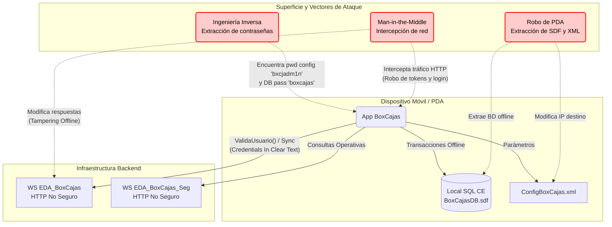

# Auditoría de Ciberseguridad - Proyecto BoxCajas

**Fecha de Auditoría:** Agosto 2026
**Analista:** Opencode Security Auditor
**Alcance:** Análisis estático de código fuente (SAST), evaluación de configuraciones y vectores de ataque en consumo de Web Services y manejo offline de datos (App Móvil / Compact Framework).

---

## 1. Resumen Ejecutivo
El análisis exhaustivo del proyecto **BoxCajas** ha revelado hallazgos críticos de seguridad que comprometen la confidencialidad, integridad y disponibilidad de la aplicación y sus datos. Se han detectado múltiples vulnerabilidades severas, destacando **contraseñas hardcodeadas en código**, **conexiones de base de datos no seguras**, **almacenamiento de configuraciones en texto plano**, y la **transmisión de credenciales sin cifrado (HTTP)**. 

El riesgo global de la aplicación se califica como **CRÍTICO**.

---

## 2. Hallazgos y Vulnerabilidades

### 2.1. Transmisión de Credenciales en Texto Claro (CWE-319)
- **Severidad:** Crítica
- **Archivos Afectados:** `BoxCajas/Web References/BoxCajas/Reference.cs` y `BoxCajas/Web References/BoxCajas_Seg/Reference.cs`
- **Descripción:** Las llamadas a los Web Services (`EDA_BoxCajas.asmx` y `EDA_BoxCajas_Seg.asmx`) se realizan a través del protocolo **HTTP** no seguro (ej: `http://192.168.20.19/...` y `http://172.16.3.222/...`). Funciones críticas como `ValidaUsuario(string Sucursal, string User, string Password)` envían el usuario y contraseña en texto claro a través de la red local, siendo extremadamente vulnerables a ataques de interceptación (*Man-in-the-Middle* y *Sniffing*).
- **Impacto:** Robo directo de las cuentas de usuario de la organización.

### 2.2. Claves de Acceso Hardcodeadas en Código (CWE-798)
- **Severidad:** Alta
- **Archivos Afectados:** `BoxCajas/UI/frmLogin.cs` (Línea 246)
- **Descripción:** Existe una lógica de "puerta trasera" para acceder a la configuración del sistema. En el evento `txtCongif_KeyPress`, el sistema verifica si la contraseña ingresada es exactamente igual a la cadena literal `"bxcjadm1n"`. 
- **Impacto:** Cualquier atacante con acceso al código compilado (Ingeniería inversa) o que conozca esta credencial puede acceder al panel `frmConfig`, alterar servidores IP, puertos e interceptar flujos de trabajo.

### 2.3. Contraseña de Base de Datos Local Hardcodeada (CWE-259)
- **Severidad:** Alta
- **Archivos Afectados:** `BoxCajas/DAO/dsTemp.Designer.cs` y `BoxCajas/DAO/dsOffline.Designer.cs`
- **Descripción:** La cadena de conexión para la base de datos SQL Server Compact Edition (`BoxCajasDB.sdf`) contiene la contraseña expuesta directamente en el código fuente.
  ```csharp
  this._connection.ConnectionString = ("Data Source =" + ... + ("\\BoxCajasDB.sdf;" + ("Password =" + "\"boxcajas\";"))));
  ```
- **Impacto:** Si se roba el dispositivo o se extrae el archivo `.sdf`, un atacante puede abrir fácilmente la base de datos y obtener todos los datos almacenados de forma offline (Recepciones de Verificación, inventarios parciales, etc.) usando la contraseña "boxcajas".

### 2.4. Almacenamiento de Configuración Inseguro (CWE-312)
- **Severidad:** Media
- **Archivos Afectados:** `BoxCajas/Class/Utility.cs` y `BoxCajas/UI/frmConfig.cs`
- **Descripción:** La aplicación lee y escribe un archivo de configuración llamado `\ConfigBoxCajas.xml` ubicado directamente en la raíz del dispositivo. Este archivo almacena direcciones IP, configuraciones de sucursal y parámetros en texto plano.
- **Impacto:** Facilita el análisis de la infraestructura interna para un atacante con acceso al file system del dispositivo.

---

## 3. Vectores de Ataque (Diagrama de Amenazas)

A continuación, un diagrama que ilustra cómo se podrían materializar las amenazas detectadas en un entorno de producción:



---

## 4. Medidas Correctivas y Recomendaciones (Remediación)

Para mitigar los riesgos descritos, se recomiendan las siguientes acciones técnicas inmediatas:

1. **Forzar el uso de HTTPS (TLS):**
   - Modificar las URLs de los Web Services en `Utility.cs` para utilizar esquemas `https://` en lugar de `http://`. Asegurar que los servidores backend posean certificados válidos (o en su defecto, configurar la validación adecuada en el Compact Framework).

2. **Eliminar Credenciales Hardcodeadas (`frmLogin.cs`):**
   - Eliminar el uso del literal `"bxcjadm1n"`. La autenticación para tareas de administración debe validarse mediante una llamada cifrada contra el backend, o al menos verificarse mediante un algoritmo de Hash robusto (ej. SHA-256) con *salt* almacenado, nunca el password en texto claro.

3. **Cifrado de Base de Datos y Cadena de Conexión:**
   - No mantener la cadena de conexión `"Password =" + "\"boxcajas\";"` en los `dsTemp.Designer.cs` y `dsOffline.Designer.cs`. 
   - Idealmente, la contraseña del archivo `.sdf` debe derivarse de una llave criptográfica dependiente del entorno, del usuario autenticado (como un Key Derivation Function derivado de su login) o el uso de *Secure Storage/Data Protection API (DPAPI)* del dispositivo.

4. **Proteger Archivos Sensibles (`ConfigBoxCajas.xml`):**
   - Serializar el XML aplicando un algoritmo de cifrado simétrico robusto (AES) antes de guardarlo en la raíz `\`, evitando así que un atacante lea o modifique libremente las direcciones IP destino de los Web Services.

5. **Auditoría de Sincronización Offline (`frmMenuSync.cs`):**
   - Las cadenas enviadas con datos separados por PIPES (ej. `strUp += folio + ";" + usuario...`) son propensas a manipulación. En el lado del servidor, asegurar que todas las cadenas de sincronización son rigurosamente validadas para evitar *SQL Injection* u *OS Command Injection* al momento de volcar la sincronización en la base principal.