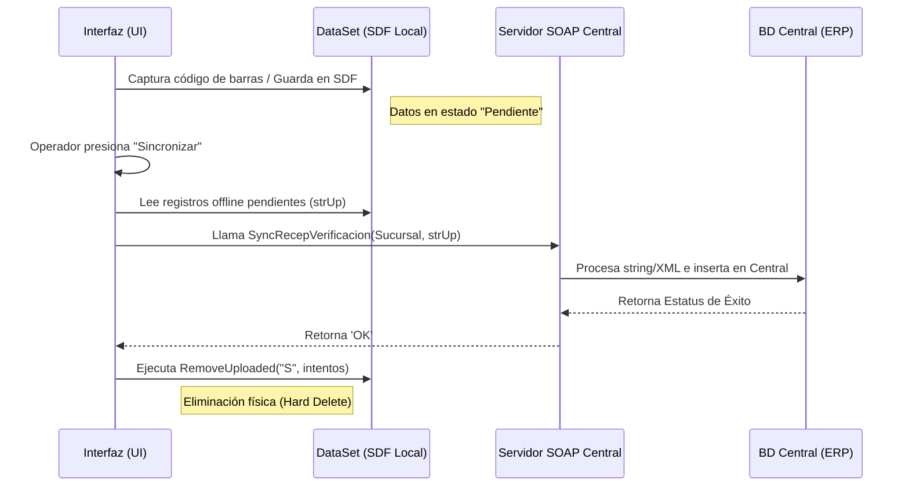

# Análisis Funcional y Técnico: BoxCaja EDA - Casos de Uso y Optimización de Base de Datos

## 1. Análisis Funcional

El sistema **BoxCaja EDA** está diseñado como una aplicación para terminales de almacén y estaciones de recolección/empacado. Su principal fortaleza radica en permitir la operación continua (*offline*) guardando la actividad del operador en un repositorio local para luego integrarse con un sistema central (ERP/WMS) mediante módulos de sincronización.

### Casos de Uso Principales Identificados

Basado en la estructura de pantallas (UI) y flujos de la aplicación, los módulos operativos son:

1. **Empaque / Surtido:**
   - Empaque Libre (`frmEmpaqueLibre`).
   - Empaque de Cajas Master (`frmEmpaqueMaster`).
   - Módulos de seguimiento y segundo conteo de artículos (`frmSegContArt`, `frmImpSegConteo`).
2. **Recepción:**
   - Recepción Consolidada de Mercancía (`frmRecepConso`).
   - Recepción con Verificación de Artículos (`frmRecepVerif`).
3. **Consolidación:**
   - Agrupación de lotes, paquetes o cajas (`frmConsolidacion`).
4. **Embarque:**
   - Despacho y carga a rutas de envío (`frmEmbarque`).
5. **Inventario Cíclico:**
   - Conteo regular o auditoría de ubicaciones en piso (`Ciclico`).
6. **Rutas:**
   - Administración de rutas logísticas y folios asociados.
7. **Sincronización:**
   - Panel de control para el envío bidireccional (carga de movimientos al servidor y descarga de catálogos) (`frmMenuSync`, `frmSyncResult`).

### Diagrama de Casos de Uso

```mermaid
usecaseDiagram
    actor OperadorAlmacen as "Operador / Almacenista"
    
    package "Operaciones Core (BoxCaja)" {
        usecase UC1 as "Surtido y Empaque
        (Libre / Master)"
        usecase UC2 as "Recepción
        (Consolidada / Verificada)"
        usecase UC3 as "Embarque y Rutas"
        usecase UC4 as "Consolidación"
        usecase UC5 as "Inventario Cíclico"
    }

    package "Sincronización y Sistema" {
        usecase UC6 as "Sincronizar Datos (SOAP)"
        usecase UC7 as "Limpiar Datos Subidos"
    }

    OperadorAlmacen --> UC1
    OperadorAlmacen --> UC2
    OperadorAlmacen --> UC3
    OperadorAlmacen --> UC4
    OperadorAlmacen --> UC5
    OperadorAlmacen --> UC6
    
    UC6 ..> UC7 : <<include>>
```

---

## 2. Análisis Técnico y Auditoría de la Base de Datos

Tras la revisión del código fuente, arquitectura y directorios, el proyecto (C# / WinForms) utiliza los siguientes componentes técnicos:

1. **Base de Datos Local:** SQL Server Compact Edition v3.5/4.0 (archivo físico `BoxCajasDB.sdf`).
2. **Acceso a Datos (DAO):** Arquitectura basada en ADO.NET **Typed DataSets** (`dsOffline.xsd`, `dsTemp.xsd`) que modelan en memoria estructuras como `RecepVerificacion`, `TMP_SegContArt`, etc.
3. **Protocolo de Comunicación:** Consumo de servicios web **SOAP** (ASMX/WCF) expuestos en `EDA_BoxCajas.wsdl`.
4. **Flujo de Sincronización:** Los movimientos (`Folio`, `Equipo`, `Corte`, `Partida`, `Articulo`) se insertan en tablas locales. El usuario inicia el proceso manualmente; el código serializa los registros a strings (`strUp`) y los manda mediante los Web Methods (ej. `SyncRecepVerificacion`). Finalmente, el cliente aplica un "Hard-Delete" (`RemoveUploaded`) de los registros transmitidos exitosamente.

### Diagrama de Flujo de Sincronización de Datos



---

## 3. Propuestas de Optimización (Mejores Prácticas)

Como parte de la auditoría de rendimiento y fiabilidad, se emiten las siguientes recomendaciones a nivel "Ingeniero Senior" / Arquitecto de Datos para modernizar y estabilizar el sistema:

### 3.1. Optimización del Motor Local (.sdf)

1. **Migración Urgente de Motor de Base de Datos:**
   - **Hallazgo:** SQL Server Compact (`.sdf`) fue discontinuado en 2013. Su soporte y rendimiento frente a archivos crecientes no es óptimo.
   - **Propuesta:** Migrar inmediatamente a **SQLite** (`Microsoft.Data.Sqlite` o `System.Data.SQLite`). Brinda una concurrencia superior, es ultraligero y es el estándar de oro actual para almacenamiento estructurado offline en clientes pesados o portátiles.

2. **Reemplazo de Typed DataSets por Micro-ORMs:**
   - **Hallazgo:** Los `DataSet` Tipados consumen excesiva RAM (por su overhead en XML) lo que hace la aplicación propensa a _Out Of Memory Exceptions_ durante inventarios masivos.
   - **Propuesta:** Migrar la capa DAO al uso de **Dapper**. El mapeo directo hacia clases POCO (Plain Old CLR Objects) disminuye exponencialmente la carga en memoria RAM, ideal para terminales con hardware restringido.

3. **Estructuras Físicas e Índices:**
   - **Propuesta:** Verificar la creación de Índices Cubiertos (`Covering Indexes`) a nivel de motor de base de datos en los campos usados rutinariamente por las cláusulas `WHERE`, tales como `Estatus`, `Folio` y `Equipo`. Ejemplo en SQLite: `CREATE INDEX IDX_RecepVerif_Sync ON RecepVerificacion (Estatus, Intentos);`.

### 3.2. Optimización en la Transferencia y Sincronización

1. **Transición a Servicios RESTful y JSON (o gRPC):**
   - **Hallazgo:** SOAP genera cargas de red (Payloads) altamente densas por las etiquetas XML autogeneradas en el WSDL, sumado a que concatena las tramas en formato `string`.
   - **Propuesta:** Crear un Endpoint RESTful que acepte JSON (o gRPC si se busca la máxima compresión). El peso por paquete de red puede disminuir hasta un 70%, acelerando el sync en bodegas con Wi-Fi deficiente.

2. **Paginación / Sincronización por Lotes (Chunking):**
   - **Hallazgo:** Enviar lotes gigantescos en la variable `strUp` hacia un solo Web Method puede causar un _Timeout_.
   - **Propuesta:** Partir el Dataset de sincronización en lotes (Batches de entre 100 y 250 registros). Si un lote falla por timeout de red, solo se reenvía ese bloque.

3. **Eliminación Suave (Soft-Delete) como Estrategia de Retención:**
   - **Hallazgo:** El método `RemoveUploaded` borra de inmediato el registro local. Si un proceso batch falla asíncronamente en el servidor, no hay traza ni "Audit Trail" local de rescate.
   - **Propuesta:** Incorporar una columna `SyncDate` (Fecha de sincronización exitosa) y un estado `IsSynced=1`. Mantener el registro durante 3 días para consultas rápidas o resolución de contingencias, y ejecutar un proceso automatizado de purga o _Vacuum_ nocturno para limpiar registros históricos y desfragmentar la BD.

4. **Colas Asíncronas (Background Sync):**
   - **Hallazgo:** La UI interrumpe al operador u obliga a una acción explícita en `frmMenuSync`.
   - **Propuesta:** Implementar un **BackgroundWorker** o Thread asíncrono que sondee conectividad y encole los datos al servidor sin intervención del usuario. Esto permite un flujo ininterrumpido en Surtido y Recepción.