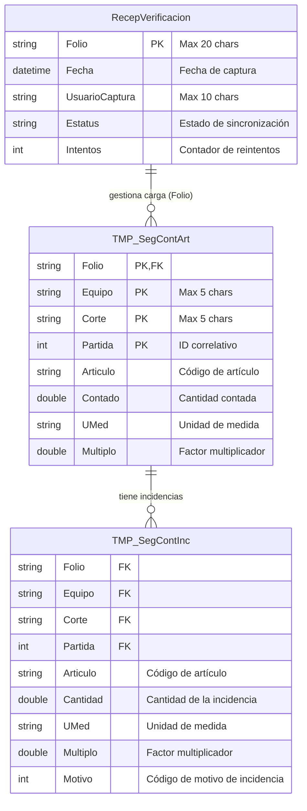

# Documentación Técnica de Base de Datos - BoxCajas

## 1. Visión General de la Arquitectura de Base de Datos
El proyecto **BoxCajas** emplea una arquitectura de almacenamiento de datos orientada a la **resiliencia y operación offline**. Utiliza una base de datos embebida relacional basada en **Microsoft SQL Server Compact Edition (SQL CE)** (`BoxCajasDB.sdf`).

La base de datos está protegida mediante contraseña (`Password="boxcajas"`) y es la pieza central para garantizar que las operaciones de recepción, verificación y conteo de artículos puedan realizarse sin interrupciones incluso ante caídas de red.

Los esquemas de acceso a datos están modelados y fuertemente tipados a través de DataSets (`dsTemp.xsd` y `dsOffline.xsd`).

---

## 2. Diagrama Entidad-Relación (ERD)

A continuación, se detalla el modelo de datos lógico inferido a partir de las restricciones, claves primarias y campos vinculantes presentes en los esquemas XSD.

> **Nota de Relación:** Aunque el motor SQL CE puede no aplicar claves foráneas duras (Hard FKs) en las tablas temporales por motivos de rendimiento en inserciones masivas, el modelo de negocio relaciona unívocamente `TMP_SegContInc` con `TMP_SegContArt` a través de la tupla `(Folio, Equipo, Corte, Partida)`.

---

## 3. Diccionario de Datos y Esquemas

### 3.1. Esquema Temporal (`dsTemp.xsd`)
Maneja la carga de trabajo operativa en tiempo real durante la captura del inventario/recepción.

* **Tabla `TMP_SegContArt`**: Almacena las partidas o detalles contados por los usuarios.
  * **PK Compuesta**: `Folio`, `Equipo`, `Corte`, `Partida`.
  * **Uso**: Inserciones secuenciales intensivas de los artículos contados físicamente.
  * **Operaciones CRUD Notables**: `GetPartidasByFolio`, `InsertPartida`, `RemovePartidasByFolio`.

* **Tabla `TMP_SegContInc`**: Almacena discrepancias o problemas con partidas específicas.
  * **Dependencia Lógica**: Comparte estructura de llaves de `TMP_SegContArt`.
  * **Uso**: Registro de faltantes, sobrantes o daños (`Motivo`).
  * **Operaciones CRUD Notables**: `GetIncidenciasByFolioPart`, `InsertIncidencia`.

### 3.2. Esquema Offline (`dsOffline.xsd`)
Gestiona el estado y ciclo de vida de los paquetes de datos listos para ser transmitidos al servidor central.

* **Tabla `RecepVerificacion`**:
  * **PK**: `Folio`.
  * **Uso**: Manejo de concurrencia y reintentos de subida.
  * **Operaciones CRUD Notables**: 
    * `GetDataByEstatus`: Recupera registros pendientes de subida.
    * `UpdateEstatus`: Incrementa `Intentos` y actualiza el estado (`Pendiente`, `Procesando`, `Terminado`, `Error`).
    * `RemoveUploaded`: Limpieza basada en estatus o límite de intentos (`Intentos >= @Intentos`).

---

## 4. Índices Clave y Estructuras Físicas

De acuerdo al patrón de consultas detectado (ej. `SELECT ... WHERE (Folio = @Folio) AND (Equipo = @Equipo) AND (Corte = @Corte)`), se definen o sugieren los siguientes índices para optimizar la base de datos:

1. **Índice Clúster en `TMP_SegContArt`**: Automático mediante la Primary Key `(Folio, Equipo, Corte, Partida)`. Asegura que las partidas de un mismo folio se almacenen en páginas contiguas de disco.
2. **Índice Secundario (Non-Clustered) en `TMP_SegContInc`**: Sobre los campos `(Folio, Equipo, Corte, Partida)`. Crítico para la función `GetIncidenciasByFolioPart`.
3. **Índice Secundario en `RecepVerificacion`**: Sobre el campo `Estatus`. Es altamente recomendado, ya que la cola de sincronización constantemente ejecuta filtros vía `GetDataByEstatus`.

---

## 5. Estrategias de Optimización (Performance)

1. **Purga Automática de Datos:**
   Las funciones generadas (`RemoveAll`, `RemovePartidasByFolio`, `RemoveUploaded`) evidencian un patrón de **Soft-Delete / Hard-Delete** donde la información que ya fue sincronizada o invalidada es eliminada físicamente para evitar que el archivo `.sdf` crezca indefinidamente y degrade los tiempos de lectura.
2. **Consultas Directas Precompiladas:**
   El uso de TableAdapters estáticos genera sentencias paramétricas limpias, protegiendo contra la inyección de dependencias (SQL Injection) y permitiendo al motor de BD embebida reutilizar planes de ejecución (caché).
3. **Aislamiento de Conexiones:**
   El modelo Offline minimiza la contención de cerraduras (locks). Los escritores (capturistas) operan aislados en su propia BD SDF local, fusionando sus cambios con el servidor asíncronamente.
4. **Actualización Optimista (Optimistic Concurrency):**
   Las directivas `UseOptimisticConcurrency="True"` en el XML indican que los TableAdapters verifican colisiones a nivel de registro (`SourceVersion="Original"` vs `Current`), evitando corrupciones si dos subprocesos interactúan con la BD.

---

## 6. Soporte a la Lógica de Negocio

La arquitectura de la base de datos es el cimiento funcional de un cliente rico (**Smart Client**) que soporta las siguientes capacidades de negocio:

* **Tolerancia a Fallos de Red (Offline-First):** La aplicación no detiene las operaciones del almacén. El conteo físico (`dsTemp`) y la consolidación de folios se realizan contra el SDF local a latencia casi cero.
* **Patrón de Cola y Reintentos (Retry Pattern):** La tabla `RecepVerificacion` actúa como un bus de salida.
  * Si la carga falla, el campo `Intentos` se incrementa mediante la función nativa de actualización.
  * El sistema depura folios "estancados" o exitosos de forma autónoma usando las lógicas embebidas como: `DELETE FROM RecepVerificacion WHERE Estatus = @Estatus or Intentos >= @Intentos`.
* **Auditoría Básica en el Borde:** Las columnas `UsuarioCaptura` y `Fecha` registran exactamente quién y cuándo realizó la acción en el equipo físico antes de ser enviada, garantizando trazabilidad independientemente de la fecha de sincronización del servidor.