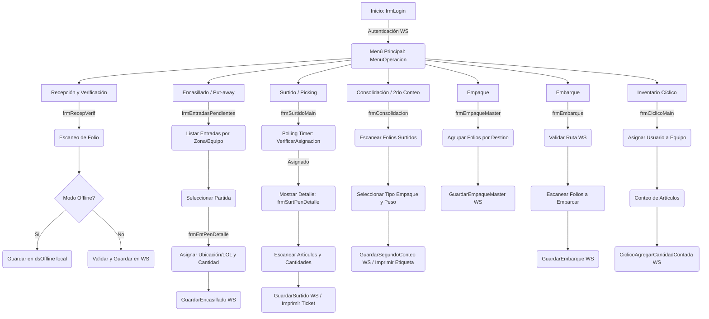

# Documentación Técnica - Proyecto BoxCajas

> **Tipo:** Aplicación C# WinForms (Windows CE / Smart Device)
> **Arquitectura:** Cliente-Servidor (Thin Client) vía SOAP Web Services
> **Estado:** Producción / Mantenimiento

## 1. Propósito y Responsabilidad
El proyecto **BoxCajas** es una aplicación móvil diseñada para terminales portátiles (handhelds) con Windows CE, utilizada en operaciones de almacén y logística. Su propósito principal es gestionar y registrar en tiempo real los procesos de recepción, encasillado (put-away), surtido (picking), consolidación, empaque, inventario cíclico y embarque de mercancía.

## 2. Arquitectura del Código

La aplicación sigue un patrón de arquitectura de **Cliente Ligero (Thin Client)**. La mayor parte de la lógica de negocio compleja y el acceso a la base de datos central residen en los Web Services SOAP (`EDA_BoxCajas.asmx` y `EDA_BoxCajas_Seg.asmx`). La aplicación móvil se encarga de la interfaz de usuario, validaciones básicas, lectura de códigos de barras, impresión directa y comunicación con los servicios.

### Estructura del Proyecto
*   **`UI/` (User Interface):** Contiene todos los formularios (WinForms) organizados por módulos (Almacen, Ciclico, Consolidado, Embarque, Rutas).
*   **`Class/` (Clases Utilitarias):**
    *   `Utility.cs`: Manejo de configuración local (`ConfigBoxCajas.xml`) e impresión por puerto serie.
    *   `PrintFormat.cs`: Formateo de cadenas (probablemente ZPL/EPL) para impresión de etiquetas y tickets.
    *   `Constante.cs`: Definición de constantes globales (ENTRADA, SALIDA, SURTIDO, etc.).
*   **`DAO/` (Data Access Object):** Manejo de datos locales para operaciones temporales o modo offline mediante `DataSets` tipados (`dsOffline`, `dsTemp`) y clases de acceso (`auxRecepVerificacion`, `auxTempSegContArt`).
*   **`Web References/`:** Proxies generados para la comunicación con los Web Services SOAP (`BoxCajas`, `BoxCajas_Seg`).

## 3. Flujos de Ejecución y Módulos Principales

### Diagrama de Flujo General (Mermaid)

### Descripción de Módulos

1.  **Login y Configuración (`frmLogin`, `frmConfig`):**
    *   Valida credenciales contra el WS (`ValidaUsuarioNew`).
    *   Verifica que la versión de la aplicación sea la correcta.
    *   Permite configurar (mediante contraseña de admin) la IP del servidor, Sucursal, Bodega y puerto de impresión leyendo/escribiendo en `ConfigBoxCajas.xml`.

2.  **Recepción y Verificación (`frmRecepVerif`):**
    *   Permite recepcionar folios (Cortes, Surtidos, etc.).
    *   **Decisión de Diseño:** Implementa un modo "Offline" (`chOffline`). Si está activo, guarda los datos localmente usando `auxRecepVerificacion` (DataSet `dsOffline`) para sincronización posterior, permitiendo operar sin red.

3.  **Encasillado (`frmEntradasPendientes`, `frmEntPenDetalle`):**
    *   Consulta al WS las entradas pendientes filtradas por Zona y Equipo.
    *   El usuario selecciona un artículo, ingresa la cantidad y la ubicación física (LOL - Localización).
    *   Valida la ubicación (`ValidaAsignacion`) y registra el movimiento (`GuardarEncasillado`).

4.  **Surtido / Picking (`frmSurtidoMain`, `frmSurtPenDetalle`):**
    *   **Decisión de Diseño:** Utiliza un `Timer` (`timer1_Tick`) para hacer *polling* constante al WS (`DisponibilidadDeUsuarioConsultar`) esperando asignaciones de trabajo.
    *   Cuando el WS asigna un trabajo (Estado "O" - Ocupado), abre automáticamente la pantalla de detalle.
    *   Permite registrar cantidades surtidas, reportar incidencias (faltantes/daños), cambiar el tipo de empaque y cerrar la caja, imprimiendo un ticket al finalizar.

5.  **Consolidación / Segundo Conteo (`frmConsolidacion`, `frmConsolidado`):**
    *   Agrupa múltiples folios surtidos en un contenedor final (Caja, Tarima, etc.).
    *   Valida que los folios pertenezcan al mismo destino o factura (en caso de envíos a domicilio).
    *   Requiere captura de peso y tipo de empaque antes de cerrar y generar la etiqueta final. Utiliza tablas temporales locales (`dsTemp`) para mantener el estado antes de enviar al WS.

6.  **Empaque (`frmEmpaqueMaster`, `frmEmpaqueLibre`):**
    *   **Master:** Agrupa varios folios ya consolidados en un "Empaque Master" validando que todos vayan a la misma sucursal destino.
    *   **Libre:** Permite generar una etiqueta de empaque genérica hacia un destino con una descripción manual.

7.  **Embarque (`frmEmbarque`):**
    *   Valida una ruta de transporte (`ObtenerSucursalesDestinoDeRuta`).
    *   El usuario escanea los folios/empaques al subirlos al transporte. El sistema valida que el destino del empaque coincida con los destinos de la ruta.

8.  **Inventario Cíclico (`frmCiclicoMain`):**
    *   Asigna al usuario a un equipo de conteo.
    *   Muestra el artículo a contar, el usuario ingresa la cantidad física y avanza al siguiente, o puede "abandonar" el artículo para que otro usuario lo cuente.

## 4. Interconexiones y Dependencias

*   **Comunicación Externa:** Dependencia total de los Web Services `EDA_BoxCajas` y `EDA_BoxCajas_Seg`. Si los servicios no están disponibles, la aplicación se bloquea (excepto en el módulo de Recepción Offline).
*   **Impresión:** La clase `Utility.ImprimirCadena` se conecta directamente a un puerto serie (COM) configurado en el XML. Envía cadenas de texto plano (formateadas por `PrintFormat`) con pausas (`Thread.Sleep`) entre líneas para evitar desbordar el buffer de impresoras térmicas portátiles (ej. Zebra).
*   **Manejo de Estado:** Se utilizan variables públicas en los formularios (`UserLogin`, `Sucursal`) que se pasan en los constructores al navegar entre pantallas para mantener el contexto de la sesión.

## 5. Decisiones de Diseño Clave y Deuda Técnica

*   **Sincronía en UI:** Las llamadas a los Web Services se realizan de forma síncrona en el hilo principal de la UI, cambiando el cursor a `WaitCursor`. Esto puede causar que la interfaz se "congele" temporalmente si la red es lenta.
*   **Polling vs Push:** El módulo de Surtido utiliza un Timer para consultar asignaciones cada cierto tiempo. Esto genera tráfico constante en la red y carga en el servidor. Una arquitectura moderna usaría WebSockets o notificaciones Push, pero dadas las limitaciones de Windows CE, el polling es una solución pragmática.
*   **Manejo de Errores:** Los Web Services retornan strings donde los errores se identifican buscando la palabra "Error" en la respuesta (`Result.IndexOf("Error") < 0`). Es un enfoque frágil comparado con el uso de excepciones SOAP o códigos de estado HTTP.
*   **Hardcoding:** Existen algunas validaciones hardcodeadas (ej. longitud de sucursal `== 4`, prefijos de folios `EP`, `EL`) que podrían requerir recompilación si las reglas de negocio cambian.