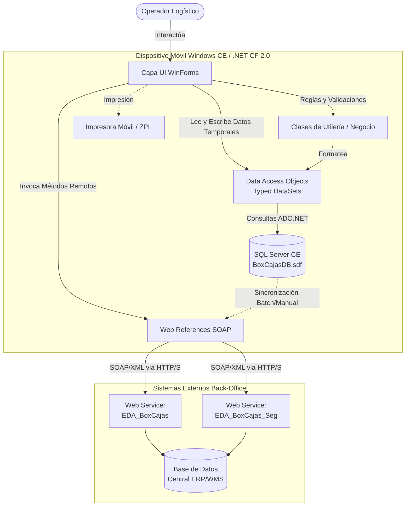

# Proyecto BoxCajas - Arquitectura y Documentación General

## 1. Visión General
El proyecto **BoxCajas** es una aplicación de cliente móvil interactivo (Thick Client) diseñada para operar en terminales portátiles basadas en **Windows CE / Windows Mobile**. Su objetivo principal es facilitar las operaciones logísticas y de almacén (tales como Recepción, Verificación, Surtido, Embarque y Empaque), dotando a los operadores de movilidad y asegurando la continuidad de las operaciones mediante capacidades de trabajo desconectado (offline).

## 2. Objetivos del Proyecto
*   **Movilidad Logística:** Proveer a los operadores de almacén de una herramienta portátil en tiempo real para el control de inventarios.
*   **Resiliencia Operativa:** Garantizar la continuidad del trabajo incluso en zonas sin cobertura Wi-Fi en el almacén, mediante el uso de almacenamiento de datos local.
*   **Sincronización Transaccional:** Permitir la sincronización controlada de datos de operación (cargas, descargas e incidencias) hacia los sistemas centrales (Back-Office) a través de Web Services.

## 3. Tecnologías y Herramientas Utilizadas
*   **Lenguaje de Programación:** C#
*   **Framework:** .NET Compact Framework v2.0
*   **Plataforma Objetivo:** Windows CE / Windows Mobile (Smart Device Application)
*   **Capa de Interfaz:** Windows Forms (WinForms adaptados a pantallas móviles)
*   **Base de Datos Local:** Microsoft SQL Server Compact Edition (SQL CE)
*   **Acceso a Datos:** ADO.NET Clásico a través de **Typed DataSets**
*   **Integración y Comunicación:** SOAP Web Services (ASMX)

## 4. Componentes Principales
El proyecto se estructura en las siguientes áreas lógicas y directorios:

1.  **Capa de Presentación (`/UI`)**
    *   Formularios Windows (WinForms) optimizados para la resolución de terminales.
    *   Flujos principales: Autenticación (`frmLogin`), Menú Operativo (`frmMenu`), Embarque (`frmEmbarque`), Verificación (`frmRecepVerif`), Empaque (`frmEmpaqueLibre`, `frmEmpaqueMaster`) y utilerías de sincronización.
2.  **Lógica y Utilidades (`/Class`)**
    *   Funciones de apoyo compartidas en el cliente, definiciones de constantes y reglas de negocio genéricas (ej. `Utility.cs`, `PrintFormat.cs`).
3.  **Acceso a Datos Local (`/DAO` y raíz)**
    *   Gestión de la base de datos local `BoxCajasDB.sdf`.
    *   Utilización de esquemas fuertemente tipados (`dsTemp.xsd`, `dsOffline.xsd`) y clases adaptadoras (DAOs) para facilitar las lecturas y escrituras sin impacto en red.
4.  **Integración Externa (`/Web References`)**
    *   Proxies SOAP autogenerados para la conexión con el Back-Office corporativo:
        *   `EDA_BoxCajas`: Web service principal para la operatoria logística.
        *   `EDA_BoxCajas_Seg`: Web service de soporte, seguridad y control de incidencias.

---

## 5. Diagrama de Arquitectura y Flujo de Componentes

El siguiente diagrama detalla cómo los componentes del proyecto interactúan dentro de la terminal de Windows CE y cómo establecen comunicación con los servidores externos.

**Flujo Típico de Operación:**
1. El usuario se autentica contra el Web Service (o localmente si está offline).
2. Se descarga el catálogo o las tareas pendientes a `BoxCajasDB.sdf` usando los Web Services.
3. El operador procesa las cajas/artículos (Verificación, Embarque) interactuando puramente con la base local para no depender del WiFi.
4. Al finalizar la tarea, se realiza una sincronización manual o automática, enviando la información estructurada a través de las referencias web.

---

## 6. Instrucciones de Instalación y Configuración

### Prerrequisitos de Desarrollo
Debido a la naturaleza Legacy del proyecto (Windows CE / .NET CF v2.0), se requieren herramientas específicas:
*   **Visual Studio 2008 Professional** (Recomendado, por el soporte nativo a "Smart Device Projects").
*   Windows Mobile 5.0/6.0 SDK o el SDK específico de Windows CE proporcionado por el fabricante del hardware.
*   Microsoft SQL Server Compact 3.5 Runtime para Windows de escritorio (para poder abrir la base de datos en Visual Studio) y para dispositivos móviles.

### Configuración del Proyecto
1. **Clonar** el repositorio en su máquina local.
2. Abrir la solución **`BoxCajas.sln`**.
3. **Validación de Base de Datos:** Compruebe que el archivo `BoxCajasDB.sdf` (ubicado en el directorio base) esté referenciado correctamente para copiarse al directorio de compilación final (`Copy to Output Directory = Copy always` o `Copy if newer`). *Nota: La BD está cifrada, password por defecto pre-configurado en las conexiones DAO.*
4. **Validación de Web Services:** En el Explorador de Soluciones, despliegue `Web References`. Haga clic derecho sobre cada referencia (`BoxCajas` y `BoxCajas_Seg`) y actualice la **Web Reference URL** al entorno de pruebas o producción correspondiente.

## 7. Despliegue y Uso
1. Conectar la terminal móvil física por USB (vía Windows Mobile Device Center) o arrancar el **Emulador de Windows CE**.
2. En Visual Studio, seleccionar el *Target Device* correspondiente (Ej. `Windows CE Device`).
3. Presionar **F5** o "Deploy". El IDE empaquetará las librerías necesarias del Compact Framework y el motor SQL CE, y las enviará al dispositivo junto con el ejecutable (`BoxCajas.exe`) y su BD local.
4. Al iniciar, la aplicación mostrará la pantalla de **Login** (`frmLogin`). Las configuraciones de entorno pueden ajustarse a través de menús de administrador para apuntar al almacén correcto.
