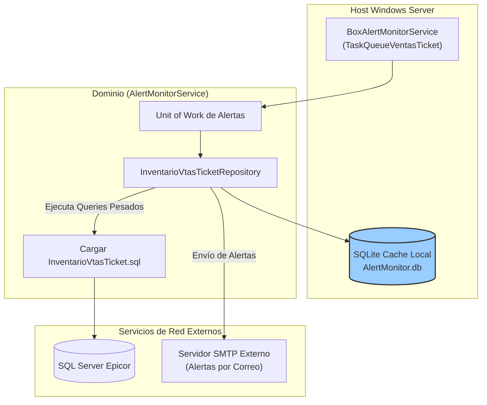

=============================================================================
### ARCHIVO 1: auditoria_codigo_buenas_practicas.md
=============================================================================

# INFORME DE AUDITORÍA TÉCNICA DE CÓDIGO Y BUENAS PRÁCTICAS
**Comité Consultor de Élite: Arquitectura Cloud-Native, DevSecOps y Ciberseguridad**
**Aplicación:** Box TaskQueueVentasTicket (Monitoreo de Alertas e Inventario de Tickets)

---

## 1.1 RESUMEN EJECUTIVO DE LA BASE DE CÓDIGO

La aplicación **Box TaskQueueVentasTicket** forma parte de la suite **BoxAlertMonitorService**. Está diseñada para monitorear y reconciliar inventarios y transacciones derivados de las ventas de tickets y facturas. El análisis revela una arquitectura basada en tareas mucho más madura que utiliza **SQLite local como base de datos de caché (`EFCoreSQLite`)**, Unit of Works y repositorios desacoplados. Sin embargo, sigue acoplada a la ejecución como Windows Service clásico.

*   **Puntuación Global Estimada (Score):** **58 / 100**
*   **Estado General:** **Regular/Bajo.** Aunque utiliza patrones arquitectónicos estructurados (Unit of Work, Entity Framework Core, persistencia local en SQLite), el acoplamiento a Windows Service e infraestructura de logs local restringe drásticamente su portabilidad a la nube.

⚠️ **Información no proporcionada en la entrada:**
1. Volumen transaccional exacto de procesamiento de tickets diario.
2. Latencia tolerada para el reporte de discrepancias de inventario de tickets hacia el ERP central.

---

## 1.2 DIAGRAMA DE ARQUITECTURA, FLUJO Y CONEXIONES EXTERNAS (MERMAID)

---

## 1.3 MATRIZ DE PUNTUACIÓN DE DESARROLLO (SCORECARD)

| Aspecto Evaluado | Puntuación (1-5) | Estado | Diagnóstico Puntual |
| :--- | :---: | :--- | :--- |
| **Arquitectura de Software** | 3 | Regular | Buena segmentación (UoW, SQLite), pero acoplada a Windows Service. |
| **Ciberseguridad en Código** | 2 | Regular | Las credenciales de SMTP y base de datos residen en App.config. |
| **Patrones de Diseño** | 3 | Regular | Patrón Unit of Work y Repository bien aplicados, aunque instanciados de forma directa. |
| **Principios SOLID** | 3 | Regular | Respeta mayormente SRP en la capa de datos. DIP vulnerado por falta de IoC. |
| **Clean Code y Modularidad** | 3 | Regular | Consultas SQL extensas almacenadas en archivos separados, lo cual es positivo. |

---

## 1.4 ANÁLISIS CRÍTICO DETALLADO POR ASPECTO

### A. Persistencia Local (SQLite y Efimeridad)
El uso de una base de datos SQLite local (`AlertMonitor.db`) es un patrón inteligente de almacenamiento intermedio para cachear discrepancias de tickets. Sin embargo, en una arquitectura basada en **contenedores efímeros (Docker/K8s)**, el almacenamiento local se destruye al reiniciar el pod. Mover esta persistencia local sin usar volúmenes compartidos destruirá el histórico de logs y alertas locales.

### B. Monitoreo por Polling Directo
El servicio lee un archivo SQL embebido (`InventarioVtasTicket.sql`) y lo ejecuta sobre la base de datos de producción de Epicor de manera constante para detectar anomalías. Esto genera sobrecarga de consultas analíticas pesadas (de agregación) en caliente sobre bases relacionales operativas.

---

## 1.5 SECCIÓN DE RECOMENDACIONES CRÍTICAS Y PLAN DE REMEDIACIÓN

### P0 - Crítico: Gestión de Persistencia y Logs
1. **Migración a PostgreSQL/Redis:** Reemplazar el archivo SQLite local por una base de datos relacional ligera externa (ej. PostgreSQL en contenedor independiente) o usar Redis para el almacenamiento de alertas de tickets.
2. **Abstracción de SMTP y DB:** Configurar los secretos de red mediante inyección de variables de entorno.

### P1 - Alto: Optimización de Consultas Analíticas
1. **Rediseñar Polling:** Pasar las alertas a un modelo reactivo donde el punto de venta (POS) notifique la venta de un ticket de manera asíncrona, en lugar de consultar constantemente las tablas maestras de ventas del ERP.
---

## 1.6 AUDITORÍA DEVSECOPS Y CIBERSEGURIDAD (OWASP Top 10)

Como parte de la evaluación de seguridad integral del Comité Consultor, se han identificado brechas críticas transversales que deben remediarse obligatoriamente para cumplir con normativas corporativas:

### A. Exposición de Secretos y Credenciales (OWASP A02:2021)
*   **Riesgo:** El almacenamiento de credenciales de base de datos, contraseñas y llaves de API (ej. XApiKey) dentro de archivos estáticos como App.config permite a cualquier usuario con acceso al servidor o repositorio comprometer el ecosistema completo.
*   **Remediación:** Migrar hacia un modelo de **Inyección de Secretos** utilizando variables de entorno en contenedores o bóvedas de grado empresarial como Azure Key Vault / HashiCorp Vault.

### B. Transmisión Insegura de Datos en Red (OWASP A02:2021)
*   **Riesgo:** Las integraciones contra los orquestadores y bases de datos locales suelen viajar a través de canales no encriptados (HTTP plano).
*   **Remediación:** Imponer políticas estrictas de cifrado forzando el uso de HTTPS (TLS 1.2 o TLS 1.3) en las llamadas de HttpClient y las conexiones a bases de datos.

### C. Vulnerabilidad ante Denegación de Servicio (DoS) Interno
*   **Riesgo:** El diseño de hilos sin límite estricto y temporizadores bloqueantes agota los recursos (CPU/RAM/Sockets) del contenedor o servidor host.
*   **Remediación:** Implementar SemaphoreSlim para acotar la concurrencia, y configurar límites estrictos de recursos (limits y 
eservations) en los orquestadores de Docker/Kubernetes.
