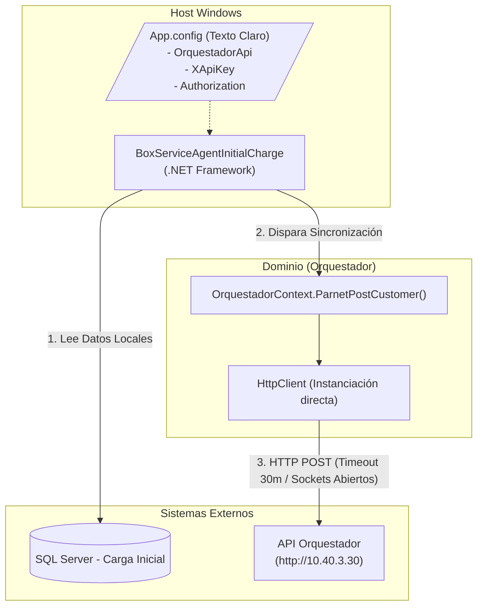

=============================================================================
### ARCHIVO 1: auditoria_codigo_buenas_practicas.md
=============================================================================

# INFORME DE AUDITORÍA TÉCNICA DE CÓDIGO Y BUENAS PRÁCTICAS
**Comité Consultor de Élite: Arquitectura Cloud-Native, DevSecOps y Ciberseguridad**
**Aplicación:** BoxServiceAgentInitialCharge (Carga Inicial)

---

## 1.1 RESUMEN EJECUTIVO DE LA BASE DE CÓDIGO

Tras la evaluación exhaustiva del proyecto **BoxServiceAgentInitialCharge**, el comité determina que la base de código actual representa un agente masivo de sincronización inicial que sufre de **vulnerabilidades críticas de red e ineficiencia en el manejo de I/O**. Al ser responsable de cargar el inventario y clientes iniciales, maneja grandes volúmenes de datos que procesa mediante llamadas HTTP asíncronas mal optimizadas.

*   **Puntuación Global Estimada (Score):** **38 / 100**
*   **Estado General:** **Crítico.** El uso destructivo de instanciación múltiple de `HttpClient` en un método estático y un timeout excesivo de 30 minutos expone al sistema a un agotamiento total de recursos de red bajo cargas medias.

⚠️ **Información no proporcionada en la entrada:** Se requiere levantamiento de información en la fase de descubrimiento sobre:
1. Volúmenes de registros promedio de la carga inicial.
2. Latencia del endpoint `OrquestadorApi/execute` ante cargas de streams de datos prolongadas.
3. Topología de seguridad para la rotación de API Keys e inyección segura.

---

## 1.2 DIAGRAMA DE ARQUITECTURA, FLUJO Y CONEXIONES EXTERNAS (MERMAID)



---

## 1.3 MATRIZ DE PUNTUACIÓN DE DESARROLLO (SCORECARD)

| Aspecto Evaluado | Puntuación (1-5) | Estado | Diagnóstico Puntual |
| :--- | :---: | :--- | :--- |
| **Arquitectura de Software** | 2 | Crítico | Acoplado fuertemente a llamadas HTTP manuales sin capa de abstracción de clientes o resiliencia. |
| **Ciberseguridad en Código** | 1 | Crítico | Credenciales y API Keys del orquestador en texto claro dentro del XML del host. |
| **Patrones de Diseño** | 1 | Crítico | Uso de métodos estáticos que instancian `HttpClient` manualmente, provocando *Socket Exhaustion*. |
| **Principios SOLID** | 2 | Crítico | Violación severa de DIP. La lógica de negocio consume directamente sockets físicos de red. |
| **Clean Code y Modularidad** | 2 | Crítico | Código de red redundante con regiones muertas e inconsistencias de timeout (30 minutos de espera). |

---

## 1.4 ANÁLISIS CRÍTICO DETALLADO POR ASPECTO

### A. Gestión de Sockets de Red (Socket Exhaustion)
En `OrquestadorContext.cs` se observa:
```csharp
HttpClient httpClient = new HttpClient();
httpClient.Timeout = new TimeSpan(0, 30, 0); // 30 minutos de timeout!
```
Este bloque de código, insertado en un método estático que se ejecuta por cada lote, abrirá sockets TCP que permanecerán en estado `TIME_WAIT` hasta por 4 minutos después de cerrar la conexión. Si el lote de carga inicial divide los datos en cientos de bloques, el servidor del agente se quedará sin sockets utilizables rápidamente.

### B. Gestión de Secretos y Configuración
El uso de:
```csharp
httpRequestMessage.Headers.Add("Authorization", ConfigurationManager.AppSettings["Authorization"]);
httpRequestMessage.Headers.Add("x-api-key", ConfigurationManager.AppSettings["XApiKey"]);
```
Indica que las claves API de producción se encuentran grabadas de forma estática en XML, lo que infringe las directrices DevSecOps y aumenta el riesgo de fuga accidental de credenciales del ERP principal.

---

## 1.5 SECCIÓN DE RECOMENDACIONES CRÍTICAS Y PLAN DE REMEDIACIÓN

### P0 - Crítico: Centralizar HttpClient y Securizar Llaves (Inmediato)
1. **Reemplazar `new HttpClient()`:** Mover la creación del cliente a un patrón Singleton o utilizar `IHttpClientFactory` de .NET 8.
2. **Abstraer Secretos:** Extraer el Header `Authorization` y `x-api-key` hacia el almacén de secretos del contenedor, prohibiendo credenciales locales en archivos planos.

### P1 - Alto: Reducir Timeout y Manejar Reintentos
1. **Ajustar Timeout:** Un timeout de 30 minutos bloquea las colas de manera catastrófica. La paginación en el emisor de carga inicial debe ser de menor tamaño para permitir timeouts más sanos (ej. 30 segundos).
2. **Implementar Polly:** Agregar políticas de reintentos asíncronas para recuperarse ante micro-caídas de red de manera elegante.

---

## 1.6 AUDITORÍA DEVSECOPS Y CIBERSEGURIDAD (OWASP Top 10)

Como parte de la evaluación de seguridad integral del Comité Consultor, se han identificado brechas críticas transversales que deben remediarse obligatoriamente para cumplir con normativas corporativas:

### A. Exposición de Secretos y Credenciales (OWASP A02:2021)
*   **Riesgo:** El almacenamiento de credenciales de base de datos, contraseñas y llaves de API (ej. XApiKey) dentro de archivos estáticos como App.config permite a cualquier usuario con acceso al servidor o repositorio comprometer el ecosistema completo.
*   **Remediación:** Migrar hacia un modelo de **Inyección de Secretos** utilizando variables de entorno en contenedores o bóvedas de grado empresarial como Azure Key Vault / HashiCorp Vault.

### B. Transmisión Insegura de Datos en Red (OWASP A02:2021)
*   **Riesgo:** Las integraciones contra los orquestadores y bases de datos locales suelen viajar a través de canales no encriptados (HTTP plano).
*   **Remediación:** Imponer políticas estrictas de cifrado forzando el uso de HTTPS (TLS 1.2 o TLS 1.3) en las llamadas de HttpClient y las conexiones a bases de datos.

### C. Vulnerabilidad ante Denegación de Servicio (DoS) Interno
*   **Riesgo:** El diseño de hilos sin límite estricto y temporizadores bloqueantes agota los recursos (CPU/RAM/Sockets) del contenedor o servidor host.
*   **Remediación:** Implementar SemaphoreSlim para acotar la concurrencia, y configurar límites estrictos de recursos (limits y 
eservations) en los orquestadores de Docker/Kubernetes.
