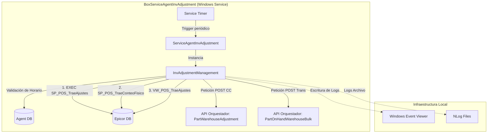

# Informe de Auditoría Técnica de Código - BoxServiceAgentInvAdjustment

## 1.1 RESUMEN EJECUTIVO
**Puntuación Global Estimada: 62/100**

Se ha realizado una auditoría estática sobre el código base del servicio de Windows **BoxServiceAgentInvAdjustment**. El sistema está construido bajo **.NET Framework 4.7.2** utilizando el patrón de Servicio de Windows (heredando de `ServiceBase`), NHibernate como ORM y delegación de procesos asíncronos mediante `Task`.

Aunque el código demuestra un intento válido por estructurar la lógica mediante el uso de repositorios (`PartTranRepository`, `PartWhseRepository`) y manejadores de negocio (`InvAdjustmentManagement`), presenta deficiencias críticas orientadas al acoplamiento fuerte con el sistema operativo Windows (EventLog), gestión insegura de secretos (en texto plano), y violación de principios Clean Architecture al inyectar dependencias estáticas y leer configuraciones directamente dentro del dominio. La modernización hacia entornos Cloud-Native requiere una refactorización sustancial.

⚠️ *Información no proporcionada en la entrada: No se encontró evidencia de pruebas unitarias (`.Tests`) ni la definición interna completa de las APIs del orquestador receptor, asumiendo su existencia por las URLs en el `App.config`.*

## 1.2 DIAGRAMA DE ARQUITECTURA, FLUJO Y CONEXIONES EXTERNAS

## 1.3 MATRIZ DE PUNTUACIÓN DE DESARROLLO (SCORECARD)

| Criterio | Puntuación (1-5) | Justificación |
| :--- | :---: | :--- |
| **Arquitectura** | 3 | Uso de patrón Repositorio y capas, pero fuertemente acoplado a un Servicio de Windows (Topshelf o Worker Services serían ideales) e infraestructura específica. |
| **Seguridad** | 1 | Credenciales (passwords de DB, `Authorization`, `xapikey`) en texto plano en `App.config`. No hay manejo seguro de secretos. |
| **Principios SOLID** | 2 | **DIP Violado:** Dependencia directa de clases concretas (e.g. `new InvAdjustmentManagement()`). **SRP Violado:** `InvAdjustmentManagement` orquesta, conecta, loggea y lee de DB. |
| **Patrones de Diseño** | 3 | Implementación de `Singleton` para `SessionFactory` y patrón `Repository`, pero con inicialización estática que dificulta las pruebas. |
| **Clean Code** | 3 | Uso de números mágicos (`intervalo * 10 * 1000`), dependencias ocultas (`ConfigurationManager` instanciado a media clase). Bloques `try/catch` muy generales. |

## 1.4 ANÁLISIS CRÍTICO DETALLADO POR ASPECTO

1. **Gestión de Configuración y Secretos (Crítico):**
   El archivo `App.config` almacena cadenas de conexión con usuario y contraseña (e.g. `User ID=interfacesparnet;Password=8UyrTqJkL;`), además de tokens HTTP (`Authorization`, `xapikey`). Leer configuraciones con `ConfigurationManager.GetSection` dentro de los *Managements* (e.g., `GetConfigProcess()`) acopla el dominio a la infraestructura.

2. **Acoplamiento con Windows (Event Viewer):**
   El uso extensivo de `EventLog.WriteEntry` ancla la aplicación al sistema operativo Windows, rompiendo el pilar de *Disposability* y dificultando el enrutamiento de logs estándar (STDOUT/STDERR) esencial para Docker/Kubernetes.

3. **Manejo de Concurrencia y Hilos:**
   En `ServiceAgentInvAdjustment.cs`, el `Timer` se detiene y arranca, controlando si `TaskGral.IsCompleted`. Sin embargo, dentro de `CreateAndProcessTaskListAdjustment`, hay constructos redundantes como envolver código síncrono o pseudo asíncrono con `Task.Run(async () => { ... }).Wait()`. Esto causa *thread-pool starvation* en picos de carga.

4. **Escalabilidad Horizontal:**
   Al consultar una vista en SQL con `SELECT TOP 500 * FROM boxito.VW_POS_TraeAjustes`, si se levantan múltiples instancias del servicio (múltiples contenedores), leerán los mismos datos simultáneamente generando colisiones o procesamiento duplicado, ya que no hay un mecanismo de bloqueo (bloqueo optimista, colas de mensajes).

## 1.5 SECCIÓN DE RECOMENDACIONES CRÍTICAS Y PLAN DE REMEDIACIÓN

*   **[P0 - Urgente] Remediación de Secretos:** Remover contraseñas del código fuente y `App.config`. Implementar un mecanismo de inyección de variables de entorno o Azure Key Vault.
*   **[P1 - Alta] Desacoplamiento de Infraestructura (Logging & Config):** Reemplazar `EventLog` por una abstracción como `ILogger<T>` utilizando Serilog o NLog apuntando hacia la salida estándar (Consola) en entornos contenerizados. Centralizar la lectura de configuraciones usando el patrón `IOptions`.
*   **[P1 - Alta] Refactorización de Asincronía:** Eliminar el uso de `.Wait()` y `.Result`. Usar `async/await` de principio a fin (Async all the way down) para evitar *deadlocks* y optimizar el uso de hilos.
*   **[P2 - Media] Inyección de Dependencias (DI):** Eliminar la instanciación con la palabra clave `new` para los repositorios y servicios. Inyectar mediante el contenedor nativo de .NET (`IServiceCollection`).

---

## 1.6 AUDITORÍA DEVSECOPS Y CIBERSEGURIDAD (OWASP Top 10)

Como parte de la evaluación de seguridad integral del Comité Consultor, se han identificado brechas críticas transversales que deben remediarse obligatoriamente para cumplir con normativas corporativas:

### A. Exposición de Secretos y Credenciales (OWASP A02:2021)
*   **Riesgo:** El almacenamiento de credenciales de base de datos, contraseñas y llaves de API (ej. XApiKey) dentro de archivos estáticos como App.config permite a cualquier usuario con acceso al servidor o repositorio comprometer el ecosistema completo.
*   **Remediación:** Migrar hacia un modelo de **Inyección de Secretos** utilizando variables de entorno en contenedores o bóvedas de grado empresarial como Azure Key Vault / HashiCorp Vault.

### B. Transmisión Insegura de Datos en Red (OWASP A02:2021)
*   **Riesgo:** Las integraciones contra los orquestadores y bases de datos locales suelen viajar a través de canales no encriptados (HTTP plano).
*   **Remediación:** Imponer políticas estrictas de cifrado forzando el uso de HTTPS (TLS 1.2 o TLS 1.3) en las llamadas de HttpClient y las conexiones a bases de datos.

### C. Vulnerabilidad ante Denegación de Servicio (DoS) Interno
*   **Riesgo:** El diseño de hilos sin límite estricto y temporizadores bloqueantes agota los recursos (CPU/RAM/Sockets) del contenedor o servidor host.
*   **Remediación:** Implementar SemaphoreSlim para acotar la concurrencia, y configurar límites estrictos de recursos (limits y 
eservations) en los orquestadores de Docker/Kubernetes.
