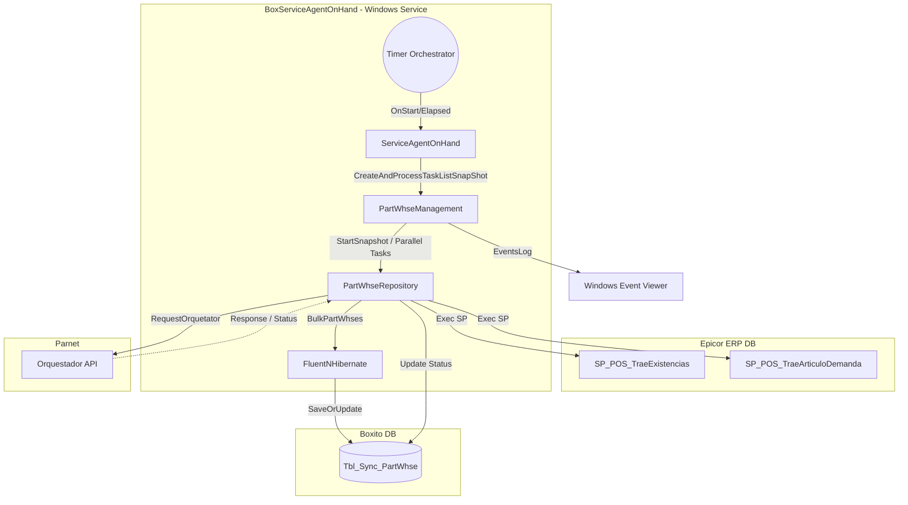

# 1.1 RESUMEN EJECUTIVO
**Puntuación Global Estimada: 45/100**

La aplicación "BoxServiceAgentOnHand" es un servicio de Windows monolítico (.NET Framework) encargado de orquestar y sincronizar inventarios (Existencias de Almacén) entre Epicor y Parnet. Su diseño muestra deuda técnica significativa y fuerte acoplamiento a primitivas del sistema operativo (Windows Event Log, `System.ServiceProcess`). Aunque cumple su función mediante llamadas asíncronas y paralelización con TPL (`Task.Run`, `Task.WhenAll`), carece de inyección de dependencias, abstracciones limpias y un manejo adecuado de configuración, lo que dificulta su escalabilidad, mantenimiento y modernización.

# 1.2 DIAGRAMA DE ARQUITECTURA, FLUJO Y CONEXIONES EXTERNAS (MERMAID)

# 1.3 MATRIZ DE PUNTUACIÓN DE DESARROLLO
| Criterio | Puntuación (1-5) | Justificación |
|----------|------------------|---------------|
| Arquitectura | 2 | Servicio Windows Legacy fuertemente acoplado. Mezcla lógica de negocio con acceso a datos. No implementa Clean Architecture. |
| Seguridad | 2 | Credenciales, tokens (x-api-key, Authorization) extraídas localmente del App.config en lugar de un vault de secretos. Construcción de strings SQL `string.Format("EXEC...")` que podría ser vulnerable a inyección si los parámetros no se sanitizan. |
| SOLID | 2 | Violación de SRP: `PartWhseManagement` y `PartWhseRepository` manejan reglas de negocio, ORM, logueo y llamadas HTTP. No hay Dependency Inversion (DI). |
| Patrones | 2 | Se usa Repository/ORM, pero se corrompe al crear objetos directamente con `new` (`new PartWhseRepository(...)`). Falta Unit of Work y control robusto de contexto. |
| Clean Code | 2 | Métodos extremadamente largos (ej. `ProcessSnapShot`, `RequestOrquetator`). Nombres mixtos de variables (inglés/español). "Magic numbers" en control de flujos y paginaciones quemadas. |

# 1.4 ANÁLISIS CRÍTICO DETALLADO POR ASPECTO
**Gestión de Hilos y Concurrencia:**
El código utiliza `Task.Run` y `Task.WhenAll` para paralelizar peticiones por sucursal (`Plant`). En `PartWhseRepository.BulkPartWhses`, la paginación con tareas paralelas (`ParallelSave`) abre múltiples sesiones de NHibernate concurrentes. Esto puede llevar a agotamiento de puertos o conexiones a la base de datos (Connection Pool Exhaustion) bajo alta carga si las sesiones no se gestionan eficientemente.

**Acceso a Datos:**
Se usa FluentNHibernate, lo que es un buen punto de partida. Sin embargo, se expone directamente la ejecución de strings SQL concatenados: `$"EXEC boxito.SP_POS_TraeArticuloDemanda '{Plant}'"`. Esto representa un riesgo y un antipatrón en el uso de un ORM moderno. 

**Logueo y Observabilidad:**
El uso extensivo de `EventLog.WriteEntry` y la clase personalizada `EventsLog` ligan fuertemente el sistema a Windows OS. Si hay fallos masivos (como caídas de red al consultar el Orquestador API), el Visor de Eventos se saturará. No hay trazabilidad distribuida ni logs estructurados (Ej. Serilog).

**Manejo de Errores:**
Bloques `try/catch` globales capturan genéricamente `Exception` y loguean en Windows, a veces continuando el flujo en un estado inconsistente (ej. transacciones revertidas que no informan al flujo superior debido al manejo silenciado).

# 1.5 SECCIÓN DE RECOMENDACIONES CRÍTICAS Y PLAN DE REMEDIACIÓN
*   **P0 (Bloqueante / Crítico):** 
    - Migrar de Windows Service (`ServiceBase`) a un `Worker Service` moderno (Genérico o en .NET Core / .NET 6+) para desvincularlo del OS.
    - Cambiar la interpolación de strings SQL por ejecución parametrizada real para la invocación de SPs.
*   **P1 (Alta Prioridad):**
    - Implementar un contenedor de Inyección de Dependencias (DI) (Ej: `Microsoft.Extensions.DependencyInjection`). Eliminar inicializaciones directas con `new` de los repositorios y gestores.
    - Reemplazar el logueo ligado a `EventViewer` por un sistema compatible con `ILogger` de Microsoft (como Serilog) dirigido a `stdout` (consola) para soportar entornos contenedorizados.
*   **P2 (Mejora Continua):**
    - Refactorizar `PartWhseManagement` para delegar las responsabilidades y acortar el tamaño de métodos, aplicando Clean Architecture.
    - Centralizar las peticiones HTTP mediante `IHttpClientFactory` y mecanismos de resiliencia (Polly) para las llamadas a "Orquestador API".

---

## 1.6 AUDITORÍA DEVSECOPS Y CIBERSEGURIDAD (OWASP Top 10)

Como parte de la evaluación de seguridad integral del Comité Consultor, se han identificado brechas críticas transversales que deben remediarse obligatoriamente para cumplir con normativas corporativas:

### A. Exposición de Secretos y Credenciales (OWASP A02:2021)
*   **Riesgo:** El almacenamiento de credenciales de base de datos, contraseñas y llaves de API (ej. XApiKey) dentro de archivos estáticos como App.config permite a cualquier usuario con acceso al servidor o repositorio comprometer el ecosistema completo.
*   **Remediación:** Migrar hacia un modelo de **Inyección de Secretos** utilizando variables de entorno en contenedores o bóvedas de grado empresarial como Azure Key Vault / HashiCorp Vault.

### B. Transmisión Insegura de Datos en Red (OWASP A02:2021)
*   **Riesgo:** Las integraciones contra los orquestadores y bases de datos locales suelen viajar a través de canales no encriptados (HTTP plano).
*   **Remediación:** Imponer políticas estrictas de cifrado forzando el uso de HTTPS (TLS 1.2 o TLS 1.3) en las llamadas de HttpClient y las conexiones a bases de datos.

### C. Vulnerabilidad ante Denegación de Servicio (DoS) Interno
*   **Riesgo:** El diseño de hilos sin límite estricto y temporizadores bloqueantes agota los recursos (CPU/RAM/Sockets) del contenedor o servidor host.
*   **Remediación:** Implementar SemaphoreSlim para acotar la concurrencia, y configurar límites estrictos de recursos (limits y 
eservations) en los orquestadores de Docker/Kubernetes.
