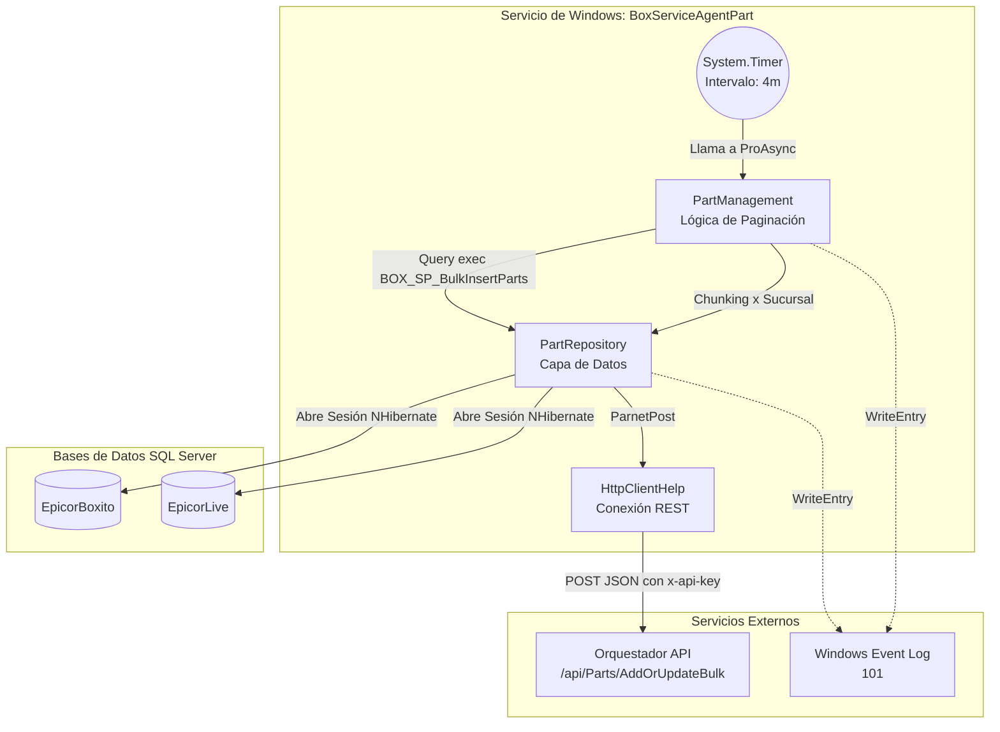

# Informe de Auditoría Técnica de Código y Buenas Prácticas

## 1.1 RESUMEN EJECUTIVO
**Puntuación Global Estimada: 42/100**

Se ha realizado una auditoría profunda sobre el código fuente del componente `BoxServiceAgentPart`, implementado como un Servicio de Windows en .NET Framework 4.7.2. El agente tiene la responsabilidad crítica de extraer partes/artículos mediante un Stored Procedure (`BOX_SP_BulkInsertParts`) y sincronizarlos hacia un Orquestador vía HTTP REST.

La aplicación presenta deficiencias severas en seguridad (exposición de credenciales), rendimiento (agotamiento de sockets y conexiones a BD) y adherencia a patrones modernos. La arquitectura es fuertemente monolítica orientada a Windows y presenta violaciones a los principios SOLID que complican su mantenibilidad. La refactorización es obligatoria antes de cualquier intento de modernización o paso a producción a gran escala.

## 1.2 DIAGRAMA DE ARQUITECTURA, FLUJO Y CONEXIONES EXTERNAS

## 1.3 MATRIZ DE PUNTUACIÓN DE DESARROLLO

| Categoría | Puntuación (1-5) | Observación |
| :--- | :---: | :--- |
| **Arquitectura** | 2 | Servicio de Windows acoplado a SO. Fuerte dependencia de la infraestructura (EventLog). |
| **Seguridad** | 1 | Contraseñas de BD y Tokens API (`x-api-key`) en texto plano en `App.config`. |
| **SOLID** | 2 | SRP violado (Repository maneja lógica HTTP). DIP violado (Instanciaciones directas). |
| **Patrones** | 2 | Anti-patrón de HttpClient (Instanciación por petición). Anti-patrón de transacciones en loops. |
| **Clean Code** | 3 | Código medianamente legible pero con código comentado innecesario y bloques try-catch muy genéricos. |

## 1.4 ANÁLISIS CRÍTICO DETALLADO POR ASPECTO

**A. Manejo de Hilos y Concurrencia (Grave):**
- **Saturación de Pool de Conexiones:** En `PartRepository.Insert` y `ChangeStatus`, se instancian `NHibernateHelper` y abren sesiones *dentro de un bucle `foreach`*. Esto abre y cierra decenas/cientos de transacciones en secuencia, destrozando el rendimiento y el connection pool de SQL Server.
- **`Parallel.ForEach` peligroso:** En `PartRepository.Update`, se abre una sesión de NHibernate dentro de un `Parallel.ForEach`. NHibernate no es thread-safe en el contexto de sesión, y aunque instancian una nueva por cada hilo, esto genera picos incontrolables de conexiones a la base de datos bajo alta carga.

**B. Conexiones Externas (Agotamiento de Sockets):**
- En `HttpClientHelp.SendOrquestadorAsync`, se realiza un `new HttpClient()` por cada invocación. Este es un anti-patrón conocido en .NET que causa *Socket Exhaustion* (TIME_WAIT). `HttpClient` debe ser un Singleton o manejado a través de `IHttpClientFactory`.

**C. Seguridad de Credenciales (Peligro Crítico):**
- El archivo `App.config` expone contraseñas en texto claro para la base de datos (`Password=8UyrTqJkL;`) y los headers de autenticación del API (`tH1RouIce7IQw8`). No hay encriptación ni uso de Azure Key Vault o variables de entorno seguras.

**D. Telemetría y Logs:**
- Fuerte dependencia de `EventLog.WriteEntry`. En entornos modernos de nube/contenedores, no existe Windows Event Viewer. Los logs deben volcarse al flujo estándar (`STDOUT`/`STDERR`).

## 1.5 SECCIÓN DE RECOMENDACIONES CRÍTICAS Y PLAN DE REMEDIACIÓN

**Prioridad 0 (P0 - Bloqueantes de Producción y Seguridad):**
1. **Corregir Anti-Patrón HttpClient:** Implementar `static readonly HttpClient` o inyectar `IHttpClientFactory` para evitar la caída del servidor por falta de sockets.
2. **Remover Secretos del Código:** Migrar strings de conexión y API keys a variables de entorno o sistemas de gestión de secretos.
3. **Corregir NHibernate en Loops:** Refactorizar las inserciones para usar *Bulk Inserts* reales (e.g. `StatelessSession` de NHibernate o SqlBulkCopy), en lugar de abrir una sesión por cada registro.

**Prioridad 1 (P1 - Estabilidad y Rendimiento):**
1. **Eliminar `Parallel.ForEach` con NHibernate:** Remplazarlo por el procesamiento en lotes asíncronos (`Task.WhenAll` controlado con Semáforos) manteniendo una única transacción de base de datos por lote (Batch).
2. **Desacoplar Logging:** Abstraer el registro de eventos mediante una interfaz `ILogger` (usando Serilog o NLog) que permita escritura en consola/archivos independientemente del SO.

**Prioridad 2 (P2 - Arquitectura y Modernización):**
1. **Migración a .NET 8 (Worker Service):** Reescribir el servicio de Windows como un .NET Worker Service multi-plataforma. Esto resolverá la dependencia con Windows y preparará el terreno para Kubernetes/Docker.
2. **Inyección de Dependencias (DI):** Eliminar los `new PartRepository()` e implementar la inyección de dependencias nativa de .NET para facilitar el testeo unitario.
---

## 1.6 AUDITORÍA DEVSECOPS Y CIBERSEGURIDAD (OWASP Top 10)

Como parte de la evaluación de seguridad integral del Comité Consultor, se han identificado brechas críticas transversales que deben remediarse obligatoriamente para cumplir con normativas corporativas:

### A. Exposición de Secretos y Credenciales (OWASP A02:2021)
*   **Riesgo:** El almacenamiento de credenciales de base de datos, contraseñas y llaves de API (ej. XApiKey) dentro de archivos estáticos como App.config permite a cualquier usuario con acceso al servidor o repositorio comprometer el ecosistema completo.
*   **Remediación:** Migrar hacia un modelo de **Inyección de Secretos** utilizando variables de entorno en contenedores o bóvedas de grado empresarial como Azure Key Vault / HashiCorp Vault.

### B. Transmisión Insegura de Datos en Red (OWASP A02:2021)
*   **Riesgo:** Las integraciones contra los orquestadores y bases de datos locales suelen viajar a través de canales no encriptados (HTTP plano).
*   **Remediación:** Imponer políticas estrictas de cifrado forzando el uso de HTTPS (TLS 1.2 o TLS 1.3) en las llamadas de HttpClient y las conexiones a bases de datos.

### C. Vulnerabilidad ante Denegación de Servicio (DoS) Interno
*   **Riesgo:** El diseño de hilos sin límite estricto y temporizadores bloqueantes agota los recursos (CPU/RAM/Sockets) del contenedor o servidor host.
*   **Remediación:** Implementar SemaphoreSlim para acotar la concurrencia, y configurar límites estrictos de recursos (limits y 
eservations) en los orquestadores de Docker/Kubernetes.
