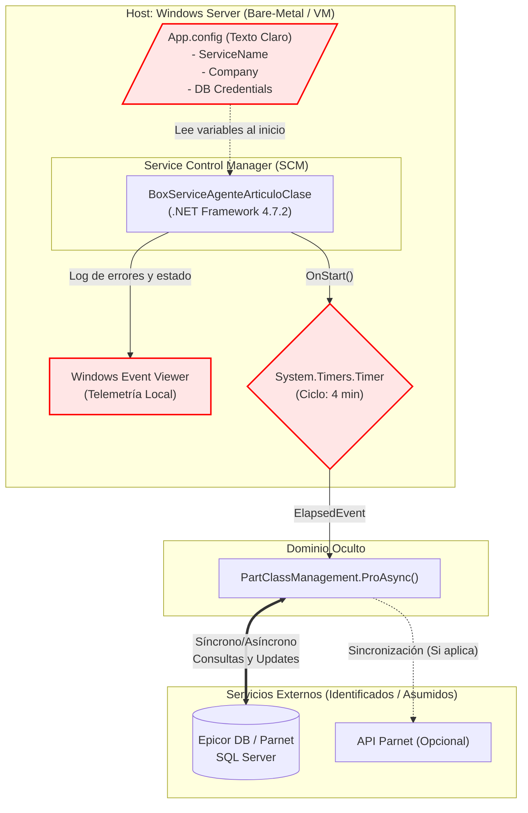

# INFORME DE AUDITORÍA TÉCNICA DE CÓDIGO Y BUENAS PRÁCTICAS
**Comité Consultor de Élite: Arquitectura Cloud-Native, DevSecOps y Ciberseguridad**

---

## 1.1 RESUMEN EJECUTIVO DE LA BASE DE CÓDIGO

Tras la evaluación exhaustiva del proyecto **Ecosistema de Agentes Maestros - BoxServiceAgenteArticuloClase**, se determina que la base de código actual representa un monolito de infraestructura severamente acoplado al sistema operativo anfitrión (Windows). Operando bajo .NET Framework 4.7.2 heredado, el sistema carece de las abstracciones necesarias para la escalabilidad, observabilidad y despliegue automatizado moderno. La deuda técnica es crítica en las áreas de inyección de dependencias, gestión de secretos y emisión de telemetría.

*   **Puntuación Global Estimada (Score):** **28 / 100**
*   **Estado General:** Deuda técnica crítica. Alto riesgo operativo por acoplamiento duro y vulnerabilidades de configuración en texto claro.

⚠️ **Información no proporcionada en la entrada:** Se requiere levantamiento de información en la fase de descubrimiento sobre:
1.  Volumen de transacciones o frecuencia real esperada (más allá de los 4 minutos hardcodeados).
2.  Implementación interna de la clase `PartClassManagement` (actualmente es una caja negra, desconocemos si maneja hilos internos de forma segura o si cierra las conexiones a la base de datos).
3.  Topología de red exacta y latencia aceptable hacia EpicorDB / Parnet.
4.  Mecanismos de reintentos (Retries) ante caídas de red; el código actual no muestra políticas de resiliencia (ej. Polly).

---

## 1.2 DIAGRAMA DE ARQUITECTURA, FLUJO Y CONEXIONES EXTERNAS (MERMAID)

**Explicación del Flujo y Puntos de Fallo Único (SPOF):**
1.  **Arranque (SPOF):** El SCM de Windows levanta el servicio. Este lee `App.config`. Si el archivo es alterado o faltan nodos, el servicio colapsa sin reportar fuera de la máquina local.
2.  **Ejecución (Cuello de botella / Riesgo de Zombis):** El `System.Timers.Timer` ejecuta `ProcesosAgente`. La validación de estado `(TaskGral == null || TaskGral.IsCompleted)` es propensa a condiciones de carrera. Si `PartClassManagement` entra en *deadlock* o una excepción severa escapa del `catch`, el hilo muere, dejando el servicio de Windows "Ejecutándose" engañosamente.
3.  **Telemetría (SPOF ciego):** Todos los errores críticos se envían a `EventLog.WriteEntry`. Esto es un punto ciego para los equipos de SRE y DevOps. Nadie sabe si el agente falla a menos que se inicie sesión por RDP en el servidor.
4.  **Conexiones Externas:** El sistema se comunica con EpicorDB. Si la base de datos no está disponible, el sistema generará excepciones en bucle cada 4 minutos saturando el Visor de Eventos.

---

## 1.3 MATRIZ DE PUNTUACIÓN DE DESARROLLO (SCORECARD)

| Aspecto Evaluado | Puntuación (1-5) | Estado | Diagnóstico Puntual |
| :--- | :---: | :--- | :--- |
| **Arquitectura de Software** | 1 | Crítico | Acoplamiento absoluto al SCM de Windows mediante `ServiceBase`. Bloquea portabilidad a Linux/Contenedores. |
| **Ciberseguridad en Código** | 1 | Crítico | Gestión de secretos mediante `ConfigurationManager` en XML. Altísimo riesgo de exposición lateral en el host. |
| **Patrones de Diseño** | 2 | Crítico | Ausencia de patrones modernos. Concurrencia manejada manualmente con timers primitivos en lugar de schedulers. |
| **Principios SOLID** | 1 | Crítico | Violación severa de DIP (uso directo de `new PartClassManagement()`) y SRP (la clase del servicio hace logging, schedule y negocio). |
| **Clean Code y Modularidad** | 2 | Crítico | Lógica entrelazada, manejo de excepciones pobre (concatena mensajes sin stacktrace real estructurado) y nula testeabilidad. |

> **📌 Nota — Interpretación de la escala (1–5):** Esta matriz mide **calidad** (salud del código), **no severidad de riesgo**. El valor **1 corresponde al peor estado posible** (Crítico) y el **5 al estado óptimo** (alineado a estándares industry-grade). Cuanto más alto el número, más sana esa dimensión del código.
>
> | Puntuación | Estado asociado | Significado |
> | :---: | :--- | :--- |
> | **1** | Crítico | Peor escenario: violaciones graves, bloqueante para operación/modernización |
> | **2** | Crítico / Regular | Deficiente: deuda técnica alta, requiere remediación urgente |
> | **3** | Regular | Aceptable: funcional pero con deuda técnica moderada |
> | **4** | Bueno | Buenas prácticas presentes, mejoras puntuales |
> | **5** | Óptimo | Excelente: adhiere a estándares (SOLID, 12-Factor, testeable) |
>
> ⚠️ **No confundir** con escalas de severidad de riesgo (CVSS o las prioridades P0/P1/P2 de la sección 1.5), donde un valor alto indica **mayor** gravedad — en esta scorecard la relación es exactamente inversa. El promedio actual del proyecto (1.4/5) equivale al Score global de **28/100** del resumen ejecutivo.

---

## 1.4 ANÁLISIS CRÍTICO DETALLADO POR ASPECTO

*   **Arquitectura de Software:** 
    El proyecto es un monolito en su mínima expresión (un componente fuertemente acoplado). La dependencia de `System.ServiceProcess` y `EventLog` significa que el binario compila exclusivamente como `WinExe`. Es imposible mover esta aplicación a la nube (AWS/Azure) en formato de contenedor ligero o Serverless sin reescribir la capa de entrada.
*   **Ciberseguridad en Código:**
    La instrucción `ConfigurationManager.AppSettings.Get(...)` indica que las configuraciones de la empresa (Company) y potencialmente las cadenas de conexión (Connection Strings) residen en `BoxServiceAgenteArticuloClase.exe.config`. Esto viola normativas de seguridad que exigen bóvedas de secretos (Vaults) o inyección por variables de entorno temporales. No hay rastros de sanitización de inputs al pasar el nombre de la compañía al constructor de negocio.
*   **Patrones de Diseño y Principios SOLID:**
    La clase principal viola el *Single Responsibility Principle* (SRP): actúa como *Daemon* del sistema operativo, como *Scheduler* temporal y como *Factory* instanciando lógicas de negocio.
    Viola el *Dependency Inversion Principle* (DIP) en la línea 62: `PartClassManagement p = new PartClassManagement(...)`. Esto acopla la infraestructura al negocio y prohíbe crear Mocks, dejando la cobertura de pruebas unitarias al 0%.
*   **Clean Code y Deuda Técnica:**
    Manejo de hilos peligroso. El código:
    `string error = string.Join("-", ex.Message, ex.InnerException?.Message);`
    Destruye el `StackTrace`. Se pierde el contexto de en qué línea exacta del código de negocio falló el sistema, haciendo el debugging una tarea de adivinación.

---

## 1.5 SECCIÓN DE RECOMENDACIONES CRÍTICAS Y PLAN DE REMEDIACIÓN

| Prioridad | Área | Acción Concreta |
| :--- | :--- | :--- |
| **P0 - Crítico** | **Infraestructura** | Abandonar `System.ServiceProcess.ServiceBase`. Migrar inmediatamente a `Microsoft.Extensions.Hosting.BackgroundService` en .NET 8 para lograr agnósticismo del Sistema Operativo. |
| **P0 - Crítico** | **Seguridad** | Eliminar `App.config`. Implementar `Microsoft.Extensions.Configuration` para consumir configuraciones desde variables de entorno y *User Secrets* (desarrollo local) o Azure Key Vault / Hashicorp Vault (Producción). |
| **P1 - Alto** | **Arquitectura** | Inyectar `IPartClassManagement` a través del constructor utilizando el contenedor IoC nativo de .NET (`IServiceCollection`), logrando 100% de testeabilidad. |
| **P1 - Alto** | **Observabilidad** | Reemplazar `EventLog.WriteEntry` por `ILogger<T>`. Configurar salidas a consola (`stdout`) estructuradas en formato JSON para su ingesta por ELK, Datadog o Splunk. |
| **P2 - Medio** | **Resiliencia** | Implementar políticas de reintentos transitorios (Transient Fault Handling) usando la librería `Polly` al conectar con Epicor DB o Parnet API. |
---

## 1.6 AUDITORÍA DEVSECOPS Y CIBERSEGURIDAD (OWASP Top 10)

Como parte de la evaluación de seguridad integral del Comité Consultor, se han identificado brechas críticas transversales que deben remediarse obligatoriamente para cumplir con normativas corporativas:

### A. Exposición de Secretos y Credenciales (OWASP A02:2021)
*   **Riesgo:** El almacenamiento de credenciales de base de datos, contraseñas y llaves de API (ej. XApiKey) dentro de archivos estáticos como App.config permite a cualquier usuario con acceso al servidor o repositorio comprometer el ecosistema completo.
*   **Remediación:** Migrar hacia un modelo de **Inyección de Secretos** utilizando variables de entorno en contenedores o bóvedas de grado empresarial como Azure Key Vault / HashiCorp Vault.

### B. Transmisión Insegura de Datos en Red (OWASP A02:2021)
*   **Riesgo:** Las integraciones contra los orquestadores y bases de datos locales suelen viajar a través de canales no encriptados (HTTP plano).
*   **Remediación:** Imponer políticas estrictas de cifrado forzando el uso de HTTPS (TLS 1.2 o TLS 1.3) en las llamadas de HttpClient y las conexiones a bases de datos.

### C. Vulnerabilidad ante Denegación de Servicio (DoS) Interno
*   **Riesgo:** El diseño de hilos sin límite estricto y temporizadores bloqueantes agota los recursos (CPU/RAM/Sockets) del contenedor o servidor host.
*   **Remediación:** Implementar SemaphoreSlim para acotar la concurrencia, y configurar límites estrictos de recursos (limits y 
eservations) en los orquestadores de Docker/Kubernetes.
