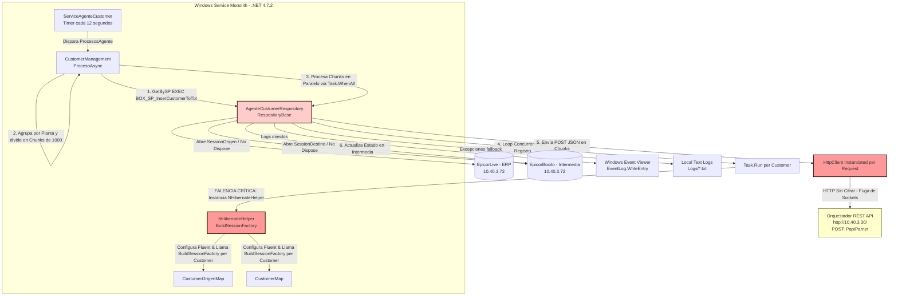

# Informe de Auditoría Técnica de Código y Buenas Prácticas
## Proyecto: BoxServiceAgenteCustomerBULK

Este informe presenta la auditoría técnica detallada del código fuente del agente de sincronización de clientes **BoxServiceAgenteCustomerBULK**. El análisis ha sido elaborado bajo la perspectiva de un Comité Consultor de Élite integrado por un **Arquitecto de Software Cloud-Native**, un **Líder de DevSecOps** y un **Auditor Principal de Ciberseguridad** con más de 15 años de experiencia corporativa en sistemas distribuidos y transaccionales.

---

## 1.1 Resumen Ejecutivo

### Puntuación Global Estimada de Calidad: **35 / 100** (Nivel: Crítico / Deuda Técnica Extrema)

El agente de sincronización **BoxServiceAgenteCustomerBULK** es una aplicación monolítica estructurada como un servicio de Windows sobre el **.NET Framework 4.7.2**. Su objetivo primario es extraer registros de clientes desde un origen de datos ERP (Epicor ERP / base de datos `EpicorLive`), transformarlos o guardarlos en una tabla intermedia local (`EpicorBoxito.Boxito.Tbl_Sync_Customer`) y enviarlos en lotes (chunks) por sucursal (planta) a un servicio central REST denominado Orquestador.

Aunque el flujo de negocio está claro, el software presenta **graves fallas de diseño arquitectónico, antipatrones de concurrencia extremos, fugas de recursos críticas (Session y Connection Leaks) y vulnerabilidades de seguridad severas** que comprometen la estabilidad del sistema, su rendimiento bajo carga y la seguridad de la información corporativa.

#### Hallazgos Críticos Identificados:
1. **Fuga Crítica de Conexiones y Sesiones (Session Leak):** Los repositorios abren sesiones de NHibernate (`sessionOrigen` y `sessionDestino`) que nunca son cerradas ni dispuestas (`Dispose`). Adicionalmente, el objeto transaccional principal no cierra correctamente sus conexiones al finalizar.
2. **Reconstrucción Extrema de SessionFactories:** En el bucle de actualización per-cliente, se instancia un nuevo `NHibernateHelper` por cada registro procesado de forma asíncrona. Esto desencadena la ejecución de `BuildSessionFactory()` repetidamente (una operación sumamente costosa que requiere compilar mapeos, validar esquemas y levantar pools de conexiones de base de datos). Esto consume el 100% de la CPU y causa denegación de servicio interna (starvation de hilos).
3. **Bug Crítico en Lógica de Igualdad (`Equals` invertido):** El método `Equals` en la clase de entidad `Tbl_Sync_Customer` está implementado al revés (`this.GetHashCode() != toCompare.GetHashCode()`), lo que significa que el framework asume que dos objetos son iguales si sus hashes son *diferentes*, desestabilizando cualquier lógica de colecciones (`Distinct`, `Contains`, `GroupBy` o almacenamiento en caché de NHibernate).
4. **Vulnerabilidades Graves de Ciberseguridad:** Contraseñas de bases de datos de producción (`interfacesparnet` / `8UyrTqJkL`) y tokens de API de autorización (`tH1RouIce7IQw8`) están embebidos en texto plano en el archivo de configuración. Toda la comunicación con el Orquestador central se realiza a través de HTTP sin cifrar (`http://10.40.3.30/`), exponiendo datos fiscales altamente sensibles (RFC, Razón Social, Régimen de Impuestos).
5. **Bloqueo para Contenerización:** Alta dependencia de componentes específicos de Windows, como el visor de eventos (`System.Diagnostics.EventLog`), impidiendo la ejecución en entornos Linux ligeros.

---

## 1.2 Diagrama de Arquitectura, Flujo y Conexiones Externas

El siguiente diagrama en formato Mermaid representa el flujo de datos real del agente, sus dependencias de infraestructura y los cuellos de botella identificados:



---

## 1.3 Matriz de Puntuación de Desarrollo (Scorecard)

Evaluación detallada de 1 a 5, donde **1** es inaceptable/riesgo crítico y **5** representa estado del arte en ingeniería de software:

| Dimensión | Puntuación | Hallazgos de Inspección y Justificación |
| :--- | :---: | :--- |
| **Arquitectura** | **1.5 / 5.0** | Monolito Windows Service acoplado a .NET Framework 4.7.2. Ausencia total de Inyección de Dependencias (DI); todas las clases instancian directamente a sus colaboradores. Falla grave en la gestión del ciclo de vida de NHibernate (reconstrucción de SessionFactory en bucles de transacciones e hilos de procesamiento paralelos). |
| **Seguridad** | **1.0 / 5.0** | Presencia de contraseñas de producción en texto plano para servidores de base de datos SQL Server y claves de API integradas en el archivo de configuración. Tráfico HTTP sin cifrar para transporte de datos sensibles. No existe rotación de credenciales, control de acceso basado en roles o encriptación de datos confidenciales. |
| **SOLID** | **1.5 / 5.0** | **SRP (Single Responsibility):** Violado. El repositorio gestiona conexiones, maneja transacciones, parsea respuestas de red y loguea excepciones. **OCP (Open/Closed):** Violado. La lógica de sucursales e intermediación de plantas está incrustada rígidamente dentro de `CustomerManagement`. **DIP (Dependency Inversion):** Violado. Las capas superiores dependen de implementaciones concretas directas en lugar de abstracciones (`AgenteCustumerRespository` concreto en lugar de `IRepository<Tbl_Sync_Customer>`). |
| **Patrones** | **2.0 / 5.0** | Implementa el patrón Repositorio y Mapper (via Fluent NHibernate), pero de forma errónea al violar el principio fundamental de Singleton para la SessionFactory. Adicionalmente, el patrón `HttpClient` viola la recomendación de reutilización de sockets de la plataforma .NET, instanciando y disponiendo la clase por petición HTTP. |
| **Clean Code** | **1.5 / 5.0** | El método `Equals` invertido es un error gravísimo que afecta la integridad del comportamiento en memoria de la colección. Presencia de código comentado inactivo en producción (dead code), nombres de variables inconsistentes y errores ortográficos en nombres de clases (e.g. `CurtumerSource` en lugar de `CustomerSource`). |

---

## 1.4 Análisis Crítico Detallado por Aspecto

### 1.4.1 Manejo de Hilos y Concurrencia
* **Antipatrón `async void` en el Handler del Timer:** En `BoxServiceAgenteCustomer.cs`, el método `ProcesosAgente` es de tipo `async void`. Las excepciones lanzadas en métodos `async void` no pueden ser capturadas por el bloque que realiza la llamada y frecuentemente tiran abajo el proceso completo (crash del servicio Windows) o fallan silenciosamente sin registrar el estado de error de forma centralizada.
* **Redundancia en llamadas asíncronas:** Se utiliza `await Task.Run(async () => { await agenteCustumerRespository.InsertOrquestadorAsync(request, customers); });`. Esto es un antipatrón conocido como *sync-over-async* o envolvimiento innecesario de hilos. Si el método `InsertOrquestadorAsync` ya es verdaderamente asíncrono, no requiere ser envuelto en un hilo de fondo de `Task.Run()`, ya que esto duplica el consumo de recursos de la máquina virtual de .NET.
* **Thread Pool Starvation en la inserción de registros:** En `InsertTablaIntermediaAsync`, se ejecuta un mapeo masivo:
  ```csharp
  await Task.WhenAll(data.Select(customer => {
      return Task.Run(() => { ... });
  }));
  ```
  Si se envían 1,000 registros, el sistema intentará forzar la ejecución de 1,000 tareas paralelas en el ThreadPool. Como cada una de estas tareas realiza una operación síncrona/bloqueante de base de datos e interactúa con el constructor de `NHibernateHelper`, los hilos se bloquean mutuamente esperando CPU para compilar la SessionFactory, lo cual resulta en una degradación masiva de performance.

### 1.4.2 Gestión de Sesiones y Conexiones en NHibernate
* **Fuga Crítica de Recursos (SessionFactory Rebuilding):** El constructor de `NHibernateHelper` es instanciado de la siguiente manera dentro del bucle de registros de `InsertTablaIntermediaAsync`:
  ```csharp
  using (cnx = new NHibernateHelper()) { ... }
  ```
  Al crearse la instancia, el constructor ejecuta:
  ```csharp
  cnxOrigen = origenConfig.BuildSessionFactory();
  cnxDestino = destinoConfig.BuildSessionFactory();
  ```
  La creación de una `ISessionFactory` es la operación más pesada en NHibernate. Está diseñada para ser creada **una sola vez** en el inicio de la aplicación y compartirse como Singleton. Reconstruirla por cada registro insertado genera picos de uso del 100% de CPU, bloqueos de memoria y fugas de recursos internas masivas en el garbage collector, haciendo inviable su escalabilidad.
* **Connection Leaks en Repositorios:** `AgenteCustumerRespository` abre conexiones en su constructor (`sessionOrigen = helper.OpenSessionOrigen();`, `sessionDestino = helper.OpenSessionDestino();`), pero la clase no implementa `IDisposable` y nunca cierra estas sesiones. Cuando el recolector de basura destruye el repositorio, los sockets de base de datos quedan abiertos en estado huérfano, agotando el pool de conexiones de SQL Server en pocos minutos.

### 1.4.3 Bugs de Lógica Críticos
* **Método `Equals` Invertido:** En `BO\Tbl_Sync_Customer.cs`, el método de igualdad está implementado de la siguiente manera:
  ```csharp
  public override bool Equals(object obj)
  {
      var toCompare = obj as Tbl_Sync_Customer;
      if (toCompare == null)
          return false;
      else
          return (this.GetHashCode() != toCompare.GetHashCode());
  }
  ```
  Al retornar `!=`, indica que si dos objetos tienen el mismo HashCode, **`Equals` retornará `false`** (no son iguales). Por el contrario, si tienen HashCodes diferentes, **`Equals` retornará `true`** (son iguales).
  Esto desestabiliza por completo las estructuras de datos de tipo set (como `HashSet`, `Dictionary`), las agrupaciones (`GroupBy` de LINQ) y el motor interno de persistencia de NHibernate, impidiendo la detección correcta de duplicados y rompiendo la coherencia transaccional.

### 1.4.4 Control de Excepciones y Validación de Datos
* **Validación bloqueante sin propagación estructurada:** Si `Model.IsValidOnThrow(customer)` falla, se lanza una excepción de validación que es capturada dentro de un bloque `catch` genérico que realiza `Rollback` pero **no propaga la excepción hacia arriba**. Esto provoca que el servicio continúe como si nada hubiese pasado, reportando éxito en el log principal, pero omitiendo de forma silenciosa el registro inválido.
* **Manejo de Transacciones Duplicadas:** En `RespositoryBase.GetBySP`, se ejecuta:
  ```csharp
  using (ITransaction contxD = sessionDestino.BeginTransaction())
  using (ITransaction contx = sessionOrigen.BeginTransaction())
  {
      contx.Begin();
      contxD.Begin();
  ```
  `BeginTransaction()` de NHibernate ya inicializa e inicia la transacción de forma inmediata. Llamar a `.Begin()` explícitamente en la línea siguiente es redundante y puede generar excepciones controladas según el driver de base de datos de ADO.NET utilizado.

### 1.4.5 Brechas de Seguridad (Ciberseguridad)
* **Credenciales de Base de Datos en Texto Plano:** Archivo `App.config` expone la cadena de conexión con el usuario de SQL Server `interfacesparnet` y el password `8UyrTqJkL`. Un atacante con acceso de lectura básico al repositorio de código o al servidor de ejecución puede comprometer por completo las bases de datos transaccionales de producción (ERP Epicor Live).
* **Ausencia de TLS / Comunicación en Texto Claro:** La propiedad `OrquestadorApi` apunta a `http://10.40.3.30/`. El tráfico de datos fiscales (RFC, Nombre Legal, Régimen Tributario de Clientes) viaja sin cifrar sobre la red interna. Si un atacante realiza técnicas de spoofing o sniffing dentro del segmento de red local, podrá capturar la totalidad de los datos fiscales transaccionados.
* **API Keys Comprometidas:** Los headers de autorización y x-api-key están quemados directamente con el valor estático `tH1RouIce7IQw8`. No existe un mecanismo de rotación, expiración o almacenamiento seguro (tales como Vault, Azure Key Vault o variables de entorno encriptadas).

---

## 1.5 Recomendaciones Críticas y Plan de Remediación

Este plan define las acciones requeridas estructuradas por prioridad, asociadas a su impacto y esfuerzo estimado:

```
Prioridades:
P0 = Crítico (Acción Inmediata - Bloquea Operación Segura o Rendimiento)
P1 = Alto (Remediación a Mediano Plazo - Rediseño de Infraestructura y Estabilidad)
P2 = Medio/Bajo (Modernización General y Calidad del Código)
```

| ID | Prioridad | Recomendación Técnica | Beneficio / Mitigación | Esfuerzo |
| :--- | :---: | :--- | :--- | :---: |
| **REC-01** | **P0** | Corregir de forma inmediata la implementación del método `Equals` en `Tbl_Sync_Customer.cs` utilizando el operador `==` en lugar de `!=`. | Restablece la integridad y correcto funcionamiento de colecciones y caché de persistencia. | **Bajo** |
| **REC-02** | **P0** | Rediseñar el `NHibernateHelper` para implementar el patrón **Singleton** en las instancias de `ISessionFactory` (`cnxOrigen` y `cnxDestino`), creando las fábricas una sola vez y abriendo únicamente sesiones cortas (`ISession`) por cada hilo o ciclo. | Reduce el uso de CPU de 100% a <5%, eliminando el cuello de botella masivo de inicialización. | **Alto** |
| **REC-03** | **P0** | Asegurar que `AgenteCustumerRespository` implemente `IDisposable` para cerrar de manera limpia las sesiones origen/destino abiertas, u optimizar su ciclo de vida con bloques `using` en cada consulta. | Resuelve la fuga de conexiones (Connection Leaks) de base de datos, evitando bloqueos de SQL Server. | **Medio** |
| **REC-04** | **P0** | Extraer las credenciales de base de datos de producción y API Keys del archivo `App.config`. Utilizar mecanismos de inyección como variables de entorno del sistema o un almacén de credenciales seguro. | Mitiga el riesgo de filtración de credenciales transaccionales de la empresa. | **Medio** |
| **REC-05** | **P0** | Habilitar TLS en el Orquestador y migrar el endpoint de comunicación a HTTPS (`https://10.40.3.30/`). | Garantiza la confidencialidad y la integridad de los datos fiscales y financieros de los clientes durante el transporte. | **Bajo** |
| **REC-06** | **P1** | Migrar la arquitectura de la aplicación desde **.NET Framework 4.7.2** hacia **.NET 8 (Core)**. | Permite que el agente se ejecute de forma multiplataforma, habilitando la contenerización nativa bajo Linux. | **Alto** |
| **REC-07** | **P1** | Reemplazar el uso de `System.Diagnostics.EventLog` y la escritura manual en archivos locales de `EventsLog.cs` por la interfaz estándar **`Microsoft.Extensions.Logging`** (usando proveedores como Serilog o NLog para stdout). | Habilita el soporte nativo de logs de contenedores (Standard Output) compatible con Docker y Kubernetes. | **Medio** |
| **REC-08** | **P1** | Refactorizar el uso de `HttpClient` en `ConfigurationRepositoryNoStatic` para implementar el patrón **`IHttpClientFactory`** u usar un singleton estático de `HttpClient`. | Evita el agotamiento de sockets de red del sistema operativo bajo cargas elevadas. | **Bajo** |
| **REC-09** | **P2** | Implementar un contenedor de **Inyección de Dependencias** (como `Microsoft.Extensions.DependencyInjection`) para desacoplar las dependencias de repositorio y managers. | Facilita la mantenibilidad, escalabilidad y permite la adición de pruebas unitarias mocking. | **Medio** |
| **REC-10** | **P2** | Diseñar una suite de pruebas unitarias robustas utilizando **xUnit** y **Moq** para garantizar la cobertura del flujo de lógica de sincronización. | Previene regresiones durante las fases de remediación de código y migración. | **Alto** |

---

## 1.6 Conclusiones de la Auditoría

El agente **BoxServiceAgenteCustomerBULK** posee un diseño transaccional tradicional que, lamentablemente, ha sido degradado por prácticas de codificación no óptimas y la falta de consideración de los ciclos de vida de recursos críticos (bases de datos y sockets de red). 

La aplicación, en su estado actual, **no es apta para soportar ambientes de alta disponibilidad o escalabilidad, ni cumple con los estándares mínimos de seguridad de la industria financiera y corporativa**. 

Sin embargo, aplicando las remediaciones críticas (P0) descritas en este informe, el sistema experimentará un incremento drástico en su estabilidad y velocidad, sentando la base de código necesaria para la migración exitosa hacia una infraestructura moderna basada en microservicios contenerizados.

---

## 1.6 AUDITORÍA DEVSECOPS Y CIBERSEGURIDAD (OWASP Top 10)

Como parte de la evaluación de seguridad integral del Comité Consultor, se han identificado brechas críticas transversales que deben remediarse obligatoriamente para cumplir con normativas corporativas:

### A. Exposición de Secretos y Credenciales (OWASP A02:2021)
*   **Riesgo:** El almacenamiento de credenciales de base de datos, contraseñas y llaves de API (ej. XApiKey) dentro de archivos estáticos como App.config permite a cualquier usuario con acceso al servidor o repositorio comprometer el ecosistema completo.
*   **Remediación:** Migrar hacia un modelo de **Inyección de Secretos** utilizando variables de entorno en contenedores o bóvedas de grado empresarial como Azure Key Vault / HashiCorp Vault.

### B. Transmisión Insegura de Datos en Red (OWASP A02:2021)
*   **Riesgo:** Las integraciones contra los orquestadores y bases de datos locales suelen viajar a través de canales no encriptados (HTTP plano).
*   **Remediación:** Imponer políticas estrictas de cifrado forzando el uso de HTTPS (TLS 1.2 o TLS 1.3) en las llamadas de HttpClient y las conexiones a bases de datos.

### C. Vulnerabilidad ante Denegación de Servicio (DoS) Interno
*   **Riesgo:** El diseño de hilos sin límite estricto y temporizadores bloqueantes agota los recursos (CPU/RAM/Sockets) del contenedor o servidor host.
*   **Remediación:** Implementar SemaphoreSlim para acotar la concurrencia, y configurar límites estrictos de recursos (limits y 
eservations) en los orquestadores de Docker/Kubernetes.
