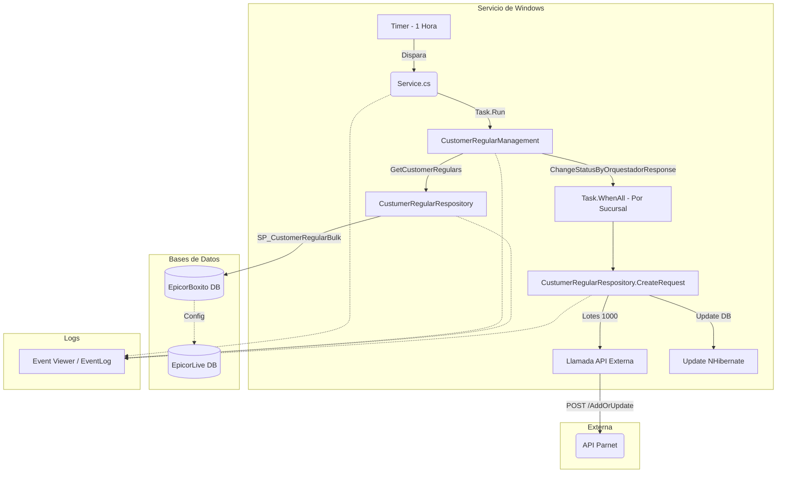

# Informe de Auditoría Técnica de Código y Buenas Prácticas

## 1.1 RESUMEN EJECUTIVO
**Puntuación Global Estimada: 45/100**
La aplicación `BoxServiceAgenteCustomerRegulars` es un servicio de Windows monolítico (.NET Framework 4.7.2) encargado de sincronizar clientes regulares desde una base de datos hacia una API REST ("APIParnet"). La arquitectura actual presenta deuda técnica significativa, particularmente en la gestión del ciclo de vida de NHibernate (creación excesiva de `SessionFactory`), acoplamiento fuerte, falta de Inyección de Dependencias, manejo subóptimo de concurrencia y exposición de secretos en texto plano. Se requiere una refactorización sustancial para alinear el código con los estándares modernos de desarrollo, mantenibilidad y nube.

## 1.2 DIAGRAMA DE ARQUITECTURA, FLUJO Y CONEXIONES EXTERNAS

## 1.3 MATRIZ DE PUNTUACIÓN DE DESARROLLO

| Categoría | Puntuación (1-5) | Observación |
| :--- | :---: | :--- |
| **Arquitectura** | 2 | Servicio de Windows acoplado a SO, .NET Framework 4.7.2 legacy. |
| **Seguridad** | 1 | Credenciales de base de datos en texto plano en `App.config`. No hay manejo de secretos. |
| **Principios SOLID** | 2 | Fuerte violación de SRP y DIP. Clases instancian sus propias dependencias con `new`. |
| **Patrones de Diseño** | 1 | Anti-patrón grave en NHibernate (re-creación del `SessionFactory` por cada operación). |
| **Clean Code** | 2 | Magic strings (nombres de servicios, SPs), redundancias y control de excepciones genérico. |

## 1.4 ANÁLISIS CRÍTICO DETALLADO POR ASPECTO

**1. Manejo de Ciclo de Vida de Base de Datos (Crítico):**
En `NHibernateHelper.cs`, el constructor inicializa el `SessionFactory` (`BuildSessionFactory()`). Sin embargo, cada vez que se requiere hacer una llamada (`GetCustomerRegulars` o `SendToAPIAsync`), se hace `using (NHibernateHelper cnx = new NHibernateHelper())`. El `SessionFactory` es extremadamente pesado de construir y debe ser un Singleton. Esto causa cuellos de botella de memoria y CPU masivos.

**2. Violación de Inyección de Dependencias (DIP) y SRP:**
Tanto `Service.cs` como `CustomerRegularManagement` instancian directamente a `CustumerRegularRespository` usando la palabra reservada `new`. Esto hace el código imposible de probar unitariamente de manera aislada (sin base de datos).

**3. Temporizadores e Hilos Subóptimos:**
En `Service.cs`, el `Timer` se configura cada hora (hardcodeado en código como `1000 * 60 * 60`), ignorando la llave `IntervaloEjecucion` que está presente en `App.config`. Además, el manejo de `TaskGral != null && TaskGral.IsCompleted` presenta riesgos de condición de carrera si el timer dispara mientras se manipula.
En `CustomerRegularManagement`, se usa `Task.WhenAll` para procesar por "Plant" (Sucursal). Dentro, cada sucursal corre `CreateRequest` de forma concurrente, lo que abrirá decenas de `SessionFactory` simultáneos y conexiones a DB descontroladas.

**4. Seguridad y Credenciales:**
El archivo `App.config` expone la cadena de conexión de `EpicorBoxito` y `EpicorLive` con el `User ID` y `Password` en texto plano (`Password=8UyrTqJkL`). ⚠️ *Información no proporcionada en la entrada sobre bóvedas de secretos actuales.*

## 1.5 SECCIÓN DE RECOMENDACIONES CRÍTICAS Y PLAN DE REMEDIACIÓN

*   **P0 (Bloqueante): Refactorizar `NHibernateHelper` a Singleton.**
    Mover la creación de la configuración y de los `SessionFactory` a un constructor estático o controlarlo vía Inyección de Dependencias. No instanciarlo con `new NHibernateHelper()` en cada transacción.
*   **P0 (Bloqueante): Ocultar Secretos.**
    Las cadenas de conexión en `App.config` deben ser cifradas mediante `aspnet_regiis` o migradas a variables de entorno / Vault, prohibiendo el texto plano en repositorios.
*   **P1 (Alto): Implementar Inyección de Dependencias (DI).**
    Utilizar un contenedor como Microsoft.Extensions.DependencyInjection o Autofac para registrar los repositorios y servicios lógicos, permitiendo Testabilidad y desacoplamiento.
*   **P1 (Alto): Parametrizar variables *hardcodeadas*.**
    El intervalo del timer en `Service.cs` (1 hora) debe ser leído correctamente del `App.config` (`IntervaloEjecucion`), previniendo recompilaciones para ajustar tiempos.
*   **P2 (Medio): Mejorar resiliencia y reintentos (Polly).**
    Implementar patrón Circuit Breaker y Retry usando Polly para la comunicación hacia la `APIParnet`, garantizando tolerancia a fallos transitorios.
---

## 1.6 AUDITORÍA DEVSECOPS Y CIBERSEGURIDAD (OWASP Top 10)

Como parte de la evaluación de seguridad integral del Comité Consultor, se han identificado brechas críticas transversales que deben remediarse obligatoriamente para cumplir con normativas corporativas:

### A. Exposición de Secretos y Credenciales (OWASP A02:2021)
*   **Riesgo:** El almacenamiento de credenciales de base de datos, contraseñas y llaves de API (ej. XApiKey) dentro de archivos estáticos como App.config permite a cualquier usuario con acceso al servidor o repositorio comprometer el ecosistema completo.
*   **Remediación:** Migrar hacia un modelo de **Inyección de Secretos** utilizando variables de entorno en contenedores o bóvedas de grado empresarial como Azure Key Vault / HashiCorp Vault.

### B. Transmisión Insegura de Datos en Red (OWASP A02:2021)
*   **Riesgo:** Las integraciones contra los orquestadores y bases de datos locales suelen viajar a través de canales no encriptados (HTTP plano).
*   **Remediación:** Imponer políticas estrictas de cifrado forzando el uso de HTTPS (TLS 1.2 o TLS 1.3) en las llamadas de HttpClient y las conexiones a bases de datos.

### C. Vulnerabilidad ante Denegación de Servicio (DoS) Interno
*   **Riesgo:** El diseño de hilos sin límite estricto y temporizadores bloqueantes agota los recursos (CPU/RAM/Sockets) del contenedor o servidor host.
*   **Remediación:** Implementar SemaphoreSlim para acotar la concurrencia, y configurar límites estrictos de recursos (limits y 
eservations) en los orquestadores de Docker/Kubernetes.
