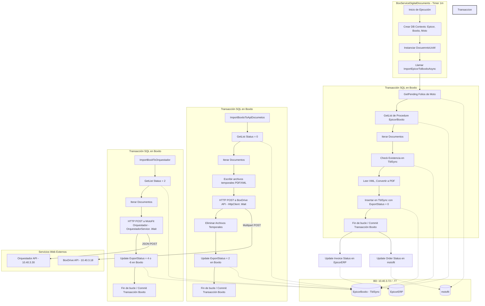

# Informe de Auditoría Técnica de Código y Buenas Prácticas
## Aplicación: BoxServiceAgenteDigitalDocuments (Documentos Digitales)
**Comité Consultor:** Arquitecto de Software Cloud-Native, Líder de DevSecOps, Auditor Principal de Ciberseguridad
**Fecha:** 2025-05-15

---

### 1.1 Resumen Ejecutivo
El presente informe detalla la auditoría técnica profunda realizada sobre el código fuente de **BoxServiceAgenteDigitalDocuments**, un agente de integración responsable de sincronizar facturas y notas de crédito de la base de datos de Epicor ERP, generar su representación en PDF mediante plantillas HTML e interactuar con dos servicios externos: BoxDrive API (carga de expedientes digitales) y MotoFit Orquestador API (notificación de pedidos).

#### Puntuación Global Estimada: **35 / 100** (Crítico)
La calificación refleja un sistema con graves deficiencias de diseño arquitectónico, rendimiento y seguridad que impiden su escalabilidad y estabilidad operativa, y que bloquean directamente una eventual contenerización sin un rediseño mayor. Los hallazgos de mayor severidad incluyen:
*   **Transacciones de larga duración bloqueando la base de datos:** El proceso abre transacciones SQL que permanecen abiertas mientras se procesan archivos en disco y se realizan peticiones HTTP externas. Esto provocará bloqueos y caídas en producción ante cargas medias-altas.
*   **Bloqueo síncrono sobre llamadas asíncronas (Sync-over-Async):** Los hilos de ejecución se bloquean deliberadamente llamando a `.Wait()` en llamadas HTTP HttpClient. Esto produce cuellos de botella severos y agotamiento del ThreadPool (ThreadPool Starvation).
*   **Fugas de recursos críticas (Socket Exhaustion):** Se instancian múltiples `HttpClient` sin control de ciclo de vida ni reutilización (un nuevo cliente para cada archivo XML y PDF), lo que causará el agotamiento de sockets de red.
*   **Acoplamiento extremo a Windows:** Dependencia dura del Visor de Eventos de Windows (`EventLog`) y de rutas absolutas locales (`C:\XD`).
*   **Vulnerabilidades de Seguridad:** Almacenamiento de credenciales de bases de datos y claves de API en texto plano dentro del archivo de configuración `App.config`.

---

### 1.2 Diagrama de Arquitectura, Flujo y Conexiones Externas

El siguiente diagrama ilustra el flujo secuencial ejecutado de forma periódica por el servicio, detallando las interacciones con las bases de datos y servicios externos, así como las zonas críticas de transacción SQL abierta:



---

### 1.3 Matriz de Puntuación de Desarrollo (Scorecard)

| Aspecto Evaluado | Puntuación (1-5) | Diagnóstico Técnico |
| :--- | :---: | :--- |
| **Arquitectura de Software** | 1.5 / 5.0 | Deficiencias graves de diseño en el manejo de transacciones, acoplamiento directo de bases de datos de diferentes dominios en un solo orquestador, y falta de patrones asincrónicos reales. |
| **Seguridad de la Información** | 1.5 / 5.0 | Exposición de credenciales de producción de base de datos SQL y tokens/claves de API en archivos de configuración planos sin cifrado. Rutas de red internas quemadas en el código. |
| **Principios SOLID** | 1.2 / 5.0 | Violación masiva de **SRP** (clase `DocuemntoUoW` actúa como "Clase Dios"), **OCP** (extensión de CFDI requiere modificar código directo para nuevas versiones), y **DIP** (los servicios instancian dependencias de forma rígida con `new`). |
| **Patrones de Diseño** | 1.8 / 5.0 | Uso nominal pero incorrecto de patrones como Unit of Work y Repository. En realidad, no hay desacoplamiento, las consultas se ejecutan directamente e interactúan con lógica de negocio interna. |
| **Clean Code y Calidad** | 2.0 / 5.0 | Errores ortográficos graves en nombres de clases y métodos de base de datos (`DocuemntoUoW`, `DocumnetPDF`, `MotoReository`), uso de indexación por posición en lugar de nombres de columna, y alta cantidad de código comentado / muerto. |
| **Threading y Performance** | 1.0 / 5.0 | Uso crítico de anti-patrones de rendimiento: bloqueo síncrono sobre métodos asíncronos (`.Wait()`), creación masiva de HttpClient por llamada, y mantenimiento de transacciones de base de datos abiertas durante llamadas de red externas. |

---

### 1.4 Análisis Crítico Detallado por Aspecto

#### 1.4.1 Arquitectura y Acceso a Datos (Riesgos de Rendimiento Críticos)
1.  **Antipatrón: Transacciones Abiertas Durante Operaciones de Archivos (I/O)**
    En `ImportEpicorToBoxitoAsync`, se invoca `this.documentosDigitalesDestinoRepository.BeginTransaction()`. Dentro de esta transacción abierta en SQL Server, la aplicación realiza iteraciones, comprueba la existencia de archivos XML en el sistema de archivos (`File.Exists`), lee los bytes, deserializa el XML, y realiza la generación pesada en PDF sustituyendo placeholders HTML mediante iTextSharp.
    *   **Impacto:** Mantener bloqueada una fila o tabla en SQL Server mientras se procesan operaciones de CPU e I/O es un pecado arquitectónico. Si un archivo de red tiene latencia o la conversión tarda 2 segundos por factura, la base de datos de producción bloqueará rápidamente a otros usuarios, consumiendo conexiones y disparando timeouts.
2.  **Antipatrón Catastrófico: Transacciones Abiertas Durante Llamadas HTTP Externas**
    En `ImportBoxitoToApiDocumentosDigitalesAsync`, se mantiene una transacción activa en SQL Server mientras la aplicación hace llamadas multipart POST por cada documento (`httpDocumentos.SendPdfAsync(...).Wait()`).
    *   **Impacto:** Esto viola flagrantemente el principio de aislamiento y diseño distribuido. Las transacciones de base de datos NUNCA deben abarcar llamadas de red externas. Si el endpoint de BoxDrive tiene una ralentización de 10 segundos o experimenta pérdida de paquetes, la base de datos de producción mantendrá el bloqueo bloqueando el motor transaccional.
3.  **Inconsistencia en Clases de Contextos de Datos (Bugs de Configuración)**
    Se detectó un grave error en la inicialización de los contextos:
    *   `BoxitoDBContext` hereda llamando a `base("conexionOrigen", true)`.
    *   `EpicorDBContext` hereda llamando a `base("conexionDestino", true)`.
    Sin embargo, en el entorno de desarrollo, ambas cadenas de conexión en `BoxServiceDigitalDocuments\App.config` apuntan exactamente a la misma base de datos: `EpicorBoxito`. Esto significa que el agente intenta leer el procedimiento almacenado transaccional de Epicor (`conexionDestino`) dentro de `EpicorBoxito`, lo cual fallaría catastróficamente en producción al faltar las tablas ERP. En `TestDigitalDocument\App.config`, se devela la verdad: `conexionDestino` debe apuntar a `EpicorERP`. El archivo de configuración de producción provisto con el servicio web está mal configurado y roto.

#### 1.4.2 Threading, Asincronía y Fuga de Sockets
1.  **Sync-over-Async (Muerte por ThreadPool Starvation)**
    A pesar de tener sufijos `Async` en los métodos de la clase `DocuemntoUoW`, estos métodos son en realidad de tipo `void` síncronos. Dentro de ellos, se llaman a procesos asíncronos y se bloquean activamente con `.Wait()` o `.Result`.
    ```csharp
    httpDocumentos.SendPdfAsync(ModelDestino, documentName, documentNameXML).Wait();
    ```
    *   **Impacto:** El bloqueo de hilos asíncronos en entornos de servicios provoca interbloqueos (deadlocks) del contexto y agota la piscina de hilos activos de la CPU (ThreadPool Starvation), destruyendo el rendimiento del host.
2.  **Socket Exhaustion por Mala Gestión de HttpClient**
    En `apiDocumentosDigitales.cs`, se instancia un `new HttpClient()` cada vez que se llama a `SendPdfAsync`. Peor aún, hay dos instanciaciones completas independientes en el mismo método (una para PDF y otra para XML) sin ningún bloque `using` ni estructura estática.
    ```csharp
    var client = new HttpClient();
    // ...
    var clientxml = new HttpClient();
    ```
    *   **Impacto:** Cada instancia de `HttpClient` mantiene abierta una conexión de socket TCP a nivel de sistema operativo en estado `TIME_WAIT` hasta por 4 minutos después de finalizar la petición. Al procesar lotes grandes de facturas (por ejemplo, 1000 documentos), el sistema operativo se quedará sin sockets efímeros libres, lanzando excepciones de red (`SocketException`) y aislando al servidor.

#### 1.4.3 Seguridad de la Información (Auditoría DevSecOps)
1.  **Credenciales en Texto Plano (Hardcoded Secrets)**
    Los archivos `App.config` contienen las contraseñas de producción de las bases de datos SQL Server (`interfacesparnet` / `8UyrTqJkL`, `Developer` / `D3ve1oper21!`, `motofit` / `MeQaOyH`) junto con tokens de autorización estáticos sensibles (`wRJSMeKKF2QT4fwpMeJf36POk6yJV`) y API Keys (`PEDIDOSkey`).
    *   **Impacto:** Incumple estándares normativos mínimos (OWASP Top 10 A02: Cryptographic Failures, e ISO 27001). Cualquier usuario con acceso de lectura al repositorio o al directorio del servicio puede extraer estas contraseñas, comprometiendo todo el entorno ERP empresarial de la organización.
2.  **Uso de Protocolos Inseguros (HTTP Claro)**
    Las APIs externas se invocan bajo direccionamientos locales e internos mediante protocolo HTTP plano (sin cifrar): `http://10.40.3.18/...` y `http://192.168.10.128/...`.
    *   **Impacto:** Permite ataques de interceptación (Man-in-the-Middle) en la red corporativa donde la información confidencial de facturación XML y datos de clientes puede ser capturada en tránsito.

#### 1.4.4 Violación de Estándares de Código y SOLID
1.  **Falta de Inyección de Dependencias (DIP)**
    En lugar de utilizar inyección de constructores e interfaces (`IDocuemntoUoW`, `IRepository`), la clase `DocuemntoUoW` acopla rígidamente repositorios concretos instanciándolos directamente en su constructor.
2.  **Violación de SRP (Single Responsibility Principle)**
    La clase `DocuemntoUoW` mezcla la lógica del orquestador, el control de la transacción SQL de la base de datos intermedia, la manipulación de archivos físicos locales de disco, la generación en PDF usando iTextSharp y el envío HTTP a través de llamadas de red. No hay separación clara de capas, lo que imposibilita las pruebas unitarias.
3.  **Inconsistencia de Nombres y Errores Tipográficos en Base de Datos (Mantenibilidad)**
    Se identificaron múltiples nombres mal escritos en clases clave y base de datos, lo que confunde a los desarrolladores y ensucia la legibilidad del sistema:
    *   `DocuemntoUoW` (Error tipográfico de "Documento").
    *   `DocumnetPDF` (Error tipográfico en base de datos e interfaz).
    *   `MotoReository` (Falta la "p" en Repository).
    *   `EntityNotFountException` (Error tipográfico de "NotFound").
4.  **Mapeo Posicional Frágil**
    En `DocumentosDigitalesProcedureDA.cs`, el mapeo de registros de base de datos se realiza utilizando enteros fijos para la posición de columna (`row.GetString(0)`). Si se agrega un nuevo campo intermedio o cambia la estructura del procedimiento almacenado en SQL Server, el código fallará silenciosamente o mapeará los datos incorrectamente.

---

### 1.5 Sección de Recomendaciones Críticas y Plan de Remediación

Este plan de remediación priorizado debe aplicarse obligatoriamente de forma previa a cualquier intento de modernización formal.

#### Prioridad P0: Parches Inmediatos de Estabilidad y Rendimiento (Tiempo: 1-2 días)
1.  **Romper las Transacciones de Red Abiertas:**
    Refactorizar `DocuemntoUoW.cs` para realizar el proceso de sincronización en tres pasos completamente desacoplados de base de datos:
    *   **Paso 1:** Abrir conexión, consultar los folios pendientes de sincronizar, recuperar los datos requeridos de Epicor, y cerrar la conexión inmediatamente.
    *   **Paso 2 (Fuera de Transacción):** Iterar la lista en memoria, buscar los archivos XML locales, realizar la generación de PDFs e iTextSharp. Guardar los archivos resultantes de manera temporal.
    *   **Paso 3:** Abrir una transacción corta para insertar los registros ya generados en la tabla `TblSyncDocumentoDigital`, cambiar estados y hacer Commit inmediato.
2.  **Corregir la Instanciación de HttpClient:**
    Declarar `HttpClient` como una variable estática única (`private static readonly HttpClient client = new HttpClient();`) dentro de `apiDocumentosDigitales` para evitar el agotamiento de sockets de red corporativos, o implementar una llamada robusta con un singleton controlado.
3.  **Arreglar el Archivo App.config:**
    Resolver las configuraciones inconsistentes de bases de datos. Incluir la cadena `conexionMoto` faltante en el `App.config` del servicio de producción e incluir las claves HTML/CSS necesarias para la generación de PDF (`Html`, `Css`, `LogoBoxito`).

#### Prioridad P1: Refactorización Estructural y Eliminación de Acoplamientos (Tiempo: 1 semana)
1.  **Migrar el Logging a Abstracciones Estándar:**
    Eliminar la dependencia directa de `EventLog.WriteEntry` y el visor de eventos de Windows. Reemplazarlo por la abstracción nativa `Microsoft.Extensions.Logging.ILogger` de .NET. Configurar un proveedor de consola (para Docker) y un archivo de log rotativo (como NLog o Serilog) si se ejecuta fuera de contenedores.
2.  **Implementar Inyección de Dependencias (DI):**
    Utilizar un contenedor de inyección de dependencias estándar (como Microsoft.Extensions.DependencyInjection) para registrar e inyectar repositorios, contextos y servicios helpers como interfaces y no clases concretas.
3.  **Remediación de Seguridad en Credenciales:**
    Retirar las contraseñas en texto plano de los archivos de configuración. Modificar el código de acceso a datos para extraer las credenciales desde variables de entorno del sistema utilizando `Environment.GetEnvironmentVariable()`.

#### Prioridad P2: Calidad de Código y Deuda Técnica (Tiempo: 3-4 días)
1.  **Corrección de Nombres y Refactorización de Tipos:**
    Refactorizar globalmente el proyecto para renombrar los componentes con errores ortográficos (`DocuemntoUoW` -> `DocumentoUoW`, `DocumnetPDF` -> `DocumentPDF`, `MotoReository` -> `MotoRepository`).
2.  **Mapeo Seguro por Nombre de Columna o Dapper:**
    Reemplazar el mapeo posicional de `IDataReader` (`row.GetString(0)`) por mapeo basado en nombres de columnas (`row.GetString(row.GetOrdinal("Company"))`), o mejor aún, utilizar Dapper como micro-ORM para automatizar y optimizar el mapeo de objetos de manera segura y eficiente.

---

### ⚠️ Información no proporcionada en la entrada (Límites de Auditoría)
Para evitar asunciones de diseño fuera del alcance factual de los archivos de código inspeccionados, se enumeran explícitamente los siguientes detalles tecnológicos **no provistos** en el código fuente ni sus archivos de configuración:
1.  **Estructura y Permisos de Red:** No se especifican las políticas de red corporativa ni los firewalls que protegen la IP del servidor de base de datos SQL (`10.40.3.72`) o las APIs externas (`10.40.3.18`), lo cual restringe el análisis de conectividad a nivel de red del contenedor.
2.  **Mecanismo de Autenticación de las APIs:** No se devela el código interno del receptor de BoxDrive API ni del Orquestador de MotoFit. Se desconoce si utilizan mecanismos JWT, OAuth o autenticación básica detrás del encabezado estático `"Authorization"`.
3.  **Volúmenes de Almacenamiento Físico en Epicor (XMLs origen):** El código indica que lee rutas como `ModelOrigen.XFileName`. Estas rutas son direcciones físicas de disco locales o de red (ej. un recurso compartido SMB). No se especifica cómo se autentica la aplicación para acceder a dicho recurso compartido de red en entornos Linux/Docker.
4.  **Esquemas Completos de BD:** No se cuenta con el esquema de base de datos de Epicor ERP, lo que impide validar si las columnas mapeadas en `ToDocumento` tienen índices optimizados o si el procedimiento almacenado genera cuellos de botella por sí mismo.

---

## 1.6 AUDITORÍA DEVSECOPS Y CIBERSEGURIDAD (OWASP Top 10)

Como parte de la evaluación de seguridad integral del Comité Consultor, se han identificado brechas críticas transversales que deben remediarse obligatoriamente para cumplir con normativas corporativas:

### A. Exposición de Secretos y Credenciales (OWASP A02:2021)
*   **Riesgo:** El almacenamiento de credenciales de base de datos, contraseñas y llaves de API (ej. XApiKey) dentro de archivos estáticos como App.config permite a cualquier usuario con acceso al servidor o repositorio comprometer el ecosistema completo.
*   **Remediación:** Migrar hacia un modelo de **Inyección de Secretos** utilizando variables de entorno en contenedores o bóvedas de grado empresarial como Azure Key Vault / HashiCorp Vault.

### B. Transmisión Insegura de Datos en Red (OWASP A02:2021)
*   **Riesgo:** Las integraciones contra los orquestadores y bases de datos locales suelen viajar a través de canales no encriptados (HTTP plano).
*   **Remediación:** Imponer políticas estrictas de cifrado forzando el uso de HTTPS (TLS 1.2 o TLS 1.3) en las llamadas de HttpClient y las conexiones a bases de datos.

### C. Vulnerabilidad ante Denegación de Servicio (DoS) Interno
*   **Riesgo:** El diseño de hilos sin límite estricto y temporizadores bloqueantes agota los recursos (CPU/RAM/Sockets) del contenedor o servidor host.
*   **Remediación:** Implementar SemaphoreSlim para acotar la concurrencia, y configurar límites estrictos de recursos (limits y 
eservations) en los orquestadores de Docker/Kubernetes.

### D. Prevención de Inyección de Entidades Externas (XXE - OWASP A05:2021)
*   **Riesgo Crítico:** Al procesar archivos XML (como CFDIs), si el parser no está configurado para bloquear DTDs, un atacante puede inyectar código para leer archivos locales del servidor o escanear la red interna.
*   **Remediación:** Configurar explícitamente XmlReaderSettings.DtdProcessing = DtdProcessing.Prohibit antes de leer cualquier stream en memoria.
