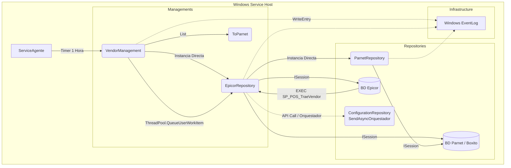

# Informe de Auditoría Técnica de Código y Buenas Prácticas
**Aplicación:** BoxServiceAgenteVendor (Proveedores)
**Fecha:** 2024-05-24

## 1.1 RESUMEN EJECUTIVO
**Puntuación Global Estimada: 35 / 100**
El componente `BoxServiceAgenteVendor` es un Servicio de Windows tradicional desarrollado en .NET Framework, diseñado para sincronizar datos de proveedores entre un origen (Epicor) y un destino (Parnet). Si bien cumple con su funcionalidad básica mediante el uso de temporizadores y NHibernate para el acceso a datos, presenta deficiencias críticas a nivel de arquitectura, manejo de concurrencia y principios de diseño que comprometen seriamente su estabilidad y escalabilidad en producción. El uso compartido de sesiones de base de datos entre hilos y el alto acoplamiento exigen una refactorización profunda (Remediación P0) antes de plantear cualquier modernización hacia ecosistemas Cloud-Native.

## 1.2 DIAGRAMA DE ARQUITECTURA, FLUJO Y CONEXIONES EXTERNAS

## 1.3 MATRIZ DE PUNTUACIÓN DE DESARROLLO (SCORECARD)

| Criterio | Puntuación (1-5) | Justificación |
| :--- | :---: | :--- |
| **Arquitectura** | 2 | Servicio Windows monolítico, con lógicas de orquestación, BD y red mezcladas. No usa Inyección de Dependencias. |
| **Seguridad** | 2 | ⚠️ *Información no proporcionada en la entrada sobre gestión de secretos (connection strings)*, pero típicamente en `App.config` en texto plano. Riesgo de inyección SQL si no se escapan bien las consultas manuales, aunque se usa NHibernate. |
| **SOLID** | 1 | Violación flagrante de SRP (VendorManagement hace de todo), OCP y DIP (instanciación directa de clases concretas como `new EpicorRepository()`). |
| **Patrones de Diseño** | 1 | Antipatrón de concurrencia: Compartir instancias de `ISession` de NHibernate entre múltiples hilos (`ThreadPool` y `Task.Run`), lo que corromperá el estado. |
| **Clean Code** | 2 | Código comentado / muerto extenso (`#region old code`), métodos grandes, nombres inconsistentes, captura genérica de excepciones `catch(Exception ex)`. |

## 1.4 ANÁLISIS CRÍTICO DETALLADO POR ASPECTO

### 1. Manejo de Concurrencia y NHibernate (Riesgo Crítico)
En `EpicorRepository`, las sesiones (`sessionDestino`, `sessionOrigen`) se abren en el constructor. Luego, en `VendorManagement.ProcessAsync`, se usa `ThreadPool.QueueUserWorkItem(ToDestiny, vendor)` para procesar múltiples registros en paralelo. Cada hilo invoca a un nuevo `EpicorRepository`, abriendo nuevas sesiones, pero también comparte estado global. El manejo de NHibernate no es thread-safe. Además, en transacciones, las excepciones capturadas de manera genérica pueden dejar conexiones abiertas y agotar el pool de conexiones.

### 2. Alto Acoplamiento y Falta de Inyección de Dependencias (DI)
El código está plagado de expresiones `new EpicorRepository()`, `new ParnetRepository()`, `new VendorManagement()`. Esto hace imposible la escritura de pruebas unitarias reales, ya que los accesos a base de datos están acoplados fuertemente a la lógica de negocio.

### 3. Ausencia de Telemetría y Observabilidad Estructurada
El uso de `EventLog.WriteEntry` ata la aplicación exclusivamente a sistemas operativos Windows y carece de atributos estructurados. En un entorno moderno, es imposible centralizar o analizar estos logs eficientemente sin un recolector complejo a nivel de SO.

### 4. Código Muerto (Dead Code)
Existen regiones enteras de código comentado (`#region old code`) en múltiples archivos (`VendorManagement.cs`, `EpicorRepository.cs`, `ParnetRepository.cs`) que ensucian la base de código, reducen la legibilidad y aumentan la deuda técnica.

## 1.5 SECCIÓN DE RECOMENDACIONES CRÍTICAS Y PLAN DE REMEDIACIÓN

### Prioridad 0 (P0): Estabilidad Inmediata (Parche en Código Actual)
- **Eliminar código muerto:** Borrar todo el código comentado.
- **Corregir concurrencia con NHibernate:** Modificar `EpicorRepository` y `ParnetRepository` para que la apertura de la `ISession` (`CnxEpicorBoxito.OpenSession()`) se realice *dentro* del contexto de ejecución de cada método usando `using (var session = ...)` en lugar de en el constructor o como variables de clase de larga duración.
- **Aislar Tareas Parciales:** En `VendorManagement`, reemplazar `ThreadPool.QueueUserWorkItem` por un patrón `Parallel.ForEach` controlando el `MaxDegreeOfParallelism` para no saturar las conexiones de BD.

### Prioridad 1 (P1): Preparación para Modernización
- **Implementar Inyección de Dependencias:** Introducir un contenedor IoC (como Microsoft.Extensions.DependencyInjection si se migra a .NET Core/5+).
- **Abstracción de Logs:** Reemplazar `EventsLog` por la interfaz `ILogger<T>` y configurar Serilog (Console + File).

### Prioridad 2 (P2): Arquitectura y Rendimiento
- **Migrar de Windows Service a Worker Service (BackgroundService):** Extraer la lógica de `Program.cs` y `ServiceAgente.cs` hacia un modelo basado en `IHostedService`.
- **Implementar Patrón Unit of Work:** Consolidar las transacciones de NHibernate para evitar el manejo manual y repetitivo de `BeginTransaction` / `Commit` / `Rollback` con múltiples try/catch anidados.
---

## 1.6 AUDITORÍA DEVSECOPS Y CIBERSEGURIDAD (OWASP Top 10)

Como parte de la evaluación de seguridad integral del Comité Consultor, se han identificado brechas críticas transversales que deben remediarse obligatoriamente para cumplir con normativas corporativas:

### A. Exposición de Secretos y Credenciales (OWASP A02:2021)
*   **Riesgo:** El almacenamiento de credenciales de base de datos, contraseñas y llaves de API (ej. XApiKey) dentro de archivos estáticos como App.config permite a cualquier usuario con acceso al servidor o repositorio comprometer el ecosistema completo.
*   **Remediación:** Migrar hacia un modelo de **Inyección de Secretos** utilizando variables de entorno en contenedores o bóvedas de grado empresarial como Azure Key Vault / HashiCorp Vault.

### B. Transmisión Insegura de Datos en Red (OWASP A02:2021)
*   **Riesgo:** Las integraciones contra los orquestadores y bases de datos locales suelen viajar a través de canales no encriptados (HTTP plano).
*   **Remediación:** Imponer políticas estrictas de cifrado forzando el uso de HTTPS (TLS 1.2 o TLS 1.3) en las llamadas de HttpClient y las conexiones a bases de datos.

### C. Vulnerabilidad ante Denegación de Servicio (DoS) Interno
*   **Riesgo:** El diseño de hilos sin límite estricto y temporizadores bloqueantes agota los recursos (CPU/RAM/Sockets) del contenedor o servidor host.
*   **Remediación:** Implementar SemaphoreSlim para acotar la concurrencia, y configurar límites estrictos de recursos (limits y 
eservations) en los orquestadores de Docker/Kubernetes.
