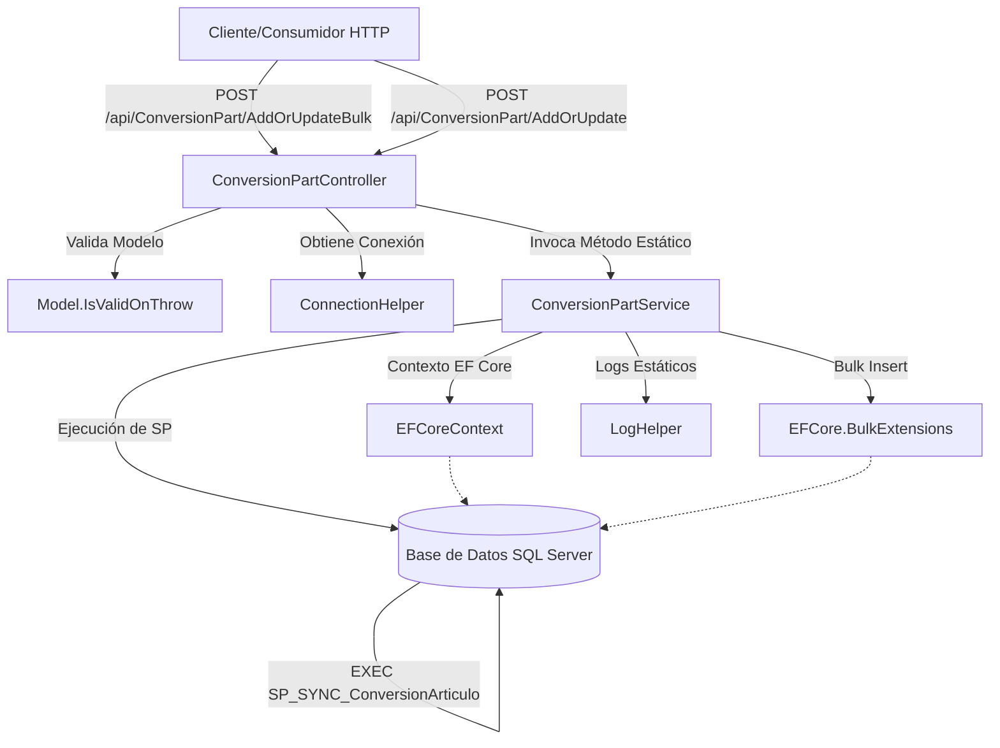

# Informe de Auditoría Técnica de Código y Buenas Prácticas
**Aplicación:** BoxServiceProviderConversionPart (Provider)

## 1.1 RESUMEN EJECUTIVO
**Puntuación Global Estimada:** 45/100
El servicio "ConversionPart" presenta severas deficiencias arquitectónicas y de código limpio. La principal preocupación reside en el diseño del servicio, el cual emplea métodos estáticos, acoplamiento fuerte con el contexto de Entity Framework Core y operaciones transaccionales ineficientes (como llamadas a `SaveChanges()` dentro de ciclos `.ForEach()`). Adicionalmente, el uso de stored procedures para la sincronización limita la portabilidad. Urge una refactorización hacia principios SOLID y un rediseño de las operaciones en base de datos.

## 1.2 DIAGRAMA DE ARQUITECTURA, FLUJO Y CONEXIONES EXTERNAS

## 1.3 MATRIZ DE PUNTUACIÓN DE DESARROLLO (1-5)
| Criterio | Puntuación | Observaciones |
| :--- | :---: | :--- |
| **Arquitectura** | 2 | Fuerte acoplamiento. Uso de métodos estáticos en Servicios que impiden la inyección de dependencias (DI). |
| **Seguridad** | 3 | Sin evidencia de autenticación/autorización en los controladores (ej. `[Authorize]`). Se exponen detalles de excepciones al cliente en caso de error. |
| **SOLID** | 1 | Violación de SRP (Single Responsibility) y OCP. Los servicios gestionan instanciación del DbContext, transacciones, lógica de negocio y logging. |
| **Patrones** | 2 | Ausencia de Repository Pattern o Unit of Work. Manejo transaccional manual y propenso a errores. |
| **Clean Code** | 2 | Bloques masivos de código comentado. Nombres inconsistentes. Ciclos con `SaveChanges` por cada iteración. |

## 1.4 ANÁLISIS CRÍTICO DETALLADO POR ASPECTO

**A. Diseño de Servicios y Métodos Estáticos**
En `ConversionPartService.cs`, los métodos `CreateOrUpdate` y `CreateOrUpdateBulk` son estáticos. Esto impide el uso de Inyección de Dependencias (Dependency Injection), imposibilitando la creación de pruebas unitarias (Mocking) y violando el principio de Inversión de Dependencias (DIP) de SOLID.

**B. Rendimiento y Anti-patrones de Base de Datos (N+1)**
En `CreateOrUpdate`, se itera sobre `request.ConversionsPart.ForEach(...)` y dentro de cada iteración se realiza un `ctx.SaveChanges()`. Esto provoca una avalancha de llamadas a la base de datos (problema N+1) degradando el rendimiento drásticamente en cargas masivas. Además, se limpia el contexto `ctx.Clear()` en el catch, lo cual corromperá el seguimiento de entidades en iteraciones subsecuentes.

**C. Gestión de Tiempos de Espera (Timeouts)**
En `CreateOrUpdateBulk`, se establece `ctx.Database.SetCommandTimeout(960000);`. 960,000 segundos equivalen a más de 11 días. Este valor es completamente irracional y enmascara un problema severo de rendimiento subyacente o un error tipográfico, lo cual podría colgar el pool de conexiones de la base de datos de manera indefinida.

**D. Manejo de Excepciones y Seguridad**
En `ConversionPartController.cs`, se retorna directamente el mensaje de la excepción y la excepción interna al cliente: `return BadRequest(ex.Message + ". InnerException:\n" + ex.InnerException?.Message);`. Esto es una vulnerabilidad de divulgación de información, exponiendo detalles internos de la base de datos o stack trace al usuario final.

**E. Código Basura (Dead Code)**
Existe un gran bloque de código comentado en la segunda mitad de `ConversionPartService.CreateOrUpdate`. Esto incrementa la deuda técnica y dificulta la lectura y mantenimiento del código.

## 1.5 SECCIÓN DE RECOMENDACIONES CRÍTICAS Y PLAN DE REMEDIACIÓN

**Prioridad 0 (P0) - Crítico para Producción Inmediata:**
1. **Corregir Timeouts y Ciclos:** Eliminar el `.ForEach` con `SaveChanges` interno en `CreateOrUpdate`. Refactorizar para acumular los cambios y llamar a `SaveChanges()` una única vez al final del ciclo. Corregir el timeout de 960,000 segundos a un límite razonable (ej. 120 o 300 segundos máximo).
2. **Ocultar Excepciones al Cliente:** Modificar el `catch` de los controladores para devolver un mensaje de error genérico y hacer logging del error completo internamente. 

**Prioridad 1 (P1) - A corto plazo (Próximo Sprint):**
1. **Refactorizar a Inyección de Dependencias:** Quitar la palabra clave `static` de los servicios. Registrar `ConversionPartService` y `EFCoreContext` en el contenedor DI (IoC) del startup de la aplicación.
2. **Eliminar Código Muerto:** Borrar inmediatamente todos los bloques de código comentado en los servicios.

**Prioridad 2 (P2) - A medio plazo (Deuda Técnica de Arquitectura):**
1. **Implementar Repositorios:** Abstraer el acceso a datos. Actualmente el servicio sabe demasiado sobre DbContext, sentencias RAW de SQL (`EXEC SP_SYNC_ConversionArticulo`) y BulkInsert.
2. **Migrar Stored Procedures a Código/EF:** Evaluar la dependencia de `SP_SYNC_ConversionArticulo`. Esta dependencia ancla la aplicación a SQL Server y dificulta el versionado de la lógica de negocio.
---

## 1.6 AUDITORÍA DEVSECOPS Y CIBERSEGURIDAD (OWASP Top 10)

Como parte de la evaluación de seguridad integral del Comité Consultor, se han identificado brechas críticas transversales que deben remediarse obligatoriamente para cumplir con normativas corporativas:

### A. Exposición de Secretos y Credenciales (OWASP A02:2021)
*   **Riesgo:** El almacenamiento de credenciales de base de datos, contraseñas y llaves de API (ej. XApiKey) dentro de archivos estáticos como App.config permite a cualquier usuario con acceso al servidor o repositorio comprometer el ecosistema completo.
*   **Remediación:** Migrar hacia un modelo de **Inyección de Secretos** utilizando variables de entorno en contenedores o bóvedas de grado empresarial como Azure Key Vault / HashiCorp Vault.

### B. Transmisión Insegura de Datos en Red (OWASP A02:2021)
*   **Riesgo:** Las integraciones contra los orquestadores y bases de datos locales suelen viajar a través de canales no encriptados (HTTP plano).
*   **Remediación:** Imponer políticas estrictas de cifrado forzando el uso de HTTPS (TLS 1.2 o TLS 1.3) en las llamadas de HttpClient y las conexiones a bases de datos.

### C. Vulnerabilidad ante Denegación de Servicio (DoS) Interno
*   **Riesgo:** El diseño de hilos sin límite estricto y temporizadores bloqueantes agota los recursos (CPU/RAM/Sockets) del contenedor o servidor host.
*   **Remediación:** Implementar SemaphoreSlim para acotar la concurrencia, y configurar límites estrictos de recursos (limits y 
eservations) en los orquestadores de Docker/Kubernetes.
