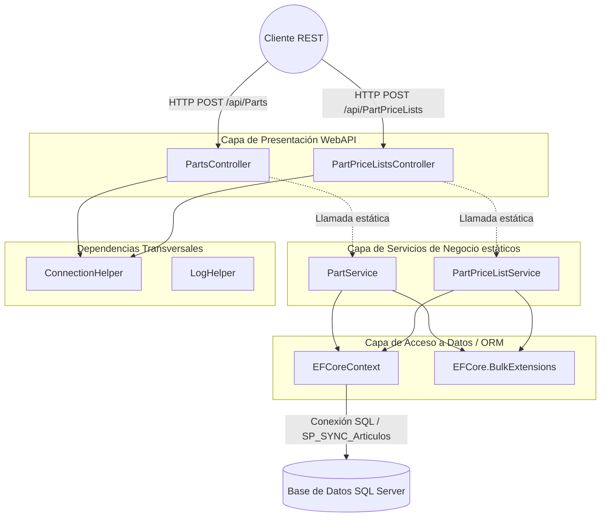

# Informe de Auditoría Técnica de Código y Plan de Modernización

## 1.1 RESUMEN EJECUTIVO
**Puntuación Global Estimada:** 42/100

La auditoría del componente `BoxServiceProviderMaestroArticulo` (API PARNET) revela una arquitectura basada en ASP.NET Web API heredada con integración parcial de Entity Framework Core. El código presenta deficiencias significativas en el manejo de inyección de dependencias (uso de métodos estáticos en servicios), violación de principios SOLID (alta adherencia y acoplamiento en los controladores), y prácticas de Clean Code deficientes (bloques try/catch monolíticos, comentarios de código muerto). La aplicación requiere una refactorización arquitectónica profunda antes de ser considerada lista para un entorno nativo en la nube o altamente escalable.

## 1.2 DIAGRAMA DE ARQUITECTURA, FLUJO Y CONEXIONES EXTERNAS

## 1.3 MATRIZ DE PUNTUACIÓN DE DESARROLLO (SCORECARD)

| Aspecto | Puntuación (1-5) | Observaciones |
| :--- | :---: | :--- |
| **Arquitectura** | 2 | Ausencia de Inyección de Dependencias. Servicios implementados como clases con métodos estáticos, dificultando pruebas unitarias y mocking. Fuerte acoplamiento con `EFCoreContext` instanciado directamente. |
| **Seguridad** | 2 | ⚠️ Información de autenticación/autorización no proporcionada en la entrada en los endpoints visibles (`[Authorize]` ausente en los controladores evaluados). Posible exposición de endpoints sin securizar. |
| **Principios SOLID** | 1 | Violación severa del Principio de Responsabilidad Única (SRP) y de Inversión de Dependencias (DIP). Servicios y controladores asumen demasiadas responsabilidades transaccionales y de red. |
| **Patrones de Diseño** | 2 | Se percibe un patrón MVC/WebAPI básico, pero se ignora el patrón Repository o Unit of Work. Manejo manual de transacciones del lado del servicio acoplado a la lógica de negocio. |
| **Clean Code** | 2 | Presencia de código comentado (código zombie), bloques `try/catch` globales capturando `Exception` genérico, y nombres inconsistentes. Logs esparcidos y acoplados. |

## 1.4 ANÁLISIS CRÍTICO DETALLADO POR ASPECTO

1. **Acoplamiento Fuerte y Anti-patrón Static Cling:**
   Los controladores llaman a métodos estáticos (ej. `PartService.CreateOrUpdate`). Esto impide inyectar dependencias y hace imposible aislar el controlador para pruebas unitarias. Cada llamada estática instancia su propio `EFCoreContext` manualmente.

2. **Manejo de Transacciones y Ciclo de Vida del DbContext:**
   El `EFCoreContext` se instancia usando `new EFCoreContext(connection)` dentro del método. No hay un manejo adecuado del ciclo de vida (falta bloque `using` o gestión por DI), lo cual puede causar fugas de memoria y conexiones a la base de datos sin cerrar adecuadamente (connection leaks).

3. **Lógica Transaccional en Base de Datos (Procedimientos Almacenados):**
   Se hace uso de consultas SQL directas y de procedimientos almacenados como `EXEC SP_SYNC_Articulos '{parent}'`. Esto crea un alto acoplamiento a SQL Server y a la lógica implementada dentro del motor de base de datos, violando el aislamiento de la lógica de negocio.

4. **Tratamiento de Excepciones:**
   El código utiliza `catch (Exception ex)` genérico y retorna `ex.Message` al cliente. Esto expone detalles internos de la aplicación y la infraestructura al cliente REST, lo que representa una vulnerabilidad de seguridad (Information Disclosure).

## 1.5 SECCIÓN DE RECOMENDACIONES CRÍTICAS Y PLAN DE REMEDIACIÓN

*   **P0 - Crítico (Inmediato):** 
    *   **Eliminar métodos estáticos:** Refactorizar los servicios (`PartService`, `PartPriceListService`) a instancias regulares implementando interfaces (ej. `IPartService`).
    *   **Inyección de Dependencias (DI):** Implementar DI para inyectar los servicios en los controladores y el `DbContext` en los servicios (o utilizar repositorios).
    *   **Ocultar Detalles de Excepción:** Modificar los controladores para devolver un código HTTP 500 estándar sin el mensaje del stacktrace en producción.
    *   **Manejo de IDisposable:** Asegurar que `EFCoreContext` se deseche correctamente (usando bloque `using` temporalmente hasta migrar a DI).

*   **P1 - Alta Prioridad (Corto Plazo):**
    *   **Patrón Repository/UoW:** Extraer el acceso a datos y las llamadas a los Stored Procedures a capas de persistencia dedicadas.
    *   **Remover "Código Zombie":** Limpiar todas las líneas de código comentadas.

*   **P2 - Mediana Prioridad (Mediano Plazo):**
    *   **Seguridad y Autenticación:** Auditar e implementar (si no existe) mecanismos de tokens como JWT en la capa WebAPI.
    *   **Métricas y Logging estructurado:** Remover las llamadas a `LogHelper` o inyectar un `ILogger` genérico.
---

## 1.6 AUDITORÍA DEVSECOPS Y CIBERSEGURIDAD (OWASP Top 10)

Como parte de la evaluación de seguridad integral del Comité Consultor, se han identificado brechas críticas transversales que deben remediarse obligatoriamente para cumplir con normativas corporativas:

### A. Exposición de Secretos y Credenciales (OWASP A02:2021)
*   **Riesgo:** El almacenamiento de credenciales de base de datos, contraseñas y llaves de API (ej. XApiKey) dentro de archivos estáticos como App.config permite a cualquier usuario con acceso al servidor o repositorio comprometer el ecosistema completo.
*   **Remediación:** Migrar hacia un modelo de **Inyección de Secretos** utilizando variables de entorno en contenedores o bóvedas de grado empresarial como Azure Key Vault / HashiCorp Vault.

### B. Transmisión Insegura de Datos en Red (OWASP A02:2021)
*   **Riesgo:** Las integraciones contra los orquestadores y bases de datos locales suelen viajar a través de canales no encriptados (HTTP plano).
*   **Remediación:** Imponer políticas estrictas de cifrado forzando el uso de HTTPS (TLS 1.2 o TLS 1.3) en las llamadas de HttpClient y las conexiones a bases de datos.

### C. Vulnerabilidad ante Denegación de Servicio (DoS) Interno
*   **Riesgo:** El diseño de hilos sin límite estricto y temporizadores bloqueantes agota los recursos (CPU/RAM/Sockets) del contenedor o servidor host.
*   **Remediación:** Implementar SemaphoreSlim para acotar la concurrencia, y configurar límites estrictos de recursos (limits y 
eservations) en los orquestadores de Docker/Kubernetes.
