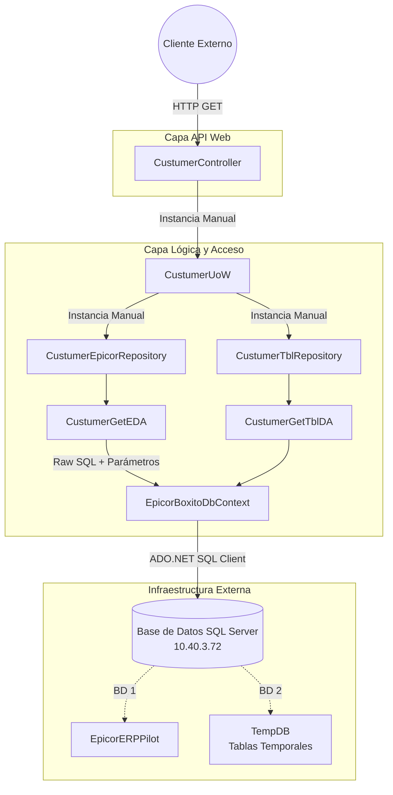

# Informe de Auditoría Técnica de Código y Buenas Prácticas
**Aplicación:** BoxServiceProviderMaestroClientes (MaestrosApi)
**Componente Analizado:** ApiObserverParnet / MaestrosApi
**Fecha:** 2024

## 1.1 RESUMEN EJECUTIVO
**Puntuación Global Estimada: 45 / 100**

Tras analizar el código fuente de la aplicación (controladores, repositorios, acceso a datos y configuración), el Comité Consultor determina que la solución está construida sobre un stack tecnológico heredado (.NET Framework 4.7.2) con un fuerte acoplamiento a infraestructuras específicas (IIS, SQL Server con consultas crudas masivas). 

Aunque existe una intención de aplicar una arquitectura en capas (UnitOfWork, Repository), la implementación actual adolece de antipatrones graves: falta de Inyección de Dependencias (DI), consultas SQL monolíticas incrustadas en el código C# que vulneran el principio de Responsabilidad Única, e instanciación manual de contextos. Adicionalmente, se detectan vulnerabilidades críticas de seguridad, como credenciales de base de datos en texto plano y ausencia de mecanismos de autenticación a nivel de endpoint.

## 1.2 DIAGRAMA DE ARQUITECTURA, FLUJO Y CONEXIONES EXTERNAS

## 1.3 MATRIZ DE PUNTUACIÓN DE DESARROLLO (1-5)

| Aspecto Evaluado | Puntuación | Justificación |
| :--- | :---: | :--- |
| **Arquitectura** | **2 / 5** | Se observan capas lógicas, pero están fuertemente acopladas mediante el operador `new`. Dependencia de IIS y .NET Framework 4.7.2. |
| **Seguridad** | **1 / 5** | Credenciales de DB hardcodeadas en `Web.config`. API pública sin atributos `[Authorize]` visibles. |
| **SOLID** | **2 / 5** | Violación flagrante del Principio de Inversión de Dependencias (DIP) y de Responsabilidad Única (SRP) debido al SQL masivo dentro del código. |
| **Patrones** | **3 / 5** | Intento válido de aplicar Repository y Unit of Work, pero implementados de manera rígida que dificulta el testing unitario (Mocking). |
| **Clean Code** | **2 / 5** | Archivos como `CustumerGetEDA.cs` contienen >150 líneas de sentencias SQL concatenadas. Mapeo manual tedioso (`ToData`). |

## 1.4 ANÁLISIS CRÍTICO DETALLADO POR ASPECTO

1. **Gestión de la Configuración y Seguridad (Crítico):** El archivo `Web.config` expone credenciales de la base de datos en claro (`Password=FdSaTrQZ`). Esto viola las normativas de cumplimiento de seguridad.
2. **Inyección de Dependencias Inexistente:** En `CustumerController.cs`, se observa `using (CustumerUoW uow = new CustumerUoW(new EpicorBoxitoDbContext()))`. Esto impide la inyección de dependencias, haciendo imposible crear pruebas unitarias efectivas y acoplando el controlador a la base de datos de producción.
3. **Deuda Técnica en Acceso a Datos (CustumerGetEDA.cs):**
   - El uso de consultas SQL crudas gigantescas incrustadas en cadenas dentro de C# es un antipatrón de mantenibilidad.
   - La consulta usa sentencias destructivas `IF OBJECT_ID... DROP TABLE` y crea tablas temporales (`#Erp_Plant_Customers_temporal`), lo que puede causar bloqueos y problemas de concurrencia en SQL Server si el endpoint recibe alta carga simultánea.
4. **Mapeo Manual (Boilerplate):** El método `ToData(IDataRecord reader)` tiene más de 40 líneas de mapeos manuales de tipos. Se debería delegar esto a micro-ORMs como Dapper.
5. **Autenticación (Información parcial):** No se observa un esquema de seguridad (como Bearer Tokens, JWT) configurado en el controlador ni filtros globales definidos explícitamente en el código revisado de la API. ⚠️ *Información sobre un posible gateway o firewall externo que supla esto no proporcionada en la entrada.*

## 1.5 SECCIÓN DE RECOMENDACIONES CRÍTICAS Y PLAN DE REMEDIACIÓN

### Prioridad 0 (P0) - Resolución Inmediata de Riesgos
- **Remediación de Credenciales:** Mover el string de conexión fuera del `Web.config` físico en el repositorio de código. Emplear Azure Key Vault, AWS Secrets Manager o Variables de Entorno, y encriptar las secciones del config.
- **Concurrencia en SQL:** Eliminar la creación de tablas temporales (`#Erp_Plant_Customers_temporal`) en tiempo de ejecución de las API. Usar `Common Table Expressions (CTE)` o vistas directamente en la base de datos.

### Prioridad 1 (P1) - Arquitectura e Inyección de Dependencias
- Implementar un contenedor de IoC (ej. Autofac, Ninject o el de Microsoft si se migra) en `Global.asax.cs`.
- Refactorizar los constructores de los controladores para recibir `ICustumerUoW` a través de sus interfaces, permitiendo un ciclo de vida `PerRequest` para evitar fugas de memoria del DbContext.

### Prioridad 2 (P2) - Modernización de Data Access
- Reemplazar el motor ADO.NET manual y extenso por **Dapper**. Esto eliminará todo el código de iteración de `IDataReader` e incrementará el rendimiento.
- Mover las consultas SQL a Procedimientos Almacenados (Stored Procedures) mantenidos con control de versiones de base de datos (DbUp, Flyway) o externalizarlas para limpiar la capa `DataAccess`.
---

## 1.6 AUDITORÍA DEVSECOPS Y CIBERSEGURIDAD (OWASP Top 10)

Como parte de la evaluación de seguridad integral del Comité Consultor, se han identificado brechas críticas transversales que deben remediarse obligatoriamente para cumplir con normativas corporativas:

### A. Exposición de Secretos y Credenciales (OWASP A02:2021)
*   **Riesgo:** El almacenamiento de credenciales de base de datos, contraseñas y llaves de API (ej. XApiKey) dentro de archivos estáticos como App.config permite a cualquier usuario con acceso al servidor o repositorio comprometer el ecosistema completo.
*   **Remediación:** Migrar hacia un modelo de **Inyección de Secretos** utilizando variables de entorno en contenedores o bóvedas de grado empresarial como Azure Key Vault / HashiCorp Vault.

### B. Transmisión Insegura de Datos en Red (OWASP A02:2021)
*   **Riesgo:** Las integraciones contra los orquestadores y bases de datos locales suelen viajar a través de canales no encriptados (HTTP plano).
*   **Remediación:** Imponer políticas estrictas de cifrado forzando el uso de HTTPS (TLS 1.2 o TLS 1.3) en las llamadas de HttpClient y las conexiones a bases de datos.

### C. Vulnerabilidad ante Denegación de Servicio (DoS) Interno
*   **Riesgo:** El diseño de hilos sin límite estricto y temporizadores bloqueantes agota los recursos (CPU/RAM/Sockets) del contenedor o servidor host.
*   **Remediación:** Implementar SemaphoreSlim para acotar la concurrencia, y configurar límites estrictos de recursos (limits y 
eservations) en los orquestadores de Docker/Kubernetes.
