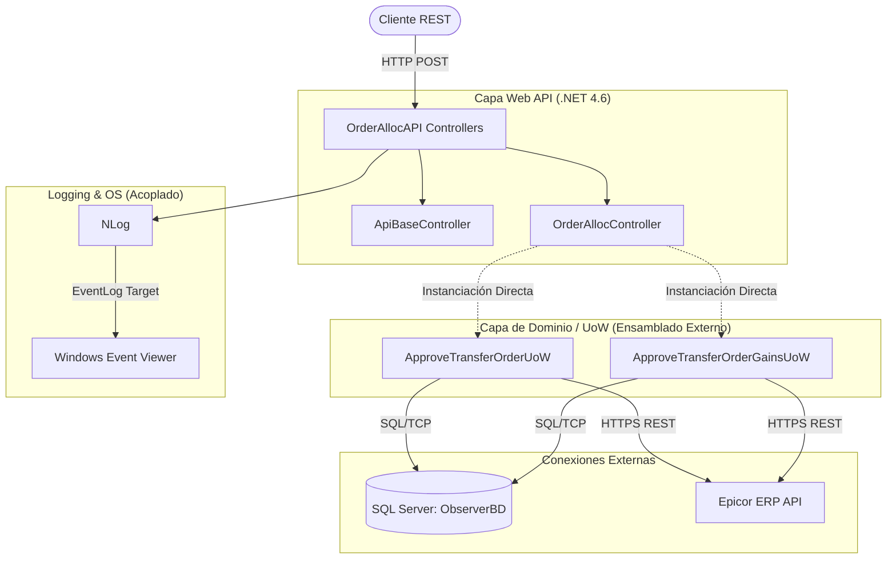

# Informe de Auditoría Técnica de Código: BoxServiceProviderPartAllocTOs (OrderAllocAPI)

## 1.1 RESUMEN EJECUTIVO
**Puntuación Global Estimada: 45/100 (Riesgo Alto - Requiere Intervención)**

La aplicación **OrderAllocAPI** (BoxServiceProviderPartAllocTOs) es un servicio basado en .NET Framework 4.6 que actúa como un orquestador para la aprobación de órdenes de transferencia, integrándose con una base de datos local (ObserverBD) y el ERP Epicor. 
Durante la auditoría, se detectaron deficiencias significativas en prácticas de Clean Code, Seguridad, y alineación con los principios SOLID. La fuerte dependencia a configuraciones estáticas (`Web.config`), la falta de Inyección de Dependencias (DI) y la gestión insegura de errores (exposición de excepciones al cliente) representan riesgos operativos y de seguridad considerables. El estado actual de la aplicación la cataloga como *Legacy*, requiriendo una modernización profunda antes de plantear la escalabilidad en la nube.

⚠️ *Información no proporcionada en la entrada: No se cuenta con el código fuente de los ensamblados subyacentes (EventHandler.dll) que contienen la lógica de negocio real (`ApproveTransferOrderUoW`), por lo que la auditoría se limita a la capa del Controlador API y la Configuración de arranque.*

---

## 1.2 DIAGRAMA DE ARQUITECTURA, FLUJO Y CONEXIONES EXTERNAS

---

## 1.3 MATRIZ DE PUNTUACIÓN DE DESARROLLO (SCORECARD)

| Aspecto Evaluado | Puntuación (1-5) | Observación Principal |
| :--- | :---: | :--- |
| **Arquitectura** | 2 | Acoplamiento fuerte a IIS y Windows EventLog. Estructura monolítica. |
| **Seguridad** | 1 | Exposición de StackTrace/Excepciones. Credenciales en texto plano. |
| **Principios SOLID** | 2 | Violación flagrante de Inversión de Dependencias (uso indiscriminado de `new`). |
| **Patrones de Diseño**| 3 | Uso parcial del patrón Unit of Work, aunque implementado rígidamente. |
| **Clean Code** | 2 | Bloques masivos de código comentado ("Dead Code"). Falta de limpieza. |

---

## 1.4 ANÁLISIS CRÍTICO DETALLADO POR ASPECTO

### A. Seguridad (Crítico)
- **Fuga de Información (Information Disclosure):** El método genérico `BadRequest(Exception ex)` en `ApiBaseController.cs` retorna la excepción cruda. Esto revela stack traces y estructura interna al cliente, un vector clásico de ataque (CWE-209).
- **Credenciales Expuestas:** El archivo `Web.config` almacena cadenas de conexión y credenciales de API (ej. `User ID=interfaces;Password=***`, Epicor `Username=SYSUSER;Password=***`) en texto plano.
- **Validación Inexistente:** Los controladores reciben objetos `ApproveTransferOrderRequestModel` pero no hay validación del modelo (`ModelState.IsValid`) antes de procesarlos.

### B. Principios SOLID e Inversión de Control
- **Violación del Principio de Inversión de Dependencias (DIP):** `OrderAllocController` crea explícitamente instancias como `new ApproveTransferOrderUoW()`. Esto hace imposible realizar pruebas unitarias (Unit Testing) aislando la lógica de negocio, acoplando el controlador a la implementación exacta.
- Curiosamente, existe código comentado (`//using (IRequestService requestService = new RequestService(...))`) que sugiere que hubo un intento de mejorar esto, pero se abandonó y se dejó como "código muerto".

### C. Clean Code y Mantenibilidad
- **Código Muerto (Dead Code):** Existen docenas de líneas de código fuente comentadas que ensucian el controlador. El control de versiones (SVN/Git) sirve para almacenar el histórico; el código comentado debe eliminarse.
- **Manejo de Errores Inconsistente:** El bloque `try-catch` engloba el flujo de la solicitud, pero delega un objeto de excepción puro sin mapearlo a una respuesta de error semántica estandarizada (Problem Details).

### D. Acoplamiento al Sistema Operativo
- El archivo de configuración de **NLog** apunta directamente a `EventLog`, acoplando la observabilidad del sistema a la infraestructura de Windows, complicando su transición a la nube y orquestadores.

---

## 1.5 SECCIÓN DE RECOMENDACIONES CRÍTICAS Y PLAN DE REMEDIACIÓN

### Prioridad 0 (P0) - Intervención Inmediata (Seguridad)
1. **Sanitizar Respuestas de Error:** Modificar `ApiBaseController.cs` para atrapar las excepciones y devolver un mensaje genérico. Loggear el detalle de la excepción internamente (NLog), pero **nunca** enviarlo en el `HttpResponseMessage`.
2. **Cifrar o Externalizar Secretos:** Implementar la encriptación de secciones del `Web.config` (ej. `aspnet_regiis`) o preferiblemente mover los secretos a variables de entorno para evitar subirlos al repositorio.

### Prioridad 1 (P1) - Arquitectura y Mantenibilidad
1. **Implementar Inyección de Dependencias (DI):** Configurar `Unity`, `Autofac` o el contenedor nativo de ASP.NET Web API para inyectar `ApproveTransferOrderUoW` a través del constructor del controlador en lugar de instanciarlo con `new`.
2. **Eliminar Código Muerto:** Borrar todos los bloques comentados inactivos dentro de `OrderAllocController.cs`.
3. **Validación de Modelos:** Agregar `if (!ModelState.IsValid) return BadRequest(ModelState);` al inicio de cada endpoint.

### Prioridad 2 (P2) - Observabilidad y Preparación
1. **Cambiar NLog Target:** Modificar `Web.config` para que NLog escriba a consola (Console Target) o archivos rotativos locales (`File Target`) en formato JSON, abandonando `EventLog` en preparación para agregadores de logs tipo ELK o Datadog.

---

## 1.6 AUDITORÍA DEVSECOPS Y CIBERSEGURIDAD (OWASP Top 10)

Como parte de la evaluación de seguridad integral del Comité Consultor, se han identificado brechas críticas transversales que deben remediarse obligatoriamente para cumplir con normativas corporativas:

### A. Exposición de Secretos y Credenciales (OWASP A02:2021)
*   **Riesgo:** El almacenamiento de credenciales de base de datos, contraseñas y llaves de API (ej. XApiKey) dentro de archivos estáticos como App.config permite a cualquier usuario con acceso al servidor o repositorio comprometer el ecosistema completo.
*   **Remediación:** Migrar hacia un modelo de **Inyección de Secretos** utilizando variables de entorno en contenedores o bóvedas de grado empresarial como Azure Key Vault / HashiCorp Vault.

### B. Transmisión Insegura de Datos en Red (OWASP A02:2021)
*   **Riesgo:** Las integraciones contra los orquestadores y bases de datos locales suelen viajar a través de canales no encriptados (HTTP plano).
*   **Remediación:** Imponer políticas estrictas de cifrado forzando el uso de HTTPS (TLS 1.2 o TLS 1.3) en las llamadas de HttpClient y las conexiones a bases de datos.

### C. Vulnerabilidad ante Denegación de Servicio (DoS) Interno
*   **Riesgo:** El diseño de hilos sin límite estricto y temporizadores bloqueantes agota los recursos (CPU/RAM/Sockets) del contenedor o servidor host.
*   **Remediación:** Implementar SemaphoreSlim para acotar la concurrencia, y configurar límites estrictos de recursos (limits y 
eservations) en los orquestadores de Docker/Kubernetes.
