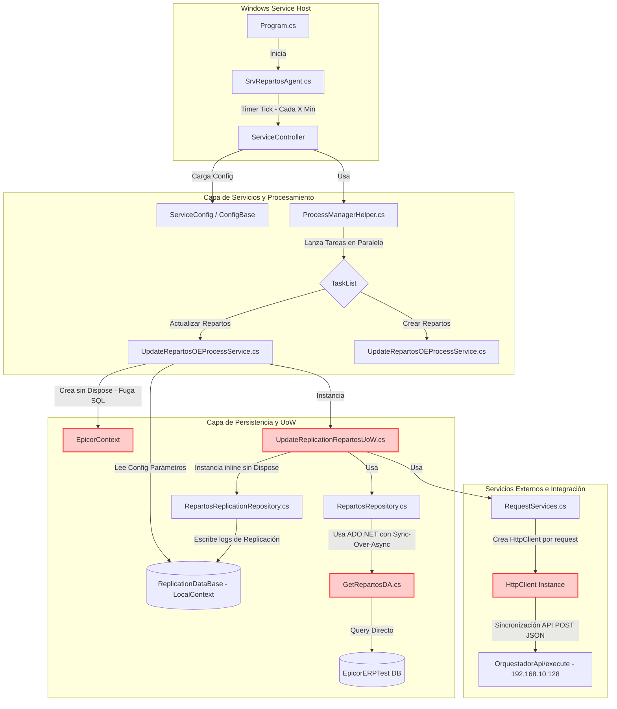

# Informe de Auditoría Técnica de Código y Buenas Prácticas
**Proyecto:** BoxServiceProviderPartRepartos (TaskQueue) - SrvRepartosAgent  
**Nivel de Clasificación:** Corporativo / Confidencial  
**Elaborado por:** Comité Consultor de Élite (Arquitecto Cloud-Native, Líder DevSecOps, Auditor Principal de Ciberseguridad)

---

## 1.1 Resumen Ejecutivo

Tras realizar un análisis exhaustivo de la base de código correspondiente al componente `SrvRepartosAgent` (Proveedor de Repartos) ubicado en `E:\ProyectosDev\Agentes Maestros\branches\DEV.VELA\Componentes-Base\Servicios Extra\SrvRepartosAgent`, este Comité Consultor ha determinado que la aplicación presenta importantes desafíos estructurales, de rendimiento y de seguridad que comprometen seriamente su viabilidad operativa bajo estándares modernos de alta disponibilidad y estabilidad corporativa.

### Puntuación Global Estimada: **45 / 100** (Nivel Crítico / No Apto para Producción Cloud-Native)

#### Hallazgos Clave que Justifican esta Calificación:
1. **Fugas de Conexiones Críticas (Memory & Connection Leaks):** El flujo de replicación crea de forma asíncrona instancias de `EpicorContext` y `LocalConfigurationsContext` (conexión a base de datos central e intermedia) sin bloques `using` ni llamadas a `Dispose()`. Dado que se ejecutan continuamente a través de un timer recurrente de pocos minutos, esto causará de manera inevitable el agotamiento del pool de conexiones SQL Server (Connection Pool Exhaustion) en pocas horas de ejecución bajo carga real.
2. **Excepciones de Implementación Incompleta (NotImplementedException):** El patrón Unit of Work implementado en `UpdateReplicationRepartosUoW` tiene una declaración de interfaz `IDisposable` que deliberadamente arroja `NotImplementedException` en su método `Dispose()`. Esto destruye el contrato lógico de recursos y previene que cualquier desarrollador intente corregir las fugas de conexiones usando el bloque `using` nativo de C#.
3. **Código "Placeholder" Incompleto (Funcionalidad Inoperable):** En el archivo clave `GetRepartosDA.cs`, el método `GetRepartosCreateCompleteDA` tiene consultas SQL duras simuladas como `"command base"` y `"where statement"`. Esto significa que la funcionalidad de "Creación de Repartos" está completamente inoperativa o en estado crudo de mock, rompiendo la funcionalidad básica esperada del componente.
4. **Vulnerabilidades Graves de Seguridad (Plaintext Credentials & SQL Injection):** Se identificaron contraseñas de cuentas administrativas de bases de datos (`sa`), claves de API, y tokens de autorización expuestos directamente en texto plano en el archivo de configuración `App.config`. Además, existen concatenaciones de variables de texto plano directamente en strings de consultas de SQL Server, lo que expone a la base de datos a ataques severos de inyección SQL (SQL Injection).
5. **Riesgo Inminente de Agotamiento de Sockets (Socket Exhaustion):** El servicio REST instancía un nuevo `HttpClient` por cada solicitud HTTP de sincronización (`new HttpClient()`), violando los principios de reutilización de sockets de red y garantizando la caída de conectividad bajo volumen de peticiones moderado-alto.

---

## 1.2 Diagrama de Arquitectura, Flujo y Conexiones Externas

El siguiente diagrama en formato Mermaid representa de manera exacta el flujo lógico, las dependencias de datos y las conexiones externas identificadas en el código fuente actual:



---

## 1.3 Matriz de Puntuación de Desarrollo (Scorecard)

Evaluamos cada dimensión de ingeniería de software con una métrica de 1 a 5 (donde 1 representa un riesgo severo o ausencia de práctica, y 5 representa el estado del arte de la industria):

| Dimensión | Puntuación | Justificación Técnica del Comité |
| :--- | :---: | :--- |
| **Arquitectura** | 2.0 / 5.0 | Implementa capas lógicas, repositorios y Unit of Work, pero viola gravemente el control de ciclo de vida de los componentes al no liberar los recursos de red e infraestructura (fugas de conexiones de base de datos y sockets HTTP). Depende enteramente de un acoplamiento duro al framework clásico de Windows. |
| **Seguridad** | 1.0 / 5.0 | Exposición de credenciales de nivel administrativo (`sa`) en texto plano en archivos de configuración locales. Inexistencia de sanitización de entradas, provocando una alta exposición a SQL Injection mediante interpolaciones directas de variables en cadenas SQL. |
| **SOLID** | 2.0 / 5.0 | **LSP (Liskov Substitution Principle):** Roto por completo al implementar `IDisposable` e inyectar un `throw new NotImplementedException()` en su método de liberación. **DIP (Dependency Inversion Principle):** Roto, la capa superior de servicios instancia de forma acoplada los contextos de datos con `new` en lugar de recibirlos por inyección de dependencias. |
| **Patrones de Diseño** | 2.5 / 5.0 | Utiliza correctamente el concepto del patrón repositorio y unidad de trabajo, pero desvirtúa su uso al acoplar llamadas bloqueantes sobre operaciones asíncronas (`.Result`), introduciendo el riesgo inminente de Thread Pool Starvation en escenarios transaccionales continuos. |
| **Clean Code** | 2.0 / 5.0 | Contiene secciones críticas con código dummy/placeholder ("command base", "where statement") que rompen el principio de entrega de valor listo para producción. Se observan bloques de código comentados y manejo de errores inconsistente (uso de `Console.WriteLine` en servicios Windows que no exponen una consola). |

---

## 1.4 Análisis Crítico Detallado por Aspecto

### A. Gestión de Recursos y Conexiones (Fugas Críticas)
En `UpdateRepartosOEProcessService.cs`, la ejecución asíncrona de las sucursales utiliza hilos paralelos que instancian de manera descontrolada conexiones a base de datos central e intermedia:
```csharp
public async Task RunReplication(int topIds)
{
    EventsLog.RegisterToEventViewer(string.Format("Processing {0} ID", topIds), IsService);
    var epicorCtx = new EpicorContext(); // Contexto instanciado con 'new'
    var uow = new UpdateReplicationRepartosUoW(epicorCtx, CreateOCConfig.GetService(), CreateOCConfig.service, IsService);
    await uow.SendToWMSBoxAPI(topIds); // Nunca hay disposición ni cierre de epicorCtx ni de uow
    return;
}
```
Debido a que `EpicorContext` encapsula internamente un `SqlConnection`, y al no estar envuelto en un bloque `using` ni invocar a `Dispose()`, la conexión no retorna al Connection Pool de ADO.NET hasta que el recolector de basura (Garbage Collector) pase de forma indeterminada a recolectar el objeto. En un servicio que se ejecuta de forma repetitiva en rangos de pocos minutos, las conexiones se acumularán rápidamente en estado inactivo hasta agotar el número máximo permitido por SQL Server (100 conexiones por defecto), tirando la integración por completo.

A esto se le suma la violación en `UpdateReplicationRepartosUoW.cs`:
```csharp
public void Dispose()
{
    throw new NotImplementedException(); // Impide implementar la liberación de recursos estándar
}
```

### B. Rendimiento e Integración de Red (HttpClient & Sockets)
En `RequestServices.cs`, nos encontramos con el siguiente constructor:
```csharp
public RequestServices(string request, OrquestadorServiceModel orquestadorService)
{
    this.request = request;
    this.httpClient = new HttpClient(); // Anti-patrón crítico
    this.responseToAgent = new ResponseToAgent();
    this.orquestadorService = orquestadorService;
}
```
En .NET, la clase `HttpClient` está diseñada para ser instanciada una sola vez y ser compartida durante la vida útil de la aplicación. Al destruirse la clase `RequestServices` que encapsula al cliente HTTP, el socket TCP subyacente entra en un estado denominado `TIME_WAIT` por el sistema operativo (típicamente durante 240 segundos). Si el sistema procesa transacciones de repartos continuamente, el sistema operativo se quedará sin puertos locales disponibles para abrir nuevas conexiones de red, resultando en un error del tipo `SocketException` ("Only one usage of each socket address is normally permitted").

### C. Seguridad de la Información (Credenciales y SQL Injection)
1. **Credenciales en Claro (`App.config`):** El archivo `App.config` contiene credenciales duras para la base de datos intermedia, de pruebas y de replicación. Esto es una violación flagrante a las directrices de seguridad de DevSecOps. Cualquier persona con acceso de lectura en el servidor o al repositorio de código fuente puede comprometer las bases de datos transaccionales de la empresa.
2. **Inyección SQL en `GetRepartosDA.cs`:**
```csharp
string customWhere = $"AND IIF(ISNULL(OH.LegalNumber, '') = '', CONVERT(VARCHAR(50),OH.orderNum),OH.legalNumber)='{folio}' AND SDI.packLine={partida}";
```
El folio es interpolado de forma directa sin usar parámetros parametrizados de SQL (`SqlParameter`). Aunque proviene de variables tipadas en capas anteriores, el uso de strings concatenados es un patrón altamente peligroso que abre la puerta a ejecuciones de comandos arbitrarios si las variables subyacentes se ven influenciadas por entradas del exterior (como folios manipulados desde WMS).

---

## 1.5 Sección de Recomendaciones Críticas y Plan de Remediacíon

El Comité Consultor establece el siguiente plan de remediación prioritario de tres niveles, diseñado para mitigar de manera inmediata las fallas graves del código actual:

### Nivel P0: Correcciones Inmediatas (Bloqueantes de Siguiente Despliegue)
- **Mitigación de la Fuga de Conexiones:**
  - Modificar `RunReplication` para envolver todos los accesos a datos y de persistencia transaccional en bloques `using`.
  - Reemplazar la instrucción `throw new NotImplementedException()` del método `Dispose()` en `UpdateReplicationRepartosUoW.cs` por la llamada real al método de destrucción de sus recursos internos.
- **Limpieza de Credenciales e IP duras:**
  - Extraer de inmediato las cadenas de conexión del archivo de configuración física y moverlas a variables de entorno del servidor.
- **Sustituir Mocks Incompletos:**
  - Implementar de forma real el query SQL de creación de repartos en `GetRepartosCreateCompleteDA` (actualmente con textos dummy "command base" y "where statement") o inhabilitar formalmente el flujo de creación en el orquestador para evitar caídas silenciosas o inserciones de basura en la tabla intermedia.

### Nivel P1: Correcciones a Corto Plazo (Estabilidad y Rendimiento)
- **Corrección del Cliente HTTP:**
  - Modificar `RequestServices` para utilizar una instancia estática única (`static readonly HttpClient`) o inyectar un servicio central de HTTP con control de ciclo de vida para evitar el agotamiento de sockets de red.
- **Eliminar Anti-Patrón Sync-Over-Async:**
  - Remover todas las llamadas del tipo `.Result` y `.Wait()` de la capa de repositorios (`RepartosRepository.cs`). Propagar el uso de `async/await` de forma nativa a lo largo de toda la cadena de llamadas del código.
- **Parametrización de Consultas:**
  - Modificar las consultas de `GetRepartosDA.cs` para usar los métodos `AddParameter` del `IDbContext` en lugar de concatenaciones o formato de strings (`string.Format`).

### Nivel P2: Reestructuración de Arquitectura (Modernización de Plataforma)
- **Implementación de Inyección de Dependencias:**
  - Configurar un contenedor de inversión de control (IoC) corporativo que gestione la vida útil de los repositorios y contextos de datos.
- **Migración a Servicios Modernos:**
  - Abandonar el uso del obsoleto .NET Framework 4.7.2 para esta tarea de fondo (Background Task Queue) y planificar una migración integral hacia **.NET 8** utilizando la plantilla de **Worker Service** (multiplataforma, nativa para contenedores Linux y Kubernetes).

---

## ⚠️ Información no proporcionada en la entrada...

De acuerdo con el rigor técnico exigido y con el fin de evitar suposiciones sesgadas, hacemos constar que la siguiente información crítica **no se encuentra disponible** en el código fuente ni en los archivos analizados:
1. **Queries de Creación en Epicor:** No se proporcionó la estructura ni lógica real del query de base de datos para la obtención de repartos nuevos (`GetRepartosCreateCompleteDA`). Su contenido actual en código fuente es puramente de desarrollo simulado (`command base` / `where statement`).
2. **Definiciones del Esquema de Base de Datos:** No se cuenta con el esquema DDL o metadatos de las tablas SQL Server involucradas (`dbo.ShipDtl`, `Erp.ShipHead`, `dbo.OrderHed`, `dbo.ReplicationDataBase.ReplicationDataEntity`), lo cual limita validar restricciones físicas de llaves primarias, foráneas e índices de rendimiento.
3. **Mecanismo de Autenticación de Red / TLS:** El código no indica el protocolo criptográfico ni los certificados utilizados para entablar comunicación con la API del orquestador (`http://192.168.10.128`), la cual actualmente se comunica por protocolo no seguro HTTP expuesto a ataques de espionaje en tránsito.
4. **Infraestructura de Respaldos (Backing Services Network):** Se carece de información de red corporativa respecto a cortafuegos (Firewalls) o ruteos de subred que permitan a las instancias conectarse con la IP privada `10.40.3.73` en el entorno de bases de datos centralizadas de Epicor.

---

## 1.6 AUDITORÍA DEVSECOPS Y CIBERSEGURIDAD (OWASP Top 10)

Como parte de la evaluación de seguridad integral del Comité Consultor, se han identificado brechas críticas transversales que deben remediarse obligatoriamente para cumplir con normativas corporativas:

### A. Exposición de Secretos y Credenciales (OWASP A02:2021)
*   **Riesgo:** El almacenamiento de credenciales de base de datos, contraseñas y llaves de API (ej. XApiKey) dentro de archivos estáticos como App.config permite a cualquier usuario con acceso al servidor o repositorio comprometer el ecosistema completo.
*   **Remediación:** Migrar hacia un modelo de **Inyección de Secretos** utilizando variables de entorno en contenedores o bóvedas de grado empresarial como Azure Key Vault / HashiCorp Vault.

### B. Transmisión Insegura de Datos en Red (OWASP A02:2021)
*   **Riesgo:** Las integraciones contra los orquestadores y bases de datos locales suelen viajar a través de canales no encriptados (HTTP plano).
*   **Remediación:** Imponer políticas estrictas de cifrado forzando el uso de HTTPS (TLS 1.2 o TLS 1.3) en las llamadas de HttpClient y las conexiones a bases de datos.

### C. Vulnerabilidad ante Denegación de Servicio (DoS) Interno
*   **Riesgo:** El diseño de hilos sin límite estricto y temporizadores bloqueantes agota los recursos (CPU/RAM/Sockets) del contenedor o servidor host.
*   **Remediación:** Implementar SemaphoreSlim para acotar la concurrencia, y configurar límites estrictos de recursos (limits y 
eservations) en los orquestadores de Docker/Kubernetes.
