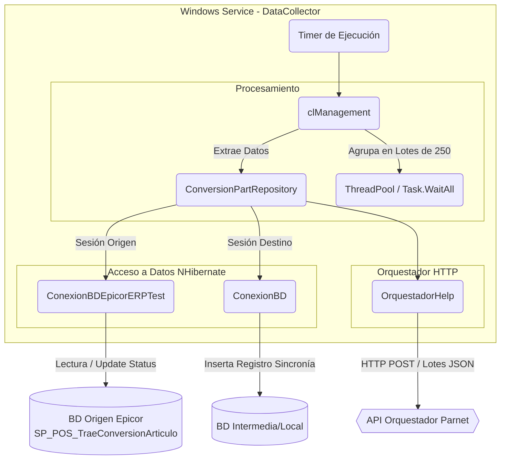

# 1. Informe de Auditoría Técnica de Código - BoxServiceQueueConversionPart (DataCollector)

## 1.1 RESUMEN EJECUTIVO
**Puntuación Global Estimada: 42/100 (Riesgo Alto - Nivel de Deuda Técnica Severa)**

El componente analizado es un Windows Service desarrollado en .NET Framework 4.7.2. Su propósito principal es extraer conversiones de artículos de una base de datos origen (presumiblemente Epicor ERP) a través de un Procedimiento Almacenado, sincronizar un estado intermedio usando NHibernate y enviar lotes de datos a un Orquestador central mediante peticiones asíncronas. 

A nivel de arquitectura y código, la aplicación sufre de un fuerte acoplamiento, violación de principios SOLID (particularmente Single Responsibility), gestión riesgosa de transacciones y concurrencia, y presencia de nombres estáticos orientados a ambientes de prueba en clases base (`ConexionBDEpicorERPTest`). Existe un manejo inconsistente de excepciones y un uso inadecuado de sesiones NHibernate concurrentes. 

## 1.2 DIAGRAMA DE ARQUITECTURA, FLUJO Y CONEXIONES EXTERNAS (MERMAID)

## 1.3 MATRIZ DE PUNTUACIÓN DE DESARROLLO (SCORECARD)
Escala: 1 (Deficiente) a 5 (Excelente)

| Criterio | Puntuación | Justificación |
|----------|------------|---------------|
| **Arquitectura** | 2/5 | Monolítico acoplado al S.O. (Windows Service). Inyección de dependencias inexistente. |
| **Seguridad** | 2/5 | ⚠️ *Información no proporcionada en la entrada sobre strings de conexión exactos.* Sin embargo, la gestión de conexiones manuales indica probable exposición en `App.config` en texto plano. No se ven validaciones JWT o autenticación fuerte al llamar al Orquestador. |
| **SOLID** | 1/5 | Múltiples violaciones de Single Responsibility Protocol (SRP). El Repositorio maneja transacciones duales de DB Y llamadas HTTP al Orquestador. |
| **Patrones** | 2/5 | Uso básico del patrón Repository pero mal implementado (hace de orquestador). Uso de Singleton para SessionFactory. |
| **Clean Code** | 2/5 | Hardcoding de nombres de servidores de test (`ConexionBDEpicorERPTest`), nombres de variables poco descriptivos (`p`, `oPart`, `dtSP`), mezcla asíncrono/síncrono (`.Wait()`). |

## 1.4 ANÁLISIS CRÍTICO DETALLADO POR ASPECTO

**1. Manejo de Concurrencia y Asincronía (Peligro de Deadlocks):**
En `clManagement.cs`, el proceso encola trabajos usando `ThreadPool.QueueUserWorkItem(ToDestiny, oPart);` pero también utiliza `Task.WaitAll` para otra colección de tareas generadas con `ToParnet`. Sin embargo, dentro de `ConversionPartRepository.cs` hay llamadas a `Task.Run(...).Wait()`, lo cual es un anti-patrón ("sync-over-async") que puede causar interbloqueos (Deadlocks) y agotamiento de hilos del ThreadPool.

**2. Acoplamiento de Responsabilidades en Repositorios:**
El archivo `ConversionPartRepository.cs` no se comporta como un repositorio. En su método `Destiny` o `DestinyAsync`, arma modelos de Request HTTP y utiliza un componente llamado `OrquestadorHelp` para enviar información. Un Repositorio debe estar restringido puramente a lógica de acceso a datos (NHibernate/SQL).

**3. Riesgos en el Acceso a Datos y Transacciones:**
En `ConversionPartRepository.Insert`, el código abre dos transacciones a dos bases de datos diferentes (`txOrigen` y `txOrigenDestino`). En caso de fallo tras procesar `txOrigenDestino.Commit()`, la primera transacción `txOrigen` todavía podría fallar y quedarse en un estado inconsistente (no es un 2PC - Two Phase Commit real). Además, el manejo de excepciones atrapa genéricos y lanza un rollback a variables que podrían estar en estado *disposed*.

**4. Ciclo de Vida de Sesiones (NHibernate):**
La instancia de `ConversionPartRepository` guarda `sessionOrigen` y `sessionDestino` como estado local durante el constructor e interactúa con ellos desde múltiples hilos creados por el `ThreadPool` en el Manager. NHibernate `ISession` no es thread-safe. Reutilizar la misma sesión para insertar miles de registros desde varios hilos va a corromper el estado y lanzar excepciones de estado obsoleto.

## 1.5 SECCIÓN DE RECOMENDACIONES CRÍTICAS Y PLAN DE REMEDIACIÓN

### P0 (Crítico - Riesgo Inminente de Falla/Corrupción de Datos)
1. **Corregir Ciclo de Vida de NHibernate ISession:** Eliminar la inyección de `ISession` en el constructor del repositorio que se comparte entre hilos. Cada hilo de procesamiento (`Task` o `ThreadUserWorkItem`) debe abrir y cerrar su propia `ISession`.
2. **Eliminar Sync-over-Async:** Erradicar llamadas `.Wait()` o `.Result` en métodos asíncronos. Cambiar el flujo a `async/await` real desde el tope (`clManagement`).
3. **Control de Concurrencia Limitado:** Cambiar `ThreadPool.QueueUserWorkItem` por un bloque `SemaphoreSlim` o `Parallel.ForEachAsync` que limite a un número prudencial de conexiones concurrentes para no saturar NHibernate o el SQL Server destino.

### P1 (Alta Importancia - Deuda Técnica Severa)
1. **Desacoplar Lógica de Red de Repositorio:** Mover las llamadas a `OrquestadorHelp` a un servicio de dominio o capa de aplicación independiente, dejando al Repositorio únicamente con sentencias CRUD a bases de datos.
2. **Inyección de Dependencias:** Incorporar un contenedor IoC (como Microsoft.Extensions.DependencyInjection o Autofac) para administrar el ciclo de vida transitorio/scoped de los repositorios.
3. **Renombrar Clases Hardcodeadas:** Cambiar `ConexionBDEpicorERPTest` por nombres agnósticos al entorno (`EpicorConnectionFactory`, etc.).

### P2 (Mejora Continua - Mediano Plazo)
1. **Mejorar Logging y Trazabilidad:** Evitar el acoplamiento estricto a `EventLog` (Eventos de Windows) a través de abstracciones como `ILogger` (NLog, Serilog), lo que facilitará la futura migración a contenedores.
2. **Actualizar el Stack (Modernización):** Evaluar migración de .NET Framework 4.7.2 a .NET 8, reemplazando el `ServiceBase` con `Microsoft.Extensions.Hosting.BackgroundService` para alistar la aplicación para contenedores Linux.

---

## 1.6 AUDITORÍA DEVSECOPS Y CIBERSEGURIDAD (OWASP Top 10)

Como parte de la evaluación de seguridad integral del Comité Consultor, se han identificado brechas críticas transversales que deben remediarse obligatoriamente para cumplir con normativas corporativas:

### A. Exposición de Secretos y Credenciales (OWASP A02:2021)
*   **Riesgo:** El almacenamiento de credenciales de base de datos, contraseñas y llaves de API (ej. XApiKey) dentro de archivos estáticos como App.config permite a cualquier usuario con acceso al servidor o repositorio comprometer el ecosistema completo.
*   **Remediación:** Migrar hacia un modelo de **Inyección de Secretos** utilizando variables de entorno en contenedores o bóvedas de grado empresarial como Azure Key Vault / HashiCorp Vault.

### B. Transmisión Insegura de Datos en Red (OWASP A02:2021)
*   **Riesgo:** Las integraciones contra los orquestadores y bases de datos locales suelen viajar a través de canales no encriptados (HTTP plano).
*   **Remediación:** Imponer políticas estrictas de cifrado forzando el uso de HTTPS (TLS 1.2 o TLS 1.3) en las llamadas de HttpClient y las conexiones a bases de datos.

### C. Vulnerabilidad ante Denegación de Servicio (DoS) Interno
*   **Riesgo:** El diseño de hilos sin límite estricto y temporizadores bloqueantes agota los recursos (CPU/RAM/Sockets) del contenedor o servidor host.
*   **Remediación:** Implementar SemaphoreSlim para acotar la concurrencia, y configurar límites estrictos de recursos (limits y 
eservations) en los orquestadores de Docker/Kubernetes.
