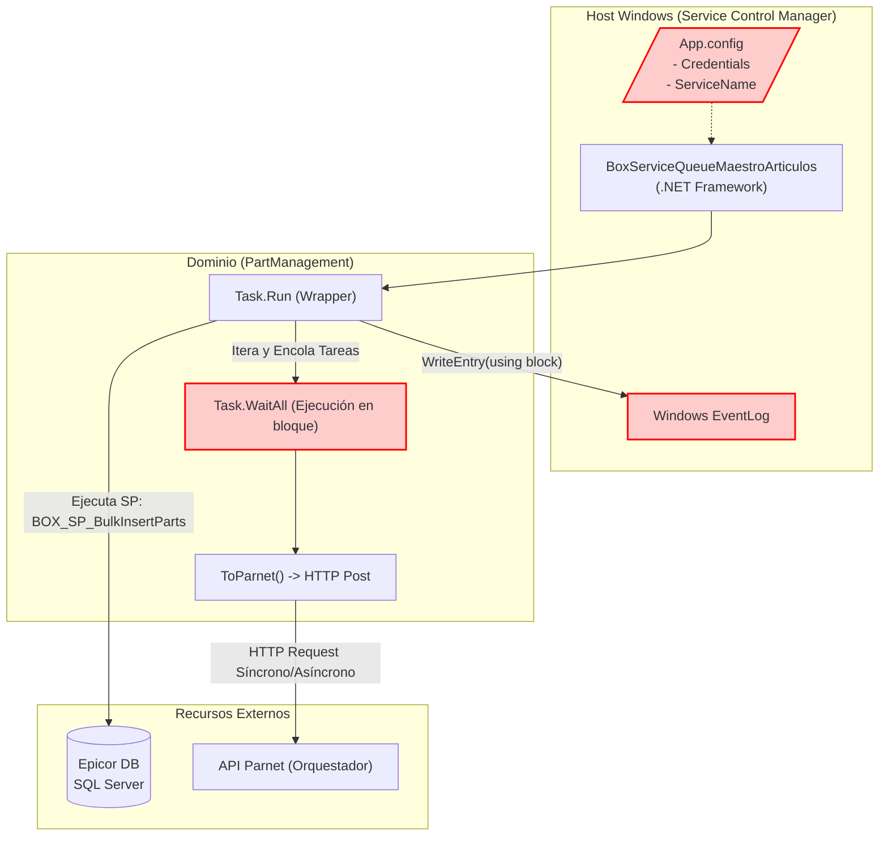

=============================================================================
### ARCHIVO 1: auditoria_codigo_buenas_practicas.md
=============================================================================

# INFORME DE AUDITORÍA TÉCNICA DE CÓDIGO Y BUENAS PRÁCTICAS
**Comité Consultor de Élite: Arquitectura Cloud-Native, DevSecOps y Ciberseguridad**
**Aplicación:** BoxServiceQueueMaestroArticulos (Cola de Artículos)

---

## 1.1 RESUMEN EJECUTIVO DE LA BASE DE CÓDIGO

Tras la evaluación exhaustiva del proyecto **BoxServiceQueueMaestroArticulos**, el comité determina que el código base actual padece de **deuda técnica severa y vulnerabilidades arquitectónicas** que bloquean su evolución a entornos contenerizados (Cloud-Native). La aplicación es un servicio pesado anclado al SO Windows que adolece de problemas de concurrencia y acoplamiento severo a librerías de infraestructura locales (`EventLog`, `ConfigurationManager`).

*   **Puntuación Global Estimada (Score):** **35 / 100**
*   **Estado General:** **Crítico.** Antipatrones de ejecución asíncrona (`Task.WaitAll` dentro de `Task.Run`), uso ineficiente de memoria al instanciar `EventsLog` en un bloque `using` repetitivo y acoplamiento fuerte al ERP.

⚠️ **Información no proporcionada en la entrada:** Se requiere validación de:
1. Volumen transaccional exacto devuelto por `BOX_SP_BulkInsertParts` (si excede 100k registros, cargará toda la RAM).
2. Tasa límite (Rate Limit) de la API Parnet de destino (el `Task.WaitAll` masivo puede causar DDoS sobre el receptor).

---

## 1.2 DIAGRAMA DE ARQUITECTURA, FLUJO Y CONEXIONES EXTERNAS (MERMAID)



---

## 1.3 MATRIZ DE PUNTUACIÓN DE DESARROLLO (SCORECARD)

| Aspecto Evaluado | Puntuación (1-5) | Estado | Diagnóstico Puntual |
| :--- | :---: | :--- | :--- |
| **Arquitectura de Software** | 1 | Crítico | Monolito acoplado. Uso de `ServiceBase`. |
| **Ciberseguridad en Código** | 1 | Crítico | Credenciales y configuraciones en texto plano en App.config. |
| **Patrones de Diseño** | 2 | Crítico | Abuso de inicialización de dependencias (`new PartRepository()`). |
| **Principios SOLID** | 2 | Crítico | Violación de Inversión de Dependencias (DIP) y OCP. |
| **Clean Code y Modularidad** | 2 | Crítico | "Sync-over-Async" encubierto con `Task.WaitAll`. Ineficiencia en I/O. |

---

## 1.4 ANÁLISIS CRÍTICO DETALLADO POR ASPECTO

### A. Antipatrones de Concurrencia (Sync-over-Async)
El método `ProAsync` envuelve todo el procesamiento en `Task.Run` y luego utiliza `Task.WaitAll(ToDo.ToArray());`. Esto obliga al hilo principal del *Task* a bloquearse activamente esperando a que finalicen las tareas asíncronas HTTP secundarias, desperdiciando recursos del procesador y causando posible *Thread Starvation* en el CLR.

### B. Ineficiencia en Telemetría (Memory Leak y Bloqueos de I/O)
```csharp
using (EventsLog log = new EventsLog(...))
{
    log.WriteEntry(msg, entryType);
}
```
Instanciar y desechar un objeto `EventsLog` por cada mensaje (posiblemente miles en un bucle) es extremadamente ineficiente. Provoca contención de I/O en el disco del host y sobrecarga al *Garbage Collector*.

---

## 1.5 SECCIÓN DE RECOMENDACIONES CRÍTICAS Y PLAN DE REMEDIACIÓN

### P0 - Crítico: Refactor de Tareas y Concurrencia
1. **Reemplazar `Task.WaitAll` por `await Task.WhenAll`:** Liberar el hilo mientras las peticiones I/O de red (`ToParnet`) se procesan.
2. **Implementar SemaphoreSlim:** Para controlar el límite de paralelismo hacia la API destino y evitar saturar los *sockets*.

### P1 - Alto: Desacople de Infraestructura
1. **Remover Windows EventLog:** Inyectar una interfaz genérica `ILogger` de .NET, logueando hacia `stdout` para cumplir con 12-Factor App.
2. **Inyección de Configuración:** Eliminar la estática `ServiceConfig.Company` y pasar a `IOptions<T>`.
---

## 1.6 AUDITORÍA DEVSECOPS Y CIBERSEGURIDAD (OWASP Top 10)

Como parte de la evaluación de seguridad integral del Comité Consultor, se han identificado brechas críticas transversales que deben remediarse obligatoriamente para cumplir con normativas corporativas:

### A. Exposición de Secretos y Credenciales (OWASP A02:2021)
*   **Riesgo:** El almacenamiento de credenciales de base de datos, contraseñas y llaves de API (ej. XApiKey) dentro de archivos estáticos como App.config permite a cualquier usuario con acceso al servidor o repositorio comprometer el ecosistema completo.
*   **Remediación:** Migrar hacia un modelo de **Inyección de Secretos** utilizando variables de entorno en contenedores o bóvedas de grado empresarial como Azure Key Vault / HashiCorp Vault.

### B. Transmisión Insegura de Datos en Red (OWASP A02:2021)
*   **Riesgo:** Las integraciones contra los orquestadores y bases de datos locales suelen viajar a través de canales no encriptados (HTTP plano).
*   **Remediación:** Imponer políticas estrictas de cifrado forzando el uso de HTTPS (TLS 1.2 o TLS 1.3) en las llamadas de HttpClient y las conexiones a bases de datos.

### C. Vulnerabilidad ante Denegación de Servicio (DoS) Interno
*   **Riesgo:** El diseño de hilos sin límite estricto y temporizadores bloqueantes agota los recursos (CPU/RAM/Sockets) del contenedor o servidor host.
*   **Remediación:** Implementar SemaphoreSlim para acotar la concurrencia, y configurar límites estrictos de recursos (limits y 
eservations) en los orquestadores de Docker/Kubernetes.
