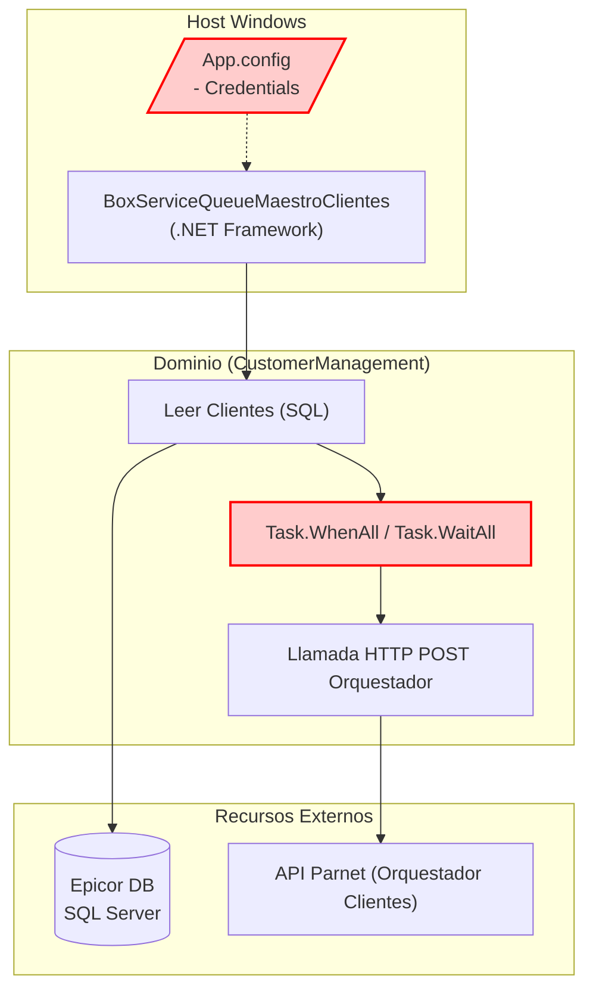

=============================================================================
### ARCHIVO 1: auditoria_codigo_buenas_practicas.md
=============================================================================

# INFORME DE AUDITORÍA TÉCNICA DE CÓDIGO Y BUENAS PRÁCTICAS
**Comité Consultor de Élite: Arquitectura Cloud-Native, DevSecOps y Ciberseguridad**
**Aplicación:** BoxServiceQueueMaestroClientes (Cola de Clientes)

---

## 1.1 RESUMEN EJECUTIVO DE LA BASE DE CÓDIGO

La aplicación **BoxServiceQueueMaestroClientes** exhibe una fuerte herencia de arquitectura legacy en .NET Framework, con un nivel crítico de acoplamiento al sistema operativo subyacente. Comparte exactamente las mismas vulnerabilidades de concurrencia de la familia de agentes Parnet, incluyendo *Fire and Forget*, dependencias fuertes no inyectadas y *Hardcoded Settings*.

*   **Puntuación Global Estimada (Score):** **35 / 100**
*   **Estado General:** **Crítico.** La lógica del negocio se encuentra entrelazada con el servicio de infraestructura de Windows (`ServiceBase`), y el manejo asíncrono bloquea activamente los hilos de red, poniendo en peligro la escalabilidad vertical.

⚠️ **Información no proporcionada en la entrada:**
1. Reglas exactas de control transaccional en caso de falla de la API destino (¿Existe un Retry Policy o compensación de Saga?).
2. Volumen de "Customer Delta" promedio por ciclo.

---

## 1.2 DIAGRAMA DE ARQUITECTURA, FLUJO Y CONEXIONES EXTERNAS (MERMAID)



---

## 1.3 MATRIZ DE PUNTUACIÓN DE DESARROLLO (SCORECARD)

| Aspecto Evaluado | Puntuación (1-5) | Estado | Diagnóstico Puntual |
| :--- | :---: | :--- | :--- |
| **Arquitectura de Software** | 1 | Crítico | Dependencia directa de `ServiceBase`. Inviable para contenedores Linux. |
| **Ciberseguridad en Código** | 1 | Crítico | Manejo de secretos en texto claro (App.config). |
| **Patrones de Diseño** | 2 | Crítico | Ausencia de IoC/DI. Se utiliza operador `new` en toda la jerarquía de llamadas. |
| **Principios SOLID** | 2 | Crítico | Ruptura sistemática del Single Responsibility Principle (SRP). |
| **Clean Code y Modularidad** | 2 | Crítico | Complejidad ciclomatica elevada en algoritmos de paginación (`Skip/Take` manual). |

---

## 1.4 ANÁLISIS CRÍTICO DETALLADO POR ASPECTO

### A. Vulnerabilidad de Fuga de Credenciales
El uso extensivo de `ConfigurationManager.AppSettings` para recuperar credenciales de base de datos y llaves de acceso a las APIs expone a la compañía a vulneraciones críticas, especialmente cuando los archivos `.config` suelen commitearse en los repositorios de código.

### B. Ineficiencia en Paginación Manual (Skip/Take)
El algoritmo para segmentar datos en lotes:
```csharp
while ((partial = plant.Value.Skip(pageNumber * pageSize).Take(pageSize).ToList()) != null)
```
Genera ineficiencia computacional `O(N^2)` en memoria y CPU, ya que `Skip` en listas en memoria obliga al iterador de LINQ a recorrer la lista desde el índice 0 en cada iteración del bucle `while`.

---

## 1.5 SECCIÓN DE RECOMENDACIONES CRÍTICAS Y PLAN DE REMEDIACIÓN

### P0 - Crítico: Abstracción de Secretos y Hilos
1. **Configuración Dinámica:** Portar el proyecto a .NET 8 y utilizar el proveedor de configuraciones basado en variables de entorno o almacenes de secretos nativos (Azure Key Vault).
2. **Refactorización de Paginación:** Usar la función nativa `.Chunk(pageSize)` de .NET 6+ para segmentar en tiempo `O(N)` y sin iteraciones redundantes.

### P1 - Alto: Tolerancia a Fallos
1. **Resiliencia HTTP:** Incluir la biblioteca **Polly** para dotar al cliente HTTP de patrones *Circuit Breaker* y *Retry*.
---

## 1.6 AUDITORÍA DEVSECOPS Y CIBERSEGURIDAD (OWASP Top 10)

Como parte de la evaluación de seguridad integral del Comité Consultor, se han identificado brechas críticas transversales que deben remediarse obligatoriamente para cumplir con normativas corporativas:

### A. Exposición de Secretos y Credenciales (OWASP A02:2021)
*   **Riesgo:** El almacenamiento de credenciales de base de datos, contraseñas y llaves de API (ej. XApiKey) dentro de archivos estáticos como App.config permite a cualquier usuario con acceso al servidor o repositorio comprometer el ecosistema completo.
*   **Remediación:** Migrar hacia un modelo de **Inyección de Secretos** utilizando variables de entorno en contenedores o bóvedas de grado empresarial como Azure Key Vault / HashiCorp Vault.

### B. Transmisión Insegura de Datos en Red (OWASP A02:2021)
*   **Riesgo:** Las integraciones contra los orquestadores y bases de datos locales suelen viajar a través de canales no encriptados (HTTP plano).
*   **Remediación:** Imponer políticas estrictas de cifrado forzando el uso de HTTPS (TLS 1.2 o TLS 1.3) en las llamadas de HttpClient y las conexiones a bases de datos.

### C. Vulnerabilidad ante Denegación de Servicio (DoS) Interno
*   **Riesgo:** El diseño de hilos sin límite estricto y temporizadores bloqueantes agota los recursos (CPU/RAM/Sockets) del contenedor o servidor host.
*   **Remediación:** Implementar SemaphoreSlim para acotar la concurrencia, y configurar límites estrictos de recursos (limits y 
eservations) en los orquestadores de Docker/Kubernetes.
