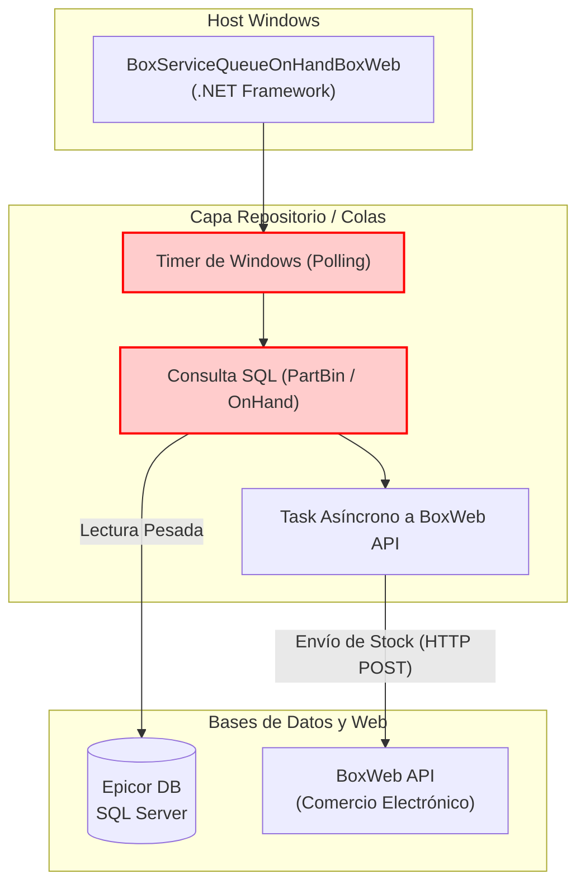

=============================================================================
### ARCHIVO 1: auditoria_codigo_buenas_practicas.md
=============================================================================

# INFORME DE AUDITORÍA TÉCNICA DE CÓDIGO Y BUENAS PRÁCTICAS
**Comité Consultor de Élite: Arquitectura Cloud-Native, DevSecOps y Ciberseguridad**
**Aplicación:** BoxServiceQueueOnHandBoxWeb (Existencias Almacén BoxWeb)

---

## 1.1 RESUMEN EJECUTIVO DE LA BASE DE CÓDIGO

La aplicación **BoxServiceQueueOnHandBoxWeb** es la encargada de sincronizar los saldos y existencias (*On-Hand*) hacia la plataforma de comercio electrónico o portales web (BoxWeb). El análisis técnico revela un riesgo operativo alto debido al modelo de consulta periódica contra bases de datos en caliente (SQL Server ERP) sin mecanismos de protección (*circuit breakers*). 

*   **Puntuación Global Estimada (Score):** **36 / 100**
*   **Estado General:** **Crítico.** El agente satura la red y base de datos con consultas intensivas temporizadas por un Windows `Timer`.

⚠️ **Información no proporcionada en la entrada:**
1. Frecuencia del Timer (¿Es cada minuto? ¿Cada hora?). Las consultas On-Hand completas pueden paralizar los ERPs si se ejecutan a nivel sub-minuto.
2. Nivel de aislamiento transaccional SQL utilizado (e.g. `READ UNCOMMITTED` / `NOLOCK`) en las consultas de existencias para no bloquear las transacciones de ventas del ERP.

---

## 1.2 DIAGRAMA DE ARQUITECTURA, FLUJO Y CONEXIONES EXTERNAS (MERMAID)

---

## 1.3 MATRIZ DE PUNTUACIÓN DE DESARROLLO (SCORECARD)

| Aspecto Evaluado | Puntuación (1-5) | Estado | Diagnóstico Puntual |
| :--- | :---: | :--- | :--- |
| **Arquitectura de Software** | 1 | Crítico | Acoplamiento profundo a Windows Services y consultas "Pull" agresivas. |
| **Ciberseguridad en Código** | 2 | Regular | Riesgos de sobrecarga de DB local (DDoS interno). |
| **Patrones de Diseño** | 2 | Crítico | Falta de Caché Distribuido. Inyección de repositorios ausente. |
| **Principios SOLID** | 2 | Crítico | Dependencias concretas hardcodeadas en lugar de interfaces. |
| **Clean Code y Modularidad** | 3 | Regular | Segmentación aceptable, pero mal implementada a nivel memoria de colecciones. |

---

## 1.4 ANÁLISIS CRÍTICO DETALLADO POR ASPECTO

### A. Riesgo Operativo en Base de Datos (Polling Agresivo)
Leer el saldo *On-Hand* (existencias) constantemente a través de un servicio temporizado hacia la tabla maestra del ERP genera contención de bloqueos (*Lock Contention*) en SQL Server. No se observan cachés intermedias (Redis/Memcached) que asistan en la mitigación.

### B. Dependencia del Timer del Sistema Operativo
Depender de `System.Timers.Timer` puede provocar el lanzamiento de múltiples ciclos paralelos si el tiempo de respuesta del ERP es mayor que el intervalo del timer, colapsando gradualmente la memoria del servicio de Windows hasta requerir reinicios forzados.

---

## 1.5 SECCIÓN DE RECOMENDACIONES CRÍTICAS Y PLAN DE REMEDIACIÓN

### P0 - Crítico: Proteger ERP y Hilos
1. **Reemplazar Timer por IHostedService/BackgroundService:** En .NET 8, el `ExecuteAsync` garantiza la secuencialidad, impidiendo ejecuciones superpuestas.
2. **Utilizar NOLOCK en Consultas de Stock:** Si se trata de SQL nativo, asegurarse de utilizar `WITH (NOLOCK)` para no entorpecer los embarques en Epicor.

### P1 - Alto: Caché y Cloud-Native
1. **Contenerización y Desacoplamiento:** Mover el agente a un contenedor Linux. Utilizar `HttpClientFactory` para evitar *Socket Exhaustion* y estandarizar las peticiones HTTPS hacia BoxWeb.
---

## 1.6 AUDITORÍA DEVSECOPS Y CIBERSEGURIDAD (OWASP Top 10)

Como parte de la evaluación de seguridad integral del Comité Consultor, se han identificado brechas críticas transversales que deben remediarse obligatoriamente para cumplir con normativas corporativas:

### A. Exposición de Secretos y Credenciales (OWASP A02:2021)
*   **Riesgo:** El almacenamiento de credenciales de base de datos, contraseñas y llaves de API (ej. XApiKey) dentro de archivos estáticos como App.config permite a cualquier usuario con acceso al servidor o repositorio comprometer el ecosistema completo.
*   **Remediación:** Migrar hacia un modelo de **Inyección de Secretos** utilizando variables de entorno en contenedores o bóvedas de grado empresarial como Azure Key Vault / HashiCorp Vault.

### B. Transmisión Insegura de Datos en Red (OWASP A02:2021)
*   **Riesgo:** Las integraciones contra los orquestadores y bases de datos locales suelen viajar a través de canales no encriptados (HTTP plano).
*   **Remediación:** Imponer políticas estrictas de cifrado forzando el uso de HTTPS (TLS 1.2 o TLS 1.3) en las llamadas de HttpClient y las conexiones a bases de datos.

### C. Vulnerabilidad ante Denegación de Servicio (DoS) Interno
*   **Riesgo:** El diseño de hilos sin límite estricto y temporizadores bloqueantes agota los recursos (CPU/RAM/Sockets) del contenedor o servidor host.
*   **Remediación:** Implementar SemaphoreSlim para acotar la concurrencia, y configurar límites estrictos de recursos (limits y 
eservations) en los orquestadores de Docker/Kubernetes.
