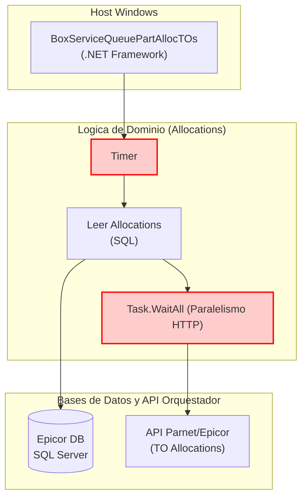

=============================================================================
### ARCHIVO 1: auditoria_codigo_buenas_practicas.md
=============================================================================

# INFORME DE AUDITORÍA TÉCNICA DE CÓDIGO Y BUENAS PRÁCTICAS
**Comité Consultor de Élite: Arquitectura Cloud-Native, DevSecOps y Ciberseguridad**
**Aplicación:** BoxServiceQueuePartAllocTOs (Cola de Asignaciones TO)

---

## 1.1 RESUMEN EJECUTIVO DE LA BASE DE CÓDIGO

La aplicación **BoxServiceQueuePartAllocTOs** es la responsable de procesar en segundo plano las reservas (Allocations) de inventarios derivadas de las Órdenes de Transferencia (TOs). Posee exactamente el mismo ADN arquitectónico de los agentes Parnet, heredando todas las vulnerabilidades sistémicas relativas al uso de `.NET Framework`, temporizadores acoplados al SO, e ineficiencias de I/O por paginación y "Sync-over-Async".

*   **Puntuación Global Estimada (Score):** **35 / 100**
*   **Estado General:** **Crítico.** El ciclo de lectura y envío HTTP presenta graves problemas de concurrencia y acoplamiento estructural.

⚠️ **Información no proporcionada en la entrada:**
1. Reglas lógicas del negocio para manejar fallos de red en reservas de inventario (¿Cómo se previene la duplicación de asignaciones?).
2. Detalles sobre los métodos `Equals` y `GetHashCode` de las entidades relacionadas para descartar bugs de EF/NHibernate en la memoria.

---

## 1.2 DIAGRAMA DE ARQUITECTURA, FLUJO Y CONEXIONES EXTERNAS (MERMAID)

---

## 1.3 MATRIZ DE PUNTUACIÓN DE DESARROLLO (SCORECARD)

| Aspecto Evaluado | Puntuación (1-5) | Estado | Diagnóstico Puntual |
| :--- | :---: | :--- | :--- |
| **Arquitectura de Software** | 1 | Crítico | Acoplamiento absoluto al SCM de Windows. |
| **Ciberseguridad en Código** | 1 | Crítico | Uso persistente de `ConfigurationManager` para lectura de claves API. |
| **Patrones de Diseño** | 2 | Crítico | No se respeta IoC. Generación de instancias mediante `new`. |
| **Principios SOLID** | 2 | Crítico | Single Responsibility seriamente comprometido en clases de Management. |
| **Clean Code y Modularidad** | 2 | Crítico | Fragmentación ineficiente de listas de tareas en bloques (`Skip/Take`). |

---

## 1.4 ANÁLISIS CRÍTICO DETALLADO POR ASPECTO

### A. Ausencia de Inyección de Dependencias
Crear el `PartAllocRepository` utilizando la sentencia `new` amarra irrevocablemente la clase de gestión con la clase de acceso a datos, violando el principio SOLID de inversión de dependencias y anulando la capacidad del equipo de desarrollo de crear Pruebas Unitarias automatizadas (Unit Testing / Mocking).

### B. "Sync-over-Async" en Peticiones Externas
Forzar un `Task.WaitAll` o ejecutar lógica asíncrona dentro de una envoltura de `ThreadPool.QueueUserWorkItem` o `Task.Run` despoja al CLR de su capacidad para liberar hilos eficientemente. Bajo presión, esto causará demoras graves en el procesamiento de las Transfer Orders.

---

## 1.5 SECCIÓN DE RECOMENDACIONES CRÍTICAS Y PLAN DE REMEDIACIÓN

### P0 - Crítico: Actualización Arquitectónica
1. **Actualizar a .NET 8 (LTS):** Es estrictamente imperativo reescribir este servicio en la plantilla genérica `Worker Service` (.NET Core / .NET 8).
2. **IoC (Inversión de Control):** Inyectar el repositorio, las configuraciones y `HttpClient` vía constructores genéricos.

### P1 - Alto: Desacoplamiento de Telemetría
1. **Migrar a ILogger:** Extraer todo log que llame a `EventLog` para cumplir con la norma Cloud-Native.
---

## 1.6 AUDITORÍA DEVSECOPS Y CIBERSEGURIDAD (OWASP Top 10)

Como parte de la evaluación de seguridad integral del Comité Consultor, se han identificado brechas críticas transversales que deben remediarse obligatoriamente para cumplir con normativas corporativas:

### A. Exposición de Secretos y Credenciales (OWASP A02:2021)
*   **Riesgo:** El almacenamiento de credenciales de base de datos, contraseñas y llaves de API (ej. XApiKey) dentro de archivos estáticos como App.config permite a cualquier usuario con acceso al servidor o repositorio comprometer el ecosistema completo.
*   **Remediación:** Migrar hacia un modelo de **Inyección de Secretos** utilizando variables de entorno en contenedores o bóvedas de grado empresarial como Azure Key Vault / HashiCorp Vault.

### B. Transmisión Insegura de Datos en Red (OWASP A02:2021)
*   **Riesgo:** Las integraciones contra los orquestadores y bases de datos locales suelen viajar a través de canales no encriptados (HTTP plano).
*   **Remediación:** Imponer políticas estrictas de cifrado forzando el uso de HTTPS (TLS 1.2 o TLS 1.3) en las llamadas de HttpClient y las conexiones a bases de datos.

### C. Vulnerabilidad ante Denegación de Servicio (DoS) Interno
*   **Riesgo:** El diseño de hilos sin límite estricto y temporizadores bloqueantes agota los recursos (CPU/RAM/Sockets) del contenedor o servidor host.
*   **Remediación:** Implementar SemaphoreSlim para acotar la concurrencia, y configurar límites estrictos de recursos (limits y 
eservations) en los orquestadores de Docker/Kubernetes.
