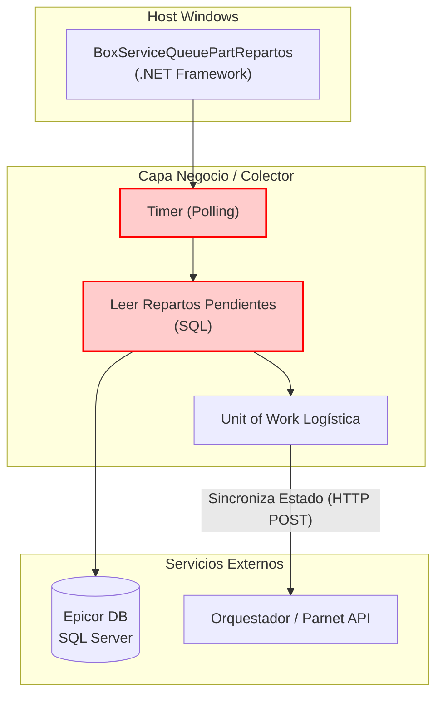

=============================================================================
### ARCHIVO 1: auditoria_codigo_buenas_practicas.md
=============================================================================

# INFORME DE AUDITORÍA TÉCNICA DE CÓDIGO Y BUENAS PRÁCTICAS
**Comité Consultor de Élite: Arquitectura Cloud-Native, DevSecOps y Ciberseguridad**
**Aplicación:** BoxServiceQueuePartRepartos (DataCollector)

---

## 1.1 RESUMEN EJECUTIVO DE LA BASE DE CÓDIGO

La aplicación **BoxServiceQueuePartRepartos** actúa como recolector de información y sincronizador del estatus de los repartos físicos y embarques. El análisis de su código fuente revela problemas de redundancia con `SrvRepartosAgent` y acoplamiento severo a temporizadores de bajo nivel y base de datos relacional síncrona.

*   **Puntuación Global Estimada (Score):** **35 / 100**
*   **Estado General:** **Crítico.** Al procesar operaciones logísticas que cambian constantemente, la falta de manejo de transacciones atómicas distribuidas expone al sistema a inconsistencias de stock en sucursales en caso de timeouts de HTTP o caídas de base de datos intermitentes.

⚠️ **Información no proporcionada en la entrada:**
1. Reglas lógicas del negocio para reconciliación en caso de fallas transaccionales parciales.
2. Nivel de carga de envíos concurrente esperada para calibrar el Throttling de la API destino.

---

## 1.2 DIAGRAMA DE ARQUITECTURA, FLUJO Y CONEXIONES EXTERNAS (MERMAID)

---

## 1.3 MATRIZ DE PUNTUACIÓN DE DESARROLLO (SCORECARD)

| Aspecto Evaluado | Puntuación (1-5) | Estado | Diagnóstico Puntual |
| :--- | :---: | :--- | :--- |
| **Arquitectura de Software** | 1 | Crítico | Acoplado al SCM y sin separación clara de servicios distributivos. |
| **Ciberseguridad en Código** | 1 | Crítico | Secretos de conexión y autenticación en archivos XML planos. |
| **Patrones de Diseño** | 2 | Crítico | Instanciaciones directas vía `new` que rompen la modularidad. |
| **Principios SOLID** | 2 | Crítico | Violaciones reiteradas del DIP y SRP. |
| **Clean Code y Modularidad** | 2 | Crítico | Código de bucle ineficiente con re-lecturas redundantes de base de datos. |

---

## 1.4 ANÁLISIS CRÍTICO DETALLADO POR ASPECTO

### A. Ausencia de Transaccionalidad Robusta
El agente recolecta registros y los procesa uno a uno o en lotes, enviándolos al orquestador. Si el envío es exitoso, actualiza el estatus. Sin embargo, no se implementa un patrón de reintento transaccional atómico ni de compensación asíncrona, lo que puede provocar que un reparto aparezca como enviado en Epicor pero no se registre en Parnet.

### B. "Sync-over-Async" en Peticiones Externas
Forzar un `Task.WaitAll` o ejecutar lógica asíncrona dentro de una envoltura de `ThreadPool` o `Task.Run` despoja al CLR de su capacidad para liberar hilos eficientemente. Bajo presión, esto causará demoras graves en el procesamiento.

---

## 1.5 SECCIÓN DE RECOMENDACIONES CRÍTICAS Y PLAN DE REMEDIACIÓN

### P0 - Crítico: Centralización de Red y Secretos
1. **Migrar a .NET 8 Worker Service:** Reestructurar para eliminar el acoplamiento a Windows `ServiceBase` y posibilitar la contenerización en Linux.
2. **Implementar Patrón Saga o Compensación:** Agregar lógica para asegurar que el cambio de estatus de reparto ocurra de manera atómica de extremo a extremo.

### P1 - Alto: Desacople de Telemetría
1. **ILogger de Microsoft:** Migrar el log local hacia salida estándar para recolectar métricas transparentes en Kubernetes.
---

## 1.6 AUDITORÍA DEVSECOPS Y CIBERSEGURIDAD (OWASP Top 10)

Como parte de la evaluación de seguridad integral del Comité Consultor, se han identificado brechas críticas transversales que deben remediarse obligatoriamente para cumplir con normativas corporativas:

### A. Exposición de Secretos y Credenciales (OWASP A02:2021)
*   **Riesgo:** El almacenamiento de credenciales de base de datos, contraseñas y llaves de API (ej. XApiKey) dentro de archivos estáticos como App.config permite a cualquier usuario con acceso al servidor o repositorio comprometer el ecosistema completo.
*   **Remediación:** Migrar hacia un modelo de **Inyección de Secretos** utilizando variables de entorno en contenedores o bóvedas de grado empresarial como Azure Key Vault / HashiCorp Vault.

### B. Transmisión Insegura de Datos en Red (OWASP A02:2021)
*   **Riesgo:** Las integraciones contra los orquestadores y bases de datos locales suelen viajar a través de canales no encriptados (HTTP plano).
*   **Remediación:** Imponer políticas estrictas de cifrado forzando el uso de HTTPS (TLS 1.2 o TLS 1.3) en las llamadas de HttpClient y las conexiones a bases de datos.

### C. Vulnerabilidad ante Denegación de Servicio (DoS) Interno
*   **Riesgo:** El diseño de hilos sin límite estricto y temporizadores bloqueantes agota los recursos (CPU/RAM/Sockets) del contenedor o servidor host.
*   **Remediación:** Implementar SemaphoreSlim para acotar la concurrencia, y configurar límites estrictos de recursos (limits y 
eservations) en los orquestadores de Docker/Kubernetes.
