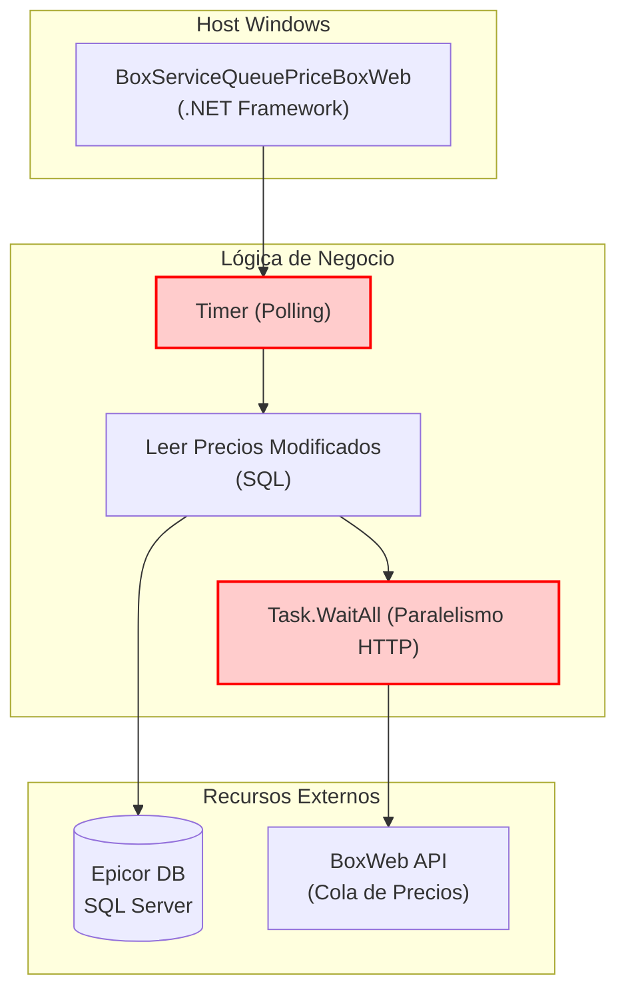

=============================================================================
### ARCHIVO 1: auditoria_codigo_buenas_practicas.md
=============================================================================

# INFORME DE AUDITORÍA TÉCNICA DE CÓDIGO Y BUENAS PRÁCTICAS
**Comité Consultor de Élite: Arquitectura Cloud-Native, DevSecOps y Ciberseguridad**
**Aplicación:** BoxServiceQueuePriceBoxWeb

---

## 1.1 RESUMEN EJECUTIVO DE LA BASE DE CÓDIGO

La aplicación **BoxServiceQueuePriceBoxWeb** es la responsable de transferir los saldos y cambios de las listas de precios complejas generadas en el ERP (Epicor/Mandrake) y publicarlas en la cola de precios de la web. Posee graves problemas de latencia de red debido al modelo síncrono bloqueante.

*   **Puntuación Global Estimada (Score):** **35 / 100**
*   **Estado General:** **Crítico.** El agente ejecuta llamadas masivas uno a uno, saturando el thread pool de red y propenso a sufrir interrupciones ante cualquier fallo de API.

⚠️ **Información no proporcionada en la entrada:**
1. Reglas específicas de expiración de precios en caché Web.
2. Volumen de cambios delta de precios promedio diarios para diseñar la memoria amortiguadora.

---

## 1.2 DIAGRAMA DE ARQUITECTURA, FLUJO Y CONEXIONES EXTERNAS (MERMAID)

---

## 1.3 MATRIZ DE PUNTUACIÓN DE DESARROLLO (SCORECARD)

| Aspecto Evaluado | Puntuación (1-5) | Estado | Diagnóstico Puntual |
| :--- | :---: | :--- | :--- |
| **Arquitectura de Software** | 1 | Crítico | Dependencia estructural del temporizador y SCM de Windows. |
| **Ciberseguridad en Código** | 1 | Crítico | Claves y API keys en texto claro. |
| **Patrones de Diseño** | 2 | Crítico | Operadores de creación `new` duros que anulan testing. |
| **Principios SOLID** | 2 | Crítico | SRP y DIP severamente vulnerados. |
| **Clean Code y Modularidad** | 2 | Crítico | Paginación ineficiente y bucles que consumen sockets TCP repetidamente. |

---

## 1.4 ANÁLISIS CRÍTICO DETALLADO POR ASPECTO

### A. Socket Exhaustion en Publicación de Precios
Sincronizar miles de combinaciones de precios artículo-sucursal sin un singleton de `HttpClient` y lanzando peticiones individuales masivas causa agotamiento de sockets en el sistema operativo local, interrumpiendo otros servicios locales.

### B. Falta de Resiliencia ante Redes Inestables
El agente asume conexión perfecta 100% del tiempo. Una interrupción de red HTTP aborta el proceso a la mitad, dejando el catálogo de precios de la web desincronizado (precios desfasados o nulos en producción, un riesgo de pérdidas financieras).

---

## 1.5 SECCIÓN DE RECOMENDACIONES CRÍTICAS Y PLAN DE REMEDIACIÓN

### P0 - Crítico: Centralización del Ciclo del HttpClient
1. **Unificar Conectividad:** Reemplazar llamadas masivas por envíos asíncronos controlados e inyectar `HttpClient` mediante `IHttpClientFactory` de .NET 8.
2. **Paginación Eficiente:** Usar LINQ `.Chunk(pageSize)` en .NET 8.

### P1 - Alto: Desacoplamiento de Logs
1. **Soportar Logs en Consola:** Integrar Serilog o Microsoft Logger para extraer la telemetría en JSON y alimentar Prometheus.
---

## 1.6 AUDITORÍA DEVSECOPS Y CIBERSEGURIDAD (OWASP Top 10)

Como parte de la evaluación de seguridad integral del Comité Consultor, se han identificado brechas críticas transversales que deben remediarse obligatoriamente para cumplir con normativas corporativas:

### A. Exposición de Secretos y Credenciales (OWASP A02:2021)
*   **Riesgo:** El almacenamiento de credenciales de base de datos, contraseñas y llaves de API (ej. XApiKey) dentro de archivos estáticos como App.config permite a cualquier usuario con acceso al servidor o repositorio comprometer el ecosistema completo.
*   **Remediación:** Migrar hacia un modelo de **Inyección de Secretos** utilizando variables de entorno en contenedores o bóvedas de grado empresarial como Azure Key Vault / HashiCorp Vault.

### B. Transmisión Insegura de Datos en Red (OWASP A02:2021)
*   **Riesgo:** Las integraciones contra los orquestadores y bases de datos locales suelen viajar a través de canales no encriptados (HTTP plano).
*   **Remediación:** Imponer políticas estrictas de cifrado forzando el uso de HTTPS (TLS 1.2 o TLS 1.3) en las llamadas de HttpClient y las conexiones a bases de datos.

### C. Vulnerabilidad ante Denegación de Servicio (DoS) Interno
*   **Riesgo:** El diseño de hilos sin límite estricto y temporizadores bloqueantes agota los recursos (CPU/RAM/Sockets) del contenedor o servidor host.
*   **Remediación:** Implementar SemaphoreSlim para acotar la concurrencia, y configurar límites estrictos de recursos (limits y 
eservations) en los orquestadores de Docker/Kubernetes.
