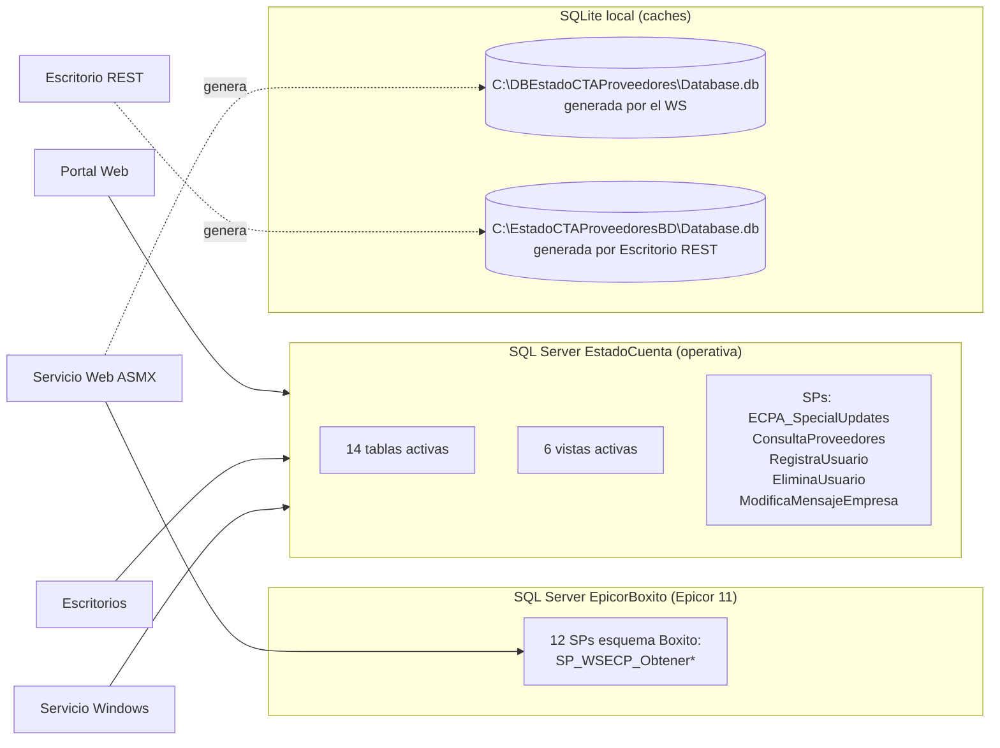

# Auditoría de Base de Datos — EstadoCuentaProveedores

> **Objetivo:** Inventariar servidores, BDs, procedimientos almacenados, tablas, vistas y funciones referenciados por el código del branch `DEV.VELA`.
> **Método:** Extracción estática desde el código fuente (queries, SPs, `Constants`, DAOs, configuraciones, TableAdapters). No se ejecutó código ni se consultaron BDs en vivo.
> **Política de redacción:** Se reportan solo **nombres de servidor/instancia y nombres de BD**. **Usuarios y contraseñas están redactados** (`[REDACTADO]`); la lista de ubicaciones exactas está en `AUDITORIA_TECNICA.md` §4.
> **Fecha:** 2026-08-10
> **Author:** BxBotYP 
---

## 1. Resumen

El sistema consume **2 bases SQL Server** y genera **2 bases SQLite locales**:

| BD | Rol | Servidores conocidos | Consumidores |
|----|-----|----------------------|--------------|
| **EpicorBoxito** | Fuente de verdad (Epicor 11) — solo lectura | GRANJA / DEV | Servicio Web (ASMX) |
| **EstadoCuenta** | BD operativa del portal — lectura/escritura | GRANJA / DEV | Portal Web, Escritorio SOAP, Escritorio REST, Servicio Windows |
| **LealtadB0x_EdoCta** (comentada) | Referencia histórica/externa | Externo | — (solo comentarios) |
| **SQLite local (2 archivos)** | Cache/descarga para consulta offline | Localhost | Servicio Web, Escritorio REST |

**Totales inventariados desde código:**

| Objeto | Cantidad | Nota |
|--------|----------|------|
| Procedimientos almacenados | **16 confirmados + 1 referenciado-faltante** | 12 en `EpicorBoxito` (esquema `Boxito`) + 4-5 en `EstadoCuenta` |
| Tablas (nombres citados) | **14 activas + 5 solo en comentarios** | BD `EstadoCuenta` |
| Vistas (nombres citados) | **6 activas + 2 solo en comentarios** | BD `EstadoCuenta` |
| Funciones (T-SQL) | **0** | Sin referencias en el código |

---

## 2. Topología



---

## 3. Inventario de conexiones

> Solo identificadores de servidor/instancia + BD. Credenciales redactadas.

| # | Componente | Nombre de clave | Servidor/Instancia | BD | Estado |
|---|-----------|-----------------|--------------------|----|--------|
| 1 | Servicio Web | `epicor11db` | GRANJA (ver §4 de AUDITORIA_TECNICA) | **EpicorBoxito** | **Activa** |
| 2 | Servicio Web | `epicor11db` (DEV) | DEV | EpicorBoxito | Comentada |
| 3 | Servicio Web | — | `C:\DBEstadoCTAProveedores` (ruta local `tmppath`) | **SQLite: Database.db** | Activa |
| 4 | Portal Web | `ECP` | GRANJA | **EstadoCuenta** | **Activa** |
| 5 | Portal Web | `ConnectionString` | DEV (`192.168.10.208`) | EstadoCuenta | Activa |
| 6 | Portal Web | `EstadoCuentaConnectionString` | DEV | EstadoCuenta | Activa |
| 7 | Portal Web | — | Externo (`188.121.44.212`) | LealtadB0x_EdoCta | Comentada |
| 8 | Escritorio SOAP | `estadocuenta` | DEV (`192.168.10.208`) | **EstadoCuenta** | **Activa** |
| 9 | Escritorio SOAP | — | DEV (`CMSAS12TS01\MSSQLSERVER12`) | EstadoCuenta | Comentada |
| 10 | Escritorio REST | `estadocuenta` | DEV (`192.168.10.208`) | **EstadoCuenta** | **Activa** |
| 11 | Escritorio REST | `path`/`pathFile` | `C:\EstadoCTAProveedoresBD` | **SQLite: Database.db** | Activa |
| 12 | Servicio Windows | `estadocuenta` | DEV (`192.168.10.208`) | EstadoCuenta | Comentada (secretos externos) |

---

## 4. Procedimientos almacenados

### 4.1 BD `EpicorBoxito` — esquema `Boxito` (consumidos por el Servicio Web ASMX)

Definidos en `Servicio Web/WSEstadoCuenta/Data/Constants.cs:8-33`:

| # | SP | WebMethod que lo usa |
|---|----|----------------------|
| 1 | `Boxito.SP_WSECP_ObtenerCuentaBancariaProveedor` | `CuentaBancariaProveedor` |
| 2 | `Boxito.SP_WSECP_ObtenerProveedor` | `Proveedor` |
| 3 | `Boxito.SP_WSECP_ObtenerFactura` | `Factura` |
| 4 | `Boxito.SP_WSECP_ObtenerPagoEncabezado` | `PagoEncabezado` |
| 5 | `Boxito.SP_WSECP_ObtenerPagoDetalle` | `PagoDetalle` |
| 6 | `Boxito.SP_WSECP_ObtenerFacturaAjuste` | `FacturaAjuste` |
| 7 | `Boxito.SP_WSECP_ObtenerFacturaNoProgramada` | `FacturaNoProgramada` |
| 8 | `Boxito.SP_WSECP_ObtenerPagoNotaCredito` | `PagoNotaCredito` |
| 9 | `Boxito.SP_WSECP_ObtenerDescuento` | `Descuento` |
| 10 | `Boxito.SP_WSECP_ObtenerPromesaPago` | `PromesaPago` |
| 11 | `Boxito.SP_WSECP_ObtenerCondicionPago` | `CondicionPago` |
| 12 | `Boxito.SP_WSECP_ObtenerFacturasSinEntradas` | `FacturasSinEntradas` |

**⚠️ Referenciado pero NO definido en el código:** `Constants.EstadoCuentaCompletoPROC` (usado en `Epicor11DA.cs:120` por el WebMethod `EstadoCuentaCompleto`). **El SP no existe en este branch** → falta de inventario y error de compilación (ver AUDITORIA_TECNICA C5).

### 4.2 BD `EstadoCuenta`

| # | SP | Consumidor | Archivo:Línea |
|---|----|-----------|----------------|
| 1 | `ECPA_SpecialUpdates` | Escritorio SOAP (después del bulk copy) | `AgenteEstadoCuenta/Data/EstadoCuentaDA.cs:670` |
| 2 | `ConsultaProveedores` | Portal — ProveedorBO | `Sitio Web/DAO/ProveedorDAO.cs:72,142` |
| 3 | `RegistraUsuario` | Portal — alta de usuarios | `Sitio Web/DAO/UsuarioDAO.cs:97` |
| 4 | `EliminaUsuario` | Portal — baja de usuarios | `Sitio Web/DAO/UsuarioDAO.cs:124` |
| 5 | `ModificaMensajeEmpresa` | Portal — mensajes de empresa | `Sitio Web/DAO/MensajeEmpresaDAO.cs:79` |

---

## 5. Tablas (BD `EstadoCuenta`)

### 5.1 Activas (14) — referencias verificadas

| # | Tabla | Consumidor / consulta de ejemplo |
|---|-------|----------------------------------|
| 1 | `Proveedor` | Portal (joins en todos los DAOs), Escritorio SOAP (truncate+bulk), WS |
| 2 | `CuentaBancariaProveedor` | Escritorio SOAP (truncate+bulk), WS |
| 3 | `Factura` | Escritorio SOAP, WS |
| 4 | `PagoEncabezado` | Escritorio SOAP, WS |
| 5 | `PagoDetalle` | Escritorio SOAP, WS |
| 6 | `FacturaAjuste` | Escritorio SOAP, WS |
| 7 | `FacturaNoProgramada` | Portal `FacturaNoProgramadaDAO.cs:47`, Escritorio SOAP, WS |
| 8 | `PagoNotaCredito` | Portal `PagoNotaCreditoDAO.cs:58`, WS |
| 9 | `Descuento` | Portal (join en `DescuentoDAO`), Escritorio SOAP, WS |
| 10 | `PromesaPago` | Escritorio SOAP, WS |
| 11 | `CondicionPago` | Escritorio SOAP, WS |
| 12 | `FacturasSinEntrada` | Portal `FacturasSinEntradaDAO.cs:43` (columnas: Folio, RFCEmisor, ClaveProveedor, ImporteIva, SubTotal, Descuento, Total, Moneda, UUID, Fecha), Escritorio SOAP, WS |
| 13 | `MensajeEmpresa` | Portal `MensajeEmpresaDAO.cs:50` (columna Mensaje) |
| 14 | `UsuarioNet` | Portal `UsuarioDAO.cs:56`, `ContraseniaDAO.cs:64,75` (columnas: UsuarioID, Password, CuentaPrincipal, Nombre, FechaCambio) |

> **⚠️ Typos / inconsistencias detectadas:**
> - `Escritorio/AgenteEstadoCuenta/Data/EstadoCuentaDA.cs:455` inserta en `PagoNOtaCredito` (con "NO" en mayúsculas) mientras que en la línea 31 borra `PagoNotaCredito` → probable error de runtime.
> - El WS `SqliteDB.cs` crea tablas SQLite con nombres derivados de DataTables que deben limpiarse (`CleanTableNames`); el nombre físico depende del DataTable devuelto por cada SP.

### 5.2 Solo en comentarios / histórico (5)

| Tabla | Dónde aparece |
|-------|---------------|
| `Usuario` | Comentada en `ContraseniaDAO.cs:63,76` (tabla antigua reemplazada por `UsuarioNet`) |
| `Articulo` | Comentada en queries de `PendientePagoDAO` |
| `CausaRechazo` | Comentada en queries de `PendientePagoDAO` |
| `CuentaProv` | Comentada en queries de `PendientePagoDAO` |
| `PendientePago` | Comentada (reemplazada por vistas `view_PendientePago*`) |

---

## 6. Vistas (BD `EstadoCuenta`)

### 6.1 Activas (6)

| # | Vista | Consumidor / archivo:línea |
|---|-------|---------------------------|
| 1 | `vw_Factura` | Portal `FacturaDAO.cs:54`; TableAdapter `dsEstadoCuenta.xsd` (`select * from vw_Factura`) |
| 2 | `vwConsultaDescuento` | Portal `DescuentoDAO.cs:59` |
| 3 | `vw_DetallePago` | Portal `DetallePagoDAO.cs:54` |
| 4 | `vw_FacturaAjuste` | Portal `FacturaAjusteDAO.cs:54` |
| 5 | `vw_ConsultaNotiPago` | Portal `NotiPagoDAO.cs:64,116` (columna Beneficiario) |
| 6 | `view_PendientePago` | Portal `PendientePagoDAO.cs:57,107` (columnas: VendorNum, VendorID, Name, ImportePagar) |

### 6.2 Solo en comentarios (2)

| Vista | Dónde aparece |
|-------|---------------|
| `view_PendientePago2` | Comentada en `PendientePagoDAO.cs` |
| `vw_ConsultaProveedor` | Comentada en `ProveedorDAO.cs:66,234` (columnas: VendorID, taxPayerID/RFC, Company, VerPortal) |

---

## 7. Funciones (T-SQL)

**Ninguna función definida ni referenciada en el código auditado.**

---

## 8. Bases SQLite locales

| # | Archivo | Generada por | Uso | Ubicación en código |
|---|---------|--------------|-----|----------------------|
| 1 | `C:\DBEstadoCTAProveedores\Database.db` | Servicio Web (`SqliteDB.cs`) | Cache de datos consultados por el WS (se borra y recrea en cada `createDB`) | `WSEstadoCuenta/Web.config:12` (`tmppath`) |
| 2 | `C:\EstadoCTAProveedoresBD\Database.db` | Escritorio REST (`EstadosCuentaBD.cs`) | Persistencia local de la descarga REST | `App.config:14-15` (`path`/`pathFile`) |

**Notas de riesgo:**
- `SqliteDB.cs:216` construye `PRAGMA table_info('" + table + "')` por concatenación (nombres provienen de DataTables internos, riesgo bajo pero frágil).
- `createDB` (borra + recrea + llena) sin mecanismo de respaldo ni versionado de esquema.
- No hay migraciones ni control de esquema para ninguna BD (ni SQL Server ni SQLite) — el esquema está implícito en el código y en scripts no versionados.

---

## 9. Riesgos y recomendaciones sobre datos

| # | Riesgo | Detalle | Acción sugerida |
|---|--------|---------|-----------------|
| 1 | **Credenciales expuestas** | Cadenas con `sa` en configs activas y comentadas (17 ubicaciones) | Rotar credenciales; usar cuentas con mínimos privilegios; secretos fuera del repo |
| 2 | **SQL injection en 14 DAOs** | Concatenación de entrada de usuario en SELECT/UPDATE/exec | Parametrizar todo; prohibir `exec` dinámico |
| 3 | **Contraseñas en texto plano** | Tablas `UsuarioNet`/`Usuario` con comparación directa | Hash (PBKDF2/BCrypt); migrar esquema |
| 4 | **SP faltante** | `EstadoCuentaCompletoPROC` no existe en el branch | Crearlo en `EpicorBoxito` y registrarlo en `Constants.cs` |
| 5 | **Full reload destructivo** | DELETE masivo + bulk insert en cada ciclo (escritorios) | Sincronización incremental (upsert por clave, timestamps) |
| 6 | **Esquema no versionado** | Sin scripts DDL en el repo; esquema solo implícito en código | Crear migraciones versionadas (ej. Flyway/EF Migrations) |
| 7 | **Sin integridad definida en código** | FKs solo implícitas en los JOINs (VendorNum, Beneficiario, etc.) | Documentar modelo lógico; validar índices de los JOINs |

---

## 10. Comandos de diagnóstico (para validar contra el entorno real)

> Ejecutar con un usuario con permisos de lectura sobre ambas BDs. **No usar `sa` desde aplicaciones.**

```sql
-- Inventario real de SPs en EpicorBoxito (esquema Boxito)
USE EpicorBoxito;
SELECT s.name AS [Esquema], p.name AS [SP]
FROM sys.procedures p
JOIN sys.schemas s ON p.schema_id = s.schema_id
WHERE s.name = 'Boxito' AND p.name LIKE 'SP_WSECP%'
ORDER BY p.name;

-- Verificar existencia del SP faltante
SELECT OBJECT_ID('dbo.EstadoCuentaCompletoPROC', 'P') AS EstadoCuentaCompletoPROC;

-- Inventario de tablas y vistas en EstadoCuenta (sin datos)
USE EstadoCuenta;
SELECT TABLE_SCHEMA, TABLE_NAME, TABLE_TYPE FROM INFORMATION_SCHEMA.TABLES
WHERE TABLE_TYPE IN ('BASE TABLE','VIEW')
ORDER BY TABLE_TYPE, TABLE_NAME;

-- SPs en EstadoCuenta
SELECT name FROM sys.objects WHERE type = 'P' ORDER BY name;
```
