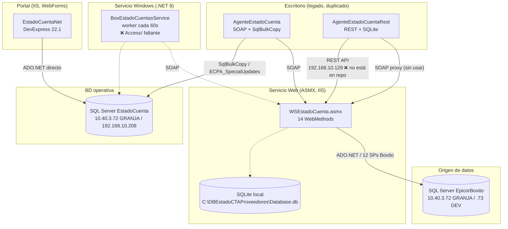

# Auditoría Técnica — EstadoCuentaProveedores

> **Objetivo:** Auditoría estática (read-only) del branch `DEV.VELA` para inventariar arquitectura, identificar riesgos técnicos/de seguridad y evaluar viabilidad de microservicios.
> **Alcance:** Todo el árbol `1 Codigo Fuente` (5 soluciones .NET + carpeta `Movil`).
> **Método:** Revisión de fuentes, configuraciones, binarios, logs y metadatos de proyecto. No se modificó código.
> **Fecha:** 2026-08-10
> **Author:** BxBotYP 

---

## 1. Resumen ejecutivo

El sistema **EstadoCuentaProveedores** sincroniza información financiera de proveedores desde **Epicor 11** (BD `EpicorBoxito`) hacia una BD operativa `EstadoCuenta`, y la expone a proveedores vía un portal web. El pipeline real en producción mezcla 5 componentes: portal WebForms, servicio web ASMX, un worker .NET 8 y **dos** agentes de escritorio (SOAP y REST) que hacen lo mismo (legado duplicado).

### Hallazgos principales

| # | Hallazgo | Severidad | Ubicación principal |
|---|----------|-----------|---------------------|
| C1 | **SQL injection sistémico** en la capa DAO del portal (20+ consultas concatenadas) | 🔴 Crítico | `Sitio Web/EstadoCuentaNet/DAO/*.cs` |
| C2 | **Credenciales hardcodeadas** (~17 ubicaciones, activas y comentadas) | 🔴 Crítico | `*.config`, `appsettings.json`, `Conexion.cs` |
| C3 | **Contraseñas en texto plano** comparadas con `=` en SQL | 🔴 Crítico | `UsuarioDAO.cs`, `ContraseniaDAO.cs` |
| C4 | **Drift de contrato SOAP** (WSDL embebido ≠ Reference.cs ≠ ASMX actual) | 🔴 Crítico | `Connected Services/*`, `EstadoCuenta.asmx.cs` |
| C5 | **Repo incompleto: el Servicio Windows no compila** (falta `Access/`) y el WS referencia un SP inexistente | 🔴 Crítico | `Servicio Windows/BoxEstadoCuentasService/` |
| C9 | **Master page `Cliente.Master` no versionado** (9 páginas del portal dependen de él) | 🔴 Crítico | `Sitio Web/EstadoCuentaNet/EstadoCuentaNet/GUI/*.aspx` |
| A1 | Servicio web ASMX sin autenticación + protocolos HTTP GET/POST habilitados | 🟠 Alto | `WSEstadoCuenta/Web.config:26-31` |
| A2 | `Thread.Abort()` para detener agentes; hilos sin coordinación | 🟠 Alto | `AgentController.cs:39` |
| A3 | Sincronización *full reload* (DELETE+INSERT masivo) sin control de errores por tabla | 🟠 Alto | `EstadoCuentaDA.cs:24-35` |
| A4 | Duplicación total de lógica entre 2 aplicaciones de escritorio | 🟠 Alto | `Escritorio/AgenteEstadoCuenta*` |
| A5 | Logs con rutas/usuario de servidor + `customErrors Off` + `debug=true` | 🟠 Alto | `logs/*.log`, `Web.config` |
| A6 | Paginación sin validación en el WS (`pagina`, `registrosPorPagina`) | 🟠 Alto | `EstadoCuenta.asmx.cs` |
| A7 | Autenticación Forms sin HTTPS, sesión `InProc` timeout 60 | 🟠 Alto | `Web.config` del sitio |
| A8 | Sin pruebas, sin CI/CD, sin Docker; artefactos de build versionados | 🟠 Alto | Repositorio completo |
| M1-M7 | Deuda técnica: `throw ex`, EF sin uso, mensajes WCF ilimitados, código muerto, logging incompleto | 🟡 Medio | Varios |

---

## 2. Inventario de componentes

| # | Componente | Stack | .NET | Rol |
|---|-----------|-------|------|-----|
| 1 | **EstadoCuentaNet** (Sitio Web) | ASP.NET WebForms + DevExpress 22.1 | .NET Framework 4.5.2 | Portal de proveedores: login, estado de cuenta, facturas, promesas de pago, pagos, descuentos, mensajes |
| 2 | **WSEstadoCuenta** (Servicio Web) | ASMX + Newtonsoft.Json 13 + ADO.NET + SQLite | .NET Framework 4.7.2 | Expone datos de Epicor 11 en JSON/DataSet; genera BD SQLite local |
| 3 | **BoxEstadoCuentasService** (Servicio Windows) | Worker Service + WCF + Serilog + Microsoft.Data.SqlClient 6 | .NET 8 | Sincronizador periódico (12 servicios), **código de `Access/` faltante** |
| 4 | **AgenteEstadoCuenta** (Escritorio SOAP) | WinForms + WCF proxy + SqlBulkCopy | .NET Framework 4.7.2 | Agente legacy que copia WS → SQL Server |
| 5 | **AgenteEstadoCuentaRest** (Escritorio REST) | WinForms + RestSharp 110 + SQLite | .NET Framework 4.7.2 | Variante del agente que persiste en SQLite local |
| 6 | **Movil** | — | — | **Carpeta vacía** (sin implementación en el repo) |

> **Nota:** el REST API `http://192.168.10.129/WSEstadoCuenta/api/` al que apunta `AgenteEstadoCuentaRest` **no existe en este repositorio** — solo existe el ASMX. Es un componente desplegado externamente sin código fuente en el branch.

### Arquitectura de comunicaciones


**Nota sobre el tráfico:** todas las comunicaciones SOAP/REST son **HTTP sin TLS** (endpoints `http://...` en App.config y appsettings).

---

## 3. Hallazgos detallados

### 🔴 C1 — SQL injection sistémico en el portal (EstadoCuentaNet)

La capa DAO construye SQL por **concatenación directa de entrada de usuario** (`CadenaWhere`) en lugar de parámetros. Sin sanitización ni `ValidateRequest` visible.

| Archivo | Líneas | Consulta afectada |
|---------|--------|-------------------|
| `DAO/UsuarioDAO.cs` | 38, 43, 48, 56 | Login (`UsuarioID`, `Password`), consultas de usuario |
| `DAO/UsuarioDAO.cs` | 97, 124 | `exec RegistraUsuario`, `exec EliminaUsuario` |
| `DAO/ContraseniaDAO.cs` | 42, 47, 53, 75 | Cambio/consulta de contraseña |
| `DAO/MensajeEmpresaDAO.cs` | 50, 79 | `exec ModificaMensajeEmpresa` |
| `DAO/DescuentoDAO.cs` | 38, 44, 50, 59 | `vwConsultaDescuento` |
| `DAO/FacturaDAO.cs` | 34, 40, 46, 54 | `vw_Factura` |
| `DAO/DetallePagoDAO.cs` | 54 | `vw_DetallePago` |
| `DAO/FacturaAjusteDAO.cs` | 54 | `vw_FacturaAjuste` |
| `DAO/FacturaNoProgramadaDAO.cs` | 47 | tabla `FacturaNoProgramada` |
| `DAO/FacturasSinEntradaDAO.cs` | 43 | tabla `FacturasSinEntrada` |
| `DAO/NotiPagoDAO.cs` | 64, 116 | `vw_ConsultaNotiPago` |
| `DAO/PagoNotaCreditoDAO.cs` | 58 | `PagoNotaCredito` |
| `DAO/PendientePagoDAO.cs` | 57, 107 | `view_PendientePago`, `view_PendientePago2` |
| `DAO/ProveedorDAO.cs` | 73, 143, 176 | SP `ConsultaProveedores` y `vw_ConsultaProveedor` |

**Ejemplo patrón** (UsuarioDAO): `sql = "SELECT * FROM Usuario WHERE UsuarioID = '" + UsuarioID + "' AND Password = '" + Password + "'"`.

**Riesgo:** acceso no autorizado al portal, lectura/escritura de la BD operativa, y posible escalamiento a otras BDs si el login `sa` (usado en varias cadenas) tiene privilegios amplios.
**Mitigación urgente:** parametrizar todas las consultas (`SqlParameter`) o migrar a procedimientos almacenados; deshabilitar el login con `sa`.

### 🔴 C2 — Credenciales hardcodeadas en ~17 ubicaciones

Detalle completo en la [sección 4](#4-inventario-de-datos-sensibles). Incluye: conexiones **activas** con usuario `sa` y contraseña real en `Web.config` y `App.config`; credenciales en **comentarios** (igual de peligrosas si el repo se comparte); URLs de endpoints internos; y **contraseñas reales en comentarios de `appsettings.json`** del Servicio Windows.

### 🔴 C3 — Contraseñas en texto plano

- `UsuarioDAO.cs:48` — `"Password = '" + Password + "'"` (comparación directa en SQL, login).
- `ContraseniaDAO.cs:75` — actualiza la contraseña sin hash.
- `Registro.aspx.cs` — genera clave con `Random` (no criptográfico) y la persiste tal cual.

**Riesgo:** exposición total de credenciales de proveedores si se lee la tabla `Usuario` (posible vía C1). **Acción:** hash con PBKDF2/BCrypt, política de complejidad y rotación.

### 🔴 C4 — Drift de contrato SOAP (tres versiones incompatibles)

| Versión | Contenido |
|---------|-----------|
| `Connected Services/WSEstadoCuenta/EstadoCuenta.wsdl` | 10 operaciones, **sin parámetros** |
| `Connected Services/WSEstadoCuenta/Reference.cs` | 12 métodos sin parámetros (agrega `CondicionPago`, `FacturasSinEntradas`); **sin `ObtieneBD` ni `EstadoCuentaCompleto`** |
| `WSEstadoCuenta/EstadoCuenta.asmx.cs` | 14 métodos **con parámetros** `(int pagina, int registrosPorPagina)` |

El código del escritorio invoca `api.Proveedor()` (sin argumentos); el servicio actual exige 2 argumentos → **falla en runtime** si el agente apunta al servicio desplegado actual. El endpoint `http://10.40.3.18/WSEstadoCuentaProveedores/EstadoCuenta.asmx` corresponde a un IIS con nombre distinto al WSDL (`localhost/WSEstadoCuenta`).

### 🔴 C5 — Repositorio incompleto / no compila

- **Servicio Windows:** `Program.cs:32` registra `SoapClientFactory` (en `Access/`, **carpeta inexistente**); `Controllers/EstadosCuentasControllers.cs:13` usa `ISyncController` (también en `Access/`). El `bin/Debug/net8.0` no contiene los ensamblados de WCF ni SqlClient (build obsoleto). **El proyecto no compila desde este checkout.**
- **Servicio Web:** `Epicor11DA.cs:120` usa `Constants.EstadoCuentaCompletoPROC` que **no existe** en `Constants.cs` (solo 12 SPs). El método `EstadoCuentaCompleto()` tampoco está en el WSDL embebido.
- **REST API** referenciado (`UrlEstadoCuentaRest`) y **carpeta `Movil`**: no hay código en el branch.

### 🔴 C9 — Master page `Cliente.Master` no versionado

No existe ningún archivo `*.master` ni carpeta `MasterPage/` en todo el repositorio (`glob **/*.master` y `**/MasterPage/**` sin resultados). Sin embargo, **9 páginas del portal declaran `MasterPageFile="~/GUI/Cliente.Master"`** → si el master page no se despliega manualmente en el servidor junto con el código, esas páginas fallan al cargar (`HttpException`: master page no encontrado).

| Página (`Sitio Web/EstadoCuentaNet/EstadoCuentaNet/GUI/`) | MasterPageFile | Caso de uso (CASOS_DE_USO.md) |
|----------------------------------------------------------|----------------|-------------------------------|
| `PromesaPago.aspx` | `~/GUI/Cliente.Master` | CU-007 |
| `PromesaPagoDetalle.aspx` | `~/GUI/Cliente.Master` | CU-007 |
| `NotiPago.aspx` | `~/GUI/Cliente.Master` | CU-009 |
| `Descuento.aspx` | `~/GUI/Cliente.Master` | CU-008 |
| `NoProgramada.aspx` | `~/GUI/Cliente.Master` | CU-011 |
| `SinEntradas.aspx` | `~/GUI/Cliente.Master` | CU-012 |
| `CambioPassword.aspx` | `~/GUI/Cliente.Master` | CU-006 |
| `AplicacionNotaCredito.aspx` | `~/GUI/Cliente.Master` | CU-013 |
| `AvisoProvedor.aspx` | `~/GUI/Cliente.Master` | CU-016 |

**Impacto:** render roto / error en runtime en 9 de las 18 páginas del portal en un deploy estático del branch, incluidas las más utilizadas por los proveedores (promesas de pago, notificaciones de pago, descuentos). Las 8 páginas restantes de `GUI/` y `default.aspx` no usan master page.

**Recomendación:** versionar el master page (`Cliente.Master` y su code-behind si existe) o extraer el layout compartido a un componente versionable; añadir una validación de deploy/CI que compruebe la existencia de todos los `MasterPageFile` referenciados por las páginas.

**Referencia cruzada:** documentado también en `CASOS_DE_USO.md` — nota de master page en la sección Sitio Web y fila de portal en la tabla de casos rotos/incompletos.

### 🟠 A1 — ASMX sin autenticación + HTTP GET/POST

`WSEstadoCuenta/Web.config:26-31` habilita `HttpGet` y `HttpPost` sobre métodos que devuelven datos financieros sin autenticar. El binding WCF efectivo (`EstadoCuentaSoap`, sin `<security>`) es HTTP plano.

### 🟠 A2 — `Thread.Abort()` y hilos frágiles

`Escritorio/.../AgentController.cs:39` usa `MainThread.Abort()` para detener; el ciclo `RepetitiveTask` hace `Thread.Sleep(1000)` con flags estáticos `Estado` no sincronizados (`ControladorRest.cs:14`, `EstadosCuentaBD.cs:5`). Riesgo de estados a medias y race conditions.

### 🟠 A3 — Sincronización full reload sin control por tabla

`EstadoCuentaDA.cs:24-35` elimina 12 tablas completas y las recarga con `SqlBulkCopy` en cada ciclo (1s de sleep). Una falla parcial deja datos incompletos; hay una transacción pero sin rollback granular por tabla ni reintentos. Además `EstadoCuentaDA.cs:455` inserta en `PagoNOtaCredito` (typo) mientras borra `PagoNotaCredito` (línea 31) → **posible excepción en runtime**.

### 🟠 A4 — Duplicación de código entre escritorios

`AgenteEstadoCuenta` y `AgenteEstadoCuentaRest` comparten ~90% de la lógica (DAO con bulk copy, constantes SQL, proxy). Mantenimiento duplicado; correcciones deben aplicarse dos veces.

### 🟠 A5 — Configuración insegura y logs sensibles

- Sitio: `Web.config` — `customErrors mode="Off"` (~línea 38), `compilation debug="true"` (~línea 40).
- WS: `Web.config:24` — `debug="true"`.
- `logs/service20251128.log` y `service20251209.log` revelan usuario de servidor (`cmcoadm`), rutas SVN completas (`C:\Users\cmcoadm\Desktop\SVN\BOX0039 - EstadoCuenta\branches\DEV.VELA\...`) y configuración activa (`Hosting environment: Development` en lo que debería ser producción).

### 🟠 A6 — Paginación sin validación en el WS

`EstadoCuenta.asmx.cs` calcula `offset = (pagina - 1) * registrosPorPagina` sin validar negativos ni límites → puede pedir páginas masivas a Epicor (riesgo de DoS por consumo).

### 🟠 A7 — Autenticación Forms débil

`Web.config` (sitio): Forms auth sin `requireSSL`, sesión `InProc` timeout 60. `Login.aspx.cs:39` autoriza por `Rows.Count > 0`; permisos de administrador por `Session["boxUsuarioTipo"]` manipulable. Claves generadas con `System.Random` (`Registro.aspx.cs`).

### 🟠 A8 — Sin pruebas, CI/CD ni contenedores

No hay proyectos de test, pipelines, Dockerfiles ni scripts de despliegue. Artefactos de build (`bin/`, `obj/`, `*.pdb`, `*.exe`) están versionados en SVN (ruta visible en logs). Sin documentación (`README`, ADRs, runbooks) en el repositorio.

### 🟡 M1 — `throw ex` (pierde stack trace)

`SqliteDB.cs:56`, `Epicor11DA.cs`, DAOs del portal. Reemplazar por `throw;`.

### 🟡 M2 — Paquetes no usados / versiones obsoletas

- Entity Framework 6.5.1 (WS) y 6.4.4 (REST) referenciados pero **todo el acceso es ADO.NET puro**.
- `.NET Framework 4.5.2` (sitio) y `4.7.2` (WS/escritorio) fuera de soporte.
- WCF en .NET 8 (`System.ServiceModel.*` 8.x) sin TLS.
- `targetFramework` inconsistente en WS: `Web.config:24` (4.7.2) vs `:25` (4.5.2).

### 🟡 M3 — Contratos de mensaje WCF sin límites

App.config de escritorio: `maxReceivedMessageSize = 2147483647`, `maxBufferSize = 2147483647`, `allowCookies="true"` — sin límites de mensaje ni compresión.

### 🟡 M4 — Código muerto / comentado

`SqlConstants.cs:5-22` (20 SELECTs comentados), `Epicor11DA.cs:15-48` (métodos SOAP comentados en la variante REST), `EstadosCuentaBD.cs` incompleto, `Movil/` vacía, `EstadoCuentaCompleto` sin implementación real completa.

### 🟡 M5 — Logging insuficiente

Servicio Windows: Serilog solo a consola (`Program.cs:11`); sinks de archivo/EventLog comentados. Escritorios: log en memoria (`List<string>`). Portal: sin logging.

### 🟡 M6 — SQLite dinámico sin validación de nombres

`SqliteDB.cs:216` — `PRAGMA table_info('" + table + "')` concatenado; `createDB` borra y recrea tablas con nombres derivados de DataTables (`CleanTableNames`).

### 🟡 M7 — Configuración de compilación mixta

`EstadoCuentaNet.csproj` (4.5.2) con DevExpress 22.1 (comentarios de v15.1); transformaciones `Web.Debug/Release.config` con credenciales.

---

## 4. Inventario de datos sensibles

> **Política de redacción:** se indica el *tipo* de dato y su ubicación (archivo:línea). **Ningún valor real se reproduce** — sustituido por `[REDACTADO]`.

| # | Componente | Archivo : Línea | Tipo de dato | Estado |
|---|-----------|-----------------|--------------|--------|
| 1 | Servicio Web | `WSEstadoCuenta/Web.config:37` | Cadena de conexión SQL Server a `EpicorBoxito` — servidor+usuario+contraseña | **Activa (GRANJA)** |
| 2 | Servicio Web | `WSEstadoCuenta/Web.config:35` | Ídem (DEV) | Comentada |
| 3 | Servicio Web | `WSEstadoCuenta/Web.config:39,41,43,45...` | Duplicados de conexión | Mixto activa/comentada |
| 4 | Servicio Web | `WSEstadoCuenta/Web.Release.config:5` | Conexión GRANJA (transform) | Activa |
| 5 | Servicio Web | `WSEstadoCuenta/Web.Debug.config:5` | Conexión DEV | Activa |
| 6 | Servicio Web | `WSEstadoCuenta/Web.config:12` | Ruta local `C:\DBEstadoCTAProveedores` | Activa |
| 7 | Sitio Web | `EstadoCuentaNet/Web.config:23` | Cadena `ECP` → `EstadoCuenta`, usuario `sa` | **Activa (GRANJA)** |
| 8 | Sitio Web | `EstadoCuentaNet/Web.config:24` | Cadena `ConnectionString` → `EstadoCuenta`, `sa` | **Activa** |
| 9 | Sitio Web | `EstadoCuentaNet/Web.config:25` | Cadena `EstadoCuentaConnectionString`, `sa` | **Activa** |
| 10 | Sitio Web | `EstadoCuentaNet/Web.config:26-27` | Conexión `LealtadB0x_EdoCta` (servidor externo) | Comentada |
| 11 | Sitio Web | `EstadoCuentaNet/DAO/Conexion.cs:15-16` | 2 cadenas con credenciales | Comentadas |
| 12 | Escritorio SOAP | `AgenteEstadoCuenta/App.config:5` | Cadena `estadocuenta` → `EstadoCuenta`, `sa` | **Activa** |
| 13 | Escritorio SOAP | `AgenteEstadoCuenta/App.config:4` | Cadena DEV (`CMSAS12TS01\MSSQLSERVER12`) | Comentada |
| 14 | Escritorio SOAP | `AgenteEstadoCuenta/App.config:13-14` | Endpoint SOAP interno (IP, HTTP) | **Activa** |
| 15 | Escritorio REST | `AgenteEstadoCuentaRest/App.config:11` | Cadena `estadocuenta`, `sa` | **Activa** |
| 16 | Escritorio REST | `AgenteEstadoCuentaRest/App.config:9` | Cadena DEV | Comentada |
| 17 | Escritorio REST | `AgenteEstadoCuentaRest/App.config:16` | URL API REST interna (IP) | **Activa** |
| 18 | Escritorio REST | `AgenteEstadoCuentaRest/App.config:23` | Endpoint SOAP interno (IP) | **Activa** |
| 19 | Servicio Windows | `BoxEstadoCuentasService/appsettings.json:3-4` | 2 cadenas de conexión **con contraseñas reales** | Comentadas |
| 20 | Servicio Windows | `BoxEstadoCuentasService/appsettings.json:7` | URL SOAP interna (IP) | **Activa** |
| 21 | Servicio Windows | `logs/service2025*.log` | Usuario de servidor, rutas SVN, entorno | Logs versionados |

**Recomendación:** mover todos los secretos a variables de entorno / Secret Manager / Key Vault, **rotar todas las credenciales expuestas** (asumen `sa`), y eliminar `bin/`, `obj/`, `logs/` del control de versiones.

---

## 5. Recomendaciones priorizadas

### 0–30 días (contención)
1. **Rotar todas las contraseñas** de las conexiones listadas en §4 y migrar a secretos externos.
2. **Parametrizar el login y las consultas críticas** del portal (C1/C3) — empezar por `UsuarioDAO` y `ContraseniaDAO`.
3. **Eliminar `HttpPost`/`HttpGet`** del ASMX y **forzar HTTPS** en ambos sitios IIS.
4. Deshabilitar `debug=true` y `customErrors Off` en producción.
5. Restaurar `Access/` faltante y corregir `Constants.EstadoCuentaCompletoPROC` (C5) para que el branch compile; añadir CI de build. **Versionar el master page `Cliente.Master` (C9)** para que el deploy estático del portal renderice sus 9 páginas dependientes.

### 30–90 días (normalización)
6. Unificar los 2 agentes de escritorio en el Servicio Windows .NET 8 (eliminar A4).
7. Reemplazar full reload por sincronización incremental con SPs de upsert (A3); corregir typo `PagoNOtaCredito`.
8. Regenerar el proxy WCF desde el WSDL vigente y versionar el contrato (C4).
9. Implementar hash de contraseñas (PBKDF2/BCrypt) y autenticación con claims.
10. Logging estructurado (Serilog a archivo con rotación) en portal y servicios; limpiar logs sensibles.

### >90 días (modernización)
11. Migrar el ASMX a **API REST .NET 8** (el candidato natural para microservicio de consulta); el Servicio Windows ya es el sincronizador — mantener como worker.
12. Contenerizar (Docker) servicio y API; añadir CI/CD (GitHub Actions/Azure DevOps) y proyectos de test.
13. Migrar el portal WebForms a .NET 8 + framework UI moderno si se desea desacoplar.
14. Definir ADRs (¿por qué REST y no SOAP? ¿por qué full reload?) y documentar el flujo de despliegue actual (IIS + SVN).

---

## 6. Cumplimiento y observaciones

| Área | Estado |
|------|--------|
| Pruebas automatizadas | ❌ Ninguna (0 proyectos de test en 5 soluciones) |
| CI/CD | ❌ Ninguno |
| Contenedores / infraestructura como código | ❌ Ninguno |
| Control de versiones | ⚠️ SVN (sin `.git`); artefactos de build y logs versionados |
| Documentación | ❌ Sin README, ADRs ni runbooks en el repo |
| Seguridad (OWASP top) | 🔴 SQLi, secretos, criptografía débil, transporte no cifrado, sesión insegura |
| Cumplimiento de stack | ⚠️ .NET Framework EOL; WCF en .NET 8 sin TLS |

---

## 7. Apéndice: verificación rápida de build (una vez restaurado el código)

```powershell
# Servicio Windows (.NET 8) — requiere restaurar Access/
dotnet restore "Servicio Windows/BoxEstadoCuentasService/BoxEstadoCuentasService.csproj"
dotnet build   "Servicio Windows/BoxEstadoCuentasService/BoxEstadoCuentasService.csproj"

# Servicio Web y Portal (MSBuild / VS2019-2022 con .NET Framework)
msbuild "Servicio Web/WSEstadoCuenta/WSEstadoCuenta.csproj" /t:Restore,Build
msbuild "Sitio Web/EstadoCuentaNet/EstadoCuentaNet.csproj"  /t:Restore,Build
```
