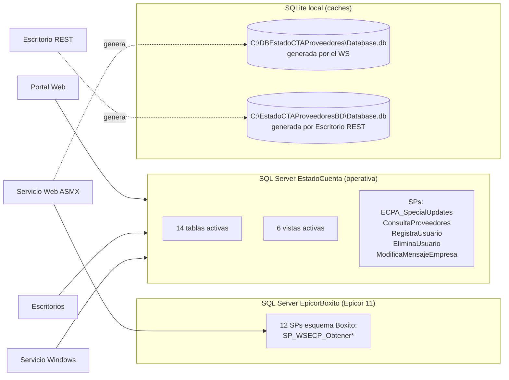

## Introducción
El sistema **EstadoCuentaProveedores** es una plataforma que sincroniza información financiera de proveedores desde el ERP Epicor 11 hacia una base de datos operativa. Este sistema expone los datos a los proveedores a través de un portal web e incluye múltiples componentes de sincronización (servicios Windows, servicios Web y agentes de escritorio). 

## Objetivo
Proveer una fuente única de verdad sobre la arquitectura, la topología de la base de datos y los casos de uso del sistema. Este documento permite a los desarrolladores comprender el estado actual del código (rama `DEV.VELA`), identificar riesgos críticos de seguridad y planificar tareas de normalización o modernización.

## Índice
* [Introducción](#introducción)
* [Objetivo](#objetivo)
* [Auditoría Técnica — EstadoCuentaProveedores](#auditoría-técnica-—-estadocuentaproveedores)
  * [1. Resumen ejecutivo](#1-resumen-ejecutivo)
  * [2. Inventario de componentes](#2-inventario-de-componentes)
  * [3. Hallazgos detallados](#3-hallazgos-detallados)
  * [4. Inventario de datos sensibles](#4-inventario-de-datos-sensibles)
  * [5. Recomendaciones priorizadas](#5-recomendaciones-priorizadas)
  * [6. Cumplimiento y observaciones](#6-cumplimiento-y-observaciones)
  * [7. Apéndice: verificación rápida de build](#7-apéndice-verificación-rápida-de-build-una-vez-restaurado-el-código)
* [Auditoría de Base de Datos — EstadoCuentaProveedores](#auditoría-de-base-de-datos-—-estadocuentaproveedores)
  * [1. Resumen](#1-resumen)
  * [2. Topología](#2-topología)
  * [3. Inventario de conexiones](#3-inventario-de-conexiones)
  * [4. Procedimientos almacenados](#4-procedimientos-almacenados)
  * [5. Tablas (BD EstadoCuenta)](#5-tablas-bd-estadocuenta)
  * [6. Vistas (BD EstadoCuenta)](#6-vistas-bd-estadocuenta)
  * [7. Funciones (T-SQL)](#7-funciones-t-sql)
  * [8. Bases SQLite locales](#8-bases-sqlite-locales)
  * [9. Riesgos y recomendaciones sobre datos](#9-riesgos-y-recomendaciones-sobre-datos)
  * [10. Comandos de diagnóstico](#10-comandos-de-diagnóstico-para-validar-contra-el-entorno-real)
* [Casos de Uso — EstadoCuentaProveedores](#casos-de-uso-—-estadocuentaproveedores)
  * [Índice de aplicaciones](#índice-de-aplicaciones)
  * [Sitio Web (EstadoCuentaNet / Portal WebForms)](#sitio-web-estadocuentanet--portal-webforms)
  * [Servicio Web (WSEstadoCuenta / ASMX)](#servicio-web-wseestadocuenta--asmx)
  * [Servicio Windows (BoxEstadoCuentasService)](#servicio-windows-boxestadocuentasservice)
  * [Escritorio (AgenteEstadoCuenta)](#escritorio-agenteestadocuenta)
  * [Escritorio REST (AgenteEstadoCuentaRest)](#escritorio-rest-agenteestadocuentarest)
  * [Móvil (Movil)](#móvil-movil)
  * [Casos de Uso Transversales / entre aplicaciones](#casos-de-uso-transversales--entre-aplicaciones)
  * [Resumen de casos de uso](#resumen-de-casos-de-uso)

---


## Auditoría Técnica — EstadoCuentaProveedores

> **Objetivo:** Auditoría estática (read-only) del branch `DEV.VELA` para inventariar arquitectura, identificar riesgos técnicos/de seguridad y evaluar viabilidad de microservicios.
> **Alcance:** Todo el árbol `1 Codigo Fuente` (5 soluciones .NET + carpeta `Movil`).
> **Método:** Revisión de fuentes, configuraciones, binarios, logs y metadatos de proyecto. No se modificó código.
> **Fecha:** 2026-08-10
> **Author:** BxBotYP 

---

### 1. Resumen ejecutivo

El sistema **EstadoCuentaProveedores** sincroniza información financiera de proveedores desde **Epicor 11** (BD `EpicorBoxito`) hacia una BD operativa `EstadoCuenta`, y la expone a proveedores vía un portal web. El pipeline real en producción mezcla 5 componentes: portal WebForms, servicio web ASMX, un worker .NET 8 y **dos** agentes de escritorio (SOAP y REST) que hacen lo mismo (legado duplicado).

#### Hallazgos principales

| # | Hallazgo | Severidad | Ubicación principal |
|---|----------|-----------|---------------------|
| C1 | **SQL injection sistémico** en la capa DAO del portal (20+ consultas concatenadas) | 🔴 Crítico | `Sitio Web/EstadoCuentaNet/DAO/*.cs` |
| C2 | **Credenciales hardcodeadas** (~17 ubicaciones, activas y comentadas) | 🔴 Crítico | `*.config`, `appsettings.json`, `Conexion.cs` |
| C3 | **Contraseñas en texto plano** comparadas con `=` en SQL | 🔴 Crítico | `UsuarioDAO.cs`, `ContraseniaDAO.cs` |
| C4 | **Drift de contrato SOAP** (WSDL embebido ≠ Reference.cs ≠ ASMX actual) | 🔴 Crítico | `Connected Services/*`, `EstadoCuenta.asmx.cs` |
| C5 | **Repo incompleto: el Servicio Windows no compila** (falta `Access/`) y el WS referencia un SP inexistente | 🔴 Crítico | `Servicio Windows/BoxEstadoCuentasService/` |
| C9 | **Master page `Cliente.Master` no versionado** (9 páginas del portal dependen de él) | 🔴 Crítico | `Sitio Web/EstadoCuentaNet/EstadoCuentaNet/GUI/*.aspx` |
| A1 | Servicio web ASMX sin autenticación + protocolos HTTP GET/POST habilitados | 🟠 Alto | `WSEstadoCuenta/Web.config:26-31` |
| A2 | `Thread.Abort()` para detener agentes; hilos sin coordinación | 🟠 Alto | `AgentController.cs:39` |
| A3 | Sincronización *full reload* (DELETE+INSERT masivo) sin control de errores por tabla | 🟠 Alto | `EstadoCuentaDA.cs:24-35` |
| A4 | Duplicación total de lógica entre 2 aplicaciones de escritorio | 🟠 Alto | `Escritorio/AgenteEstadoCuenta*` |
| A5 | Logs con rutas/usuario de servidor + `customErrors Off` + `debug=true` | 🟠 Alto | `logs/*.log`, `Web.config` |
| A6 | Paginación sin validación en el WS (`pagina`, `registrosPorPagina`) | 🟠 Alto | `EstadoCuenta.asmx.cs` |
| A7 | Autenticación Forms sin HTTPS, sesión `InProc` timeout 60 | 🟠 Alto | `Web.config` del sitio |
| A8 | Sin pruebas, sin CI/CD, sin Docker; artefactos de build versionados | 🟠 Alto | Repositorio completo |
| M1-M7 | Deuda técnica: `throw ex`, EF sin uso, mensajes WCF ilimitados, código muerto, logging incompleto | 🟡 Medio | Varios |

---

### 2. Inventario de componentes

| # | Componente | Stack | .NET | Rol |
|---|-----------|-------|------|-----|
| 1 | **EstadoCuentaNet** (Sitio Web) | ASP.NET WebForms + DevExpress 22.1 | .NET Framework 4.5.2 | Portal de proveedores: login, estado de cuenta, facturas, promesas de pago, pagos, descuentos, mensajes |
| 2 | **WSEstadoCuenta** (Servicio Web) | ASMX + Newtonsoft.Json 13 + ADO.NET + SQLite | .NET Framework 4.7.2 | Expone datos de Epicor 11 en JSON/DataSet; genera BD SQLite local |
| 3 | **BoxEstadoCuentasService** (Servicio Windows) | Worker Service + WCF + Serilog + Microsoft.Data.SqlClient 6 | .NET 8 | Sincronizador periódico (12 servicios), **código de `Access/` faltante** |
| 4 | **AgenteEstadoCuenta** (Escritorio SOAP) | WinForms + WCF proxy + SqlBulkCopy | .NET Framework 4.7.2 | Agente legacy que copia WS → SQL Server |
| 5 | **AgenteEstadoCuentaRest** (Escritorio REST) | WinForms + RestSharp 110 + SQLite | .NET Framework 4.7.2 | Variante del agente que persiste en SQLite local |
| 6 | **Movil** | — | — | **Carpeta vacía** (sin implementación en el repo) |

> **Nota:** el REST API `http://192.168.10.129/WSEstadoCuenta/api/` al que apunta `AgenteEstadoCuentaRest` **no existe en este repositorio** — solo existe el ASMX. Es un componente desplegado externamente sin código fuente en el branch.

#### Arquitectura de comunicaciones

```mermaid
flowchart TB
    subgraph ORIGEN["Origen de datos"]
        E11[(SQL Server EpicorBoxito<br/>10.40.3.72 GRANJA / .73 DEV)]
    end

    subgraph WSLayer["Servicio Web (ASMX, IIS)"]
        WS[WSEstadoCuenta.asmx<br/>14 WebMethods]
        SQLITE[(SQLite local<br/>C:\DBEstadoCTAProveedores\Database.db)]
        WS -->|ADO.NET / 12 SPs Boxito| E11
        WS -.-> SQLITE
    end

    subgraph SVC["Servicio Windows (.NET 8)"]
        SVCW[BoxEstadoCuentasService<br/>worker cada 60s<br/>❌ Access/ faltante]
        SVCW -. SOAP .-> WS
    end

    subgraph DESK["Escritorio (legado, duplicado)"]
        AG1[AgenteEstadoCuenta<br/>SOAP + SqlBulkCopy]
        AG2[AgenteEstadoCuentaRest<br/>REST + SQLite]
    end

    subgraph SITE["Portal (IIS, WebForms)"]
        ST[EstadoCuentaNet<br/>DevExpress 22.1]
    end

    subgraph SINK["BD operativa"]
        OP[(SQL Server EstadoCuenta<br/>10.40.3.72 GRANJA / 192.168.10.208)]
    end

    AG1 -->|SOAP| WS
    AG2 -->|SOAP proxy (sin usar)| WS
    AG2 -->|REST API<br/>192.168.10.129 ❌ no está en repo| WS
    AG1 -->|SqlBulkCopy / ECPA_SpecialUpdates| OP
    SVCW -.-> OP
    ST -->|ADO.NET directo| OP
```

**Nota sobre el tráfico:** todas las comunicaciones SOAP/REST son **HTTP sin TLS** (endpoints `http://...` en App.config y appsettings).

---

### 3. Hallazgos detallados

#### 🔴 C1 — SQL injection sistémico en el portal (EstadoCuentaNet)

La capa DAO construye SQL por **concatenación directa de entrada de usuario** (`CadenaWhere`) en lugar de parámetros. Sin sanitización ni `ValidateRequest` visible.

| Archivo | Líneas | Consulta afectada |
|---------|--------|-------------------|
| `DAO/UsuarioDAO.cs` | 38, 43, 48, 56 | Login (`UsuarioID`, `Password`), consultas de usuario |
| `DAO/UsuarioDAO.cs` | 97, 124 | `exec RegistraUsuario`, `exec EliminaUsuario` |
| `DAO/ContraseniaDAO.cs` | 42, 47, 53, 75 | Cambio/consulta de contraseña |
| `DAO/MensajeEmpresaDAO.cs` | 50, 79 | `exec ModificaMensajeEmpresa` |
| `DAO/DescuentoDAO.cs` | 38, 44, 50, 59 | `vwConsultaDescuento` |
| `DAO/FacturaDAO.cs` | 34, 40, 46, 54 | `vw_Factura` |
| `DAO/DetallePagoDAO.cs` | 54 | `vw_DetallePago` |
| `DAO/FacturaAjusteDAO.cs` | 54 | `vw_FacturaAjuste` |
| `DAO/FacturaNoProgramadaDAO.cs` | 47 | tabla `FacturaNoProgramada` |
| `DAO/FacturasSinEntradaDAO.cs` | 43 | tabla `FacturasSinEntrada` |
| `DAO/NotiPagoDAO.cs` | 64, 116 | `vw_ConsultaNotiPago` |
| `DAO/PagoNotaCreditoDAO.cs` | 58 | `PagoNotaCredito` |
| `DAO/PendientePagoDAO.cs` | 57, 107 | `view_PendientePago`, `view_PendientePago2` |
| `DAO/ProveedorDAO.cs` | 73, 143, 176 | SP `ConsultaProveedores` y `vw_ConsultaProveedor` |

**Ejemplo patrón** (UsuarioDAO): `sql = "SELECT * FROM Usuario WHERE UsuarioID = '" + UsuarioID + "' AND Password = '" + Password + "'"`.

**Riesgo:** acceso no autorizado al portal, lectura/escritura de la BD operativa, y posible escalamiento a otras BDs si el login `sa` (usado en varias cadenas) tiene privilegios amplios.
**Mitigación urgente:** parametrizar todas las consultas (`SqlParameter`) o migrar a procedimientos almacenados; deshabilitar el login con `sa`.

#### 🔴 C2 — Credenciales hardcodeadas en ~17 ubicaciones

Detalle completo en la [sección 4](#4-inventario-de-datos-sensibles). Incluye: conexiones **activas** con usuario `sa` y contraseña real en `Web.config` y `App.config`; credenciales en **comentarios** (igual de peligrosas si el repo se comparte); URLs de endpoints internos; y **contraseñas reales en comentarios de `appsettings.json`** del Servicio Windows.

#### 🔴 C3 — Contraseñas en texto plano

- `UsuarioDAO.cs:48` — `"Password = '" + Password + "'"` (comparación directa en SQL, login).
- `ContraseniaDAO.cs:75` — actualiza la contraseña sin hash.
- `Registro.aspx.cs` — genera clave con `Random` (no criptográfico) y la persiste tal cual.

**Riesgo:** exposición total de credenciales de proveedores si se lee la tabla `Usuario` (posible vía C1). **Acción:** hash con PBKDF2/BCrypt, política de complejidad y rotación.

#### 🔴 C4 — Drift de contrato SOAP (tres versiones incompatibles)

| Versión | Contenido |
|---------|-----------|
| `Connected Services/WSEstadoCuenta/EstadoCuenta.wsdl` | 10 operaciones, **sin parámetros** |
| `Connected Services/WSEstadoCuenta/Reference.cs` | 12 métodos sin parámetros (agrega `CondicionPago`, `FacturasSinEntradas`); **sin `ObtieneBD` ni `EstadoCuentaCompleto`** |
| `WSEstadoCuenta/EstadoCuenta.asmx.cs` | 14 métodos **con parámetros** `(int pagina, int registrosPorPagina)` |

El código del escritorio invoca `api.Proveedor()` (sin argumentos); el servicio actual exige 2 argumentos → **falla en runtime** si el agente apunta al servicio desplegado actual. El endpoint `http://10.40.3.18/WSEstadoCuentaProveedores/EstadoCuenta.asmx` corresponde a un IIS con nombre distinto al WSDL (`localhost/WSEstadoCuenta`).

#### 🔴 C5 — Repositorio incompleto / no compila

- **Servicio Windows:** `Program.cs:32` registra `SoapClientFactory` (en `Access/`, **carpeta inexistente**); `Controllers/EstadosCuentasControllers.cs:13` usa `ISyncController` (también en `Access/`). El `bin/Debug/net8.0` no contiene los ensamblados de WCF ni SqlClient (build obsoleto). **El proyecto no compila desde este checkout.**
- **Servicio Web:** `Epicor11DA.cs:120` usa `Constants.EstadoCuentaCompletoPROC` que **no existe** en `Constants.cs` (solo 12 SPs). El método `EstadoCuentaCompleto()` tampoco está en el WSDL embebido.
- **REST API** referenciado (`UrlEstadoCuentaRest`) y **carpeta `Movil`**: no hay código en el branch.

#### 🔴 C9 — Master page `Cliente.Master` no versionado

No existe ningún archivo `*.master` ni carpeta `MasterPage/` en todo el repositorio (`glob **/*.master` y `**/MasterPage/**` sin resultados). Sin embargo, **9 páginas del portal declaran `MasterPageFile="~/GUI/Cliente.Master"`** → si el master page no se despliega manualmente en el servidor junto con el código, esas páginas fallan al cargar (`HttpException`: master page no encontrado).

| Página (`Sitio Web/EstadoCuentaNet/EstadoCuentaNet/GUI/`) | MasterPageFile | Caso de uso (CASOS_DE_USO.md) |
|----------------------------------------------------------|----------------|-------------------------------|
| `PromesaPago.aspx` | `~/GUI/Cliente.Master` | CU-007 |
| `PromesaPagoDetalle.aspx` | `~/GUI/Cliente.Master` | CU-007 |
| `NotiPago.aspx` | `~/GUI/Cliente.Master` | CU-009 |
| `Descuento.aspx` | `~/GUI/Cliente.Master` | CU-008 |
| `NoProgramada.aspx` | `~/GUI/Cliente.Master` | CU-011 |
| `SinEntradas.aspx` | `~/GUI/Cliente.Master` | CU-012 |
| `CambioPassword.aspx` | `~/GUI/Cliente.Master` | CU-006 |
| `AplicacionNotaCredito.aspx` | `~/GUI/Cliente.Master` | CU-013 |
| `AvisoProvedor.aspx` | `~/GUI/Cliente.Master` | CU-016 |

**Impacto:** render roto / error en runtime en 9 de las 18 páginas del portal en un deploy estático del branch, incluidas las más utilizadas por los proveedores (promesas de pago, notificaciones de pago, descuentos). Las 8 páginas restantes de `GUI/` y `default.aspx` no usan master page.

**Recomendación:** versionar el master page (`Cliente.Master` y su code-behind si existe) o extraer el layout compartido a un componente versionable; añadir una validación de deploy/CI que compruebe la existencia de todos los `MasterPageFile` referenciados por las páginas.

**Referencia cruzada:** documentado también en [Casos de Uso](#casos-de-uso-—-estadocuentaproveedores) — nota de master page en la sección Sitio Web y fila de portal en la tabla de casos rotos/incompletos.

#### 🟠 A1 — ASMX sin autenticación + HTTP GET/POST

`WSEstadoCuenta/Web.config:26-31` habilita `HttpGet` y `HttpPost` sobre métodos que devuelven datos financieros sin autenticar. El binding WCF efectivo (`EstadoCuentaSoap`, sin `<security>`) es HTTP plano.

#### 🟠 A2 — `Thread.Abort()` y hilos frágiles

`Escritorio/.../AgentController.cs:39` usa `MainThread.Abort()` para detener; el ciclo `RepetitiveTask` hace `Thread.Sleep(1000)` con flags estáticos `Estado` no sincronizados (`ControladorRest.cs:14`, `EstadosCuentaBD.cs:5`). Riesgo de estados a medias y race conditions.

#### 🟠 A3 — Sincronización full reload sin control por tabla

`EstadoCuentaDA.cs:24-35` elimina 12 tablas completas y las recarga con `SqlBulkCopy` en cada ciclo (1s de sleep). Una falla parcial deja datos incompletos; hay una transacción pero sin rollback granular por tabla ni reintentos. Además `EstadoCuentaDA.cs:455` inserta en `PagoNOtaCredito` (typo) mientras borra `PagoNotaCredito` (línea 31) → **posible excepción en runtime**.

#### 🟠 A4 — Duplicación de código entre escritorios

`AgenteEstadoCuenta` y `AgenteEstadoCuentaRest` comparten ~90% de la lógica (DAO con bulk copy, constantes SQL, proxy). Mantenimiento duplicado; correcciones deben aplicarse dos veces.

#### 🟠 A5 — Configuración insegura y logs sensibles

- Sitio: `Web.config` — `customErrors mode="Off"` (~línea 38), `compilation debug="true"` (~línea 40).
- WS: `Web.config:24` — `debug="true"`.
- `logs/service20251128.log` y `service20251209.log` revelan usuario de servidor (`cmcoadm`), rutas SVN completas (`C:\Users\cmcoadm\Desktop\SVN\BOX0039 - EstadoCuenta\branches\DEV.VELA\...`) y configuración activa (`Hosting environment: Development` en lo que debería ser producción).

#### 🟠 A6 — Paginación sin validación en el WS

`EstadoCuenta.asmx.cs` calcula `offset = (pagina - 1) * registrosPorPagina` sin validar negativos ni límites → puede pedir páginas masivas a Epicor (riesgo de DoS por consumo).

#### 🟠 A7 — Autenticación Forms débil

`Web.config` (sitio): Forms auth sin `requireSSL`, sesión `InProc` timeout 60. `Login.aspx.cs:39` autoriza por `Rows.Count > 0`; permisos de administrador por `Session["boxUsuarioTipo"]` manipulable. Claves generadas con `System.Random` (`Registro.aspx.cs`).

#### 🟠 A8 — Sin pruebas, CI/CD ni contenedores

No hay proyectos de test, pipelines, Dockerfiles ni scripts de despliegue. Artefactos de build (`bin/`, `obj/`, `*.pdb`, `*.exe`) están versionados en SVN (ruta visible en logs). Sin documentación (`README`, ADRs, runbooks) en el repositorio.

#### 🟡 M1 — `throw ex` (pierde stack trace)

`SqliteDB.cs:56`, `Epicor11DA.cs`, DAOs del portal. Reemplazar por `throw;`.

#### 🟡 M2 — Paquetes no usados / versiones obsoletas

- Entity Framework 6.5.1 (WS) y 6.4.4 (REST) referenciados pero **todo el acceso es ADO.NET puro**.
- `.NET Framework 4.5.2` (sitio) y `4.7.2` (WS/escritorio) fuera de soporte.
- WCF en .NET 8 (`System.ServiceModel.*` 8.x) sin TLS.
- `targetFramework` inconsistente en WS: `Web.config:24` (4.7.2) vs `:25` (4.5.2).

#### 🟡 M3 — Contratos de mensaje WCF sin límites

App.config de escritorio: `maxReceivedMessageSize = 2147483647`, `maxBufferSize = 2147483647`, `allowCookies="true"` — sin límites de mensaje ni compresión.

#### 🟡 M4 — Código muerto / comentado

`SqlConstants.cs:5-22` (20 SELECTs comentados), `Epicor11DA.cs:15-48` (métodos SOAP comentados en la variante REST), `EstadosCuentaBD.cs` incompleto, `Movil/` vacía, `EstadoCuentaCompleto` sin implementación real completa.

#### 🟡 M5 — Logging insuficiente

Servicio Windows: Serilog solo a consola (`Program.cs:11`); sinks de archivo/EventLog comentados. Escritorios: log en memoria (`List<string>`). Portal: sin logging.

#### 🟡 M6 — SQLite dinámico sin validación de nombres

`SqliteDB.cs:216` — `PRAGMA table_info('" + table + "')` concatenado; `createDB` borra y recrea tablas con nombres derivados de DataTables (`CleanTableNames`).

#### 🟡 M7 — Configuración de compilación mixta

`EstadoCuentaNet.csproj` (4.5.2) con DevExpress 22.1 (comentarios de v15.1); transformaciones `Web.Debug/Release.config` con credenciales.

---

### 4. Inventario de datos sensibles

> **Política de redacción:** se indica el *tipo* de dato y su ubicación (archivo:línea). **Ningún valor real se reproduce** — sustituido por `[REDACTADO]`.

| # | Componente | Archivo : Línea | Tipo de dato | Estado |
|---|-----------|-----------------|--------------|--------|
| 1 | Servicio Web | `WSEstadoCuenta/Web.config:37` | Cadena de conexión SQL Server a `EpicorBoxito` — servidor+usuario+contraseña | **Activa (GRANJA)** |
| 2 | Servicio Web | `WSEstadoCuenta/Web.config:35` | Ídem (DEV) | Comentada |
| 3 | Servicio Web | `WSEstadoCuenta/Web.config:39,41,43,45...` | Duplicados de conexión | Mixto activa/comentada |
| 4 | Servicio Web | `WSEstadoCuenta/Web.Release.config:5` | Conexión GRANJA (transform) | Activa |
| 5 | Servicio Web | `WSEstadoCuenta/Web.Debug.config:5` | Conexión DEV | Activa |
| 6 | Servicio Web | `WSEstadoCuenta/Web.config:12` | Ruta local `C:\DBEstadoCTAProveedores` | Activa |
| 7 | Sitio Web | `EstadoCuentaNet/Web.config:23` | Cadena `ECP` → `EstadoCuenta`, usuario `sa` | **Activa (GRANJA)** |
| 8 | Sitio Web | `EstadoCuentaNet/Web.config:24` | Cadena `ConnectionString` → `EstadoCuenta`, `sa` | **Activa** |
| 9 | Sitio Web | `EstadoCuentaNet/Web.config:25` | Cadena `EstadoCuentaConnectionString`, `sa` | **Activa** |
| 10 | Sitio Web | `EstadoCuentaNet/Web.config:26-27` | Conexión `LealtadB0x_EdoCta` (servidor externo) | Comentada |
| 11 | Sitio Web | `EstadoCuentaNet/DAO/Conexion.cs:15-16` | 2 cadenas con credenciales | Comentadas |
| 12 | Escritorio SOAP | `AgenteEstadoCuenta/App.config:5` | Cadena `estadocuenta` → `EstadoCuenta`, `sa` | **Activa** |
| 13 | Escritorio SOAP | `AgenteEstadoCuenta/App.config:4` | Cadena DEV (`CMSAS12TS01\MSSQLSERVER12`) | Comentada |
| 14 | Escritorio SOAP | `AgenteEstadoCuenta/App.config:13-14` | Endpoint SOAP interno (IP, HTTP) | **Activa** |
| 15 | Escritorio REST | `AgenteEstadoCuentaRest/App.config:11` | Cadena `estadocuenta`, `sa` | **Activa** |
| 16 | Escritorio REST | `AgenteEstadoCuentaRest/App.config:9` | Cadena DEV | Comentada |
| 17 | Escritorio REST | `AgenteEstadoCuentaRest/App.config:16` | URL API REST interna (IP) | **Activa** |
| 18 | Escritorio REST | `AgenteEstadoCuentaRest/App.config:23` | Endpoint SOAP interno (IP) | **Activa** |
| 19 | Servicio Windows | `BoxEstadoCuentasService/appsettings.json:3-4` | 2 cadenas de conexión **con contraseñas reales** | Comentadas |
| 20 | Servicio Windows | `BoxEstadoCuentasService/appsettings.json:7` | URL SOAP interna (IP) | **Activa** |
| 21 | Servicio Windows | `logs/service2025*.log` | Usuario de servidor, rutas SVN, entorno | Logs versionados |

**Recomendación:** mover todos los secretos a variables de entorno / Secret Manager / Key Vault, **rotar todas las credenciales expuestas** (asumen `sa`), y eliminar `bin/`, `obj/`, `logs/` del control de versiones.

---

### 5. Recomendaciones priorizadas

#### 0–30 días (contención)
1. **Rotar todas las contraseñas** de las conexiones listadas en §4 y migrar a secretos externos.
2. **Parametrizar el login y las consultas críticas** del portal (C1/C3) — empezar por `UsuarioDAO` y `ContraseniaDAO`.
3. **Eliminar `HttpPost`/`HttpGet`** del ASMX y **forzar HTTPS** en ambos sitios IIS.
4. Deshabilitar `debug=true` y `customErrors Off` en producción.
5. Restaurar `Access/` faltante y corregir `Constants.EstadoCuentaCompletoPROC` (C5) para que el branch compile; añadir CI de build. **Versionar el master page `Cliente.Master` (C9)** para que el deploy estático del portal renderice sus 9 páginas dependientes.

#### 30–90 días (normalización)
6. Unificar los 2 agentes de escritorio en el Servicio Windows .NET 8 (eliminar A4).
7. Reemplazar full reload por sincronización incremental con SPs de upsert (A3); corregir typo `PagoNOtaCredito`.
8. Regenerar el proxy WCF desde el WSDL vigente y versionar el contrato (C4).
9. Implementar hash de contraseñas (PBKDF2/BCrypt) y autenticación con claims.
10. Logging estructurado (Serilog a archivo con rotación) en portal y servicios; limpiar logs sensibles.

#### >90 días (modernización)
11. Migrar el ASMX a **API REST .NET 8** (el candidato natural para microservicio de consulta); el Servicio Windows ya es el sincronizador — mantener como worker.
12. Contenerizar (Docker) servicio y API; añadir CI/CD (GitHub Actions/Azure DevOps) y proyectos de test.
13. Migrar el portal WebForms a .NET 8 + framework UI moderno si se desea desacoplar.
14. Definir ADRs (¿por qué REST y no SOAP? ¿por qué full reload?) y documentar el flujo de despliegue actual (IIS + SVN).

---

### 6. Cumplimiento y observaciones

| Área | Estado |
|------|--------|
| Pruebas automatizadas | ❌ Ninguna (0 proyectos de test en 5 soluciones) |
| CI/CD | ❌ Ninguno |
| Contenedores / infraestructura como código | ❌ Ninguno |
| Control de versiones | ⚠️ SVN (sin `.git`); artefactos de build y logs versionados |
| Documentación | ❌ Sin README, ADRs ni runbooks en el repo |
| Seguridad (OWASP top) | 🔴 SQLi, secretos, criptografía débil, transporte no cifrado, sesión insegura |
| Cumplimiento de stack | ⚠️ .NET Framework EOL; WCF en .NET 8 sin TLS |

---

### 7. Apéndice: verificación rápida de build (una vez restaurado el código)

```powershell
## Servicio Windows (.NET 8) — requiere restaurar Access/
dotnet restore "Servicio Windows/BoxEstadoCuentasService/BoxEstadoCuentasService.csproj"
dotnet build   "Servicio Windows/BoxEstadoCuentasService/BoxEstadoCuentasService.csproj"

## Servicio Web y Portal (MSBuild / VS2019-2022 con .NET Framework)
msbuild "Servicio Web/WSEstadoCuenta/WSEstadoCuenta.csproj" /t:Restore,Build
msbuild "Sitio Web/EstadoCuentaNet/EstadoCuentaNet.csproj"  /t:Restore,Build
```

---

## Auditoría de Base de Datos — EstadoCuentaProveedores

> **Objetivo:** Inventariar servidores, BDs, procedimientos almacenados, tablas, vistas y funciones referenciados por el código del branch `DEV.VELA`.
> **Método:** Extracción estática desde el código fuente (queries, SPs, `Constants`, DAOs, configuraciones, TableAdapters). No se ejecutó código ni se consultaron BDs en vivo.
> **Política de redacción:** Se reportan solo **nombres de servidor/instancia y nombres de BD**. **Usuarios y contraseñas están redactados** (`[REDACTADO]`); la lista de ubicaciones exactas está en [Auditoría Técnica §4](#4-inventario-de-datos-sensibles).
> **Fecha:** 2026-08-10
> **Author:** BxBotYP 
---

### 1. Resumen

El sistema consume **2 bases SQL Server** y genera **2 bases SQLite locales**:

| BD | Rol | Servidores conocidos | Consumidores |
|----|-----|----------------------|--------------|
| **EpicorBoxito** | Fuente de verdad (Epicor 11) — solo lectura | GRANJA / DEV | Servicio Web (ASMX) |
| **EstadoCuenta** | BD operativa del portal — lectura/escritura | GRANJA / DEV | Portal Web, Escritorio SOAP, Escritorio REST, Servicio Windows |
| **LealtadB0x_EdoCta** (comentada) | Referencia histórica/externa | Externo | — (solo comentarios) |
| **SQLite local (2 archivos)** | Cache/descarga para consulta offline | Localhost | Servicio Web, Escritorio REST |

**Totales inventariados desde código:**

| Objeto | Cantidad | Nota |
|--------|----------|------|
| Procedimientos almacenados | **16 confirmados + 1 referenciado-faltante** | 12 en `EpicorBoxito` (esquema `Boxito`) + 4-5 en `EstadoCuenta` |
| Tablas (nombres citados) | **14 activas + 5 solo en comentarios** | BD `EstadoCuenta` |
| Vistas (nombres citados) | **6 activas + 2 solo en comentarios** | BD `EstadoCuenta` |
| Funciones (T-SQL) | **0** | Sin referencias en el código |

---

### 2. Topología



---

### 3. Inventario de conexiones

> Solo identificadores de servidor/instancia + BD. Credenciales redactadas.

| # | Componente | Nombre de clave | Servidor/Instancia | BD | Estado |
|---|-----------|-----------------|--------------------|----|--------|
| 1 | Servicio Web | `epicor11db` | GRANJA (ver §4 de Auditoría Técnica en la sección correspondiente) | **EpicorBoxito** | **Activa** |
| 2 | Servicio Web | `epicor11db` (DEV) | DEV | EpicorBoxito | Comentada |
| 3 | Servicio Web | — | `C:\DBEstadoCTAProveedores` (ruta local `tmppath`) | **SQLite: Database.db** | Activa |
| 4 | Portal Web | `ECP` | GRANJA | **EstadoCuenta** | **Activa** |
| 5 | Portal Web | `ConnectionString` | DEV (`192.168.10.208`) | EstadoCuenta | Activa |
| 6 | Portal Web | `EstadoCuentaConnectionString` | DEV | EstadoCuenta | Activa |
| 7 | Portal Web | — | Externo (`188.121.44.212`) | LealtadB0x_EdoCta | Comentada |
| 8 | Escritorio SOAP | `estadocuenta` | DEV (`192.168.10.208`) | **EstadoCuenta** | **Activa** |
| 9 | Escritorio SOAP | — | DEV (`CMSAS12TS01\MSSQLSERVER12`) | EstadoCuenta | Comentada |
| 10 | Escritorio REST | `estadocuenta` | DEV (`192.168.10.208`) | **EstadoCuenta** | **Activa** |
| 11 | Escritorio REST | `path`/`pathFile` | `C:\EstadoCTAProveedoresBD` | **SQLite: Database.db** | Activa |
| 12 | Servicio Windows | `estadocuenta` | DEV (`192.168.10.208`) | EstadoCuenta | Comentada (secretos externos) |

---

### 4. Procedimientos almacenados

#### 4.1 BD `EpicorBoxito` — esquema `Boxito` (consumidos por el Servicio Web ASMX)

Definidos en `Servicio Web/WSEstadoCuenta/Data/Constants.cs:8-33`:

| # | SP | WebMethod que lo usa |
|---|----|----------------------|
| 1 | `Boxito.SP_WSECP_ObtenerCuentaBancariaProveedor` | `CuentaBancariaProveedor` |
| 2 | `Boxito.SP_WSECP_ObtenerProveedor` | `Proveedor` |
| 3 | `Boxito.SP_WSECP_ObtenerFactura` | `Factura` |
| 4 | `Boxito.SP_WSECP_ObtenerPagoEncabezado` | `PagoEncabezado` |
| 5 | `Boxito.SP_WSECP_ObtenerPagoDetalle` | `PagoDetalle` |
| 6 | `Boxito.SP_WSECP_ObtenerFacturaAjuste` | `FacturaAjuste` |
| 7 | `Boxito.SP_WSECP_ObtenerFacturaNoProgramada` | `FacturaNoProgramada` |
| 8 | `Boxito.SP_WSECP_ObtenerPagoNotaCredito` | `PagoNotaCredito` |
| 9 | `Boxito.SP_WSECP_ObtenerDescuento` | `Descuento` |
| 10 | `Boxito.SP_WSECP_ObtenerPromesaPago` | `PromesaPago` |
| 11 | `Boxito.SP_WSECP_ObtenerCondicionPago` | `CondicionPago` |
| 12 | `Boxito.SP_WSECP_ObtenerFacturasSinEntradas` | `FacturasSinEntradas` |

**⚠️ Referenciado pero NO definido en el código:** `Constants.EstadoCuentaCompletoPROC` (usado en `Epicor11DA.cs:120` por el WebMethod `EstadoCuentaCompleto`). **El SP no existe en este branch** → falta de inventario y error de compilación (ver [Auditoría Técnica C5](#🔴-c5-—-repositorio-incompleto--no-compila)).

#### 4.2 BD `EstadoCuenta`

| # | SP | Consumidor | Archivo:Línea |
|---|----|-----------|----------------|
| 1 | `ECPA_SpecialUpdates` | Escritorio SOAP (después del bulk copy) | `AgenteEstadoCuenta/Data/EstadoCuentaDA.cs:670` |
| 2 | `ConsultaProveedores` | Portal — ProveedorBO | `Sitio Web/DAO/ProveedorDAO.cs:72,142` |
| 3 | `RegistraUsuario` | Portal — alta de usuarios | `Sitio Web/DAO/UsuarioDAO.cs:97` |
| 4 | `EliminaUsuario` | Portal — baja de usuarios | `Sitio Web/DAO/UsuarioDAO.cs:124` |
| 5 | `ModificaMensajeEmpresa` | Portal — mensajes de empresa | `Sitio Web/DAO/MensajeEmpresaDAO.cs:79` |

---

### 5. Tablas (BD `EstadoCuenta`)

#### 5.1 Activas (14) — referencias verificadas

| # | Tabla | Consumidor / consulta de ejemplo |
|---|-------|----------------------------------|
| 1 | `Proveedor` | Portal (joins en todos los DAOs), Escritorio SOAP (truncate+bulk), WS |
| 2 | `CuentaBancariaProveedor` | Escritorio SOAP (truncate+bulk), WS |
| 3 | `Factura` | Escritorio SOAP, WS |
| 4 | `PagoEncabezado` | Escritorio SOAP, WS |
| 5 | `PagoDetalle` | Escritorio SOAP, WS |
| 6 | `FacturaAjuste` | Escritorio SOAP, WS |
| 7 | `FacturaNoProgramada` | Portal `FacturaNoProgramadaDAO.cs:47`, Escritorio SOAP, WS |
| 8 | `PagoNotaCredito` | Portal `PagoNotaCreditoDAO.cs:58`, WS |
| 9 | `Descuento` | Portal (join en `DescuentoDAO`), Escritorio SOAP, WS |
| 10 | `PromesaPago` | Escritorio SOAP, WS |
| 11 | `CondicionPago` | Escritorio SOAP, WS |
| 12 | `FacturasSinEntrada` | Portal `FacturasSinEntradaDAO.cs:43` (columnas: Folio, RFCEmisor, ClaveProveedor, ImporteIva, SubTotal, Descuento, Total, Moneda, UUID, Fecha), Escritorio SOAP, WS |
| 13 | `MensajeEmpresa` | Portal `MensajeEmpresaDAO.cs:50` (columna Mensaje) |
| 14 | `UsuarioNet` | Portal `UsuarioDAO.cs:56`, `ContraseniaDAO.cs:64,75` (columnas: UsuarioID, Password, CuentaPrincipal, Nombre, FechaCambio) |

> **⚠️ Typos / inconsistencias detectadas:**
> - `Escritorio/AgenteEstadoCuenta/Data/EstadoCuentaDA.cs:455` inserta en `PagoNOtaCredito` (con "NO" en mayúsculas) mientras que en la línea 31 borra `PagoNotaCredito` → probable error de runtime.
> - El WS `SqliteDB.cs` crea tablas SQLite con nombres derivados de DataTables que deben limpiarse (`CleanTableNames`); el nombre físico depende del DataTable devuelto por cada SP.

#### 5.2 Solo en comentarios / histórico (5)

| Tabla | Dónde aparece |
|-------|---------------|
| `Usuario` | Comentada en `ContraseniaDAO.cs:63,76` (tabla antigua reemplazada por `UsuarioNet`) |
| `Articulo` | Comentada en queries de `PendientePagoDAO` |
| `CausaRechazo` | Comentada en queries de `PendientePagoDAO` |
| `CuentaProv` | Comentada en queries de `PendientePagoDAO` |
| `PendientePago` | Comentada (reemplazada por vistas `view_PendientePago*`) |

---

### 6. Vistas (BD `EstadoCuenta`)

#### 6.1 Activas (6)

| # | Vista | Consumidor / archivo:línea |
|---|-------|---------------------------|
| 1 | `vw_Factura` | Portal `FacturaDAO.cs:54`; TableAdapter `dsEstadoCuenta.xsd` (`select * from vw_Factura`) |
| 2 | `vwConsultaDescuento` | Portal `DescuentoDAO.cs:59` |
| 3 | `vw_DetallePago` | Portal `DetallePagoDAO.cs:54` |
| 4 | `vw_FacturaAjuste` | Portal `FacturaAjusteDAO.cs:54` |
| 5 | `vw_ConsultaNotiPago` | Portal `NotiPagoDAO.cs:64,116` (columna Beneficiario) |
| 6 | `view_PendientePago` | Portal `PendientePagoDAO.cs:57,107` (columnas: VendorNum, VendorID, Name, ImportePagar) |

#### 6.2 Solo en comentarios (2)

| Vista | Dónde aparece |
|-------|---------------|
| `view_PendientePago2` | Comentada en `PendientePagoDAO.cs` |
| `vw_ConsultaProveedor` | Comentada en `ProveedorDAO.cs:66,234` (columnas: VendorID, taxPayerID/RFC, Company, VerPortal) |

---

### 7. Funciones (T-SQL)

**Ninguna función definida ni referenciada en el código auditado.**

---

### 8. Bases SQLite locales

| # | Archivo | Generada por | Uso | Ubicación en código |
|---|---------|--------------|-----|----------------------|
| 1 | `C:\DBEstadoCTAProveedores\Database.db` | Servicio Web (`SqliteDB.cs`) | Cache de datos consultados por el WS (se borra y recrea en cada `createDB`) | `WSEstadoCuenta/Web.config:12` (`tmppath`) |
| 2 | `C:\EstadoCTAProveedoresBD\Database.db` | Escritorio REST (`EstadosCuentaBD.cs`) | Persistencia local de la descarga REST | `App.config:14-15` (`path`/`pathFile`) |

**Notas de riesgo:**
- `SqliteDB.cs:216` construye `PRAGMA table_info('" + table + "')` por concatenación (nombres provienen de DataTables internos, riesgo bajo pero frágil).
- `createDB` (borra + recrea + llena) sin mecanismo de respaldo ni versionado de esquema.
- No hay migraciones ni control de esquema para ninguna BD (ni SQL Server ni SQLite) — el esquema está implícito en el código y en scripts no versionados.

---

### 9. Riesgos y recomendaciones sobre datos

| # | Riesgo | Detalle | Acción sugerida |
|---|--------|---------|-----------------|
| 1 | **Credenciales expuestas** | Cadenas con `sa` en configs activas y comentadas (17 ubicaciones) | Rotar credenciales; usar cuentas con mínimos privilegios; secretos fuera del repo |
| 2 | **SQL injection en 14 DAOs** | Concatenación de entrada de usuario en SELECT/UPDATE/exec | Parametrizar todo; prohibir `exec` dinámico |
| 3 | **Contraseñas en texto plano** | Tablas `UsuarioNet`/`Usuario` con comparación directa | Hash (PBKDF2/BCrypt); migrar esquema |
| 4 | **SP faltante** | `EstadoCuentaCompletoPROC` no existe en el branch | Crearlo en `EpicorBoxito` y registrarlo en `Constants.cs` |
| 5 | **Full reload destructivo** | DELETE masivo + bulk insert en cada ciclo (escritorios) | Sincronización incremental (upsert por clave, timestamps) |
| 6 | **Esquema no versionado** | Sin scripts DDL en el repo; esquema solo implícito en código | Crear migraciones versionadas (ej. Flyway/EF Migrations) |
| 7 | **Sin integridad definida en código** | FKs solo implícitas en los JOINs (VendorNum, Beneficiario, etc.) | Documentar modelo lógico; validar índices de los JOINs |

---

### 10. Comandos de diagnóstico (para validar contra el entorno real)

> Ejecutar con un usuario con permisos de lectura sobre ambas BDs. **No usar `sa` desde aplicaciones.**

```sql
-- Inventario real de SPs en EpicorBoxito (esquema Boxito)
USE EpicorBoxito;
SELECT s.name AS [Esquema], p.name AS [SP]
FROM sys.procedures p
JOIN sys.schemas s ON p.schema_id = s.schema_id
WHERE s.name = 'Boxito' AND p.name LIKE 'SP_WSECP%'
ORDER BY p.name;

-- Verificar existencia del SP faltante
SELECT OBJECT_ID('dbo.EstadoCuentaCompletoPROC', 'P') AS EstadoCuentaCompletoPROC;

-- Inventario de tablas y vistas en EstadoCuenta (sin datos)
USE EstadoCuenta;
SELECT TABLE_SCHEMA, TABLE_NAME, TABLE_TYPE FROM INFORMATION_SCHEMA.TABLES
WHERE TABLE_TYPE IN ('BASE TABLE','VIEW')
ORDER BY TABLE_TYPE, TABLE_NAME;

-- SPs en EstadoCuenta
SELECT name FROM sys.objects WHERE type = 'P' ORDER BY name;
```

---

## Casos de Uso — EstadoCuentaProveedores

> **Objetivo:** Documentar todos los casos de uso de cada aplicación del ecosistema, derivados directamente del código fuente del branch `DEV.VELA` (revisión estática; no se modificó código).
> **Cobertura:** Sitio Web, Servicio Web, Servicio Windows, Escritorio SOAP, Escritorio REST, Móvil y casos transversales.
> **Convención de IDs:** `CU-001`…`CU-NNN` correlativos a lo largo del documento.
> **Notas de estado:** Se marca `[ROTO]` o `[INCOMPLETO]` cuando el caso de uso no puede ejecutarse tal como está versionado el código.

---

### Índice de aplicaciones

| Sección | Aplicación | Rango de IDs | Casos de uso |
|---------|-----------|--------------|--------------|
| [Sitio Web](#sitio-web-estadocuentanet--portal-webforms) | EstadoCuentaNet (WebForms) | CU-001 – CU-016 | 16 |
| [Servicio Web](#servicio-web-wseestadocuenta--asmx) | WSEstadoCuenta (ASMX) | CU-017 – CU-019 | 3 |
| [Servicio Windows](#servicio-windows-boxestadocuentasservice) | BoxEstadoCuentasService (.NET 8) | CU-020 – CU-022 | 3 |
| [Escritorio SOAP](#escritorio-agenteestadocuenta) | AgenteEstadoCuenta (WinForms + WCF) | CU-023 – CU-025 | 3 |
| [Escritorio REST](#escritorio-rest-agenteestadocuentarest) | AgenteEstadoCuentaRest (WinForms + SQLite) | CU-026 – CU-030 | 5 |
| [Móvil](#móvil-movil) | `Movil/` | — | 0 (carpeta vacía) |
| [Transversales](#casos-de-uso-transversales--entre-aplicaciones) | — | CU-031 – CU-035 | 5 |
| **Total** | | | **35** |

---

### Sitio Web (EstadoCuentaNet / Portal WebForms)

**Stack:** ASP.NET WebForms .NET Framework 4.5.2 + DevExpress Web 22.1. Autenticación Forms, sesión `InProc`, conexión ADO.NET directa a SQL Server `EstadoCuenta` (cadena `ECP`). Carpeta raíz: `Sitio Web/EstadoCuentaNet/EstadoCuentaNet/`.

**Actores:** Proveedor (usuario del portal), Administrador, Sistema (BD `EstadoCuenta`).

> **Nota de master page:** 9 páginas del GUI declaran `MasterPageFile="~/GUI/Cliente.Master"` (PromesaPago, PromesaPagoDetalle, NotiPago, Descuento, NoProgramada, SinEntradas, CambioPassword, AplicacionNotaCredito, AvisoProvedor), pero **no existe ningún archivo `*.master` versionado en el branch** (no hay carpeta `MasterPage/` ni `Cliente.Master` en `GUI/`) → si el master page no se despliega manualmente en el servidor, esas páginas fallan al cargar (`HttpException` de master page no encontrado). Las demás páginas (Login, Registro, PanelAdmin, PanelCliente, Factura, AltaProveedores, AltaAvisos, NotiPagoDetalle, `default.aspx`) no usan master page. Ver fila de portal en la tabla de casos rotos/incompletos y **hallazgo C9 en [Auditoría Técnica](#auditoría-técnica-—-estadocuentaproveedores)**.

#### CU-001 — Autenticación en el portal

- **Nombre:** Inicio de sesión de proveedor/administrador.
- **Actores:** Proveedor, Administrador.
- **Descripción / objetivo:** Validar credenciales contra la tabla `UsuarioNet` y establecer el contexto de sesión (tipo de usuario, cuenta principal, nombre, empresa) para autorizar el resto de los casos de uso.
- **Precondiciones:** El usuario existe en `UsuarioNet` (creado vía CU-004). `Web.config` configura Forms auth (`loginUrl="GUI/Login.aspx"`, `<deny users="?">`).
- **Flujo principal:**
  1. El usuario carga `GUI/Login.aspx` y captura usuario y contraseña (control `Login1`).
  2. `Login1_Authenticate` invoca `ValidaUsuario` (`GUI/Login.aspx.cs:31`).
  3. `UsuarioDAO.Consulta` ejecuta `SELECT * FROM [UsuarioNet] WHERE UsuarioID='...' AND Password='...'` (`DAO/UsuarioDAO.cs:56`).
  4. Si hay al menos una fila: se cargan `Session["boxUsuarioTipo"]`, `Session["UsuarioID"]` (cuenta principal), `Session["boxUsuarioCuentaPrincipal"]`, `Session["boxUsuarioNombre"]`, `Session["boxCompany"]="5001"` (`Login.aspx.cs:48-59`).
  5. Si el tipo **no** es `ADMINISTRADOR`, se invoca `ConsultaProveedor` → `ProveedorDAO.Consulta` (SP `ConsultaProveedores`) y se guardan `Session["boxProv"]`, `Session["VendorID"]`, `Session["TaxPayerID"]`, `Session["boxTipo"]` (`Login.aspx.cs:66-94`).
  6. `e.Authenticated = true`; Forms auth redirige a `GUI/PanelAdmin.aspx` (`DestinationPageUrl` del control Login).
- **Flujos alternativos / excepciones:**
  - **Credenciales inválidas:** `Rows.Count == 0` → `e.Authenticated = false`; el control muestra "Su intento de acceso no tuvo éxito…".
  - **Error de BD:** el catch interno de `UsuarioDAO` devuelve tabla vacía → mismo resultado que credenciales inválidas (sin mensaje específico).
  - **Proveedor no encontrado en `vw_ConsultaProveedor`:** `ConsultaProveedor` captura excepción y continúa sin `Session["TaxPayerID"]` (`Login.aspx.cs:91`).
- **Postcondiciones:** Sesión autenticada con tipo de usuario, proveedor y empresa. Acceso a las páginas protegidas.
- **Componentes técnicos involucrados:**
  - `GUI/Login.aspx`, `GUI/Login.aspx.cs` (`Login1_Authenticate`, `ValidaUsuario`, `ConsultaProveedor`)
  - `DAO/UsuarioDAO.cs:56` (consulta concatenada `UsuarioNet`), `DAO/ProveedorDAO.cs:72` (SP `ConsultaProveedores`)
  - `BO/UsuarioBO`, `BO/ProveedorBO`; `Web.config` (forms auth, `ECP`)

#### CU-002 — Cierre de sesión

- **Nombre:** Terminar sesión del portal.
- **Actores:** Proveedor, Administrador.
- **Descripción / objetivo:** Invalidar el ticket de Forms auth y limpiar la sesión.
- **Precondiciones:** Sesión iniciada (CU-001).
- **Flujo principal:**
  1. El usuario presiona el botón de cerrar sesión en `PanelAdmin`, `AltaProveedores` o `AltaAvisos`.
  2. Se ejecuta `FormsAuthentication.SignOut()`, `Session.RemoveAll()` y `FormsAuthentication.RedirectToLoginPage()` (p. ej. `GUI/PanelAdmin.aspx.cs:69-75`).
- **Flujos alternativos:** Ninguno.
- **Postcondiciones:** Sesión eliminada; el navegador es redirigido a `GUI/Login.aspx`.
- **Componentes técnicos involucrados:** `GUI/PanelAdmin.aspx.cs:69-75`, `GUI/AltaProveedores.aspx.cs:88-93`, `GUI/AltaAvisos.aspx.cs:122-127`.

#### CU-003 — Consulta de proveedores con acceso al portal (Panel Administrador)

- **Nombre:** Listar proveedores habilitados para el portal.
- **Actores:** Administrador.
- **Descripción / objetivo:** Mostrar el catálogo de proveedores (deduplicado por RFC, excluyendo RFC genéricos, más los genéricos `XAXX010101000` y `GBO1310311S2`) para que el administrador gestione usuarios (CU-004/CU-005) o navegue al detalle financiero (CU-007).
- **Precondiciones:** Sesión con `boxUsuarioTipo == "ADMINISTRADOR"` y `boxCompany`.
- **Flujo principal:**
  1. El usuario carga `GUI/PanelAdmin.aspx`; `Page_Load` valida rol y llama `Consulta` (`PanelAdmin.aspx.cs:17-38`).
  2. `ProveedorDAO.ConsultaAdministrador` ejecuta la consulta UNION sobre `vw_ConsultaProveedor` con `Company='5001'` (`DAO/ProveedorDAO.cs:239-267`).
  3. Se enlazan los resultados al grid `gvCuentas`.
- **Flujos alternativos / excepciones:**
  - **No es administrador:** `Response.Redirect("PromesaPago.aspx")` (`PanelAdmin.aspx.cs:23-27`).
  - **Sesión inexistente:** el `catch` de `Page_Load` ignora la excepción (página en blanco).
- **Postcondiciones:** Grid con el catálogo de proveedores visible para el administrador.
- **Componentes técnicos involucrados:** `GUI/PanelAdmin.aspx.cs`, `DAO/ProveedorDAO.cs:191-284`, vista `vw_ConsultaProveedor`.

#### CU-004 — Alta de usuario proveedor (registro en el portal)

- **Nombre:** Crear credenciales de acceso para un proveedor.
- **Actores:** Administrador.
- **Descripción / objetivo:** Asociar un `UsuarioID` + contraseña generada a una cuenta principal (RFC o `VendorID` de RFC genérico) e invocar el SP `RegistraUsuario`.
- **Precondiciones:** Sesión de administrador; acceso desde `PanelAdmin.aspx` con parámetro `?CP=<cuenta>`.
- **Flujo principal:**
  1. El administrador navega a `GUI/Registro.aspx?CP=...` desde el panel.
  2. `Page_Load` valida rol (si no es admin → `PromesaPago.aspx`), carga `txtUsuario` desde `CP`, consulta el proveedor para determinar la cuenta (`ConsultaProveedor` → si `TaxPayerID` es genérico usa `VendorID`, si no usa el RFC), y **genera una clave aleatoria** con `genera_clave(6)` usando `System.Random` (`Registro.aspx.cs:36,51-61`).
  3. `Consulta()` lista las cuentas existentes del `lblCuenta` en `gvCuentas` (`Registro.aspx.cs:63-78`).
  4. El administrador captura usuario y contraseña y presiona "Guardar" → `ASPxButton1_Click` valida campos no vacíos y llama `alta()` (`Registro.aspx.cs:108-122`).
  5. `alta()` → `UsuarioDAO.Modifica` → `exec RegistraUsuario '<usuario>','<password>','<cuenta>'` (`DAO/UsuarioDAO.cs:97`).
- **Flujos alternativos / excepciones:**
  - **Campos vacíos:** focus en el campo faltante y retorno sin guardar.
  - **Sin `?CP`:** redirección a `PanelAdmin.aspx` (`Registro.aspx.cs:47`).
  - **Error de BD:** `UsuarioDAO.Modifica` escribe en consola y no propaga; la UI continúa como si hubiera funcionado.
- **Postcondiciones:** El proveedor queda registrado en `UsuarioNet` (vía SP) y puede autenticarse (CU-001).
- **Componentes técnicos involucrados:** `GUI/Registro.aspx.cs`, `DAO/UsuarioDAO.cs:82-109` (SP `RegistraUsuario`), tabla `UsuarioNet`.

#### CU-005 — Baja de usuario proveedor

- **Nombre:** Eliminar el acceso de un proveedor al portal.
- **Actores:** Administrador.
- **Descripción / objetivo:** Remover un `UsuarioID` de la cuenta principal mediante el SP `EliminaUsuario`.
- **Precondiciones:** Sesión de administrador; el usuario existe en `gvCuentas`.
- **Flujo principal:**
  1. El administrador presiona el botón de baja (callback `gvCuentas_CustomButtonCallback`) sobre la fila del usuario (`Registro.aspx.cs:126-138`).
  2. `baja(usuario)` → `UsuarioDAO.Baja` → `exec EliminaUsuario '<usuario>','<cuenta>'` (`DAO/UsuarioDAO.cs:124`).
  3. `Consulta()` refresca el grid.
- **Flujos alternativos / excepciones:** Error de BD silenciado por catch interno.
- **Postcondiciones:** El usuario ya no puede autenticarse.
- **Componentes técnicos involucrados:** `GUI/Registro.aspx.cs:94-106,126-138`, `DAO/UsuarioDAO.cs:111-136` (SP `EliminaUsuario`).

#### CU-006 — Cambio de contraseña

- **Nombre:** Actualizar la contraseña del usuario autenticado.
- **Actores:** Proveedor, Administrador.
- **Descripción / objetivo:** Validar la contraseña actual, confirmar la nueva y persistir el cambio en `UsuarioNet`.
- **Precondiciones:** Sesión iniciada; la página `GUI/CambioPassword.aspx` accesible.
- **Flujo principal:**
  1. El usuario captura contraseña actual, nueva y confirmación.
  2. `btnModificarContrasenia_Click` valida campos no vacíos y coincidencia de confirmación (`CambioPassword.aspx.cs:22-31`).
  3. `ContraseniaDAO.Consulta` ejecuta la lógica de cambio: `update UsuarioNet set FechaCambio=getDate(), Password='<nueva>' WHERE ...` (`DAO/ContraseniaDAO.cs:75`), usando `Nombre` y cuenta principal de la sesión.
  4. Se muestra el resultado vía `ScriptManager.RegisterStartupScript` (alert).
- **Flujos alternativos / excepciones:**
  - **Campos vacíos / contraseñas no coinciden:** alert informativo, sin cambios.
  - **Excepción en DAO:** alert "No se pudo modificar la contraseña" (`CambioPassword.aspx.cs:47-50`).
- **Postcondiciones:** La contraseña en `UsuarioNet` queda actualizada (texto plano; ver auditoría).
- **Componentes técnicos involucrados:** `GUI/CambioPassword.aspx.cs`, `DAO/ContraseniaDAO.cs:42,47,53,75`, tabla `UsuarioNet`.

#### CU-007 — Consulta de promesas de pago

- **Nombre:** Consultar promesas de pago del proveedor (con detalle y exportación).
- **Actores:** Proveedor, Administrador.
- **Descripción / objetivo:** Mostrar el estado de cuenta de promesas de pago, totales de promesa, descuentos y monto neto; permite ver detalle por documento y exportar a Excel. Es la **página principal** a la que se redirige a un proveedor tras el login.
- **Precondiciones:** Sesión iniciada con proveedor identificado (`Session["VendorNum"]`/`Session["TaxPayerID"]`).
- **Flujo principal:**
  1. El usuario carga `GUI/PromesaPago.aspx`; `Page_Load` determina el proveedor: `?Prov=` (desde Panel Admin), `Session["VendorID"]` (proveedor) o `Session["boxProv"]` (admin) (`PromesaPago.aspx.cs:33-53`).
  2. `ConsultaProveedorDatos` guarda `VendorNum`, `TaxPayerID`, `boxProveedor`, `boxProv` (`PromesaPago.aspx.cs:191-223`).
  3. `Consulta()` invoca `PendientePagoDAO.Consulta` sobre `view_PendientePago`; si el RFC es genérico (`XAXX010101000`/`GBO1310311S2`) filtra por `VendorNum`, si no, por `Rfc` (agrupa) (`PromesaPago.aspx.cs:71-119`).
  4. `ConsultaDescuento()` invoca `DescuentoDAO.Consulta` sobre `vwConsultaDescuento` y calcula totales (`TotalPagar`, `TotalDescuento`, `TotalTotal`) (`PromesaPago.aspx.cs:161-188`).
  5. `ConsultaAviso()` muestra un popup con el mensaje de empresa si aplica (`PromesaPago.aspx.cs:226-258`).
  6. El usuario navega a `PromesaPagoDetalle.aspx` para ver el detalle por documento (`PendientePagoDAO.ConsultaDetalle` / `Consulta2` sobre `view_PendientePago`).
  7. El usuario presiona "Exportar" → `gvePromesaPago.WriteXlsToResponse` (`PromesaPago.aspx.cs:121-125`).
- **Flujos alternativos / excepciones:**
  - **Proveedor tipo "Sucursal" o "Fletero":** redirección automática a `NotiPago.aspx` (`PromesaPago.aspx.cs:146-149`).
  - **Sin resultados:** grids vacíos, totales en cero.
  - **Excepciones:** capturadas en silencio en `Page_Load`.
- **Postcondiciones:** El proveedor ve su estado de cuenta de promesas y puede exportarlo.
- **Componentes técnicos involucrados:**
  - `GUI/PromesaPago.aspx(.cs)`, `GUI/PromesaPagoDetalle.aspx(.cs)`
  - `DAO/PendientePagoDAO.cs:57,107` (vistas `view_PendientePago`), `DAO/DescuentoDAO.cs:59` (`vwConsultaDescuento`), `DAO/MensajeEmpresaDAO.cs:50` (`MensajeEmpresa`)
  - `DAO/ProveedorDAO.cs` (SP `ConsultaProveedores`), DevExpress grid + export XLS.

#### CU-008 — Consulta de descuentos

- **Nombre:** Consultar saldos de descuentos y totales por proveedor.
- **Actores:** Proveedor, Administrador.
- **Descripción / objetivo:** Mostrar descuentos disponibles (vista `vwConsultaDescuento`), total de promesas y neto, con exportación a Excel.
- **Precondiciones:** Sesión iniciada.
- **Flujo principal:**
  1. El usuario carga `GUI/Descuento.aspx`; `Page_Load` → `ConsultaProveedor` (redirige a `NotiPago.aspx` si tipo "Sucursal") (`Descuento.aspx.cs:66-104`).
  2. `Consulta()` suma promesas (`PendientePagoDAO.Consulta`); `ConsultaDescuento()` enlaza `gvDescuento` con `DescuentoDAO.Consulta` filtrando por RFC (`Session["TaxPayerID"]` para admin, `Session["UsuarioID"]` para proveedor) (`Descuento.aspx.cs:105-171`).
  3. Exportación XLS con `gveDescuento.WriteXlsToResponse` (`Descuento.aspx.cs:60-65`).
- **Flujos alternativos / excepciones:** Sin resultados → totales en cero; excepciones silenciadas.
- **Postcondiciones:** El proveedor visualiza/exporta su saldo de descuentos.
- **Componentes técnicos involucrados:** `GUI/Descuento.aspx(.cs)`, `DAO/DescuentoDAO.cs`, `DAO/PendientePagoDAO.cs`, vista `vwConsultaDescuento`.

#### CU-009 — Consulta de notificaciones de pago

- **Nombre:** Consultar notificaciones de pago (encabezado + detalle + exportación).
- **Actores:** Proveedor, Administrador.
- **Descripción / objetivo:** Mostrar los pagos realizados (folio bancario, fecha, cuenta) con detalle por documento.
- **Precondiciones:** Sesión iniciada; para "Sucursal"/"Fletero" es la página destino automática (CU-007/CU-008).
- **Flujo principal:**
  1. El usuario carga `GUI/NotiPago.aspx`; `Consulta()` invoca `NotiPagoDAO.ConsultaEncabezado` sobre `vw_ConsultaNotiPago` (join con `Proveedor`), con filtro `VendorNum` (RFC genérico) o `Rfc` (`NotiPago.aspx.cs:41-101`).
  2. `ConsultaAviso()` muestra popup de mensaje de empresa si aplica (`NotiPago.aspx.cs:109-143`).
  3. El usuario navega a `NotiPagoDetalle.aspx?ProvID=...&Pg=...`: muestra datos del proveedor (`ProveedorDAO.DetalleProveedor`), encabezado (`NotiPagoDAO.ConsultaEncabezadoVendor`) y detalle (`DetallePagoDAO.ConsultaDetallePago` sobre `vw_DetallePago`) (`NotiPagoDetalle.aspx.cs:54-134`).
  4. Exportación: `gveNotiPago.WriteXlsToResponse` en `NotiPago`; en `NotiPagoDetalle` el parámetro `?excel=1` genera la respuesta XLS (`NotiPagoDetalle.aspx.cs:36-46`).
- **Flujos alternativos / excepciones:** Sin resultados → grid vacío; excepciones silenciadas.
- **Postcondiciones:** El proveedor ve/exporta sus notificaciones de pago.
- **Componentes técnicos involucrados:** `GUI/NotiPago.aspx(.cs)`, `GUI/NotiPagoDetalle.aspx(.cs)`, `DAO/NotiPagoDAO.cs:64,116`, `DAO/DetallePagoDAO.cs:54`, `DAO/ProveedorDAO.cs:176`, vistas `vw_ConsultaNotiPago`, `vw_DetallePago`, tabla `Proveedor`.

#### CU-010 — Consulta de detalle de factura

- **Nombre:** Ver detalle de una factura y sus ajustes.
- **Actores:** Proveedor, Administrador.
- **Descripción / objetivo:** Mostrar encabezado de factura (fechas, condición de pago, cuenta bancaria, importes) y lista de ajustes aplicados.
- **Precondiciones:** Acceso desde la consulta de promesas/facturas con parámetros `?ProvID=` y `?fc=`.
- **Flujo principal:**
  1. El usuario carga `GUI/Factura.aspx?ProvID=...&fc=...`.
  2. `RecuperaDatosProveedor` obtiene el nombre del proveedor (`ProveedorDAO.DetalleProveedor`) (`Factura.aspx.cs:129-148`).
  3. `ConsultaFactura` invoca `FacturaDAO.ConsultaFactura` sobre `vw_Factura` (join `Proveedor`) y llena los campos de encabezado (`Factura.aspx.cs:48-96`).
  4. `cargarDatos` invoca `FacturaAjusteDAO.ConsultaFacturaAjuste` sobre `vw_FacturaAjuste` y enlaza el `Repeater1` (`Factura.aspx.cs:103-127`).
  5. Si `?excel=1`: respuesta de descarga XLS (`Factura.aspx.cs:36-40`).
- **Flujos alternativos / excepciones:** Sin ajustes → repeater vacío; excepciones silenciadas.
- **Postcondiciones:** El proveedor ve el desglose completo de la factura.
- **Componentes técnicos involucrados:** `GUI/Factura.aspx(.cs)`, `DAO/FacturaDAO.cs:54`, `DAO/FacturaAjusteDAO.cs:54`, `DAO/ProveedorDAO.cs:176`, vistas `vw_Factura`, `vw_FacturaAjuste`.

#### CU-011 — Consulta de facturas no programadas

- **Nombre:** Consultar facturas no programadas de pago.
- **Actores:** Proveedor, Administrador.
- **Descripción / objetivo:** Listar facturas sin programación (tabla `FacturaNoProgramada`) del proveedor y exportar a Excel.
- **Precondiciones:** Sesión iniciada.
- **Flujo principal:**
  1. El usuario carga `GUI/NoProgramada.aspx`; `Consulta()` determina filtro: `VendorNum` (RFC genérico) o `VendorRfc` (`NoProgramada.aspx.cs:37-74`).
  2. `FacturaNoProgramadaDAO.ConsultaFacturaNoProgramada` ejecuta `SELECT * FROM FacturaNoProgramada f inner join Proveedor p ...` (`DAO/FacturaNoProgramadaDAO.cs:47`).
  3. Exportación XLS con `gveFactura.WriteXlsToResponse` (`NoProgramada.aspx.cs:76-81`).
- **Flujos alternativos / excepciones:** Sin resultados → grid vacío.
- **Postcondiciones:** El proveedor ve/exporta sus facturas no programadas.
- **Componentes técnicos involucrados:** `GUI/NoProgramada.aspx(.cs)`, `DAO/FacturaNoProgramadaDAO.cs`, tablas `FacturaNoProgramada`, `Proveedor`.

#### CU-012 — Consulta de facturas sin entrada

- **Nombre:** Consultar facturas sin entrada (CFDI pendientes de recepción).
- **Actores:** Proveedor, Administrador.
- **Descripción / objetivo:** Listar facturas sin entrada de mercancía (tabla `FacturasSinEntrada`) con columnas fiscales (Folio, RFCEmisor, UUID, IVA, totales).
- **Precondiciones:** Sesión iniciada.
- **Flujo principal:**
  1. El usuario carga `GUI/SinEntradas.aspx`; `Consulta()` aplica filtro `vendorNum` o `vendorRfc` según RFC genérico (`SinEntradas.aspx.cs:30-67`).
  2. `FacturasSinEntradaDAO.ConsultaFacturaSinEntrada` ejecuta `SELECT Folio, RFCEmisor, isnull(ClaveProveedor,''), ImporteIva Iva, SubTotal, Descuento, Total, Moneda, UUID, Fecha FROM FacturasSinEntrada ...` (`DAO/FacturasSinEntradaDAO.cs:43`).
- **Flujos alternativos / excepciones:** Sin resultados → grid vacío.
- **Postcondiciones:** El proveedor ve sus facturas sin entrada.
- **Componentes técnicos involucrados:** `GUI/SinEntradas.aspx(.cs)`, `DAO/FacturasSinEntradaDAO.cs`, tabla `FacturasSinEntrada`.

#### CU-013 — Consulta de aplicación de notas de crédito

- **Nombre:** Consultar notas de crédito aplicadas a pagos.
- **Actores:** Proveedor, Administrador.
- **Descripción / objetivo:** Listar aplicaciones de notas de crédito (tabla `PagoNotaCredito`) del proveedor y exportar.
- **Precondiciones:** Sesión iniciada.
- **Flujo principal:**
  1. El usuario carga `GUI/AplicacionNotaCredito.aspx`; `Consulta()` filtra por `VendorNum` o `ProveedorRfc` (`AplicacionNotaCredito.aspx.cs:37-100`).
  2. `PagoNotaCreditoDAO.Consulta` ejecuta `SELECT * FROM [PagoNotaCredito] n inner join Proveedor p ...` (`DAO/PagoNotaCreditoDAO.cs:58`).
  3. Exportación XLS (`AplicacionNotaCredito.aspx.cs:102-106`).
- **Flujos alternativos / excepciones:** Sin resultados → grid vacío.
- **Postcondiciones:** El proveedor ve/exporta sus notas de crédito aplicadas.
- **Componentes técnicos involucrados:** `GUI/AplicacionNotaCredito.aspx(.cs)`, `DAO/PagoNotaCreditoDAO.cs`, tablas `PagoNotaCredito`, `Proveedor`.

#### CU-014 — Alta de proveedores (pendientes de portal)

- **Nombre:** Gestionar proveedores pendientes de alta en el portal.
- **Actores:** Administrador.
- **Descripción / objetivo:** Listar proveedores con `ProveedorPendiente = 1` (SP `ConsultaProveedores`) para que el administrador decida su alta en el portal.
- **Precondiciones:** Sesión de administrador.
- **Flujo principal:**
  1. El usuario carga `GUI/AltaProveedores.aspx`; valida rol (`AltaProveedores.aspx.cs:20-31`).
  2. `Consulta()` → `ProveedorDAO.ConsultaPendiente` → SP `ConsultaProveedores` con `@ProveedorPendiente = 1` (`DAO/ProveedorDAO.cs:94-161`).
  3. Enlaza el grid `gvCuentas`.
- **Flujos alternativos / excepciones:** No es admin → redirect a `PromesaPago.aspx`.
- **Postcondiciones:** El administrador visualiza la lista de proveedores pendientes.
- **Componentes técnicos involucrados:** `GUI/AltaProveedores.aspx(.cs)`, `DAO/ProveedorDAO.cs:142` (SP `ConsultaProveedores`).

#### CU-015 — Gestión de avisos / mensajes de empresa

- **Nombre:** Crear, consultar y modificar el mensaje de aviso por empresa y tipo de proveedor.
- **Actores:** Administrador.
- **Descripción / objetivo:** Mantener el mensaje que verán los proveedores (popup en CU-007/CU-009 o página CU-016).
- **Precondiciones:** Sesión de administrador.
- **Flujo principal:**
  1. El usuario carga `GUI/AltaAvisos.aspx`; valida rol (`AltaAvisos.aspx.cs:23-31`).
  2. `btnConsultar_Click` → `Consulta()` busca el mensaje por `ddlEmpresa` y `ddlTipoProveedor` (`MensajeEmpresaDAO.Consulta` sobre `MensajeEmpresa`) (`AltaAvisos.aspx.cs:45-72`).
  3. `btnGuardar_Click` → `ModificaMensaje()` → `MensajeEmpresaDAO.Modifica` → `exec ModificaMensajeEmpresa '<empresa>','<tipo>','<mensaje>'` (`AltaAvisos.aspx.cs:74-94`; `DAO/MensajeEmpresaDAO.cs:79`).
  4. `btnNuevo_Click` limpia el campo para un mensaje nuevo (`AltaAvisos.aspx.cs:114-119`).
- **Flujos alternativos / excepciones:** Sin mensaje previo → campo vacío; error de BD silenciado.
- **Postcondiciones:** El mensaje queda persistido y visible para los proveedores del tipo seleccionado.
- **Componentes técnicos involucrados:** `GUI/AltaAvisos.aspx(.cs)`, `DAO/MensajeEmpresaDAO.cs:50,79` (SP `ModificaMensajeEmpresa`), tabla `MensajeEmpresa`.

#### CU-016 — Visualización de aviso por tipo de proveedor

- **Nombre:** Ver el aviso de empresa asignado al proveedor.
- **Actores:** Proveedor.
- **Descripción / objetivo:** Mostrar (solo lectura) el mensaje de empresa filtrado por empresa y tipo de proveedor.
- **Precondiciones:** Sesión de proveedor (no administrador); mensaje configurado (CU-015).
- **Flujo principal:**
  1. El usuario carga `GUI/AvisoProvedor.aspx`; `Page_Load` verifica que no sea administrador (`AvisoProvedor.aspx.cs:23-39`).
  2. `MensajeEmpresaDAO.Consulta` filtra por `boxCompany` + `boxTipo`; el texto se muestra en `txtAviso` con `ReadOnly=true`.
- **Flujos alternativos / excepciones:** Administrador → no se muestra mensaje; sin mensaje → campo vacío.
- **Postcondiciones:** El proveedor lee el aviso asignado.
- **Componentes técnicos involucrados:** `GUI/AvisoProvedor.aspx(.cs)`, `DAO/MensajeEmpresaDAO.cs:50`, tabla `MensajeEmpresa`.

---

### Servicio Web (WSEstadoCuenta / ASMX)

**Stack:** ASMX (.asmx) sobre .NET Framework 4.7.2, Newtonsoft.Json, ADO.NET a SQL Server `EpicorBoxito`, SQLite local. 14 WebMethods. Raíz: `Servicio Web/WSEstadoCuenta/WSEstadoCuenta/`.

**Actores:** Agentes de escritorio (SOAP), Servicio Windows, clientes HTTP GET/POST (protocolos habilitados en `Web.config:26-31`). **Sin autenticación.**

> **Nota de contrato:** el ASMX actual exige `(int pagina, int registrosPorPagina)`, pero los proxies versionados en `Connected Services` de los escritorios invocan los métodos **sin parámetros** → los CU-017/CU-018/CU-019 que dependen de esos proxies están `[ROTO]` en runtime (ver auditoría C4).

#### CU-017 — Consulta paginada de entidades de Epicor

- **Nombre:** Exponer catálogos/entidades financieras de Epicor 11 en JSON (12 WebMethods).
- **Actores:** Agente de escritorio SOAP, Servicio Windows, cliente HTTP.
- **Descripción / objetivo:** Cada WebMethod consulta un SP del esquema `Boxito` (`SP_WSECP_Obtener*`) con paginación `OFFSET/FETCH` y devuelve un `Response<DataSet>` serializado en JSON.
- **Precondiciones:** BD `EpicorBoxito` accesible (`epicor11db` en `Web.config:37`); los 12 SPs `Boxito.SP_WSECP_*` existen (definidos en `Data/Constants.cs:8-33`).
- **Flujo principal (patrón común a los 12 métodos):**
  1. El cliente invoca, por ejemplo, `Proveedor(pagina, registrosPorPagina)` (`EstadoCuenta.asmx.cs:46`).
  2. El método calcula `initial = (pagina - 1) * registrosPorPagina` (p. ej. línea 28 del ASMX) y delega en `Epicor11DA.<Entidad>()`.
  3. `Epicor11DA` construye `SqlParameter` (`@Offset`, `@Fetch`) y ejecuta el SP vía `ExecuteProcedure` (`Data/Epicor11DA.cs:160-175`).
  4. Se serializa `Response<DataSet> { Error, Message, Data }` con `JsonConvert.SerializeObject` y se devuelve.
- **Flujos alternativos / excepciones:**
  - **Excepción:** `Error = 1`, `Message = ex.Message` (fuga de detalles internos) — patrón en todos los catch del ASMX.
  - **Paginación inválida:** sin validación de `pagina <= 0` o `registrosPorPagina` desmedido (riesgo de páginas masivas).
  - **`[ROTO]` contra los proxies actuales:** los agentes llaman `api.Proveedor()` sin argumentos; el ASMX espera 2 → error de contrato SOAP.
- **Postcondiciones:** El cliente recibe el dataset JSON de la entidad solicitada.
- **Componentes técnicos involucrados:**
  - `EstadoCuenta.asmx.cs:24,46,68,90,112,134,156,178,200,222,244,266` (12 WebMethods)
  - `Data/Constants.cs` (12 constantes `SP_WSECP_*`), `Data/Epicor11DA.cs` (`ExecuteProcedure`, `ExecuteSelectQuery`), `Models/Response.cs`
  - SPs: `Boxito.SP_WSECP_ObtenerCuentaBancariaProveedor`, `ObtenerProveedor`, `ObtenerFactura`, `ObtenerPagoEncabezado`, `ObtenerPagoDetalle`, `ObtenerFacturaAjuste`, `ObtenerFacturaNoProgramada`, `ObtenerPagoNotaCredito`, `ObtenerDescuento`, `ObtenerPromesaPago`, `ObtenerCondicionPago`, `ObtenerFacturasSinEntradas`.

#### CU-018 — Obtención del estado de cuenta completo `[ROTO]`

- **Nombre:** Descargar todo el estado de cuenta en una sola llamada.
- **Actores:** Agentes de escritorio, Servicio Windows.
- **Descripción / objetivo:** WebMethod `EstadoCuentaCompleto()` que devuelve el dataset completo de estado de cuenta.
- **Precondiciones:** SP `EstadoCuentaCompletoPROC` existente en `EpicorBoxito` — **no está definido** (`Constants.cs` solo tiene 12 SPs).
- **Flujo principal:**
  1. El cliente invoca `EstadoCuentaCompleto()` (`EstadoCuenta.asmx.cs:288`).
  2. El método llama `Epicor11DA.EstadoCuentaCompleto()` **sin argumentos** (`EstadoCuenta.asmx.cs:286`).
  3. `Epicor11DA.EstadoCuentaCompleto(int offset, int fetch)` (línea 120) usa `Constants.EstadoCuentaCompletoPROC` → **constante inexistente**.
- **Flujos alternativos / excepciones:** Compilación fallida por constante/signature faltante; si llegara a ejecutarse, catch devuelve `Error=1`.
- **Postcondiciones:** No alcanzables en el estado actual del código.
- **Componentes técnicos involucrados:** `EstadoCuenta.asmx.cs:281-297`, `Data/Epicor11DA.cs:120-128`, `Data/Constants.cs` (faltante). **Estado: ROTO.**

#### CU-019 — Generación de base SQLite comprimida (ZIP)

- **Nombre:** Obtener una BD SQLite local con todas las tablas del estado de cuenta.
- **Actores:** Agente de escritorio REST.
- **Descripción / objetivo:** WebMethod `ObtieneBD(pagina, registrosPorPagina)` que genera/actualiza una BD SQLite (`C:\DBEstadoCTAProveedores\Database.db`) con las tablas del estado de cuenta y la devuelve comprimida en ZIP (byte[]) al cliente.
- **Precondiciones:** Ruta `tmppath` configurada (`Web.config:12`); SPs Epicor accesibles.
- **Flujo principal:**
  1. El cliente invoca `ObtieneBD(pagina, registrosPorPagina)` (`EstadoCuenta.asmx.cs:300`).
  2. Se obtienen los datos con `Epicor11DA.EstadoCuentaCompleto(initial, intervalo)` (`EstadoCuenta.asmx.cs:308`) — **depende del SP faltante (CU-018)**.
  3. `SqliteDB.createDB(DataTable, nombre)` borra y recrea cada tabla SQLite a partir del esquema del DataTable (`Data/SqliteDB.cs:160`), limpiando nombres (`CleanTableNames`).
  4. Se comprime el archivo `.db` y se devuelve `Response<byte[]>`.
- **Flujos alternativos / excepciones:** `throw ex` en `SqliteDB` (pierde stack); catch devuelve `Error=1`.
- **Postcondiciones:** El cliente recibe el ZIP con la SQLite actualizada.
- **Componentes técnicos involucrados:** `EstadoCuenta.asmx.cs:299-315`, `Data/SqliteDB.cs` (`createSQLiteTable`, `getCreateQuery`, `fillTable`, `createDB`, `getTable`, `PRAGMA table_info`), `Data/Epicor11DA.cs`. **Estado: ROTO (por dependencia de CU-018).**

---

### Servicio Windows (BoxEstadoCuentasService)

**Stack:** Worker Service .NET 8, Microsoft.Extensions.Hosting 9, Serilog, WCF 8.*, Microsoft.Data.SqlClient. Raíz: `Servicio Windows/BoxEstadoCuentasService/`.

**Actores:** Sistema operativo (registro de servicio), operadores (configuración vía `appsettings.json`), Servicio Web (SOAP), BD `EstadoCuenta`.

> **Nota crítica:** el proyecto referencia `BoxEstadoCuentasService.Access` (`Program.cs:32` `SoapClientFactory`, `Controllers/EstadosCuentasControllers.cs:13` `ISyncController`, 12 controllers), pero **la carpeta `Access/` no existe en el branch** → el proyecto no compila. Los casos de uso están descritos según el código versionado y se marcan `[INCOMPLETO]`.

#### CU-020 — Arranque y configuración del servicio

- **Nombre:** Iniciar el servicio como Windows Service y cargar configuración.
- **Actores:** Sistema operativo, operador.
- **Descripción / objetivo:** Registrar/iniciar el worker con `UseWindowsService("BoxEstadoCuentasService")`, configurar Serilog (consola; sinks de archivo/EventLog comentados en `Program.cs:12-18`) y cargar `appsettings.json`.
- **Precondiciones:** `appsettings.json` con secciones `Parameters` y `Servicios`.
- **Flujo principal:**
  1. El sistema inicia el host; `Program.cs` configura logging, base path y JSON (`Program.cs:7-28`).
  2. Se registran DI: `ParametersHelper`, `SoapClientFactory` **[no existe]**, `EstadoCuentaSyncWorker`, `EstadosCuentasControllers` (`Program.cs:29-37`).
  3. `host.Run()` inicia `EstadoCuentaSyncWorker.ExecuteAsync`; se cargan `GetServicios()` y se loguea "Worker iniciado".
- **Flujos alternativos / excepciones:**
  - **Error de configuración:** log de error y cierre (log histórico: `Failed to load configuration from file ... appsettings.json`).
  - **Registro como servicio:** en producción se ejecutó como consola en modo Development (evidencia en `logs/service2025*.log`).
- **Postcondiciones:** El worker queda en ejecución con intervalo de 60 s por defecto.
- **Componentes técnicos involucrados:** `Program.cs`, `Workers/EstadoCuentaSyncWorker.cs:36-79`, `Helpers/ParametersHelper.cs`, `appsettings.json` (`Parameters`: `sleeptime=60`, `debuglog=true`, `enable=true`, `simulationMode=true`). **Estado: INCOMPLETO (no compila).**

#### CU-021 — Sincronización periódica de estados de cuenta

- **Nombre:** Ejecutar el ciclo de sincronización de las 12 entidades.
- **Actores:** Sistema (timer interno), Servicio Web (SOAP), BD `EstadoCuenta`.
- **Descripción / objetivo:** Cada `sleeptime` segundos (default 60) y con `enable=true`, disparar en paralelo los 12 controllers de sincronización (una tarea por `Servicio.Estatus`).
- **Precondiciones:** `enable=true`; lista `Servicios` cargada; conexión `estadocuenta` disponible (vía secretos externos; comentada en `appsettings.json:3-4`).
- **Flujo principal:**
  1. El worker hace `WaitAsync` sobre `SemaphoreSlim(2)` (máx. 2 ciclos concurrentes) (`EstadoCuentaSyncWorker.cs:26,43`).
  2. Lee `enable`, `debuglog`, `sleeptime` (`EstadoCuentaSyncWorker.cs:47-49`).
  3. Para cada servicio con `Estatus=true` crea `Task.Run(EjecutarTareaAsync)` (`EstadoCuentaSyncWorker.cs:57-65`).
  4. `EjecutarTareaAsync` obtiene el controller vía `EstadosCuentasControllers.GetController(serviceProvider, servicio.Id)` y llama `syncController.Sync()` (`EstadoCuentaSyncWorker.cs:85-91`).
  5. `Sync()` (en los controllers de `Access/`) ejecuta el SP correspondiente con `CommandType.StoredProcedure` (`EstadoCuentaSyncWorker.cs:130-137`) y persiste en `EstadoCuenta`.
  6. `Task.WhenAll` espera todas las tareas; `finally` libera el semáforo y `Task.Delay(sleeptime)` espera el siguiente ciclo (`EstadoCuentaSyncWorker.cs:67-77`).
- **Flujos alternativos / excepciones:**
  - **`enable=false`:** log "Servicio deshabilitado" y espera (`EstadoCuentaSyncWorker.cs:69-72`).
  - **Controller nulo:** `GetController` devuelve `null` para `serviceId` fuera de 1–12 (`EstadosCuentasControllers.cs:29`) → `NullReferenceException` no manejada.
  - **Excepción general:** `catch` registra "Error no controlado" y el ciclo continúa (`EstadoCuentaSyncWorker.cs:68-71`).
- **Postcondiciones:** Las 12 entidades sincronizadas en `EstadoCuenta` (o intento fallido logueado).
- **Componentes técnicos involucrados:** `Workers/EstadoCuentaSyncWorker.cs`, `Controllers/EstadosCuentasControllers.cs:13-31` (mapeo Id→controller), `Models/Servicio.cs`, `appsettings.json` `Servicios` (12 entradas). **Estado: INCOMPLETO (depende de `Access/`).**

#### CU-022 — Configuración operativa de servicios y simulación

- **Nombre:** Habilitar/deshabilitar servicios y activar modo simulación.
- **Actores:** Operador.
- **Descripción / objetivo:** Controlar por configuración qué entidades se sincronizan (`Servicios[].Estatus`), el intervalo, el log detallado y el modo simulación (`simulationMode`), sin recompilar.
- **Precondiciones:** Acceso al `appsettings.json` del servicio.
- **Flujo principal:**
  1. El operador edita `Servicios` (Id 1–12, `Estatus`), `Parameters.sleeptime`, `Parameters.debuglog`, `Parameters.enable`, `Parameters.simulationMode` (`appsettings.json:24-43`).
  2. En el siguiente ciclo, `ParametersHelper.GetServicios`/`GetBoolParameter`/`GetIntParameter` aplican los cambios (recarga `reloadOnChange: true`).
- **Flujos alternativos / excepciones:** Valores inválidos → defaults de `ParametersHelper` (`DEFAULT_TIMEOUT_MIN=30` para enteros, `false` para bool).
- **Postcondiciones:** El comportamiento del ciclo cambia según la configuración.
- **Componentes técnicos involucrados:** `appsettings.json:24-43`, `Helpers/ParametersHelper.cs:17-46`, `Models/Servicio.cs`. **Estado: INCOMPLETO (el efecto de `simulationMode` depende de `Access/`).**

---

### Escritorio (AgenteEstadoCuenta)

**Stack:** WinForms .NET Framework 4.7.2, proxy WCF (`Connected Services/WSEstadoCuenta`), SqlBulkCopy, DotNetZip. Raíz: `Escritorio/AgenteEstadoCuenta/AgenteEstadoCuenta/`.

**Actores:** Operador (usuario que abre la ventana), Servicio Web (SOAP), BD `EstadoCuenta` (cadena `estadocuenta` de `App.config:5`).

> **Nota de contrato:** el proxy (`Reference.cs`) genera llamadas **sin parámetros** (p. ej. `api.Proveedor()` en `Data/Epicor11DA.cs:19`), mientras el ASMX actual exige 2 parámetros → los CU-023/CU-024 fallan en runtime contra el servicio desplegado actual. Endpoint: `http://[IP]/WSEstadoCuentaProveedores/EstadoCuenta.asmx` (`App.config:13`).

#### CU-023 — Inicio y detención del agente

- **Nombre:** Controlar el ciclo del agente desde la UI.
- **Actores:** Operador.
- **Descripción / objetivo:** Iniciar/detener el hilo de sincronización mediante los botones de la ventana y el monitoreo visual del log.
- **Precondiciones:** Aplicación ejecutándose; endpoint SOAP configurado.
- **Flujo principal:**
  1. El constructor de `AgenteEstadoCuenta` crea `AgentController` (con `Repeat=true`) y el hilo `Logger` (`AgenteEstadoCuenta.cs:14-23`); `AgentController.Start()` arranca `RepetitiveTask` y `Logger.Start()` inicia `LogMonitor` (`AgenteEstadoCuenta.cs:62-65`).
  2. El operador presiona el botón Detener → `AgentController.Stop()`; si el hilo está en `Waiting` (durmiento 10 min) se aborta con `MainThread.Abort()` (`AgentController.cs:34-47`).
  3. El botón Iniciar vuelve a arrancar el agente; `changeButtonStatus` alterna la habilitación de botones (`AgenteEstadoCuenta.cs:79-90`).
  4. Al cerrar la ventana, `OnFormClosing` llama `Stop()` y `Logger.Abort()` (`AgenteEstadoCuenta.cs:25-30`).
- **Flujos alternativos / excepciones:** `ThreadAbortException` capturada y descartada (`AgentController.cs:158-161`).
- **Postcondiciones:** El agente queda en estado iniciado o detenido según la acción.
- **Componentes técnicos involucrados:** `AgenteEstadoCuenta.cs` (form), `Controller/AgentController.cs:24-51`.

#### CU-024 — Ciclo de sincronización SOAP → SQL Server

- **Nombre:** Descargar 12 entidades vía SOAP y reemplazar las tablas de `EstadoCuenta`.
- **Actores:** Sistema (hilo interno), Servicio Web, BD `EstadoCuenta`.
- **Descripción / objetivo:** Cada 10 minutos (600 000 ms), llamar a los 12 WebMethods, validar respuestas y aplicar *full reload* (DELETE + BulkCopy) en `EstadoCuenta`, finalizando con el SP `ECPA_SpecialUpdates`.
- **Precondiciones:** `Repeat=true`; servicio web accesible; cadena `estadocuenta` válida.
- **Flujo principal:**
  1. `RepetitiveTask` duerme 1 s y registra "Iniciando actualización" (`AgentController.cs:70-71`).
  2. Ejecuta las 12 llamadas SOAP vía `Epicor11DA.<Entidad>(Api)` (`AgentController.cs:72-83`; `Data/Epicor11DA.cs`).
  3. Valida `Error != 0` en cada respuesta → `ErrorResponseException` si alguna falla (`AgentController.cs:86-122`).
  4. `EstadoCuentaDA.SetNewData(...)` con los 12 datasets: borra cada tabla (`DELETE FROM Proveedor, CuentaBancariaProveedor, ...` — `Data/EstadoCuentaDA.cs:24-35`) y reinserta con `SqlBulkCopy` (`InsertProveedor`, `InsertCuentaBancariaProveedor`, ..., `InsertFacturasSinEntrada` — líneas 59-705).
  5. Ejecuta el SP `ECPA_SpecialUpdates` (`Data/EstadoCuentaDA.cs:670`).
  6. Registra "Actualización completada, esperando 10 minutos" y duerme 600 000 ms (`AgentController.cs:139,153-156`).
- **Flujos alternativos / excepciones:**
  - **Error en alguna entidad:** se loguea el mensaje y el ciclo espera 10 min igualmente (`AgentController.cs:141-144`).
  - **`Repeat=false` durante la espera:** `MainThread.Abort()` para terminar (`AgentController.cs:146-150`).
  - **Excepción general:** log + `Thread.Sleep(2000)` (`AgentController.cs:162-166`).
  - **Typo de tabla:** `InsertPagoNotaCredito` apunta a `DestinationTableName = "PagoNOtaCredito"` (`EstadoCuentaDA.cs:455`) mientras el DELETE usa `PagoNotaCredito` (línea 31) → posible fallo de bulk insert.
  - **`[ROTO]` contrato SOAP:** las llamadas sin parámetros no coinciden con el ASMX actual.
- **Postcondiciones:** Las 12 tablas de `EstadoCuenta` quedan reemplazadas con datos frescos de Epicor.
- **Componentes técnicos involucrados:** `Controller/AgentController.cs:64-168`, `Data/Epicor11DA.cs`, `Data/EstadoCuentaDA.cs` (truncates, bulk copies, `ECPA_SpecialUpdates`), `Connected Services/WSEstadoCuenta/Reference.cs`.

#### CU-025 — Monitoreo de log en pantalla

- **Nombre:** Visualizar los últimos eventos del agente.
- **Actores:** Operador.
- **Descripción / objetivo:** Refrescar cada 500 ms un `listBoxLog` con las últimas 12 entradas del log en memoria.
- **Precondiciones:** Ventana abierta.
- **Flujo principal:** `LogMonitor` hace `this.Invoke` para actualizar el `listBoxLog` desde el hilo de UI (`AgenteEstadoCuenta.cs:32-60`).
- **Flujos alternativos / excepciones:** Excepción capturada y silenciada (hilo continúa).
- **Postcondiciones:** El operador ve el estado del agente en tiempo casi real.
- **Componentes técnicos involucrados:** `AgenteEstadoCuenta.cs:32-60`, `Controller/AgentController.cs` (`Log`).

---

### Escritorio REST (AgenteEstadoCuentaRest)

**Stack:** WinForms .NET Framework 4.7.2, RestSharp 110.2.0, SQLite (System.Data.SQLite), DotNetZip, proxy WCF (sin uso real). Raíz: `Escritorio/AgenteEstadoCuentaRest/AgenteEstadoCuenta/`.

**Actores:** Operador, Servicio Web (SOAP `ObtieneBD` y REST opcional), SQLite local (`C:\EstadoCTAProveedoresBD\Database.db`), BD `EstadoCuenta`.

> **Notas:** (1) El flujo activo usa `api.ObtieneBD()` **SOAP sin parámetros** → contrato roto contra el ASMX actual. (2) El método REST `obtieneDatosRest` (RestSharp → `UrlEstadoCuentaRest = http://192.168.10.129/WSEstadoCuenta/api/`) está implementado pero **comentado en el flujo principal** y el endpoint REST no está en el repo.

#### CU-026 — Inicio y detención del agente REST

- **Nombre:** Controlar el ciclo del agente REST desde la UI.
- **Actores:** Operador.
- **Descripción / objetivo:** Igual que CU-023 pero para la variante REST (ventana y botones duplicados).
- **Precondiciones:** Aplicación ejecutándose.
- **Flujo principal:** Mismo patrón que CU-023 (`AgenteEstadoCuenta.cs` de la variante REST, idéntico al SOAP; `Controller/AgentController.cs:28-51`).
- **Flujos alternativos / excepciones:** `ThreadAbortException` descartada.
- **Postcondiciones:** Agente iniciado/detenido.
- **Componentes técnicos involucrados:** `AgenteEstadoCuenta.cs`, `Controller/AgentController.cs:28-51`.

#### CU-027 — Descarga y descompresión de la BD SQLite

- **Nombre:** Obtener el ZIP de la base SQLite desde el Servicio Web.
- **Actores:** Sistema (hilo), Servicio Web.
- **Descripción / objetivo:** Llamar `api.ObtieneBD()` (SOAP), validar la respuesta, crear el directorio destino, eliminar el `.db` anterior y descomprimir el ZIP (DotNetZip) en `C:\EstadoCTAProveedoresBD\`.
- **Precondiciones:** Servicio web accesible; `path`/`pathFile` en `App.config:14-15`; respuesta `Response<byte[]>` con ZIP válido.
- **Flujo principal:**
  1. `RepetitiveTask` duerme 1 s y registra "Iniciando actualización" (`AgentController.cs:74-75`).
  2. `Epicor11DA<byte[]>.ObtieneBD(Api)` deserializa `Response<byte[]>` (`Data/Epicor11DA.cs:91-95`).
  3. Si `Error != 0` → `ErrorResponseException` (`AgentController.cs:151-152`).
  4. `Directory.CreateDirectory(path)`; si `File.Exists(pathFile)` se elimina (`AgentController.cs:154-161`).
  5. Se descomprime el ZIP en memoria con `ZipFile.Read` y `entrada.Extract(...)` (`AgentController.cs:163-175`).
- **Flujos alternativos / excepciones:** Error de descompresión → catch general → log + `Thread.Sleep(2000)`.
  - **`[ROTO]`:** la llamada SOAP `ObtieneBD()` sin parámetros no coincide con `ObtieneBD(int pagina, int registrosPorPagina)` del ASMX.
- **Postcondiciones:** `Database.db` local actualizado y listo para lectura.
- **Componentes técnicos involucrados:** `Controller/AgentController.cs:68-175`, `Data/Epicor11DA.cs:91-95`, `App.config:14-16`, `Connected Services/WSEstadoCuenta/Reference.cs`.

#### CU-028 — Carga de tablas SQLite → SQL Server

- **Nombre:** Leer las 12 tablas del SQLite local y reemplazar `EstadoCuenta`.
- **Actores:** Sistema (hilo), SQLite local, BD `EstadoCuenta`.
- **Descripción / objetivo:** Leer cada tabla (`SELECT * FROM <tabla>`) del SQLite y aplicar el mismo *full reload* (DELETE + BulkCopy + `ECPA_SpecialUpdates`) que CU-024.
- **Precondiciones:** SQLite descargada (CU-027); cadena `estadocuenta` válida.
- **Flujo principal:**
  1. `ObtieneTablaSQLite("CuentaBancariaProveedor"|"Proveedor"|..., pathFile)` abre SQLite con `Data Source=...;Version=3;` y llena un `DataSet` (`AgentController.cs:177-188,238-260`).
  2. `EstadoCuentaDA.SetNewData(...)` con los 12 datasets (mismo mecanismo que CU-024) (`AgentController.cs:191-204`).
  3. Log "Actualización completada, esperando 10 minutos" y espera 600 000 ms (`AgentController.cs:206,220-222`).
- **Flujos alternativos / excepciones:**
  - **Tabla inexistente en SQLite:** `ObtieneTablaSQLite` devuelve `null` (catch) y el `DataSet` nulo puede propagar fallo en `SetNewData`.
  - **Nombre de tabla `FacturasSinEntradas`** (plural) vs convención de las demás — depende del esquema generado por el WS.
- **Postcondiciones:** Tablas de `EstadoCuenta` reemplazadas.
- **Componentes técnicos involucrados:** `Controller/AgentController.cs:238-260`, `Data/EstadoCuentaDA.cs` (truncates, bulk copies, `ECPA_SpecialUpdates`).

#### CU-029 — Obtención de datos vía REST (endpoint externo) `[INCOMPLETO]`

- **Nombre:** Consumir el API REST externo del estado de cuenta.
- **Actores:** Sistema, API REST (`http://192.168.10.129/WSEstadoCuenta/api/`).
- **Descripción / objetivo:** Método genérico `obtieneDatosRest(peticion)` con RestSharp (`Method.Post`, sin cuerpo) que deserializa la respuesta a `T`; **no se usa en el flujo activo** (región comentada en `AgentController.cs:80-146`) y el API no está versionado en el repo.
- **Precondiciones:** URL configurada (`App.config:16`); endpoint REST disponible (externo).
- **Flujo principal:** `url = UrlEstadoCuentaRest + peticion`; `RestClient.Execute`; `JsonConvert.DeserializeObject<T>` (`Data/Epicor11DA.cs:97-125`).
- **Flujos alternativos / excepciones:** `throw ex` en catch.
- **Postcondiciones:** Datos deserializados (si el endpoint responde).
- **Componentes técnicos involucrados:** `Data/Epicor11DA.cs:97-125`, `App.config:16`. **Estado: INCOMPLETO / no integrado.**

#### CU-030 — Monitoreo de log en pantalla (REST)

- **Nombre:** Visualizar eventos del agente REST.
- **Actores:** Operador.
- **Descripción / objetivo:** Idéntico a CU-025 (form duplicado).
- **Precondiciones:** Ventana abierta.
- **Flujo principal:** `LogMonitor` con `Invoke` y refresco de `listBoxLog` cada 500 ms (`AgenteEstadoCuenta.cs:32-60`).
- **Flujos alternativos / excepciones:** Excepción silenciada.
- **Postcondiciones:** Operador monitorea el agente.
- **Componentes técnicos involucrados:** `AgenteEstadoCuenta.cs:32-60`, `Controller/AgentController.cs` (`Log`).

---

### Móvil (Movil)

**Carpeta:** `Movil/` — **vacía** (0 archivos).

No existen casos de uso implementados en el branch. El directorio está presente en la estructura SVN pero sin proyecto, pantallas ni código. **Estado: INCOMPLETO (no implementado).**

---

### Casos de Uso Transversales / entre aplicaciones

#### CU-031 — Sincronización Epicor → EstadoCuenta (full reload)

- **Nombre:** Replicar las 12 entidades desde Epicor (vía Servicio Web) hacia `EstadoCuenta`.
- **Actores:** Servicio Web, Escritorio SOAP, Escritorio REST, Servicio Windows, BDs `EpicorBoxito` y `EstadoCuenta`.
- **Descripción / objetivo:** Patrón transversal de pipeline de datos con **3 implementaciones coexistentes**:
  | Implementación | Origen | Destino | Estrategia | Estado |
  |----------------|--------|---------|------------|--------|
  | Escritorio SOAP (CU-024) | SOAP 12 llamadas | SQL Server | DELETE + BulkCopy + `ECPA_SpecialUpdates` | ROTO (contrato) |
  | Escritorio REST (CU-027/CU-028) | SOAP `ObtieneBD` (ZIP) | SQLite → SQL Server | DELETE + BulkCopy + `ECPA_SpecialUpdates` | ROTO (contrato) |
  | Servicio Windows (CU-021) | SOAP vía controllers | SQL Server | SP por entidad | INCOMPLETO (falta `Access/`) |
- **Precondiciones:** SPs Epicor presentes; cadena de conexión a `EstadoCuenta` válida; servicio web desplegado.
- **Flujo principal:** Depende de la implementación (CU-021/024/028). Común: consultar Epicor → validar respuesta → persistir en `EstadoCuenta` → esperar intervalo.
- **Flujos alternativos / excepciones:** Error por entidad se loguea y se continúa; contrato SOAP roto impide la ejecución actual de los agentes.
- **Postcondiciones:** Datos actualizados en `EstadoCuenta` (por lotes completos, sin incremental).
- **Componentes técnicos involucrados:** `Servicio Web/WSEstadoCuenta/WSEstadoCuenta/EstadoCuenta.asmx.cs`, `Data/Epicor11DA.cs`, `Escritorio/*/Data/EstadoCuentaDA.cs`, `Servicio Windows/.../Workers/EstadoCuentaSyncWorker.cs`.

#### CU-032 — Consulta de estado de cuenta por RFC / VendorNum (filtrado según tipo de usuario)

- **Nombre:** Filtrar la información financiera por RFC (agrupado) o VendorNum (RFC genérico).
- **Actores:** Portal (páginas de consulta), proveedor, administrador.
- **Descripción / objetivo:** Patrón transversal en 6 páginas: si el `TaxPayerID` es genérico (`XAXX010101000` o `GBO1310311S2`) se filtra por `VendorNum`; en otro caso se filtra por RFC (agrupa proveedores del mismo contribuyente). El administrador usa `Session["TaxPayerID"]`; el proveedor usa `Session["UsuarioID"]`.
- **Precondiciones:** Sesión con `TaxPayerID`/`VendorNum` cargados (CU-001).
- **Flujo principal:** `Page_Load` de cada página decide el criterio y lo pasa al BO → DAO → vista/tabla.
- **Flujos alternativos / excepciones:** RFC genérico sin `VendorNum` en sesión → consulta vacía.
- **Postcondiciones:** Resultados consistentes con la identidad fiscal del proveedor.
- **Componentes técnicos involucrados:** `GUI/PromesaPago.aspx.cs:84-95`, `GUI/Descuento.aspx.cs:119-126`, `GUI/NotiPago.aspx.cs:62-87`, `GUI/NoProgramada.aspx.cs:43-68`, `GUI/SinEntradas.aspx.cs:36-61`, `GUI/AplicacionNotaCredito.aspx.cs:60-95`, `GUI/PromesaPagoDetalle.aspx.cs:44-52`.

#### CU-033 — Exportación a Excel de las consultas

- **Nombre:** Exportar resultados de consultas a archivos XLS.
- **Actores:** Proveedor, Administrador.
- **Descripción / objetivo:** Patrón transversal con dos mecanismos: `gve<X>.WriteXlsToResponse` (DevExpress XtraPrinting) en 5 páginas, y descarga directa con `Response` (`?excel=1`) en `Factura` y `NotiPagoDetalle`.
- **Precondiciones:** Consulta con resultados.
- **Flujo principal:** Botón "Exportar" → `XlsExportOptions` → `WriteXlsToResponse`; o `Response.AddHeader("content-disposition","attachment;filename=...")` + `ContentType="application/vnd.xls"`.
- **Flujos alternativos / excepciones:** Exportación de grid vacío → archivo sin filas.
- **Postcondiciones:** El navegador descarga el XLS.
- **Componentes técnicos involucrados:** `GUI/PromesaPago.aspx.cs:121-125`, `GUI/Descuento.aspx.cs:60-65`, `GUI/NotiPago.aspx.cs:103-107`, `GUI/NoProgramada.aspx.cs:76-81`, `GUI/AplicacionNotaCredito.aspx.cs:102-106`, `GUI/Factura.aspx.cs:36-40`, `GUI/NotiPagoDetalle.aspx.cs:36-46`.

#### CU-034 — Avisos de empresa por tipo de proveedor (configuración y visualización)

- **Nombre:** Administrar y mostrar mensajes de aviso segmentados.
- **Actores:** Administrador, Proveedor, Portal.
- **Descripción / objetivo:** Patrón transversal de avisos: el administrador mantiene el mensaje (CU-015); el proveedor lo ve como popup al entrar a `PromesaPago`/`NotiPago` (una sola vez por sesión vía `Session["Utilizado"]`) o en la página `AvisoProvedor` (CU-016).
- **Precondiciones:** Mensaje configurado; sesión de proveedor.
- **Flujo principal:**
  1. `ConsultaAviso()` consulta `MensajeEmpresaDAO.Consulta` por `boxCompany` + `boxTipo` (`PromesaPago.aspx.cs:226-258`, `NotiPago.aspx.cs:109-143`).
  2. Si existe, `PopMensaje.ShowOnPageLoad = true` y se guarda `Session["Utilizado"]=1` para no repetir.
- **Flujos alternativos / excepciones:** `boxTipo` nulo (proveedor sin tipo) → catch silencioso, sin aviso.
- **Postcondiciones:** El proveedor ve el aviso asignado a su segmento.
- **Componentes técnicos involucrados:** `GUI/AltaAvisos.aspx(.cs)`, `GUI/AvisoProvedor.aspx(.cs)`, `GUI/PromesaPago.aspx.cs`, `GUI/NotiPago.aspx.cs`, `DAO/MensajeEmpresaDAO.cs:50,79`, tabla `MensajeEmpresa`.

#### CU-035 — Autenticación y autorización por rol (sesión compartida)

- **Nombre:** Enforzar roles (PROVEEDOR vs ADMINISTRADOR) sobre las páginas del portal.
- **Actores:** Portal, Proveedor, Administrador.
- **Descripción / objetivo:** Patrón transversal de control de acceso: las páginas de administración validan `Session["boxUsuarioTipo"] == "ADMINISTRADOR"` y redirigen a `PromesaPago.aspx` en caso contrario; el web.config aplica Forms auth global (`<deny users="?">`).
- **Precondiciones:** Sesión iniciada (CU-001).
- **Flujo principal:** `Page_Load` de `PanelAdmin`, `Registro`, `AltaProveedores`, `AltaAvisos` valida rol antes de operar.
- **Flujos alternativos / excepciones:**
  - **No administrador:** `Response.Redirect("PromesaPago.aspx")` (p. ej. `PanelAdmin.aspx.cs:23-27`).
  - **Sesión caducada:** `catch` silencioso; página sin datos.
- **Postcondiciones:** Solo administradores ejecutan funciones administrativas.
- **Componentes técnicos involucrados:** `Web.config` (forms auth), `GUI/PanelAdmin.aspx.cs:23`, `GUI/Registro.aspx.cs:24`, `GUI/AltaProveedores.aspx.cs:20`, `GUI/AltaAvisos.aspx.cs:23`.

---

### Resumen de casos de uso

| Aplicación | IDs | Cantidad |
|-----------|-----|----------|
| Sitio Web (EstadoCuentaNet) | CU-001 – CU-016 | 16 |
| Servicio Web (WSEstadoCuenta) | CU-017 – CU-019 | 3 |
| Servicio Windows (BoxEstadoCuentasService) | CU-020 – CU-022 | 3 |
| Escritorio (AgenteEstadoCuenta) | CU-023 – CU-025 | 3 |
| Escritorio REST (AgenteEstadoCuentaRest) | CU-026 – CU-030 | 5 |
| Móvil (`Movil/`) | — | 0 |
| Transversales | CU-031 – CU-035 | 5 |
| **Total** | | **35** |

> **Ajuste respecto al índice inicial:** la sección del Escritorio SOAP se consolidó en 3 casos de uso (CU-023/024/025) y la de Transversales en 5 (CU-031–035); el índice de la cabecera refleja este ajuste (total 35).

#### Casos de uso rotos / incompletos

| ID | Caso | Estado | Causa |
|----|------|--------|-------|
| CU-017 | Consulta paginada vía proxy SOAP | 🔴 ROTO | Proxy sin parámetros vs ASMX con `(pagina, registrosPorPagina)` |
| CU-018 | Estado de cuenta completo | 🔴 ROTO | `Constants.EstadoCuentaCompletoPROC` inexistente + llamada sin argumentos |
| CU-019 | Generación SQLite ZIP | 🔴 ROTO | Depende de CU-018 (SP faltante) |
| CU-020/021/022 | Servicio Windows | 🟠 INCOMPLETO | Falta carpeta `Access/` (`SoapClientFactory`, `ISyncController`, 12 controllers) → no compila |
| CU-024 | Sincronización SOAP → SQL Server | 🔴 ROTO | Contrato SOAP + typo `PagoNOtaCredito` (`EstadoCuentaDA.cs:455`) |
| CU-027 | Descarga SQLite ZIP | 🔴 ROTO | `api.ObtieneBD()` sin parámetros vs ASMX actual |
| CU-029 | Consumo del API REST externo | 🟠 INCOMPLETO | Flujo comentado; endpoint REST no versionado en el repo |
| Móvil | Toda la aplicación | 🟠 INCOMPLETO | Carpeta `Movil/` vacía |
| Portal (CU-006, CU-007, CU-008, CU-009, CU-011, CU-012, CU-013, CU-016 y páginas derivadas) | 9 páginas con master page | 🔴 ROTO (en deploy estático) | `MasterPageFile="~/GUI/Cliente.Master"` sin archivo `*.master` versionado en el branch |