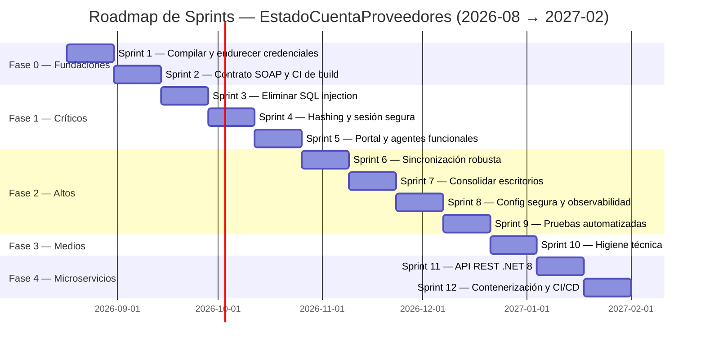
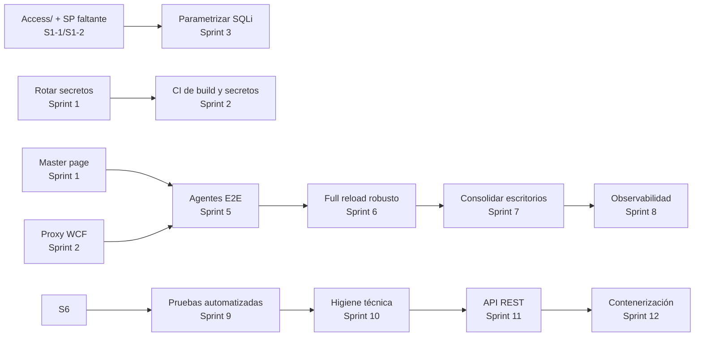

# Plan de Sprints (SCRUM) — EstadoCuentaProveedores

> **Objetivo:** Plan de ejecución por fases/sprints para sanear, estabilizar y modernizar el ecosistema **EstadoCuentaProveedores** (branch `DEV.VELA`), atacando cada hallazgo de auditoría según su criticidad e impacto en los casos de uso.
> **Base documental:** `AUDITORIA_TECNICA.md` (hallazgos C1–C5/C9, A1–A8, M1–M7), `AUDITORIA_BASE_DATOS.md` (16 SPs confirmados + 1 faltante, 14 tablas, 6 vistas) y `CASOS_DE_USO.md` (35 casos de uso, CU-001…CU-035).
> **Método:** SCRUM — sprints de 2 semanas, ~350 story points totales, priorización por criticidad × impacto × dependencias × esfuerzo.
> **Fecha:** 2026-08-10
> **Author:** BxBotYP

---

## 1. Resumen ejecutivo

### 1.1 Contexto

El ecosistema se compone de **5 soluciones .NET + 1 carpeta vacía**:

| # | Componente | Stack | Estado actual |
|---|-----------|-------|---------------|
| 1 | **EstadoCuentaNet** (Sitio Web) | WebForms .NET 4.5.2 + DevExpress 22.1 | Funcional en producción, 18 páginas (9 rotas en deploy estático por master page faltante) |
| 2 | **WSEstadoCuenta** (Servicio Web ASMX) | .NET 4.7.2 + Newtonsoft.Json + SQLite | 14 WebMethods; contrato SOAP desalineado con los agentes |
| 3 | **BoxEstadoCuentasService** (Servicio Windows) | .NET 8 + WCF + Serilog | **No compila** (falta `Access/`) |
| 4 | **AgenteEstadoCuenta** (Escritorio SOAP) | WinForms .NET 4.7.2 + SqlBulkCopy | ROTO (contrato SOAP) |
| 5 | **AgenteEstadoCuentaRest** (Escritorio REST) | WinForms .NET 4.7.2 + RestSharp + SQLite | ROTO (contrato SOAP) / REST no integrado |
| 6 | **Movil** | — | Vacía (sin implementación) |

### 1.2 Veredicto de arquitectura (microservicios — parcial)

> **SÍ** al servicio de sincronización (ya es un worker .NET 8) contenerizable y a la **API REST .NET 8** como reemplazo del ASMX.
> **NO** a fragmentar el portal WebForms en microservicios: es un monolito pequeño y cohesivo; se moderniza como monolito (a lo sumo, módulos desacoplados).
> El pipeline de datos (Epicor → EstadoCuenta) debe converger a **una sola implementación** (CU-031): la duplicación actual en 3 implementaciones (CU-024/CU-027/CU-021) es deuda crítica de mantenimiento.

### 1.3 Alcance del plan

- **12 sprints** × 2 semanas = **24 semanas laborables** (~6 meses calendario).
- **Calendario sugerido:** 2026-08-17 → 2026-02-12 (con pausa navideña entre S10 y S11).
- **Fases:** 0 (Fundaciones) → 1 (Críticos) → 2 (Altos) → 3 (Medios) → 4 (Microservicios).
- **Cierre esperado:** los 21 hallazgos con plan de remediación ejecutado (6 🔴, 8 🟠, 7 🟡), los casos de uso ROTO/INCOMPLETO restaurados, y el inicio de la migración ASMX → API REST.

---

## 2. Criterios de priorización

### 2.1 Fórmula de priorización

```
Prioridad = (Criticidad × Peso CU impactados) × (1 / Dependencias pendientes) × (1 / Esfuerzo)
```

| Factor | Cómo se ponderó |
|--------|-----------------|
| **Criticidad** | 🔴 Crítico = 5, 🟠 Alto = 3, 🟡 Medio = 1 |
| **Peso CU** | Número de casos de uso (CU-XXX) que el hallazgo bloquea o degrada; se priorizan los CU de acceso (CU-001) y consulta principal (CU-007) |
| **Dependencias** | Un hallazgo "habilitador" se ejecuta **antes** aunque su criticidad no sea la mayor (p. ej. C5 antes que C1) |
| **Esfuerzo** | Estimación relativa S=3 / M=5 / L=8 / XL=13 story points |

### 2.2 Hallazgos habilitadores (prerrequisitos del plan)

Sin estos, ningún otro trabajo es verificable ni seguro:

| Habilitador | Hallazgo | ¿Por qué es prerrequisito? |
|-------------|----------|----------------------------|
| **Repositorio compilable** | C5 | No se puede parametrizar SQLi (C1) ni probar nada si `Access/` falta y el WS no compila |
| **Rotación de credenciales** | C2 | Cualquier trabajo posterior sobre un repo con secretos activos sigue expuesto; CI no puede scannearlo con 0 fallos si no se rotan |
| **Master page versionado** | C9 | 9 páginas del portal (CU-006/007/008/009/011/012/013/016) no renderizan en deploy estático → bloquea cualquier prueba funcional del portal |
| **Contrato SOAP regenerado** | C4 | Los agentes (CU-024/CU-027) y el worker no pueden ejecutarse contra el ASMX actual |
| **CI de build** | A8 (parcial) | Sin CI no hay verificación automatizada de ninguno de los sprints posteriores |

### 2.3 Orden de ataque por criticidad

1. **Fase 0 — Fundaciones (S1–S2):** habilitadores → "que compile y no esté expuesto".
2. **Fase 1 — Críticos (S3–S5):** vulnerabilidades de acceso (C1 → C3 → A7/A1) y funcionalidad rota (C9/C5/C4 restantes) → "seguro y funcionando".
3. **Fase 2 — Altos (S6–S9):** robustez operativa (A3/A2 → A4 → A5 → A8 completo) → "confiable y observable".
4. **Fase 3 — Medios (S10):** deuda menor (M1–M7) → "limpio".
5. **Fase 4 — Microservicios (S11–S12):** API REST + contenerización → "moderno".

---

## 3. Roadmap por fases



### Resumen por fase

| Fase | Nombre | Sprints | Hallazgos objetivo | Entregable principal |
|------|--------|---------|--------------------|----------------------|
| 0 | Fundaciones / habilitadores | S1–S2 | C5, C2, C9, C4, A8 (CI) | Repo que compila, sin secretos, con CI y contrato alineado |
| 1 | Críticos | S3–S5 | C1, C3, A7, A1, C9, C5, C4 | Portal y agentes seguros y funcionando end-to-end |
| 2 | Altos | S6–S9 | A3, A2, A4, A5, M5, A6, A8 | Sincronización robusta, un solo sincronizador, pruebas automatizadas |
| 3 | Medios | S10 | M1–M7 | Deuda técnica menor eliminada |
| 4 | Microservicios / mejora continua | S11–S12 | Transición ASMX→REST, A8/A4 | API REST .NET 8 + contenerización + CI/CD |

---

## 4. Detalle de sprints

### Sprint 1 — "Restaurar compilación y endurecer credenciales"

- **Objetivo del sprint:** Lograr que las 5 soluciones compilen desde un checkout limpio y que el repositorio quede libre de credenciales, habilitando así todo el trabajo posterior.
- **Estimación total:** 35 SP

| ID | Item | Hallazgo | Descripción corta | Archivos/áreas | CU impactados | Estimación | Rol |
|----|------|----------|-------------------|----------------|---------------|------------|-----|
| S1-1 | Restaurar carpeta `Access/` | C5 | Recuperar y versionar `SoapClientFactory`, `ISyncController` y los 12 controllers de sincronización (fuente: IIS/servidor/backups; si se perdieron, reconstruir por contrato del worker) | `Servicio Windows/BoxEstadoCuentasService/Access/`, `Program.cs:32`, `Controllers/EstadosCuentasControllers.cs:13` | CU-020, CU-021, CU-022 | XL | coder + reviewer |
| S1-2 | Corregir `EstadoCuentaCompletoPROC` | C5 | Definir el SP en `EpicorBoxito` (esquema `Boxito`) y registrarlo en `Constants.cs` para que el ASMX compile | `Servicio Web/WSEstadoCuenta/WSEstadoCuenta/Data/Constants.cs`, `Data/Epicor11DA.cs:120` | CU-018, CU-019 | L | db-specialist |
| S1-3 | Rotar y externalizar credenciales | C2 | Rotar las ~17 ubicaciones (Web.config, App.config, appsettings.json, Conexion.cs) y migrar a variables de entorno / Secret Manager | `*.config`, `appsettings.json:3-4`, `DAO/Conexion.cs:15-16` | Transversal (todo el ecosistema) | L | security-auditor + devops-engineer |
| S1-4 | Eliminar secretos en comentarios | C2 | Remover credenciales comentadas y URLs internas; ajustar `Web.Release/Debug.config` | `Web.config:35,39-45`, `App.config:4,9`, `Web.Debug/Release.config` | Transversal | S | security-auditor |
| S1-5 | Versionar master page | C9 | Incorporar `GUI/Cliente.Master` (+ code-behind si existe) o crear el layout compartido | `Sitio Web/EstadoCuentaNet/EstadoCuentaNet/GUI/` | CU-006, CU-007, CU-008, CU-009, CU-011, CU-012, CU-013, CU-016 | S | coder |

- **Definition of Done (DoD):**
  - `dotnet build` y `msbuild` verdes en las 5 soluciones desde checkout limpio.
  - Grep de secretos reales: 0 coincidencias (las 21 filas de §4 de AUDITORIA_TECNICA migradas a secretos).
  - `glob **/*.master` encuentra `Cliente.Master` versionado.
- **Riesgos del sprint:** `Access/` puede estar perdido (no existir en backups) → plan B: reconstrucción por contrato del worker (2 días extra). Rotación puede romper producción → ventana de mantenimiento coordinada y verificación de conectividad.
- **Entregables:** repo compilable, secretos externalizados, master page versionado, 9 páginas del portal renderizan en deploy estático.

---

### Sprint 2 — "Contrato SOAP alineado y CI de build"

- **Objetivo del sprint:** Regenerar el proxy WCF contra el WSDL vigente y establecer CI que valide compilación, secretos y máster pages en cada cambio.
- **Estimación total:** 29 SP

| ID | Item | Hallazgo | Descripción corta | Archivos/áreas | CU impactados | Estimación | Rol |
|----|------|----------|-------------------|----------------|---------------|------------|-----|
| S2-1 | Regenerar proxy WCF | C4 | Regenerar `Reference.cs`/WSDL con los 14 métodos del ASMX actual, incluidos `(pagina, registrosPorPagina)` y `ObtieneBD` | `Escritorio/*/Connected Services/WSEstadoCuenta/`, `App.config:13` | CU-017, CU-024, CU-027 | L | coder |
| S2-2 | Versionar contrato y validar | C4 | Comprometer el WSDL vigente y añadir test que compare proxy vs ASMX (sin drift) | `Connected Services/*`, CI | CU-017, CU-024 | M | coder + tester |
| S2-3 | CI de build multi-solución | A8 | Pipeline (GitHub Actions/Azure DevOps): restore + build de las 5 soluciones en cada PR | Repositorio raíz (`.github/` o `.azuredevops/`) | Transversal | L | devops-engineer |
| S2-4 | CI de detección de secretos | A8 | Integrar `gitleaks`/`detect-secrets`/`TruffleHog` en CI con fallo ante hallazgos | CI | Transversal | M | devops-engineer + security-auditor |
| S2-5 | CI: validación de máster pages | C9 | Script que verifica que cada `MasterPageFile` referenciado existe en el árbol | CI, `GUI/*.aspx` | CU-006…CU-016 | S | devops-engineer |

- **Definition of Done (DoD):** proxy regenerado y funcional contra ASMX real; pipeline CI verde; scan de secretos con 0 hallazgos; falla del pipeline ante master page inexistente.
- **Riesgos del sprint:** Regenerar el proxy puede exponer drift de nombres/espacios de nombres → migrar los agentes en el mismo sprint con pruebas de smoke; licencias de agentes de build para .NET Framework (VS Build Tools).
- **Entregables:** agentes compilan contra contrato vigente; CI como guardián del repo.

---

### Sprint 3 — "Eliminar SQL injection del portal"

- **Objetivo del sprint:** Parametrizar el 100% de las consultas del portal para eliminar la vulnerabilidad explotable más crítica (C1).
- **Estimación total:** 34 SP

| ID | Item | Hallazgo | Descripción corta | Archivos/áreas | CU impactados | Estimación | Rol |
|----|------|----------|-------------------|----------------|---------------|------------|-----|
| S3-1 | Parametrizar login y contraseña | C1/C3 | Convertir a `SqlParameter` las consultas de `UsuarioDAO` y `ContraseniaDAO` (incluidos `exec RegistraUsuario`/`EliminaUsuario`) | `DAO/UsuarioDAO.cs:38-124`, `DAO/ContraseniaDAO.cs:42-75` | CU-001, CU-004, CU-005, CU-006 | L | coder + security-auditor |
| S3-2 | Parametrizar DAOs de consulta | C1 | Migrar los 9 DAOs restantes a consultas parametrizadas o SPs | `DAO/PendientePagoDAO`, `DescuentoDAO`, `FacturaDAO`, `FacturaAjusteDAO`, `DetallePagoDAO`, `FacturaNoProgramadaDAO`, `FacturasSinEntradaDAO`, `NotiPagoDAO`, `PagoNotaCreditoDAO`, `MensajeEmpresaDAO`, `ProveedorDAO` | CU-007…CU-016 | XL | coder |
| S3-3 | Usuario BD de mínimos privilegios | C1 | Reemplazar `sa` por login con solo lectura/escritura sobre `EstadoCuenta` y `EpicorBoxito` | Cadenas de conexión (secretos), SQL Server | Transversal | M | db-specialist + security-auditor |
| S3-4 | Tests de DAOs parametrizados | A8/C1 | Suite unitaria con mocks/BD de prueba que valide las consultas y su parametrización | Proyecto de test nuevo, `DAO/*` | CU-001…CU-016 | L | tester |

- **Definition of Done (DoD):** grep `"'" +` en `DAO/` → 0 resultados; login parametrizado probado; tests verdes en CI; usuarios de servicio sin privilegios `sa`.
- **Riesgos del sprint:** Cambio masivo en DAOs puede introducir regresiones en consultas con join/vistas → cubrir con S3-4; las vistas dependen de esquema en BD (validar con DBA).
- **Entregables:** portal inmune a SQLi (C1 cerrado); base de tests para el portal.

---

### Sprint 4 — "Hashing de contraseñas y sesión segura"

- **Objetivo del sprint:** Eliminar las contraseñas en texto plano (C3) y endurecer autenticación (A7) y transporte (A1).
- **Estimación total:** 29 SP

| ID | Item | Hallazgo | Descripción corta | Archivos/áreas | CU impactados | Estimación | Rol |
|----|------|----------|-------------------|----------------|---------------|------------|-----|
| S4-1 | Hash PBKDF2/BCrypt en usuario | C3 | Hash en alta, login y cambio de contraseña; migración de hashes con reintento de reset para cuentas existentes | `DAO/UsuarioDAO.cs`, `DAO/ContraseniaDAO.cs`, `UsuarioNet` | CU-001, CU-004, CU-006 | XL | coder + security-auditor |
| S4-2 | HTTPS + cookies seguras | A7 | `requireSSL`, `HttpOnly`, `SameSite`, cookie de sesión segura | `Web.config` del sitio | CU-001 | M | coder |
| S4-3 | ASMX solo SOAP | A1 | Deshabilitar `HttpPost`/`HttpGet` del ASMX (solo SOAP) | `WSEstadoCuenta/Web.config:26-31` | CU-017 | S | coder + devops-engineer |
| S4-4 | Validación server-side + anti-CSRF | A7 | `ValidateRequest`, validación de entradas en páginas con formularios y token anti-forgery en el portal | `GUI/*.aspx(.cs)` | CU-001, CU-004, CU-006, CU-015 | M | coder + security-auditor |
| S4-5 | Generador de claves criptográfico | C3 | Sustituir `System.Random` por `RNGCryptoServiceProvider` en `genera_clave` | `GUI/Registro.aspx.cs:51-61` | CU-004 | S | coder |

- **Definition of Done (DoD):** 0 contraseñas nuevas en texto plano (flag de migración); login y cambio de contraseña verdes bajo HTTPS; ASMX no responde a GET/POST; claves generadas criptográficamente.
- **Riesgos del sprint:** Migración de contraseñas existentes → estrategia de "cambio obligatorio en primer acceso" o doble validación transitoria; habilitar HTTPS requiere certificados en IIS (coordinación con infraestructura).
- **Entregables:** C3, A7 y A1 cerrados; portal con acceso seguro.

---

### Sprint 5 — "Portal y agentes funcionando end-to-end"

- **Objetivo del sprint:** Cerrar los hallazgos críticos restantes (C5/C9/C4) validando que los casos de uso antes ROTO funcionan de punta a punta.
- **Estimación total:** 34 SP

| ID | Item | Hallazgo | Descripción corta | Archivos/áreas | CU impactados | Estimación | Rol |
|----|------|----------|-------------------|----------------|---------------|------------|-----|
| S5-1 | SP `EstadoCuentaCompletoPROC` + integración | C5 | Crear SP en `EpicorBoxito` (12 tablas de estado de cuenta, `OFFSET/FETCH`) y conectar `EstadoCuentaCompleto` | `Data/Epicor11DA.cs:120-128`, `Data/Constants.cs`, SQL `Boxito` | CU-018 | L | db-specialist + coder |
| S5-2 | `ObtieneBD` (ZIP SQLite) validado | C5 | Probar generación y descompresión del ZIP SQLite de punta a punta | `EstadoCuenta.asmx.cs:299-315`, `Data/SqliteDB.cs` | CU-019, CU-027 | L | coder |
| S5-3 | Render de las 9 páginas con master | C9 | Validar en IIS (deploy estático) que las 9 páginas renderizan con el master versionado (S1-5) | `GUI/*.aspx` + `Cliente.Master` | CU-006…CU-016 | M | tester |
| S5-4 | Agentes SOAP/REST contra ASMX regenerado | C4 | Smoke test de los 12 WebMethods + `ObtieneBD` desde ambos agentes con el proxy nuevo (S2-1) | `Escritorio/*/Controller/AgentController.cs`, `Data/Epicor11DA.cs` | CU-024, CU-027, CU-028 | L | tester + coder |
| S5-5 | Checklist de aceptación críticos | C1–C9 | Revisión final de los 6 hallazgos críticos con evidencias (build, scans, pruebas) | Transversal | Todos | M | reviewer + security-auditor |

- **Definition of Done (DoD):** CU-017, CU-018, CU-019, CU-024, CU-027 ejecutan sin error en ambiente de QA; checklist de los 6 críticos firmado; 0 hallazgos críticos abiertos.
- **Riesgos del sprint:** El SP nuevo debe replicar exactamente el esquema esperado por `SqliteDB.createDB` (nombres de columnas) → alinear con DBA antes de codificar; entorno de QA con Epicor accesible.
- **Entregables:** fase crítica cerrada: ecosistema seguro y funcionando.

---

### Sprint 6 — "Sincronización robusta"

- **Objetivo del sprint:** Eliminar el full reload frágil (A3) y el detenido forzoso de hilos (A2) para que la carga de datos no deje el sistema a medias.
- **Estimación total:** 24 SP

| ID | Item | Hallazgo | Descripción corta | Archivos/áreas | CU impactados | Estimación | Rol |
|----|------|----------|-------------------|----------------|---------------|------------|-----|
| S6-1 | Corregir typo `PagoNOtaCredito` | A3 | Alinear `DestinationTableName` con `PagoNotaCredito` | `Escritorio/*/Data/EstadoCuentaDA.cs:455,31` | CU-024, CU-028 | S | coder |
| S6-2 | Control de errores por tabla + reintentos | A3 | Rollback granular por tabla, validación previa (esquema/columnas) y reintento con backoff en `SetNewData` | `Data/EstadoCuentaDA.cs:24-35,59-705` | CU-024, CU-028, CU-031 | L | coder |
| S6-3 | Detención cooperativa (`CancellationToken`) | A2 | Reemplazar `MainThread.Abort()` por token/flag con cierre ordenado | `Controller/AgentController.cs:34-47,146-161` | CU-023, CU-026 | M | coder |
| S6-4 | Flags estáticos sincronizados | A2 | `lock`/`volatile` en `Estado` y semáforos del worker | `Controller/AgentController.cs`, `ControladorRest.cs:14`, `EstadosCuentaBD.cs:5` | CU-023, CU-026 | S | coder |
| S6-5 | Tests de integración de carga | A8/A3 | Prueba con dataset pequeño: carga completa, fallo parcial y rollback | Proyecto de test, `EstadoCuentaDA` | CU-024, CU-028 | M | tester |

- **Definition of Done (DoD):** carga transaccional con error por tabla manejado; detención limpia sin `ThreadAbortException`; tests de integración en CI.
- **Riesgos del sprint:** El typo puede estar "compensado" en la BD destino → verificar esquema real antes de corregir; cambiar el ciclo de carga requiere ventana de mantenimiento.
- **Entregables:** sincronización confiable (A3, A2 cerrados).

---

### Sprint 7 — "Consolidar los escritorios en el worker .NET 8"

- **Objetivo del sprint:** Unificar la duplicación total de lógica (A4): un solo sincronizador (CU-021) con las capacidades de ambos agentes (CU-024/CU-028/CU-027).
- **Estimación total:** 27 SP

| ID | Item | Hallazgo | Descripción corta | Archivos/áreas | CU impactados | Estimación | Rol |
|----|------|----------|-------------------|----------------|---------------|------------|-----|
| S7-1 | Portar carga vía SOAP al worker | A4 | El worker (ya con 12 controllers en `Access/`) ejecuta la descarga SOAP paginada → persistencia con BulkCopy + `ECPA_SpecialUpdates` | `Servicio Windows/BoxEstadoCuentasService/Access/`, `Workers/EstadoCuentaSyncWorker.cs` | CU-021, CU-024 | L | coder |
| S7-2 | Portar carga vía SQLite ZIP al worker | A4 | Modo alternativo del worker que descarga `ObtieneBD` (ZIP) y carga desde SQLite (equivalente a CU-027/CU-028) | `Access/`, `Data/` del worker | CU-027, CU-028 | L | coder |
| S7-3 | Migrar `simulationMode` real | C5/A4 | Implementar el efecto real de `simulationMode` (los 12 controllers existen tras S1-1) | `Workers/EstadoCuentaSyncWorker.cs:85-91`, `appsettings.json` | CU-022 | M | coder |
| S7-4 | Deprecar escritorios | A4 | Marcar `AgenteEstadoCuenta` y `AgenteEstadoCuentaRest` como legacy (README + exclusión del CI de despliegue) | `Escritorio/*` | CU-023…CU-030 | S | tech-writer |
| S7-5 | ADR: unificación de sincronizadores | M4/A4 | Documentar la decisión de converger a un solo sincronizador | `docs/adr/` | CU-031 | S | tech-writer + software-architect |

- **Definition of Done (DoD):** worker sincroniza las 12 entidades (SOAP y SQLite) con resultados idénticos a los agentes en QA; escritorios deprecated; ADR publicado.
- **Riesgos del sprint:** El worker .NET 8 no tiene las librerías WinForms del agente (no las necesita) pero sí debe reutilizar `EstadoCuentaDA` → extraer a librería compartida; discrepancia de resultados entre implementaciones (baseline de datos en QA).
- **Entregables:** un solo pipeline de sincronización (A4 cerrado; CU-031 convergido).

---

### Sprint 8 — "Configuración segura y observabilidad"

- **Objetivo del sprint:** Producción sin `debug`, sin logs sensibles, con paginación validada y transporte HTTPS en todos los endpoints.
- **Estimación total:** 19 SP

| ID | Item | Hallazgo | Descripción corta | Archivos/áreas | CU impactados | Estimación | Rol |
|----|------|----------|-------------------|----------------|---------------|------------|-----|
| S8-1 | `customErrors On` + `debug=false` | A5 | Endurecer `Web.config` de sitio y WS; limpiar `Web.Debug/Release.config` | `Web.config` (sitio: ~38,40; WS:24) | Transversal | S | devops-engineer |
| S8-2 | Limpiar logs versionados | A5 | Eliminar `logs/service2025*.log` del repo y excluir `logs/`, `bin/`, `obj/` del VCS | `Servicio Windows/BoxEstadoCuentasService/logs/`, SVN ignores | Transversal | S | devops-engineer |
| S8-3 | Logging estructurado con rotación | M5 | Serilog a archivo con rotación en worker y portal; eliminar log en memoria de escritorios (deprecados) | `Program.cs:11-18`, `GUI` | CU-021, CU-025, CU-030 | M | coder |
| S8-4 | Validación de paginación | A6 | Límites para `pagina`/`registrosPorPagina` en los 14 WebMethods (máx. configurable) | `EstadoCuenta.asmx.cs` | CU-017 | S | coder |
| S8-5 | HTTPS en los 3 sitios IIS | A5/A7 | Certificados y redirects HTTP→HTTPS en portal, ASMX y (futuro) API | IIS, configs | CU-001, CU-017 | M | devops-engineer + infrastructure |

- **Definition of Done (DoD):** 0 logs sensibles en repo; Serilog rota archivos; paginación con límites probada; los 3 endpoints accesibles solo por HTTPS.
- **Riesgos del sprint:** Certificados internos requieren despliegue en clientes (agentes de escritorio) → ventana coordinada; forzar HTTPS rompe consumidores HTTP (verificar agentes).
- **Entregables:** A5, M5, A6 cerrados; base de observabilidad para los sprints finales.

---

### Sprint 9 — "Pruebas automatizadas del portal"

- **Objetivo del sprint:** Establecer la primera suite de pruebas automatizadas con cobertura mínima en los flujos críticos (A8).
- **Estimación total:** 31 SP

| ID | Item | Hallazgo | Descripción corta | Archivos/áreas | CU impactados | Estimación | Rol |
|----|------|----------|-------------------|----------------|---------------|------------|-----|
| S9-1 | Tests E2E del portal | A8 | Playwright/Selenium: login (CU-001), promesas (CU-007), detalle, exportación (CU-033), avisos (CU-034) | Proyecto de test E2E | CU-001, CU-007, CU-033, CU-034 | L | tester |
| S9-2 | Tests de integración de DAOs | A8 | Ampliar S3-4 a todos los DAOs contra BD de prueba (vistas y SPs) | Proyecto de test, `DAO/*` | CU-001…CU-016 | L | tester |
| S9-3 | Tests de los 14 WebMethods | A8 | Paginación, errores, contrato SOAP (S2-2) y `ObtieneBD` | Proyecto de test del WS | CU-017, CU-019 | M | tester |
| S9-4 | Cobertura en CI | A8 | Reportes de cobertura (`coverlet`/`OpenCover`) integrados al pipeline | CI | Transversal | M | devops-engineer |
| S9-5 | Baseline de cobertura ≥30% | A8 | Umbral de calidad en módulos críticos (DAOs, ASMX, worker) | CI | Transversal | M | reviewer + tester |

- **Definition of Done (DoD):** suite E2E + integración verde en CI; cobertura reportada ≥30% en módulos críticos; umbral de fallo configurado.
- **Riesgos del sprint:** DevExpress grids dificultan selectores E2E → priorizar por data-testid y esperas explícitas; BD de prueba debe replicar vistas/SPs (script de seed desde AUDITORIA_BASE_DATOS).
- **Entregables:** A8 (calidad) avanzado; red de seguridad para los sprints 10–12.

---

### Sprint 10 — "Higiene técnica"

- **Objetivo del sprint:** Cerrar los hallazgos medios (M1–M7) y dejar el repositorio limpio y documentado.
- **Estimación total:** 25 SP

| ID | Item | Hallazgo | Descripción corta | Archivos/áreas | CU impactados | Estimación | Rol |
|----|------|----------|-------------------|----------------|---------------|------------|-----|
| S10-1 | Eliminar `throw ex` | M1 | Reemplazar por `throw;` conservando stack | `Data/SqliteDB.cs:56`, `Data/Epicor11DA.cs`, DAOs | Transversal | S | coder |
| S10-2 | Remover paquetes no usados | M2 | Desinstalar EF (WS y REST), alinear `targetFramework` del WS (4.7.2) | `packages.config`, `Web.config:24-25` | Transversal | S | coder |
| S10-3 | Límites de mensajes WCF | M3 | Reducir `maxReceivedMessageSize`/`maxBufferSize` a valores razonables | `App.config` de escritorios | CU-024, CU-027 | S | coder + security-auditor |
| S10-4 | Eliminar código muerto | M4 | Quitar `SqlConstants.cs:5-22` (SELECTs comentados), métodos SOAP comentados de la variante REST, `EstadosCuentaBD.cs` incompleto | `Escritorio/*/Data/` | Transversal | M | coder + reviewer |
| S10-5 | Sanear SQLite dinámico | M6 | Parametrizar `PRAGMA table_info` y validar nombres de tabla | `Data/SqliteDB.cs:216`, `CleanTableNames` | CU-019 | S | coder |
| S10-6 | Decidir futuro de `Movil/` | M4 | Análisis: eliminar la carpeta o crear backlog de app móvil (decisión de negocio) | `Movil/` | — | M | software-architect + tech-writer |
| S10-7 | ADRs de decisiones clave | M4 | ADRs: REST vs SOAP, full reload vs incremental, portal monolito, migración de secretos | `docs/adr/` | Transversal | S | tech-writer + software-architect |

- **Definition of Done (DoD):** checklist de los 7 medios cerrado; `grep throw\ ex` → 0; ADRs publicados; decisión de `Movil/` tomada.
- **Riesgos del sprint:** Bajo (items de limpieza); único riesgo: remover EF rompe build si hay código oculto → CI lo detecta en el mismo sprint.
- **Entregables:** deuda técnica menor eliminada; fase 3 cerrada.

---

### Sprint 11 — "API REST .NET 8 (reemplazo del ASMX)"

- **Objetivo del sprint:** Iniciar la migración al candidato ideal: una **API REST .NET 8** que reemplace el ASMX con autenticación JWT, manteniendo compatibilidad durante la transición.
- **Estimación total:** 36 SP

| ID | Item | Hallazgo | Descripción corta | Archivos/áreas | CU impactados | Estimación | Rol |
|----|------|----------|-------------------|----------------|---------------|------------|-----|
| S11-1 | Scaffold API REST (12 endpoints) | C4/A6 | API .NET 8 con los 12 endpoints de consulta reutilizando los SPs `Boxito.SP_WSECP_*` y paginación validada | `Microservicios/ApiEstadoCuenta/` | CU-017 | XL | coder + software-architect |
| S11-2 | Autenticación JWT | A1/A7 | Bearer tokens con roles PROVEEDOR/ADMINISTRADOR (alineado con CU-035) | `Microservicios/ApiEstadoCuenta/` | CU-017, CU-035 | L | coder + security-auditor |
| S11-3 | Endpoint `ObtieneBD` (ZIP SQLite) | C5 | Migrar la generación de SQLite ZIP a un endpoint de la API | `Microservicios/ApiEstadoCuenta/` | CU-019, CU-027 | M | coder |
| S11-4 | ASMX como fachada de transición | C4 | El ASMX delega en la API (mismos contratos SOAP) para no romper consumidores legacy | `WSEstadoCuenta/EstadoCuenta.asmx.cs` | CU-017, CU-024, CU-027 | M | coder |
| S11-5 | Pruebas de carga API vs ASMX | A6/A8 | Benchmark de latencia/throughput para justificar el corte definitivo | `Microservicios/ApiEstadoCuenta/`, QA | CU-017 | M | tester + performance |

- **Definition of Done (DoD):** API REST desplegada con JWT y 12 endpoints + `ObtieneBD`; ASMX delegando (sin lógica duplicada); pruebas de carga documentadas; E2E verdes contra la API.
- **Riesgos del sprint:** Migrar lógica de `Epicor11DA` y `SqliteDB` a .NET 8 (reusar o portar); JWT obliga a tocar el flujo de sesión del portal (CU-035) → mantener ambos mecanismos durante transición.
- **Entregables:** primer microservicio real; base para contenerización.

---

### Sprint 12 — "Contenerización y CI/CD completo"

- **Objetivo del sprint:** Contenerizar worker y API, completar el pipeline CI/CD con despliegue automatizado y cerrar el plan con runbooks y métricas.
- **Estimación total:** 29 SP

| ID | Item | Hallazgo | Descripción corta | Archivos/áreas | CU impactados | Estimación | Rol |
|----|------|----------|-------------------|----------------|---------------|------------|-----|
| S12-1 | Dockerfile + compose (API + worker) | A8 | Imágenes para `ApiEstadoCuenta` y `BoxEstadoCuentasService`; `docker-compose` con SQLite y secretos | `Microservicios/`, `Servicio Windows/` | CU-017…CU-022 | L | devops-engineer |
| S12-2 | Pipeline CI/CD completo | A8 | build → test → scan secretos → imagen → deploy (IIS/Docker) en QA y producción | CI/CD | Transversal | L | devops-engineer |
| S12-3 | Migrar agentes legacy a workers | A4 | Si aún hay escritorios en uso, reemplazarlos por instancias contenerizadas del worker | `Servicio Windows/`, infraestructura | CU-024, CU-027, CU-031 | M | coder + devops-engineer |
| S12-4 | Runbooks de despliegue y monitoreo | A8/M5 | Runbooks IIS/Docker, métricas y alertas de los componentes | `docs/runbooks/` | Transversal | M | tech-writer + devops-engineer |
| S12-5 | Retrospectiva y backlog continuo | — | Medir métricas de éxito (§8), cerrar hallazgos y publicar backlog de mejora continua | Repositorio (docs) | Transversal | S | software-architect |

- **Definition of Done (DoD):** pipeline CI/CD verde con despliegue automatizado; worker y API contenerizados; runbooks publicados; métricas de éxito medidas y documentadas.
- **Riesgos del sprint:** IIS/SVN coexistirá con Docker → plan de corte con ventana de mantenimiento; secretos en contenedores → usar Docker secrets/env.
- **Entregables:** ecosistema modernizado: repo con CI/CD, microservicio REST, worker contenerizado y documentación operativa.

---

## 5. Asignación a roles / equipo

### 5.1 Roles del equipo

| Rol | Responsabilidad | Interviene en |
|-----|-----------------|---------------|
| **software-architect** | Decisiones de arquitectura, ADRs, veredictos de microservicios | S7, S10, S11, S12 |
| **coder** | Implementación de código en todas las soluciones | Todos los sprints |
| **security-auditor** | Revisión de vulnerabilidades (SQLi, secretos, criptografía), hardening | S1–S6, S10, S11 |
| **db-specialist** | SPs, esquema, migraciones, mínimos privilegios, SQLite | S1, S3, S5 |
| **tester** | Unitarias, integración, E2E, pruebas de carga | S2–S6, S9, S11 |
| **reviewer** | Code review, checklist de aceptación, calidad | S1, S3, S5, S9, S10 |
| **devops-engineer** | CI/CD, contenedores, secretos, IIS/HTTPS, observabilidad | S1, S2, S8, S9, S11, S12 |
| **tech-writer** | READMEs, ADRs, runbooks, deprecaciones | S7, S10, S12 |

### 5.2 Carga por fase (dedicación sugerida)

| Fase | Equipo base | Carga extra |
|------|-------------|-------------|
| Fase 0 (S1–S2) | 3 coder + devops + security | DBA 50%, tester 25% |
| Fase 1 (S3–S5) | 3 coder + security + tester | DBA 50%, reviewer 25% |
| Fase 2 (S6–S9) | 2 coder + tester + devops | reviewer 25% |
| Fase 3 (S10) | 2 coder + architect + tech-writer | — |
| Fase 4 (S11–S12) | 2 coder + devops + architect | security 25%, DBA 25% |

> **Tamaño de equipo recomendado:** 1 PO/arquitecto + 3 desarrolladores + 1 QA + 1 DevOps (part-time 50%) + DBA y security (compartidos). Con este equipo, 12 sprints × 2 semanas son viables con ~350 story points (~29 SP/sprint).

---

## 6. Justificación del orden y dependencias

### 6.1 Cadena de dependencias



### 6.2 Reglas que justifican el orden

1. **No se parametriza SQLi con un repo que no compila** (C5 → antes de C1). Cada cambio de C1 necesita build + pruebas; sin `Access/` el build global falla.
2. **No se hace CI con secretos activos en el repo** (C2 → antes de A8): el scanner de secretos fallaría permanentemente y el repo seguiría expuesto.
3. **No se prueban páginas que no renderizan** (C9 → antes de cualquier prueba funcional del portal en S5/S9).
4. **No se consolida lo que no funciona** (C4 → antes de A4): unificar agentes contra un contrato roto es perder trabajo.
5. **No se conteneriza sin CI ni sin API** (S11/S12 al final): la contenerización es la culminación del pipeline, no su punto de partida.
6. **La seguridad de acceso precede a la funcionalidad**: C1 (S3) y C3/A7 (S4) se ejecutan antes de las pruebas funcionales amplias (S5), porque sin ellas los datos del portal están expuestos.

---

## 7. Riesgos globales del plan

| # | Riesgo | Probabilidad | Impacto | Mitigación |
|---|--------|:---:|:---:|------------|
| R1 | **`Access/` irrecoverable** (código solo en servidor, no en backups) | Media | Alto | Plan B: reconstrucción por contrato del worker (S1-1, +2 días); buscar en `bin/` versionados y logs (PBDs) |
| R2 | **Rotación de credenciales rompe producción** | Media | Alto | Ventana de mantenimiento coordinada; secretos en entorno primero; monitoreo post-cambio |
| R3 | **Build de .NET Framework/DevExpress sin licencias ni VS correcto** | Media | Medio | Agentes de build con VS Build Tools + licencias DevExpress en CI (S2) |
| R4 | **Migración de contraseñas en texto plano** (C3) | Media | Medio | Estrategia dual: rehash al primer login + aviso de cambio obligatorio; pruebas con datos reales en QA |
| R5 | **SVN limita CI/CD y PR** (A8) | Alta | Medio | Evaluar migración a Git durante Fase 0 (decisión de negocio); mientras tanto, CI disparado por commit |
| R6 | **Cambio de alcance en microservicios** (Fase 4) | Media | Medio | Alcance mínimo viable definido en S11 (12 endpoints + JWT + ObtieneBD); cualquier ampliación va a backlog continuo |
| R7 | **Vacaciones/ausencias** (S10 cae en diciembre) | Alta | Bajo | Calendario con pausa navideña entre S10 y S11; buffer de 2 semanas al final del plan |
| R8 | **Endpoints HTTP internos (192.168.x.x) impiden pruebas remotas** | Alta | Medio | Ambiente QA en la misma red; túneles/port-forwarding para CI |

---

## 8. Métricas de éxito

| # | Métrica | Objetivo | Medición | Sprint de verificación |
|---|---------|----------|----------|------------------------|
| M1 | Compilación del ecosistema | 5/5 soluciones build verde desde checkout limpio | CI `build` | S2 (estable desde S1) |
| M2 | Secretos en repositorio | **0** ubicaciones con credenciales reales | Scan de secretos en CI (§4 de auditoría: 21 filas → 0) | S2 y continuo |
| M3 | Consultas concatenadas en DAOs | **0** | Grep `"'" +` / patrón de concatenación | S3 |
| M4 | Contraseñas en texto plano nuevas | **0** (migración completada) | Conteo de filas sin hash en `UsuarioNet` | S4 |
| M5 | Páginas del portal en deploy estático | **18/18** renderizan | Smoke test en IIS de QA | S5 |
| M6 | Casos de uso ROTO restaurados | CU-017/018/019/024/027 **verdes** | Suite de tests (S9) contra los CU | S5 (validación), S9 (automatizado) |
| M7 | Sincronizadores activos | **1** (worker .NET 8) | Inventario de despliegue | S7 |
| M8 | Cobertura de tests en módulos críticos | ≥ **30%** | Reporte de cobertura en CI | S9 |
| M9 | Endpoints HTTPS | **3/3** (portal, ASMX/API) | Escaneo de puertos/headers | S8 |
| M10 | Despliegue automatizado | CI/CD con deploy a QA y producción | Pipeline verde end-to-end | S12 |
| M11 | Hallazgos de auditoría | 6 🔴 + 8 🟠 + 7 🟡 = **21 cerrados** (o con evidencia de remediación) | Matriz de trazabilidad (Anexo A) | S5 (críticos), S9 (altos), S10 (medios) |

> **Criterio de éxito global:** al cierre del Sprint 12, el ecosistema compila, no expone secretos, es inmune a SQLi, tiene un solo sincronizador contenerizado, una API REST autenticada, CI/CD operativo y los 21 hallazgos de la auditoría inicial están cerrados o con plan de remediación aprobado.

---

## Anexo A — Traza hallazgo → sprint → casos de uso

| Hallazgo | Severidad | Sprint(es) | Casos de uso impactados |
|----------|:---:|:---:|-------------------------|
| C1 — SQLi sistémico portal | 🔴 | S3 | CU-001, CU-004…CU-016 |
| C2 — Credenciales hardcodeadas | 🔴 | S1 | Transversal |
| C3 — Contraseñas en texto plano | 🔴 | S3 (parcial), S4 | CU-001, CU-004, CU-006 |
| C4 — Drift contrato SOAP | 🔴 | S2, S5, S11 | CU-017, CU-024, CU-027 |
| C5 — Repo incompleto / no compila | 🔴 | S1, S5, S11 | CU-018, CU-019, CU-020…CU-022, CU-027 |
| C9 — Master page no versionado | 🔴 | S1, S2, S5 | CU-006, CU-007, CU-008, CU-009, CU-011, CU-012, CU-013, CU-016 |
| A1 — ASMX sin auth + GET/POST | 🟠 | S4, S11 | CU-017 |
| A2 — Thread.Abort / hilos frágiles | 🟠 | S6 | CU-023, CU-026 |
| A3 — Full reload sin control por tabla | 🟠 | S6 | CU-024, CU-028, CU-031 |
| A4 — Duplicación de escritorios | 🟠 | S7, S12 | CU-023…CU-031 |
| A5 — Config insegura + logs sensibles | 🟠 | S8 | Transversal |
| A6 — Paginación sin validación | 🟠 | S8, S11 | CU-017 |
| A7 — Forms auth débil | 🟠 | S4, S11 | CU-001, CU-035 |
| A8 — Sin pruebas/CI/CD/Docker | 🟠 | S2, S9, S12 | Transversal |
| M1 — `throw ex` | 🟡 | S10 | Transversal |
| M2 — Paquetes no usados / obsoletos | 🟡 | S10 | Transversal |
| M3 — Contratos WCF sin límites | 🟡 | S10 | CU-024, CU-027 |
| M4 — Código muerto / comentado | 🟡 | S7, S10 | Transversal |
| M5 — Logging insuficiente | 🟡 | S8 | CU-021, CU-025, CU-030 |
| M6 — SQLite dinámico sin validación | 🟡 | S10 | CU-019 |
| M7 — Config de compilación mixta | 🟡 | S10 | Transversal |

---

*Documento generado a partir de `AUDITORIA_TECNICA.md`, `AUDITORIA_BASE_DATOS.md` y `CASOS_DE_USO.md` (branch DEV.VELA). Los sprints y estimaciones son relativos (S=3, M=5, L=8, XL=13) y deben recalibrarse en la planificación inicial del equipo.*
