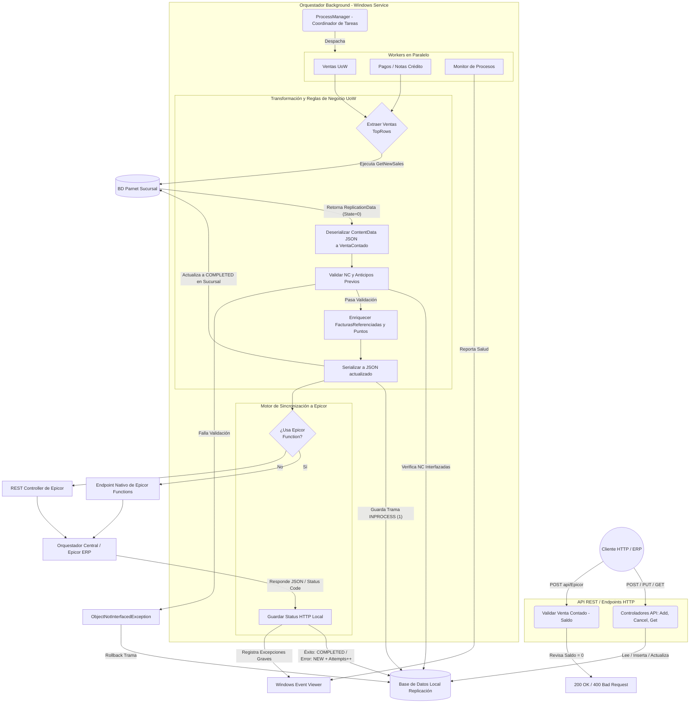

# Inventario de Casos de Uso y Contratos de Integración - BOXAgenteBase

A partir del análisis de la estructura y el código fuente del componente `BOXAgenteBase`, se ha identificado la arquitectura del sistema. Está compuesto principalmente por dos subsistemas: un **API REST (`RestService`)** que expone endpoints HTTP, y un **Windows Service (`BoxServiceAgentConfig`)** que actúa como un orquestador de tareas en background para extraer, transformar y replicar información entre bases de datos de sucursales (Parnet) y el sistema central (Epicor).

## Subsistema: API REST (`RestService`)

### [CU_001] Creación de Documento de Replicación
*   **Componente:** `RestService` (DocumentController)
*   **Trigger / Endpoint:** HTTP POST `api/document/Add`
*   **Datos de Entrada:** Objeto `ReplicationData` (Entidad principal de datos a replicar).
*   **Flujo de Ejecución:**
    1. El controlador recibe el payload y delega la ejecución al Unit of Work (`ReplicationAgentUoW`).
    2. Se abre un contexto local (`LocalContext`) a la base de datos de replicación.
    3. Se ejecuta el método `SaveReplicationData` para persistir el documento.
*   **Salida / Petición Saliente:** Llamada interna a la base de datos local (SQL) para inserción.

### [CU_002] Cancelación de Documento de Replicación
*   **Componente:** `RestService` (DocumentController)
*   **Trigger / Endpoint:** HTTP PUT `api/document/Cancel/{id}`
*   **Datos de Entrada:** `Guid id` (por URL).
*   **Flujo de Ejecución:**
    1. Instancia del Unit of Work `ReplicationAgentUoW`.
    2. Busca y actualiza el estado del documento correspondiente al ID llamando al método `Cancel()`.
*   **Salida / Petición Saliente:** Ejecución de UPDATE en la base de datos local de replicación.

### [CU_003] Consulta de Documentos
*   **Componente:** `RestService` (DocumentController)
*   **Trigger / Endpoint:** HTTP GET `api/document/GetById/{id}` y HTTP GET `api/document/GetByStatus/{status}`
*   **Datos de Entrada:** 
    *   Para GetById: `Guid id`.
    *   Para GetByStatus: Enum `EReplicationDataState status`, variables de query `pageNumber` y `pageSize`.
*   **Flujo de Ejecución:**
    1. Ejecuta la consulta a la BD local mediante `ReplicationAgentUoW`.
    2. Retorna un objeto o lista paginada de objetos `ReplicationData`.
*   **Salida / Petición Saliente:** Response JSON hacia el cliente HTTP.

### [CU_004] Validación de Factura Contado (Integración Epicor)
*   **Componente:** `RestService` (DocumentController)
*   **Trigger / Endpoint:** HTTP POST `api/document/Epicor`
*   **Datos de Entrada:** DTO `VentaContado ventaContado` (proveniente de `ReplicationDataModel.Model.FacturaModels`).
*   **Flujo de Ejecución:**
    1. Recibe la entidad representativa de una venta.
    2. Valida la regla de negocio: `ventaContado.facturaEncabezado.SaldoFactura == 0`.
    3. Si se cumple, da por procesada la factura.
*   **Salida / Petición Saliente:** HTTP 200 OK si el saldo es cero.
*   **Manejo de Errores:** Si el saldo no es cero, lanza una excepción de regla de negocio y retorna `HTTP 400 BadRequest`.

---

## Subsistema: Orquestador Background (`BoxServiceAgentConfig`)

El servicio de Windows gestiona un pool de procesos paralelos mediante `ProcessManager`. A continuación se agrupan los de mayor impacto, enfocados en el detalle técnico de la extracción y transformación de datos (Unit of Works).

### [CU_005] Extracción, Transformación y Replicación de Ventas (Contado, Crédito, Transferencia)
*   **Componente:** `BoxServiceAgentConfig` (`AgentProcess.cs`, `ReplicationVentasAgentUoW.cs`)
*   **Trigger / Endpoint:** Tarea programada en background instanciada por `ProcessManager`.
*   **Datos de Entrada:** Conexiones de sucursales (`ConnectionsBranchOffices`), Modelos de Replicación (`ReplicationData`).
*   **Flujo de Extracción y Transformación (Detallado):**
    1. **Extracción en Origen:** Mediante el método `GetNewSales` sobre el `ParnetContext`, se extrae un bloque (ej. Top 1000) de ventas sin procesar de la sucursal remota. Estos registros se levantan en memoria como objetos `ReplicationData` en estado `NEW` (0).
    2. **Mapeo de Integridad:** Por cada `ReplicationData` en memoria, se verifica si ya fue persistido previamente en la base de datos de Réplica Local (`contextReplicationData`) buscando por el `DataId` (FolioÚnico o GUID transaccional).
    3. **Transformación (Enriquecimiento de JSON):** Si el registro no se había procesado, se inicia su enriquecimiento en base a las reglas de negocio de Epicor. El payload inicial de la venta se encuentra en `ContentData`. 
       * Se deserializa `ContentData` hacia el objeto de negocio `VentaContado`.
       * El motor evalúa si existen Notas de Crédito asociadas (`CxCNCreditoEncabezado`) disparando una consulta con el `Folio` de la venta.
       * Si se detectan notas de crédito o anticipos, se revisa iterativamente la dependencia: cada factura de anticipo ligada a esa Nota de Crédito se busca en la BD de Replica Local para confirmar que ya esté en estado finalizado (`EReplicationDataState.COMPLETED`). Si no lo está, la bandera `InterfazarTrama` cambia a falso y se aborta el ciclo (lanzando `ObjectNotInterfacedException`), reteniendo la venta hasta que los anticipos suban a Epicor primero.
       * Si todo es válido, las referencias a esas facturas/NC se inyectan dentro de la lista `FacturasReferenciadas` en el objeto `VentaContado`. También se verifican ventas por Puntos.
       * Una vez construido el objeto enriquecido, se vuelve a serializar (`JsonConvert.SerializeObject`) sobrescribiendo el string `ContentData` del registro `ReplicationData`.
    4. **Inserción Local:** La nueva trama `ReplicationData` se inserta en la BD de Replicación (SQL) bajo una transacción aislada, quedando temporalmente en estado `INPROCESS` (1).
    5. **Actualización en Origen:** En la base de datos de la Sucursal (Parnet), el registro original se marca como `COMPLETED` para que no se extraiga en la siguiente vuelta.
    6. **Envío al Orquestador Central:** Se filtran de memoria los registros que pasaron con éxito la validación. Luego, cada uno es enviado (`PostOrquestadorApi`) al bus de Epicor, decidiendo si usa un Controller REST genérico o una llamada nativa a *Epicor Functions*, dictado por la bandera `IsFunction`.
    7. **Auditoría de Retorno:** Se interpreta la respuesta HTTP desde Epicor (`responseToAgent.JsonResponseOrquestador`). Si es un código HTTP 200, la trama en la base local se marca como `COMPLETED`; de lo contrario, si hay error, se marca en `NEW` incrementando los intentos (`Attempts`), almacenando el stack trace de la API.

### [CU_006] Procesamiento de Cobranza (Pagos, Anticipos y Notas de Crédito)
*   **Componente:** `BoxServiceAgentConfig` (`PaymentProcess`, `AdvancePaymentProcess`, etc.)
*   **Trigger / Endpoint:** Tareas programadas internas de cobranza.
*   **Flujo de Ejecución:** Funciona con el mismo núcleo que `CU_005` pero invocando repositorios contables distintos. Deserializa registros para buscar cruces (aplicaciones de saldo), serializa la transacción enriquecida y dispara el `PostOrquestadorApi` hacia Epicor.

### [CU_007] Monitor del Orquestador y Estado del Agente
*   **Componente:** `BoxServiceAgentConfig` (`MonitorProcess.cs`)
*   **Trigger / Endpoint:** Tarea programada (Heartbeat).
*   **Flujo de Ejecución:** Recopila constantemente la matriz de estados en `lstTasks` y el `ProcessManager`, guardando métricas del estatus general (ej. `RanToCompletion`) de cada hilo directo al Visor de Eventos de Windows (`EventsLog`).

---

## Diagrama de Flujo del Sistema Unificado

El siguiente diagrama muestra el flujo *End-to-End* unificado, demostrando cómo el sistema extrae, transforma y empuja la información desde sucursales a Epicor, a la vez que da servicio en su API de recepción.

