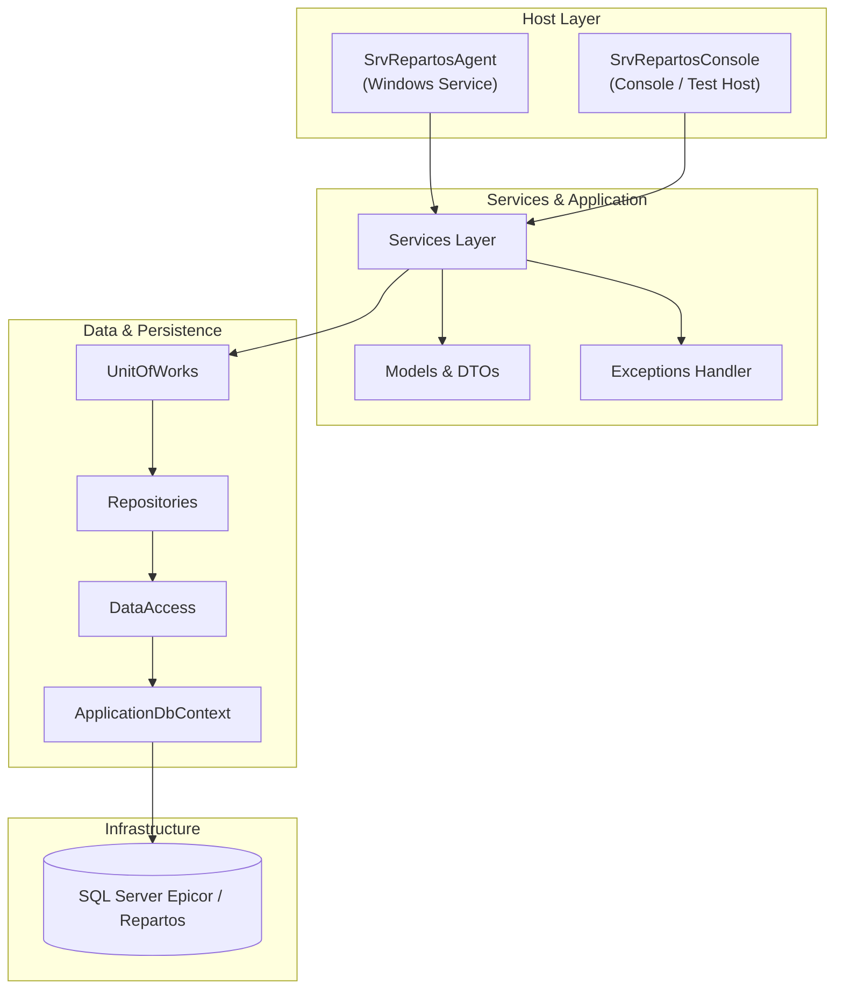
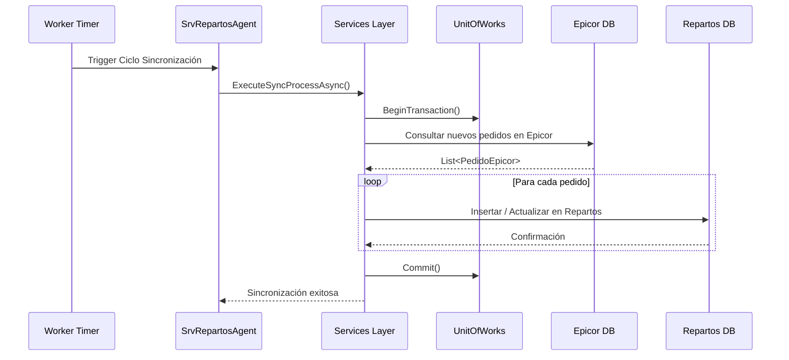
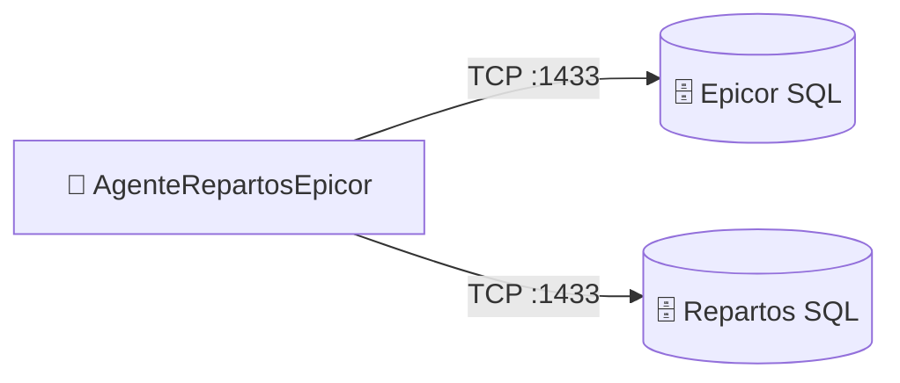

# AgenteRepartosEpicor — Documentación Técnica

> **Tipo:** WindowsService / SharedLib
> **Framework:** .NET Framework 4.7.2
> **Target:** .NET Framework 4.7.2
> **Última actualización:** 2026-08-13
> **Estado:** ✅ Producción

---

## Sección 1 — Propósito y Responsabilidad

- **Propósito:** Servicio Windows de integración (`SrvRepartosAgent`) y consola de prueba (`SrvRepartosConsole`) para la sincronización bidireccional de pedidos, clientes, inventarios y estados de entrega entre el ERP Epicor y la base de datos operativa de Repartos.
- **Qué problemas de negocio resuelve:** Asegura la consistencia de datos entre el sistema ERP central (Epicor) y las rutas de reparto locales en las sucursales de Grupo Boxito.
- **Qué NO hace:** No procesa pasarelas de pago ni genera interfaces de usuario para clientes finales.

---

## Sección 2 — Diagrama de Arquitectura Interna



---

## Sección 3 — Stack Tecnológico

| Categoría | Paquete / Tecnología | Versión | Propósito en este componente |
|-----------|---------------------|---------|------------------------------|
| Framework | .NET Framework / ServiceProcess | 4.7.2 | Host de servicio Windows |
| ORM / Data | Entity Framework | 6.4.4 | Acceso a SQL Server |
| Logging | NLog / built-in | Custom | Registro de auditoría y errores |
| Testing | MSTest / xUnit | Standard | Pruebas de integración de servicios |

---

## Sección 4 — Estructura del Proyecto

```
AgenteRepartosEpicor/SrvRepartosAgent/
├── SrvRepartosAgent/          # Servicio Windows principal
├── SrvRepartosConsoleTest/   # Aplicación de consola para pruebas locales
├── ApplicationDbContext/     # Contexto de base de datos EF
├── DataAccess/               # Capa de acceso a datos base
├── Repositories/             # Repositorios específicos de Epicor/Repartos
├── UnitOfWorks/              # Control de transacciones (Unit of Work)
├── Entities/                 # Entidades de dominio
├── Services/                 # Lógica de sincronización con Epicor
├── Models/                   # Modelos y DTOs
├── Exceptions/               # Excepciones personalizadas de negocio
└── SrvRepartosAgent.sln      # Solución MSBuild
```

---

## Sección 5 — Configuración y Variables de Entorno

| Key (path completo) | Tipo | Requerido | Descripción | Ejemplo seguro |
|---------------------|------|-----------|-------------|----------------|
| `ConnectionStrings:EpicorDB` | string | ✅ | Conexión a base de datos Epicor ERP | `Server=epicor_db;Database=EpicorLive;Trusted_Connection=True;` |
| `ConnectionStrings:RepartosDB` | string | ✅ | Conexión a base de datos Repartos | `Server=sql_rep;Database=Repartos;Trusted_Connection=True;` |
| `Sync:IntervalMinutes` | int | No | Frecuencia de sincronización de pedidos | `10` |

---

## Sección 6 — Endpoints / Interfaces Públicas

Componente backend de servicio en segundo plano (Windows Service). No expone interfaces HTTP públicas. Su ejecución es controlada mediante el ciclo de vida de servicios de Windows (Start, Stop, Pause).

---

## Sección 7 — Flujos de Datos Críticos



---

## Sección 8 — Modelo de Datos

- **DbContext:** `ApplicationDbContext` gestiona la conexión con las bases de datos transaccionales.
- **Patrón:** Repository Pattern + Unit of Work (`UnitOfWorks`, `Repositories`).

---

## Sección 9 — Seguridad

- **Credenciales de Base de Datos:** Almacenadas en App.config con cifrado a nivel de sección (`configSections` / `cipher`).
- **Permisos:** Servicio ejecutado bajo credenciales de usuario de red con permisos específicos en SQL Server.

---

## Sección 10 — Manejo de Errores y Logging

- **Logging:** Registro detallado de errores de conexión con ERP Epicor y excepciones transaccionales.
- **Manejo de Excepciones:** Jerarquía de excepciones personalizadas en el proyecto `Exceptions`.

---

## Sección 11 — Conexiones con Otros Componentes



| Destino | Protocolo | Puerto | Dirección | Propósito |
|---------|-----------|--------|-----------|-----------|
| Epicor DB | TCP | 1433 | Outbound | Lectura de pedidos y catálogos ERP |
| Repartos DB | TCP | 1433 | Outbound | Escritura y actualización de rutas |

---

## Sección 12 — Despliegue

- **Método:** Instalación de servicio Windows en servidor de integración mediante `sc create` o script de instalación PowerShell.
- **Prerrequisitos:** .NET Framework 4.7.2 Runtime, conectividad de red con instancias SQL Server de Epicor y Repartos.

---

## Sección 13 — Testing

- **Ejecución:** Pruebas funcionales locales mediante la aplicación de consola `SrvRepartosConsoleTest`.

---

## Sección 14 — Consideraciones y Deuda Técnica

| Prioridad | Área | Hallazgo | Mejora sugerida | Impacto |
|-----------|------|----------|-----------------|---------|
| 🟡 Media | Mantenibilidad | Acoplamiento estricto con estructura SQL de Epicor | Encapsular en adaptadores de repositorio genéricos | Resiliencia ante cambios en esquema ERP |
| 🟢 Baja | Observabilidad | Monitoreo manual de logs en archivos | Integrar colector centralizado de logs (Elastic / Seq) | Rapidez de diagnóstico |
