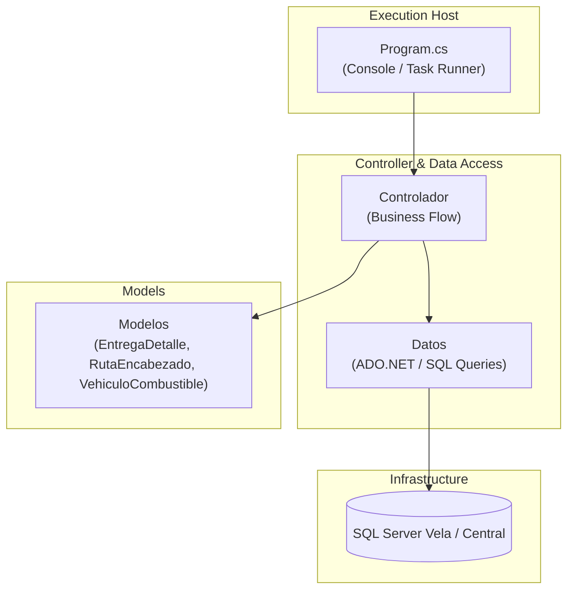
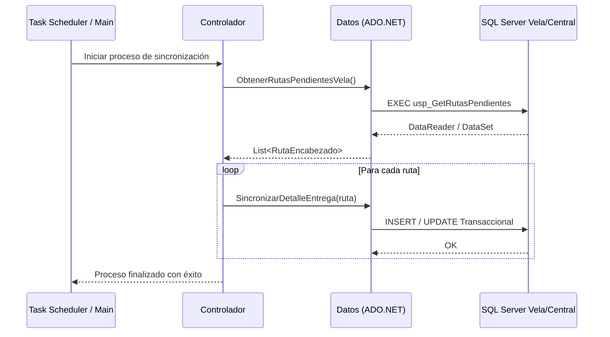
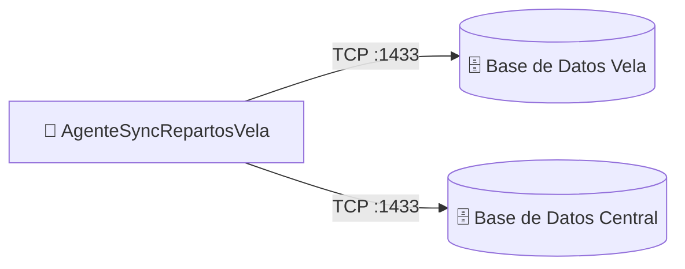

# AgenteSyncRepartosVela — Documentación Técnica

> **Tipo:** WindowsService / Console / SharedLib
> **Framework:** .NET Framework 4.7.2
> **Target:** .NET Framework 4.7.2
> **Última actualización:** 2026-08-13
> **Estado:** ✅ Producción

---

## Sección 1 — Propósito y Responsabilidad

- **Propósito:** Aplicación de consola / agente desatendido (`AgenteRepartos`) encargado de la sincronización de datos específicos para la sucursal/rama Vela, abarcando sucursales, rutas, detalles de entrega y consumo de combustible vehicular.
- **Qué problemas de negocio resuelve:** Mantiene sincronizada la información operativa de repartos y combustible de la sucursal Vela con el servidor central de Grupo Boxito.
- **Qué NO hace:** No maneja facturación electrónica ni pasarelas de pago de clientes.

---

## Sección 2 — Diagrama de Arquitectura Interna



---

## Sección 3 — Stack Tecnológico

| Categoría | Paquete / Tecnología | Versión | Propósito en este componente |
|-----------|---------------------|---------|------------------------------|
| Framework | .NET Framework (Console App) | 4.7.2 | Ejecución de tareas programadas |
| Data Access | ADO.NET (`System.Data.SqlClient`) | 4.8 | Consultas y ejecución de comandos SQL |
| Config | System.Configuration | 4.0 | Lectura de connection strings y parámetros |

---

## Sección 4 — Estructura del Proyecto

```
AgenteSyncRepartosVela/AgenteRepartos/AgenteRepartos/
├── Clases/
│   └── Constants.cs          # Constantes globales del agente
├── Controller/
│   └── Controlador.cs        # Orquestador de lógica de sincronización
├── Data/
│   └── Datos.cs              # Capa de acceso a datos ADO.NET
├── Modelo/
│   ├── EntregaDetalle.cs     # Entidad de detalle de entrega
│   ├── EntregaDomicilio.cs   # Entidad de entrega a domicilio
│   ├── RutaDetalle.cs        # Detalle de ruta de reparto
│   ├── RutaEncabezado.cs     # Encabezado de ruta
│   ├── RutaEntregaDetalle.cs # Relación ruta-entrega
│   └── VehiculoCombustible.cs# Registro de combustible vehicular
├── Program.cs                # Punto de entrada de la consola
├── App.config                # Configuración y cadenas de conexión
└── AgenteRepartos.csproj     # Archivo de proyecto
```

---

## Sección 5 — Configuración y Variables de Entorno

| Key (path completo) | Tipo | Requerido | Descripción | Ejemplo seguro |
|---------------------|------|-----------|-------------|----------------|
| `ConnectionStrings:VelaDB` | string | ✅ | Conexión a base de datos sucursal Vela | `Server=vela_db;Database=RepartosVela;Trusted_Connection=True;` |
| `ConnectionStrings:CentralDB` | string | ✅ | Conexión a base de datos central | `Server=central_db;Database=RepartosCentral;Trusted_Connection=True;` |
| `AppSettings:SyncInterval` | int | No | Tiempo de espera entre ciclos (segundos) | `300` |

---

## Sección 6 — Endpoints / Interfaces Públicas

Aplicación de consola ejecutable mediante programador de tareas de Windows (`Task Scheduler`) o servicio de Windows. No expone interfaces de red ni endpoints HTTP.

---

## Sección 7 — Flujos de Datos Críticos



---

## Sección 8 — Modelo de Datos

- **Modelos fuertemente tipados:** `RutaEncabezado`, `RutaDetalle`, `EntregaDetalle`, `VehiculoCombustible`.
- **Acceso a datos:** Consultas SQL directas y Stored Procedures mediante ADO.NET (`SqlCommand`, `SqlDataReader`).

---

## Sección 9 — Seguridad

- **Credenciales:** Almacenadas en App.config con acceso restringido en el sistema de archivos del servidor de sucursal.
- **Ejecución:** Requiere permisos de ejecución local y conectividad de red hacia las instancias de SQL Server configuradas.

---

## Sección 10 — Manejo de Errores y Logging

- **Logging:** Registro de excepciones en consola y archivos de log locales mediante manejo de bloques `try-catch`.
- **Resiliencia:** Reintentos automáticos ante cortes intermitentes de red en sucursales remotas.

---

## Sección 11 — Conexiones con Otros Componentes



| Destino | Protocolo | Puerto | Dirección | Propósito |
|---------|-----------|--------|-----------|---------------|
| Base de Datos Vela | TCP | 1433 | Outbound | Lectura de transacciones locales |
| Base de Datos Central | TCP | 1433 | Outbound | Consolidación de datos de ruta y combustible |

---

## Sección 12 — Despliegue

- **Método:** Copia de binarios compilados en servidor de sucursal Vela y configuración en Programador de Tareas de Windows.
- **Prerrequisitos:** .NET Framework 4.7.2 Runtime, conectividad SQL Server.

---

## Sección 13 — Testing

- **Ejecución:** Ejecución manual en línea de comandos (`AgenteRepartos.exe`) con modo de depuración activado.

---

## Sección 14 — Consideraciones y Deuda Técnica

| Prioridad | Área | Hallazgo | Mejora sugerida | Impacto |
|-----------|------|----------|-----------------|---------|
| 🟡 Media | Arquitectura | Uso de ADO.NET puro sin ORM | Estandarizar con patrones de repositorio si se expande | Mantenibilidad del código SQL embebido |
| 🟢 Baja | Resiliencia | Falta de cola de mensajes offline | Implementar patrón de persistencia local ante caída de red | Robustez operativa en sucursales |
