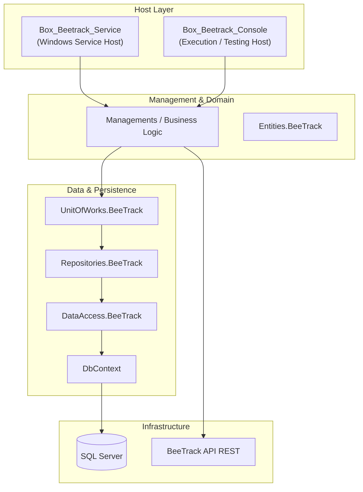
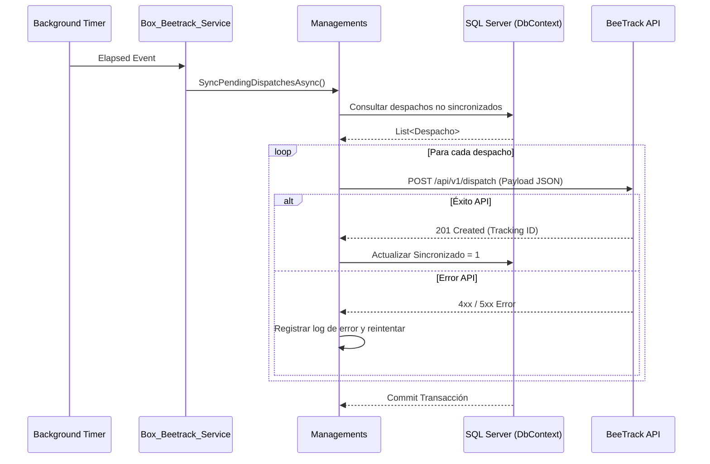
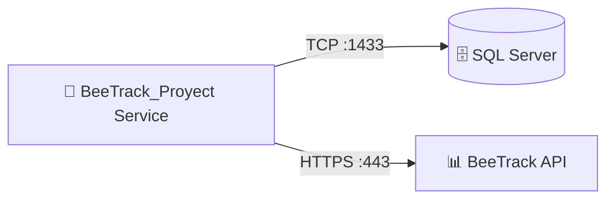

# BeeTrack_Proyect — Documentación Técnica

> **Tipo:** WindowsService / SharedLib
> **Framework:** .NET Framework 4.7.2
> **Target:** .NET Framework 4.7.2
> **Última actualización:** 2026-08-13
> **Estado:** ✅ Producción

---

## Sección 1 — Propósito y Responsabilidad

- **Propósito:** Servicio Windows desatendido (`Box_Beetrack_Service`) y aplicación de consola (`Box_Beetrack_Console`) encargados de sincronizar de forma bidireccional los despachos y estados de entrega entre la base de datos local de Grupo Boxito y la plataforma BeeTrack.
- **Qué problemas de negocio resuelve:** Automatiza el envío de guías de despacho a BeeTrack y la recepción de confirmaciones de entrega sin intervención manual del operador logístico.
- **Qué NO hace:** No expone endpoints HTTP públicos ni gestiona la interfaz gráfica de usuario.

---

## Sección 2 — Diagrama de Arquitectura Interna



---

## Sección 3 — Stack Tecnológico

| Categoría | Paquete / Tecnología | Versión | Propósito en este componente |
|-----------|---------------------|---------|------------------------------|
| Framework | .NET Framework / WinService | 4.7.2 | Hosting como servicio de Windows |
| ORM / Data | Entity Framework | 6.4.4 | Acceso a base de datos relacional |
| Logging | NLog | 4.7.15 | Registro de auditoría y errores |
| HTTP | System.Net.Http | 4.3.4 | Comunicación REST con BeeTrack API |

---

## Sección 4 — Estructura del Proyecto

```
BeeTrack_Proyect/
├── BeeTrack/                 # Windows Service (`Box_Beetrack_Service`)
├── ConsoleApp1/              # Consola de pruebas (`Box_Beetrack_Console`)
├── DbContext/                # Contexto de base de datos Entity Framework
├── Entities.BeeTrack/        # Entidades y modelos de dominio
├── DataAccess.BeeTrack/      # Capa de acceso a datos y repositorios base
├── Repositories.BeeTrack/    # Implementación de repositorios específicos
├── UnitOfWorks.BeeTrack/     # Patrón Unit of Work para transacciones
└── Managements/              # Lógica de negocio y llamadas a API BeeTrack
```

---

## Sección 5 — Configuración y Variables de Entorno

| Key (path completo) | Tipo | Requerido | Descripción | Ejemplo seguro |
|---------------------|------|-----------|-------------|----------------|
| `ConnectionStrings:BeeTrackDB` | string | ✅ | Conexión SQL Server | `Server=.;Database=Repartos;Trusted_Connection=True;` |
| `BeeTrack:ApiUrl` | string | ✅ | URL base del API de BeeTrack | `https://app.beetrack.com/api/v1` |
| `BeeTrack:AuthToken` | string | ✅ | Token de autenticación BeeTrack | `***` (secret) |
| `Service:TimerIntervalMs` | int | No | Intervalo de ejecución del worker | `30000` |

---

## Sección 6 — Endpoints / Interfaces Públicas

Al tratarse de un Windows Service y aplicación de consola, no expone endpoints REST HTTP entrantes. Su interfaz pública consiste en tareas programadas (workers) que ejecutan ciclos de sincronización periódicos contra BeeTrack API.

---

## Sección 7 — Flujos de Datos Críticos



---

## Sección 8 — Modelo de Datos

- **DbContext:** Gestiona entidades de despacho, rutas, clientes y estados de sincronización con BeeTrack.
- **Patrón:** Repository Pattern + Unit of Work (`UnitOfWorks.BeeTrack`).

---

## Sección 9 — Seguridad

- **Credenciales:** Tokens de acceso a BeeTrack almacenados en App.config / AppSettings cifrados.
- **Permisos de servicio:** Ejecución bajo cuenta de servicio dedicada en Windows con privilegios mínimos necesarios.

---

## Sección 10 — Manejo de Errores y Logging

- **Logging:** NLog con registro detallado de excepciones de red y base de datos.
- **Manejo de transacciones:** Uso de `DbContext` transaccional con rollback automático ante fallos de persistencia.

---

## Sección 11 — Conexiones con Otros Componentes



| Destino | Protocolo | Puerto | Dirección | Propósito |
|---------|-----------|--------|-----------|-----------|
| SQL Server | TCP | 1433 | Outbound | Persistencia de datos locales |
| BeeTrack API | HTTPS | 443 | Outbound | Sincronización de guías y despachos |

---

## Sección 12 — Despliegue

- **Método:** Instalación de Windows Service mediante comandos `sc create BoxBeeTrack binPath=...` o instalador MSI / ClickOnce.
- **Prerrequisitos:** .NET Framework 4.7.2 Runtime, acceso de red a SQL Server y BeeTrack.

---

## Sección 13 — Testing

- **Ejecución:** Pruebas unitarias y de integración ejecutadas mediante `Box_Beetrack_Console` en modo interactivo.

---

## Sección 14 — Consideraciones y Deuda Técnica

| Prioridad | Área | Hallazgo | Mejora sugerida | Impacto |
|-----------|------|----------|-----------------|---------|
| 🟡 Media | Arquitectura | Implementación basada en .NET Framework 4.7.2 | Migrar a .NET 8 Worker Service | Optimización de rendimiento y soporte a largo plazo |
| 🟢 Baja | Monitoreo | Falta de health checks activos | Integrar alertas automáticas ante fallos de sincronización | Detección temprana de incidencias |
