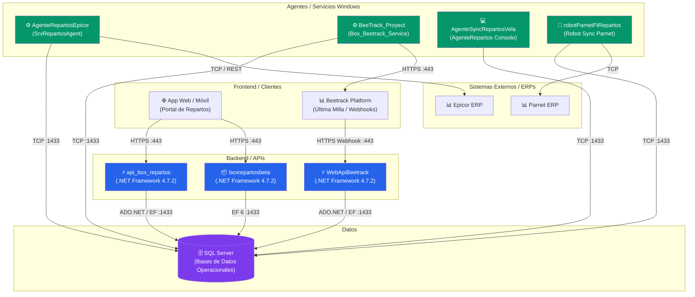
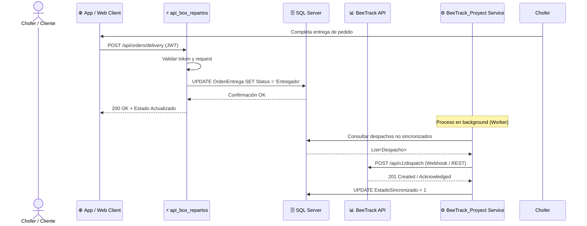

# Repartos — Sistema Integral de Gestión Logística y Entregas

> **Grupo Boxito** — Ecosistema multi-componente para la gestión centralizada de rutas de reparto, sincronización de pedidos con ERPs (Epicor y Parnet), pasarelas de logística de última milla (Beetrack) y generación de reportes operativos.

## Tabla de Contenidos

- [Arquitectura General del Sistema](#arquitectura-general-del-sistema)
- [Componentes del Proyecto](#componentes-del-proyecto)
- [Matriz de Dependencias](#matriz-de-dependencias)
- [Stack Tecnológico Global](#stack-tecnológico-global)
- [Flujo de Datos Principal (End-to-End)](#flujo-de-datos-principal-end-to-end)
- [Requisitos del Sistema](#requisitos-del-sistema)
- [Despliegue por Componente](#despliegue-por-componente)
- [Estructura del Repositorio](#estructura-del-repositorio)
- [Decisiones Arquitectónicas (ADRs)](#decisiones-arquitectónicas-adrs)
- [Deuda Técnica Consolidada](#deuda-technical-consolidada)
- [Documentación Detallada por Componente](#documentación-detallada-por-componente)

---

## Arquitectura General del Sistema



---

## Componentes del Proyecto

| Componente | Tipo | Framework | Estado | Documentación Técnica |
|------------|------|-----------|--------|----------------------|
| `api_box_repartos` | API REST | .NET Framework 4.7.2 | ✅ Producción | [📄 Doc técnica](./docs/api_box_repartos/TECHNICAL-DOC.md) |
| `WebApiBeetrack` | API REST | .NET Framework 4.7.2 | ✅ Producción | [📄 Doc técnica](./docs/WebApiBeetrack/TECHNICAL-DOC.md) |
| `boxrepartosbeta` | API / Web / Reports | .NET Framework 4.7.2 | ✅ Producción | [📄 Doc técnica](./docs/boxrepartosbeta/TECHNICAL-DOC.md) |
| `BeeTrack_Proyect` | Windows Service | .NET Framework 4.7.2 | ✅ Producción | [📄 Doc técnica](./docs/BeeTrack_Proyect/TECHNICAL-DOC.md) |
| `AgenteRepartosEpicor` | Windows Service | .NET Framework 4.7.2 | ✅ Producción | [📄 Doc técnica](./docs/AgenteRepartosEpicor/TECHNICAL-DOC.md) |
| `AgenteSyncRepartosVela` | Console App / Agent | .NET Framework 4.7.2 | ✅ Producción | [📄 Doc técnica](./docs/AgenteSyncRepartosVela/TECHNICAL-DOC.md) |
| `robotParnetFtRepartos` | Console / Robot | .NET Framework 4.7.2 | ✅ Producción | [📄 Doc técnica](./docs/robotParnetFtRepartos/TECHNICAL-DOC.md) |

---

## Matriz de Dependencias

| | api_box_repartos | WebApiBeetrack | boxrepartosbeta | BeeTrack_Proyect | AgenteRepartosEpicor | AgenteSyncRepartosVela | robotParnetFtRepartos | SQL Server | Beetrack | Epicor ERP | Parnet ERP |
|---|---|---|---|---|---|---|---|---|---|---|---|
| **api_box_repartos** | — | — | — | — | — | — | — | ✅ EF 6 | — | — | — |
| **WebApiBeetrack** | — | — | — | — | — | — | — | ✅ ADO.NET | 🔄 Webhook | — | — |
| **boxrepartosbeta** | — | — | — | — | — | — | — | ✅ EF 6 | — | — | — |
| **BeeTrack_Proyect** | — | — | — | — | — | — | — | ✅ EF 6 | ⚡ REST | — | — |
| **AgenteRepartosEpicor** | — | — | — | — | — | — | — | ✅ EF 6 | — | ⚡ TCP/REST | — |
| **AgenteSyncRepartosVela** | — | — | — | — | — | — | — | ✅ ADO.NET | — | — | — |
| **robotParnetFtRepartos** | — | — | — | — | — | — | — | ✅ EF 6 | — | — | ⚡ TCP |

> ✅ = Dependencia directa, ⚡ = Dependencia crítica (falla = servicio afectado), 🔄 = Comunicación bidireccional

---

## Stack Tecnológico Global

| Capa | Tecnología | Versión | Componentes que la usan |
|------|------------|---------|------------------------|
| Runtime | .NET Framework | 4.7.2 | Todos |
| Base de datos | SQL Server | 2019 / 2022 | Todos |
| ORM | Entity Framework | 6.x | api_box_repartos, boxrepartosbeta, BeeTrack_Proyect, AgenteRepartosEpicor, robotParnetFtRepartos |
| Data Access | ADO.NET | 4.8 | WebApiBeetrack, AgenteSyncRepartosVela |
| Logging | NLog / log4net | 4.x | Todos |
| Reporting | Crystal Reports Engine | 13.0 | boxrepartosbeta |
| Protocolos | HTTP/REST, Webhooks | HTTPS | api_box_repartos, WebApiBeetrack, BeeTrack_Proyect |

---

## Flujo de Datos Principal (End-to-End)



---

## Requisitos del Sistema

| Requisito | Especificación |
|-----------|----------------|
| OS Servidor | Windows Server 2019 / 2022 |
| Runtime | .NET Framework 4.7.2 Developer Pack / Runtime |
| Base de datos | SQL Server 2019 o superior |
| RAM mínima servidor | 8 GB (Recomendado 16 GB) |
| Puertos requeridos | 443 (HTTPS), 1433 (TCP SQL Server) |
| IIS | IIS 10+ con ASP.NET 4.7 support |

---

## Despliegue por Componente

| Componente | Método | Destino | Prerrequisitos |
|------------|--------|---------|----------------|
| `api_box_repartos` | Web Deploy / Publish | IIS (Servidor Central) | .NET Framework 4.7.2 |
| `WebApiBeetrack` | Web Deploy / Publish | IIS (Servidor Central) | .NET Framework 4.7.2 |
| `boxrepartosbeta` | Web Deploy / Publish | IIS (Servidor Central) | .NET Framework 4.7.2, Crystal Reports Runtime |
| `BeeTrack_Proyect` | `sc create` / Script | Servidor de Servicios Windows | Cuenta de servicio dedicada |
| `AgenteRepartosEpicor` | `sc create` / Script | Servidor de Servicios Windows | Conectividad con Epicor ERP y Repartos DB |
| `AgenteSyncRepartosVela` | Task Scheduler / Binarios | Servidor Sucursal Vela | Conectividad de red local y central |
| `robotParnetFtRepartos` | Ejecutable / Batch | Servidor de Procesos Batch | Conectividad con Parnet ERP |

---

## Estructura del Repositorio

```
Repartos/
├── api_box_repartos/            # API REST principal para clientes móviles/web
├── WebApiBeetrack/              # API Webhook para integración con BeeTrack
├── boxrepartosbeta/             # Solución de backend, reportes Crystal y sincronización
├── BeeTrack_Proyect/            # Windows Service de sincronización BeeTrack
├── AgenteRepartosEpicor/        # Windows Service de integración con Epicor ERP
├── AgenteSyncRepartosVela/      # Agente de consola para sucursal Vela
├── robotParnetFtRepartos/       # Robot de sincronización con Parnet ERP
├── docs/                        # Documentación técnica por componente (14 secciones c/u)
└── README.md                    # Este archivo maestro
```

---

## Decisiones Arquitectónicas (ADRs)

| # | Decisión | Contexto | Fecha | Estado |
|---|----------|----------|-------|--------|
| 1 | Uso de .NET Framework 4.7.2 en todo el ecosistema | Ecosistema heredado con integración a Crystal Reports y ERPs legacy | 2026-08-13 | Aceptada |
| 2 | Desacoplamiento mediante Agentes y Servicios Windows | Aislar las tareas pesadas de sincronización con ERPs (Epicor/Parnet/BeeTrack) de las APIs web | 2026-08-13 | Aceptada |
| 3 | Base de datos relacional compartida SQL Server | Permite transaccionalidad cruzada y reportes unificados | 2026-08-13 | Aceptada |

---

## Deuda Técnica Consolidada

| Prioridad | Componente | Hallazgo | Impacto | Esfuerzo |
|-----------|------------|----------|---------|----------|
| 🔴 Alta | `boxrepartosbeta` | Dependencia de Crystal Reports en .NET Framework | Complejidad de mantenimiento y despliegue | L |
| 🟡 Media | Todos (.NET Framework 4.7.2) | Ecosistema en .NET Framework 4.7.2 | Fin del soporte a largo plazo de .NET Framework | L |
| 🟡 Media | `robotParnetFtRepartos` | Duplicidad de DAOs para múltiples bases de datos | Mantenibilidad del código SQL | M |
| 🟢 Baja | `WebApiBeetrack` | Configuración de CORS amplia | Seguridad perimetral | S |

---

## Documentación Detallada por Componente

1. ⚡ [api_box_repartos — Doc Técnica](./docs/api_box_repartos/TECHNICAL-DOC.md)
2. ⚡ [WebApiBeetrack — Doc Técnica](./docs/WebApiBeetrack/TECHNICAL-DOC.md)
3. 📦 [boxrepartosbeta — Doc Técnica](./docs/boxrepartosbeta/TECHNICAL-DOC.md)
4. ⚙️ [BeeTrack_Proyect — Doc Técnica](./docs/BeeTrack_Proyect/TECHNICAL-DOC.md)
5. ⚙️ [AgenteRepartosEpicor — Doc Técnica](./docs/AgenteRepartosEpicor/TECHNICAL-DOC.md)
6. 💻 [AgenteSyncRepartosVela — Doc Técnica](./docs/AgenteSyncRepartosVela/TECHNICAL-DOC.md)
7. 🤖 [robotParnetFtRepartos — Doc Técnica](./docs/robotParnetFtRepartos/TECHNICAL-DOC.md)
