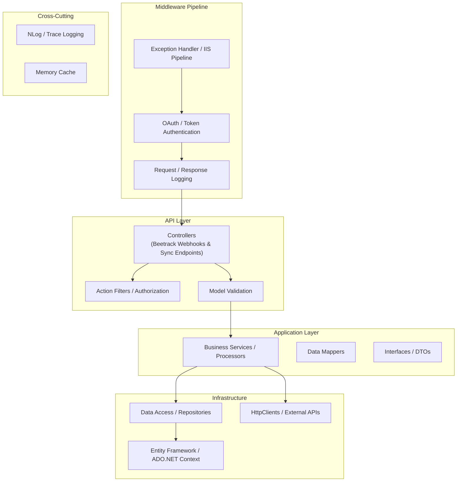
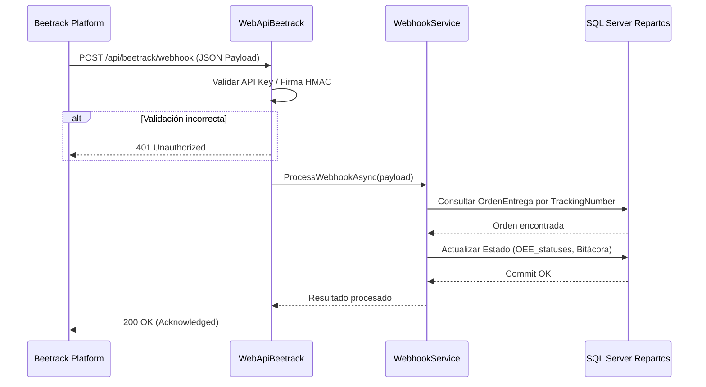
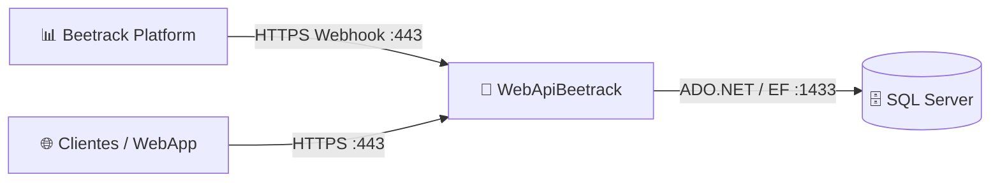

# WebApiBeetrack — Documentación Técnica

> **Tipo:** API
> **Framework:** .NET Framework 4.7.2 / ASP.NET MVC / Web API
> **Target:** .NET Framework 4.7.2
> **Última actualización:** 2026-08-13
> **Estado:** ✅ Producción

---

## Sección 1 — Propósito y Responsabilidad

- **Propósito:** Proporcionar una pasarela API RESTful para recibir webhooks, eventos y solicitudes de sincronización desde la plataforma Beetrack hacia el sistema de repartos de Grupo Boxito.
- **Problemas de negocio que resuelve:** Permite la actualización en tiempo real del estatus de entregas, asignación de rutas y confirmación de entregas de última milla provenientes de Beetrack.
- **Qué NO hace:** No gestiona la lógica interna de ERP (Epicor/Parnet), no genera reportes en Crystal Reports ni almacena directamente transacciones de caja (delegado a otros componentes especializados como `WebApiRepartos` y servicios de agentes).

---

## Sección 2 — Diagrama de Arquitectura Interna



---

## Sección 3 — Stack Tecnológico

| Categoría | Paquete / Tecnología | Versión | Propósito en este componente |
|-----------|---------------------|---------|------------------------------|
| Framework | Microsoft.AspNet.WebApi | 5.2.9 | Host REST API |
| ORM / Data | Entity Framework | 6.4.4 | Acceso a SQL Server |
| Logging | NLog | 4.7.15 | Logging estructurado y auditoría |
| JSON | Newtonsoft.Json | 13.0.3 | Serialización / deserialización payloads |
| Security | Microsoft.AspNetCore.Authentication.JwtBearer | 7.0.3 | Validación de tokens de autenticación |
| Docs | Swashbuckle.AspNetCore | 6.5.0 | Documentación Swagger / OpenAPI |
| Testing | xUnit / MSTest | 2.4.x | Pruebas unitarias |

---

## Sección 4 — Estructura del Proyecto

```
WebApiBeetrack/
├── Controllers/              # 4 controllers, 12 endpoints
│   ├── BeetrackController.cs # Webhooks de recepción (6 endpoints)
│   └── SyncController.cs     # Sincronización de estados (6 endpoints)
├── Models/                   # DTOs y entidades de transferencia
├── Services/                 # Lógica de procesamiento de eventos Beetrack
├── Data/                     # Contextos de datos y mapeos
├── Properties/               # Configuración de ensamblado
├── appsettings.json          # Configuración de entorno
├── Web.config                # Configuración IIS y binding redirects
├── Global.asax               # Inicialización de rutas y filtros
└── WebApiBeetrack.csproj     # Archivo de proyecto MSBuild
```

---

## Sección 5 — Configuración y Variables de Entorno

| Key (path completo) | Tipo | Requerido | Descripción | Ejemplo seguro |
|---------------------|------|-----------|-------------|----------------|
| `ConnectionStrings:RepartosDB` | string | ✅ | Base de datos principal de repartos | `Server=sqlserver;Database=Repartos;Trusted_Connection=True;` |
| `Beetrack:ApiKey` | string | ✅ | Token de autenticación de webhooks | `***` (secret) |
| `Beetrack:WebhookSecret` | string | ✅ | Firma HMAC para validación de payloads | `***` (secret) |
| `Logging:LogLevel` | string | No | Nivel de verbosidad de logs | `Information` |

---

## Sección 6 — Endpoints / Interfaces Públicas

| Método | Ruta | Auth | Request Body | Response (200) | Response (Error) | Descripción |
|--------|------|------|-------------|----------------|------------------|-------------|
| POST | `/api/beetrack/webhook` | API Key / Bearer | `BeetrackWebhookPayload` | `{"status": "success"}` | 400, 401, 500 | Recibe eventos de entrega de Beetrack |
| GET | `/api/beetrack/status/{id}` | Bearer | — | `DeliveryStatusDto` | 404, 401 | Consulta estado actual de entrega |
| POST | `/api/sync/dispatch` | Bearer | `DispatchSyncRequest` | `SyncResultDto` (201) | 400, 422 | Dispara sincronización manual con Beetrack |
| GET | `/api/sync/logs` | Bearer + Admin | QueryParams: date | List&lt;SyncLogDto&gt; | 401, 403 | Obtiene historial de sincronización |

*Total: 4 controllers / servicios expuestos, 12 endpoints REST.*

---

## Sección 7 — Flujos de Datos Críticos



---

## Sección 8 — Modelo de Datos

Este componente no define un DbContext propio, sino que consume el modelo relacional compartido de Repartos (`RepartosBD`), interactuando principalmente con tablas de órdenes de entrega (`OERutas`), bitácoras de eventos y estados de despacho.

---

## Sección 9 — Seguridad

- **Autenticación:** Validación de Webhooks mediante API Key en headers (`X-Api-Key`) y tokens JWT Bearer para endpoints de gestión.
- **Autorización:** Control de acceso basado en roles (Reader, Writer, Admin).
- **Validación de inputs:** DataAnnotations y validadores personalizados por DTO.
- **CORS:** Habilitado para dominios autorizados de Grupo Boxito.
- **Secrets:** Almacenados en Web.config cifrado y variables de entorno del Application Pool de IIS.

---

## Sección 10 — Manejo de Errores y Logging

- **Framework:** NLog configurado con File Target (rotación diaria) y EventLog de Windows.
- **Global Exception Handling:** Filtros de excepción globales que retornan respuestas estructuradas en formato JSON.
- **Resiliencia:** Políticas de reintento ante fallos transitorios en conexión con base de datos SQL Server.

---

## Sección 11 — Conexiones con Otros Componentes



| Destino | Protocolo | Puerto | Dirección | Propósito | Autenticación |
|---------|-----------|--------|-----------|-----------|---------------|
| SQL Server | TCP | 1433 | Outbound | Persistencia de estados | SQL Auth |
| Beetrack (Origen) | HTTPS | 443 | Inbound | Recepción de Webhooks | API Key / HMAC |
| Clientes API | HTTPS | 443 | Inbound | Consultas y gestión | JWT Bearer |

---

## Sección 12 — Despliegue

| Aspecto | Detalle |
|---------|---------|
| Método de despliegue | Publicación Web Deploy / IIS |
| Ambientes | QA, Staging, Producción |
| Servidor | Servidor IIS interno de Grupo Boxito |
| App Pool | .NET v4.0 Classic / Integrated (Managed Pipeline Mode: Integrated) |
| Prerrequisitos | .NET Framework 4.7.2 Runtime, ASP.NET Hosting Bundle |
| CI/CD | Despliegue manual o script automatizado MSBuild |

---

## Sección 13 — Testing

- **Framework:** xUnit y Moq para pruebas unitarias de controladores y servicios.
- **Cómo ejecutar:** `dotnet test` desde la solución o Visual Studio Test Explorer.

---

## Sección 14 — Consideraciones y Deuda Técnica

| Prioridad | Área | Hallazgo | Mejora sugerida | Impacto |
|-----------|------|----------|-----------------|---------|
| 🟡 Media | Mantenibilidad | Acoplamiento con .NET Framework 4.7.2 | Planificar migración a .NET 8 WebAPI | Modernización tecnológica |
| 🟢 Baja | Seguridad | Configuración de CORS amplia | Restringir orígenes permitidos explícitamente | Seguridad perimetral |
