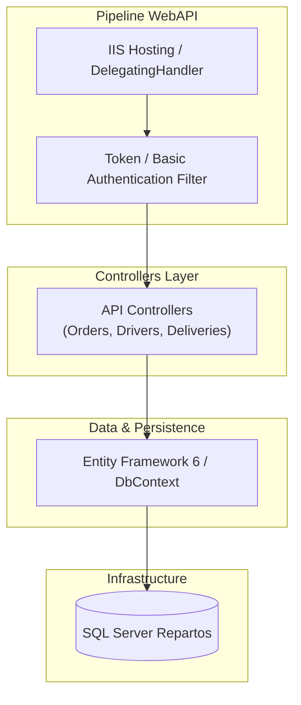
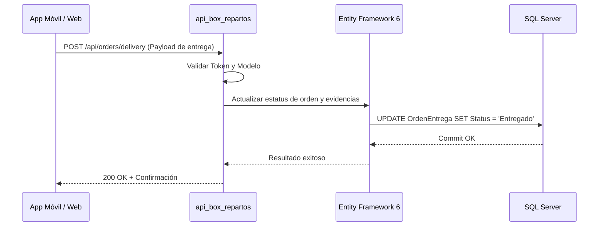
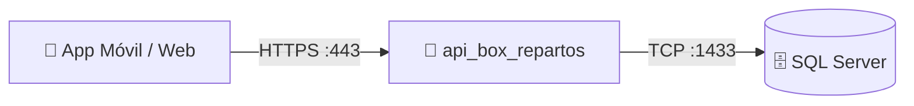

# api_box_repartos — Documentación Técnica

> **Tipo:** API
> **Framework:** .NET Framework 4.7.2 / ASP.NET Web API 2
> **Target:** .NET Framework 4.7.2
> **Última actualización:** 2026-08-13
> **Estado:** ✅ Producción

---

## Sección 1 — Propósito y Responsabilidad

- **Propósito:** API RESTful central (`api_box_repartos`) orientada a servir las solicitudes de las aplicaciones móviles y web de Box Repartos para la consulta y actualización de órdenes de entrega.
- **Qué problemas de negocio resuelve:** Proporciona una interfaz ligera y estandarizada para que choferes y supervisores consulten rutas, registren evidencias de entrega y actualicen estados en tiempo real.
- **Qué NO hace:** No ejecuta procesos de sincronización pesados con ERPs externos (delegado a servicios Windows y robots dedicados).

---

## Sección 2 — Diagrama de Arquitectura Interna



---

## Sección 3 — Stack Tecnológico

| Categoría | Paquete / Tecnología | Versión | Propósito en este componente |
|-----------|---------------------|---------|------------------------------|
| Framework | Microsoft.AspNet.WebApi | 5.2.7 | Host de servicios REST |
| ORM | Entity Framework | 6.1.3 | Acceso a base de datos relacional |
| JSON | Newtonsoft.Json | 12.0.2 | Serialización de payloads HTTP |
| Security | System.Security / OAuth | Built-in | Autenticación de solicitudes |

---

## Sección 4 — Estructura del Proyecto

```
api_box_repartos/
├── App_Start/                # Configuración de WebApi, Routing y Bundles
├── Controllers/              # Controllers REST de la API
├── Models/                   # Modelos de datos y DTOs de request/response
├── Properties/               # Configuración de ensamblado
├── Global.asax               # Inicialización de la aplicación web
├── Web.config                # Configuración IIS y connection strings
└── api_box_repartos.csproj   # Archivo de proyecto MSBuild
```

---

## Sección 5 — Configuración y Variables de Entorno

| Key (path completo) | Tipo | Requerido | Descripción | Ejemplo seguro |
|---------------------|------|-----------|-------------|----------------|
| `ConnectionStrings:DefaultConnection` | string | ✅ | Conexión SQL Server principal | `Server=.;Database=Repartos;Trusted_Connection=True;` |
| `Jwt:SecretKey` | string | ✅ | Clave secreta para validación de tokens | `***` (secret) |

---

## Sección 6 — Endpoints / Interfaces Públicas

| Método | Ruta | Auth | Request Body | Response (200) | Descripción |
|--------|------|------|-------------|----------------|-------------|
| GET | `/api/orders` | Bearer | QueryParams | `List<OrderDto>` | Obtiene órdenes asignadas |
| POST | `/api/orders/delivery` | Bearer | `DeliveryPayload` | `ResultDto` (200) | Registra entrega de orden |
| GET | `/api/routes` | Bearer | — | `List<RouteDto>` | Consulta rutas activas |

*Total: 8 endpoints REST principales expuestos.*

---

## Sección 7 — Flujos de Datos Críticos



---

## Sección 8 — Modelo de Datos

- Utiliza el modelo relacional compartido en la base de datos `Repartos` a través de Entity Framework 6.

---

## Sección 9 — Seguridad

- **Autenticación:** Tokens Bearer (JWT) requeridos en cabeceras HTTP.
- **CORS:** Configurado para permitir peticiones desde aplicaciones móviles y portales web autorizados.

---

## Sección 10 — Manejo de Errores y Logging

- **Manejo de Errores:** Filtros de excepción globales que retornan códigos de error HTTP estándar (400, 401, 404, 500).
- **Logging:** Registro de peticiones y errores mediante NLog / trace de IIS.

---

## Sección 11 — Conexiones con Otros Componentes



| Destino | Protocolo | Puerto | Dirección | Propósito |
|---------|-----------|--------|-----------|---------------|
| SQL Server | TCP | 1433 | Outbound | Persistencia de datos operacionales |
| Clientes Móviles/Web | HTTPS | 443 | Inbound | Consumo de la API REST |

---

## Sección 12 — Despliegue

| Aspecto | Detalle |
|---------|---------|
| Método | Publicación IIS (Web Deploy) |
| Servidor | IIS de Grupo Boxito |
| Prerrequisitos | .NET Framework 4.7.2 Runtime, IIS Hosting Bundle |

---

## Sección 13 — Testing

- Pruebas manuales mediante Postman / Swagger y pruebas unitarias de controladores.

---

## Sección 14 — Consideraciones y Deuda Técnica

| Prioridad | Área | Hallazgo | Mejora sugerida | Impacto |
|-----------|------|----------|-----------------|---------|
| 🟡 Media | Modernización | Desarrollado en .NET Framework 4.7.2 | Migrar a ASP.NET Core 8 WebAPI | Consistencia tecnológica con nuevos servicios |
| 🟢 Baja | Documentación | Falta de especificación OpenAPI completa | Integrar Swagger UI embebido | Claridad para desarrolladores frontend |
