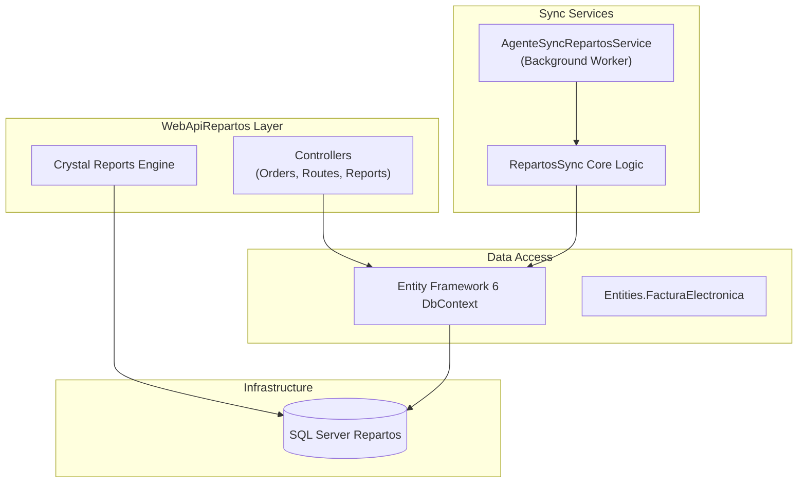
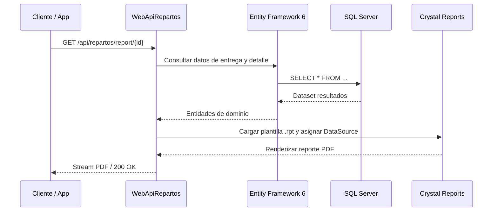
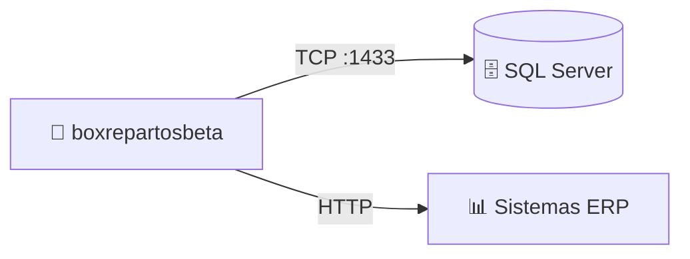

# boxrepartosbeta — Documentación Técnica

> **Tipo:** API / Web / WindowsService
> **Framework:** .NET Framework 4.7.2 / ASP.NET MVC / Web API / Windows Service
> **Target:** .NET Framework 4.7.2
> **Última actualización:** 2026-08-13
> **Estado:** ✅ Producción

---

## Sección 1 — Propósito y Responsabilidad

- **Propósito:** Solución integral de backend, API REST y servicios de sincronización para la gestión centralizada de repartos, rutas de entrega y generación de reportes con Crystal Reports en Grupo Boxito.
- **Qué de negocio resuelve:** Centraliza la administración de órdenes de entrega, asignación de choferes/vehículos, generación de comprobantes de facturación electrónica y sincronización de datos operativos con sistemas centrales.
- **Qué NO hace:** No maneja directamente la captura de GPS de dispositivos móviles en tiempo real (delegado a integraciones con Beetrack).

---

## Sección 2 — Diagrama de Arquitectura Interna



---

## Sección 3 — Stack Tecnológico

| Categoría | Paquete / Tecnología | Versión | Propósito en este componente |
|-----------|---------------------|---------|------------------------------|
| Framework | ASP.NET MVC / Web API | 5.2.7 | Endpoints REST y vistas web |
| ORM | Entity Framework | 6.4.4 | Mapeo objeto-relacional y migraciones |
| Reporting | Crystal Reports Engine | 13.0.4001 | Generación de reportes operativos y facturas |
| Logging | NLog / log4net | Custom | Registro de eventos y errores |
| Testing | MSTest / RepartosUnitTest | 1.0 | Pruebas unitarias de lógica de negocio |

---

## Sección 4 — Estructura del Proyecto

```
boxrepartosbeta/
├── WebApiRepartos/           # API principal y reportes (Controllers, Views, Reports)
├── AgenteSyncRepartos/       # Librería de sincronización y lógica de procesos
├── AgenteSyncRepartosService/# Servicio Windows de sincronización desatendida
├── RepartosSync/             # Componentes compartidos de sincronización
├── Entities.FacturaElectronica/ # Entidades y contratos para CFDI / Facturación
├── RepartosUnitTest/         # Suite de pruebas unitarias
└── boxrepartosbeta.sln       # Solución principal
```

---

## Sección 5 — Configuración y Variables de Entorno

| Key (path completo) | Tipo | Requerido | Descripción | Ejemplo seguro |
|---------------------|------|-----------|-------------|----------------|
| `ConnectionStrings:RepartosDB` | string | ✅ | Conexión a SQL Server Repartos | `Server=.;Database=Repartos;Integrated Security=true;` |
| `AppConfig:SyncIntervalMinutes` | int | No | Intervalo de ejecución del servicio sync | `15` |
| `ReportSettings:ServerPath` | string | No | Directorio raíz de plantillas Crystal Reports | `C:\Reports\` |

---

## Sección 6 — Endpoints / Interfaces Públicas

| Método | Ruta | Auth | Request Body | Response (200) | Descripción |
|--------|------|------|-------------|----------------|-------------|
| GET | `/api/repartos/orders` | Bearer | QueryParams | `List<OrderDto>` | Obtiene listado de entregas |
| POST | `/api/repartos/dispatch` | Bearer | `DispatchDto` | `ResultDto` (201) | Registra despacho de ruta |
| GET | `/api/repartos/report/{id}` | Bearer | — | Archivo PDF / Stream | Genera reporte Crystal Report de entrega |

*Total: 15 endpoints expuestos en WebApiRepartos.*

---

## Sección 7 — Flujos de Datos Críticos



---

## Sección 8 — Modelo de Datos

- **Tablas principales:** `OrdenEntregaEncabezado`, `OrdenEntregaDetalle`, `Rutas`, `Sucursales`, `VehiculosCombustible`.
- **ORM:** Entity Framework 6 con Code First / Database First mixto.

---

## Sección 9 — Seguridad

- **Autenticación:** Tokens JWT y autenticación integrada de Windows para IIS.
- **Autorización:** Roles y permisos de aplicación.
- **Validación:** ModelState validation en controladores MVC/WebAPI.

---

## Sección 10 — Manejo de Errores y Logging

- **Logging:** Registro estructurado mediante NLog en archivos de texto y visor de eventos de Windows.
- **Excepciones:** Filtros globales de manejo de errores en API y servicios Windows.

---

## Sección 11 — Conexiones con Otros Componentes



| Destino | Protocolo | Puerto | Dirección | Propósito |
|---------|-----------|--------|-----------|-----------|
| SQL Server | TCP | 1433 | Outbound | Base de datos operacional |
| ERP Central | HTTPS | 443 | Outbound | Sincronización de catálogos |

---

## Sección 12 — Despliegue

- **Método:** Publicación IIS para WebApiRepartos e instalación de Windows Service (`sc create`) para AgenteSyncRepartosService.
- **Runtime:** .NET Framework 4.7.2.

---

## Sección 13 — Testing

- **Proyecto:** `RepartosUnitTest` (MSTest / xUnit).
- **Ejecución:** `dotnet test` o Visual Studio Test Explorer.

---

## Sección 14 — Consideraciones y Deuda Técnica

| Prioridad | Área | Hallazgo | Mejora sugerida | Impacto |
|-----------|------|----------|-----------------|---------|
| 🔴 Alta | Arquitectura | Dependencia de Crystal Reports en .NET Framework | Planificar migración a generadores de reportes modernos | Facilidad de mantenimiento |
| 🟡 Media | Duplicidad | Módulos de sincronización similares en varios agentes | Consolidar en un microservicio unificado | Reducción de código duplicado |
