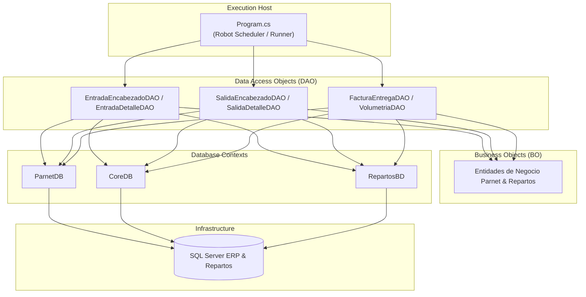
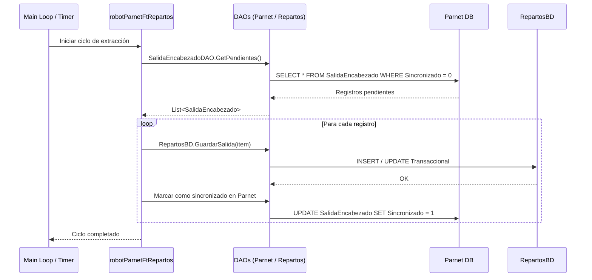
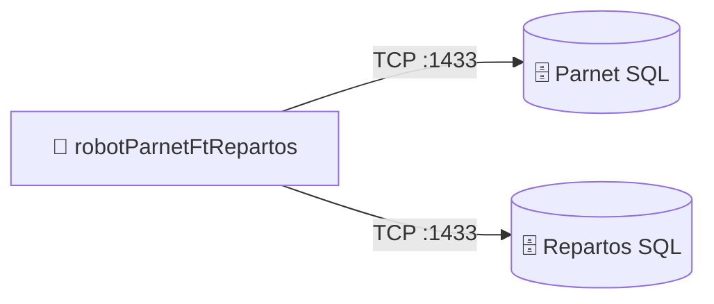

# robotParnetFtRepartos — Documentación Técnica

> **Tipo:** WindowsService / Console
> **Framework:** .NET Framework 4.7.2
> **Target:** .NET Framework 4.7.2
> **Última actualización:** 2026-08-13
> **Estado:** ❔ Desconocido

---

## Sección 1 — Propósito y Responsabilidad

- **Propósito:** Robot de sincronización automatizada (`robotParnetFtRepartos`) que extrae y procesa información desde las bases de datos de Parnet ERP y bases centrales (`CoreBD`, `Parnet`, `RepartosBD`) para alimentar los procesos logísticos de reparto.
- **Qué problemas de negocio resuelve:** Automatiza la integración entre el sistema Parnet ERP y el módulo de repartos, evitando captura manual de salidas, entradas y volumetrías de mercancía.
- **Qué NO hace:** No provee interfaz gráfica de usuario para operadores logísticos ni gestiona rastreo GPS en ruta.

---

## Sección 2 — Diagrama de Arquitectura Interna



---

## Sección 3 — Stack Tecnológico

| Categoría | Paquete / Tecnología | Versión | Propósito en este componente |
|-----------|---------------------|---------|------------------------------|
| Framework | .NET Framework (Console / Worker) | 4.7.2 | Ejecución de tareas programadas |
| ORM / Data | Entity Framework | 6.2.0 | Acceso a base de datos relacional |
| Data Access | ADO.NET / LINQ to Entities | 4.7.2 | Consultas y DAOs optimizados |
| Logging | System.Diagnostics / Console | Built-in | Registro de eventos y trazas |

---

## Sección 4 — Estructura del Proyecto

```
robotParnetFtRepartos/
├── Models/
│   ├── CoreBD/               # Modelos de base de datos Core (Productos, Volumetria)
│   ├── Parnet/
│   │   ├── BO/               # Business Objects (Entrada, Salida, Factura)
│   │   └── DAO/              # Data Access Objects específicos de Parnet
│   └── RepartosBD/           # Modelos y tablas del sistema de Repartos
├── Properties/               # Configuración de ensamblado
├── App.config                # Cadenas de conexión y parámetros
├── Program.cs                # Orquestador principal del robot
└── robotParnetFtRepartos.csproj # Archivo de proyecto
```

---

## Sección 5 — Configuración y Variables de Entorno

| Key (path completo) | Tipo | Requerido | Descripción | Ejemplo seguro |
|---------------------|------|-----------|-------------|----------------|
| `ConnectionStrings:ParnetDB` | string | ✅ | Conexión a base de datos Parnet ERP | `Server=parnet_server;Database=ParnetLive;Trusted_Connection=True;` |
| `ConnectionStrings:RepartosDB` | string | ✅ | Conexión a base de datos Repartos | `Server=sql_server;Database=Repartos;Trusted_Connection=True;` |
| `Robot:IntervalSeconds` | int | No | Frecuencia de ejecución del ciclo | `60` |

---

## Sección 6 — Endpoints / Interfaces Públicas

Aplicación de consola desatendida. No expone servicios de red ni APIs HTTP. Se ejecuta de forma continua o mediante programador de tareas.

---

## Sección 7 — Flujos de Datos Críticos



---

## Sección 8 — Modelo de Datos

- **Parnet BO/DAO:** Abstracciones para manejar entradas, salidas, facturas y volumetrías directamente desde Parnet ERP.
- **RepartosBD:** Modelos operacionales de empleados, rutas, motivos de cancelación y órdenes de entrega.

---

## Sección 9 — Seguridad

- **Credenciales:** Almacenadas en App.config con acceso restringido al sistema operativo.
- **Conectividad:** Uso de conexiones seguras cifradas hacia SQL Server.

---

## Sección 10 — Manejo de Errores y Logging

- **Logging:** Registro en consola y archivos de texto de errores de conexión con bases de datos heterogéneas (Parnet y Repartos).
- **Control de Transacciones:** Uso de bloques `try-catch-rollback` para evitar estados inconsistentes entre sistemas.

---

## Sección 11 — Conexiones con Otros Componentes



| Destino | Protocolo | Puerto | Dirección | Propósito |
|---------|-----------|--------|-----------|---------------|
| Parnet DB | TCP | 1433 | Outbound | Lectura de datos ERP Parnet |
| Repartos DB | TCP | 1433 | Outbound | Escritura y actualización de entregas |

---

## Sección 12 — Despliegue

- **Método:** Despliegue de ejecutables en servidor de procesos batch / servicios de Grupo Boxito.
- **Prerrequisitos:** .NET Framework 4.7.2, conectividad SQL Server.

---

## Sección 13 — Testing

- **Ejecución:** Pruebas unitarias y de integración mediante ejecución local en modo consola.

---

## Sección 14 — Consideraciones y Deuda Técnica

| Prioridad | Área | Hallazgo | Mejora sugerida | Impacto |
|-----------|------|----------|-----------------|---------|
| 🟡 Media | Arquitectura | Duplicidad de DAOs para múltiples bases de datos | Refactorizar hacia un repositorio genérico unificado | Reducción de código repetitivo |
| 🟢 Baja | Monitoreo | Ausencia de telemetría en tiempo real | Integrar notificaciones de error vía Webhook / Email | Agilidad en resolución de fallos |
