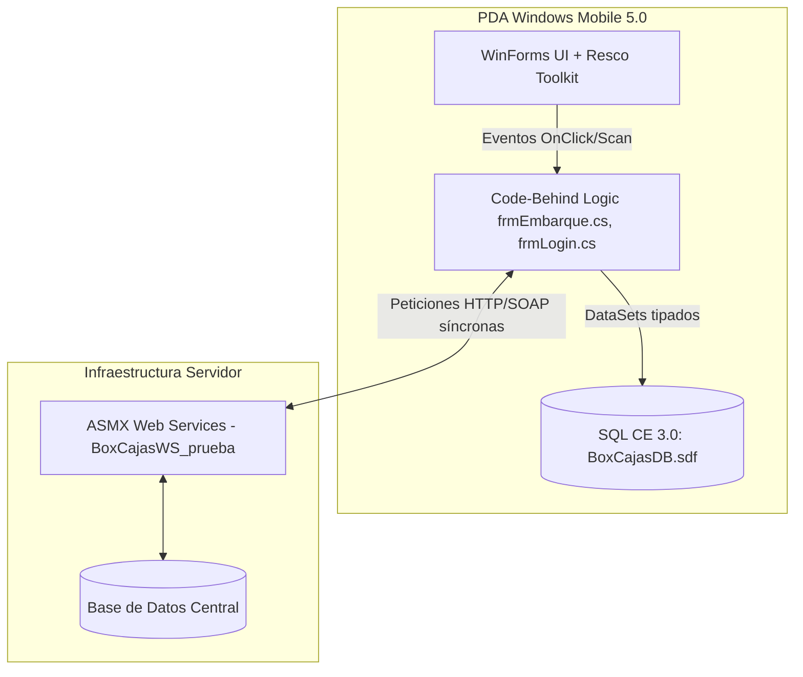

# BoxCaja EDA (Electronic Data Acquisition)

## 1. Propósito del Sistema
BoxCaja EDA es una solución móvil legada diseñada para la captura de datos en campo y almacén. Está construida para operar en terminales de radiofrecuencia (PDAs) que funcionan bajo el ecosistema de Windows Mobile. Su propósito es facilitar tareas operativas como el login de operadores, validación de rutas, embarque de cajas y sincronización de catálogos mediante lectura de códigos de barras (folios tipo `EP`, `EL`, `SC`).

## 2. Arquitectura de Alto Nivel
El sistema utiliza una arquitectura de **Smart Client** tradicional de dos capas (Cliente pesado):
*   **Capa de Presentación y Lógica (UI):** Construida sobre **Windows Forms (.NET Compact Framework 2.0)**. Emplea la suite comercial **Resco MobileForms Toolkit v5.8** (AdvancedList, SmartGrid, ImageBox, etc.) para renderizar la interfaz.
*   **Capa de Acceso a Datos Local:** Utiliza ADO.NET (DataSets tipados como `dsOffline`, `dsTemp`) y persiste información en una base de datos **SQL Server Compact Edition 3.0** (`BoxCajasDB.sdf`).
*   **Capa de Integración (Red):** La app móvil se comunica con un backend a través de **Web Services ASMX (SOAP)** clásicos (ej. `EDA_BoxCajas.asmx` y `EDA_BoxCajas_Seg.asmx`). Las respuestas de estos servicios no utilizan objetos serializados estándar (XML/JSON), sino que devuelven cadenas de texto planas separadas por tuberías (`|`) que el cliente parsea manualmente.

## 3. Diagrama de Arquitectura / Flujo

## 4. Estructura del Proyecto
El código fuente radica en la solución `BoxCajas.sln` y el proyecto principal `BoxCajas.csproj`:
*   `/UI/`: Contiene todos los formularios agrupados por módulo (`Almacen`, `Ciclico`, `Consolidado`, `Embarque`, `Rutas`). La lógica de negocio está fuertemente acoplada aquí.
*   `/DAO/`: DataSets tipados (`dsOffline.xsd`, `dsTemp.xsd`) y clases auxiliares que mapean hacia SQL CE.
*   `/Class/`: Clases de utilidad (`Utility.cs`, `Constante.cs`) y formato de impresión (`PrintFormat.cs`).
*   `/Web References/`: Proxies autogenerados (`Reference.cs`) apuntando a los ASMX.
*   `BoxCajasDB.sdf`: Archivo físico de la base de datos local.

## 5. Requisitos Previos y Entorno de Desarrollo
Para compilar y dar mantenimiento a esta versión legada, se requiere un entorno antiguo estricto:
*   **IDE:** Visual Studio 2005 o 2008 Professional.
*   **Frameworks:** .NET Compact Framework 2.0.
*   **Componentes de Terceros:** Resco MobileForms Toolkit CF2 v5.8 instalado y licenciado en la máquina de desarrollo.
*   **SDK:** Windows Mobile 5.0 Pocket PC SDK.
*   **Base de Datos:** SQL Server Compact Edition 3.0 SDK.