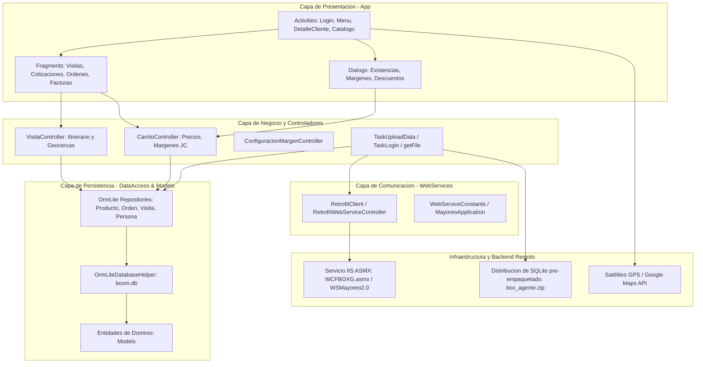
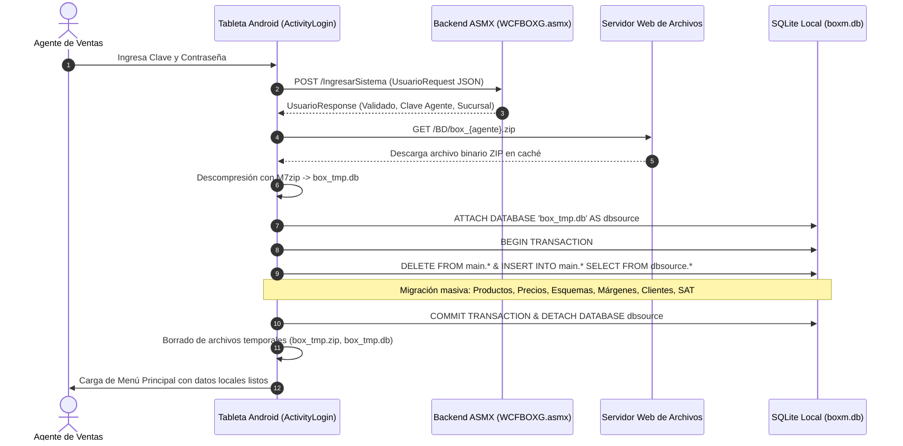

# Boxito Mayoreo - Tableta (Android Legacy)

Aplicación móvil Android empresarial para la fuerza de ventas en campo y agentes de mayoreo de Grupo Boxito. Proporciona una solución operativa bajo el paradigma *offline-first*, permitiendo la ejecución de itinerarios de visita, captura de pedidos, cotizaciones, cálculo de márgenes comerciales, validación de inventarios y cumplimiento de directrices fiscales (CFDI 4.0 y Carta Porte SAT) sin dependencia continua de conexión a internet.

---

## 1. Stack Tecnológico Actual

El proyecto está construido sobre una pila tecnológica Android nativa legacy basada en Java y herramientas previas a la migración total hacia AndroidX y Room:

| Componente / Capa | Tecnología / Biblioteca | Versión | Propósito / Alcance |
|---|---|---|---|
| **Lenguaje principal** | Java (Java 8 / Java 11 bytecode) | 1.8 / 11 | Lógica de negocio y vistas nativas Android. |
| **Sistema de compilación** | Gradle & Android Gradle Plugin (AGP) | Gradle 7.0.2 / AGP 7.0.3 | Compilación modularizada y ensamblado de APKs. |
| **SDK Targets** | Android SDK | compileSdk 30, minSdk 29 (app) / 20 (ws), targetSdk 30 | Compatibilidad focalizada en tabletas Android dedicadas. |
| **Inyección de dependencias** | RoboGuice + RoboBlender | 3.0.1 | Inyección de vistas (`@InjectView`), servicios (`@Inject`) y layouts (`@ContentView`). |
| **Persistencia Local (ORM)** | OrmLite Android & Core | 4.48 (librerías) / 5.1 (app) | Mapeo objeto-relacional sobre base de datos SQLite local (`boxm.db`). |
| **Motor de Base de Datos** | SQLite Nativo Android | 3.x | Base de datos interna relacional y soporte de `ATTACH DATABASE` para sincronización. |
| **Networking / HTTP** | Square Retrofit + Gson Converter | 2.0.2 | Cliente HTTP tipado para consumo de servicios web. |
| **Capa de Transporte HTTP** | Square OkHttp & OkHttp3 Logging | 2.3.0 / 3.2.0 | Transporte HTTP, interceptores de log y timeouts prolongados (hasta 10 horas para syncs masivas). |
| **Serialización / Parsing** | Google Gson | 2.2.3 / 2.5 | Transformación de DTOs JSON a modelos Java. |
| **Geolocalización y Mapas** | Google Play Services (Maps & Location) | 9.0.2 / 16.0.0 | Rastreo satelital GPS, control de geocercas poligonales y visualización de rutas. |
| **Carga de Imágenes** | Universal Image Loader (UIL) + Picasso | UIL 1.9.5 (JAR) / Picasso 2.5.2 | Caché multinivel en disco y memoria RAM para catálogo visual de artículos. |
| **Compresión / Utilidades** | M7zip / Commons-Net | 7z / 3.3 | Descompresión de bases de datos pre-empaquetadas y utilidades de transferencia. |
| **Componentes UI** | Android Support Repository v7 / Design | 23.3.0 | AppCompat, CardView, RecyclerView, Design Support (TabLayout, FloatingActionButton). |
| **Librerías UI Auxiliares** | Clans FAB, MaterialDateTimePicker, Confetti | 1.6.3 / 2.3.0 / 1.1.0 | Menús flotantes, selector de fechas material, animaciones de cumpleaños. |
| **Compatibilidad Multidex** | AndroidX MultiDex | 2.0.1 | Manejo de limitación de 64K métodos DEX. |

---

## 2. Estructura de Módulos y Carpetas

El repositorio está organizado como un proyecto multi-módulo Gradle donde cada módulo delimita responsabilidades específicas de la arquitectura:

```
Tableta/
├── app/                           # Módulo de aplicación principal (Android Application)
│   ├── src/main/
│   │   ├── java/com/boxito/boxm/
│   │   │   ├── activities/        # Pantallas, navegación e interfaces de usuario
│   │   │   │   └── base/          # BaseActivity y BaseActivityDialog
│   │   │   ├── adaptadores/       # Adaptadores de RecyclerView y ListView
│   │   │   │   └── holders/       # ViewHolders para componentes visuales
│   │   │   ├── asynctask/         # Tareas asíncronas en segundo plano (TaskUploadData)
│   │   │   ├── controllers/       # Lógica comercial, cálculo de precios y carritos
│   │   │   ├── db/                # Helper nativo SQLite (DbBoxito)
│   │   │   ├── dialogs/           # Ventanas modales (existencias, descuentos, proformas)
│   │   │   ├── fragments/         # Vistas modulares por pestañas
│   │   │   ├── modules/           # Módulos de configuración RoboGuice
│   │   │   ├── util/              # Utilidades de cálculo comercial, GPS, fechas y archivos
│   │   │   ├── views/             # Vistas personalizadas (SpeedometerGauge)
│   │   │   ├── MapsActivity.java  # Actividad de visualización de mapa
│   │   │   └── MayoreoApplication.java # Configuración global, ImageLoader y URLs de servidor
│   │   └── res/                   # Layouts XML, valores, drawables y configuraciones
│   ├── build.gradle               # Dependencias finales y empaquetado del APK
│   └── proguard-rules.pro         # Reglas de ofuscación de la app
├── dataaccess/                    # Módulo de persistencia y repositorios (Android Library)
│   ├── src/main/java/com/boxito/boxm/dataaccess/
│   │   ├── modules/               # DataAccessModule para inyección de repositorios
│   │   └── ormlite/               # Implementaciones de repositorios OrmLite
│   │       └── base/              # OrmLiteDatabaseHelper y OrmLiteBaseRepository
│   └── build.gradle               # Configuración de compilación y Roboblender
├── models/                        # Entidades del dominio y contratos de persistencia (Android Library)
│   ├── src/main/java/com/boxito/boxm/models/
│   │   ├── repositories/          # Interfaces Repository (CRUD y consultas especializadas)
│   │   │   └── base/              # Contratos Repository, ReadRepository, WriteRepository
│   │   └── *.java                 # Modelos ORM (Producto, Visita, OrdenCompra, DetalleOrden, etc.)
│   └── build.gradle               # Dependencias de modelos y OrmLite
├── webservices/                   # Capa de consumo HTTP y clientes remotos (Android Library)
│   ├── src/main/java/com/boxito/boxm/webservices/
│   │   ├── constants/             # WebServiceConstants (URLs de servicios, endpoints y tipos)
│   │   ├── controllers/           # RetrofitWebServiceController y PreferencesController
│   │   ├── dto/                   # Data Transfer Objects (UsuarioDto, FacturaDto, etc.)
│   │   ├── interfaces/            # WebServiceController (Contrato de consumo)
│   │   ├── modules/               # WebServiceModule para inyección
│   │   ├── provider/              # Proveedores de cliente Retrofit
│   │   ├── requests/              # Clases envoltorio de petición
│   │   ├── responses/             # Estructuras de respuesta JSON del backend
│   │   └── retrofit/              # Interfaces RetrofitClient y RetrofitClientBoxito
│   └── build.gradle               # Configuración Retrofit, OkHttp y Roboblender
├── certificado/                   # Archivos de firma para despliegue
│   ├── ventunmay.jks              # Keystore oficial de firma
│   └── ventunmay.txt              # Metadatos del certificado
├── lib/                           # Bibliotecas locales JAR
│   ├── android-support-v4.jar
│   └── universal-image-loader-1.9.5*.jar
├── gradle/wrapper/                # Wrapper de Gradle (v7.0.2)
├── build.gradle                   # Configuración global del proyecto
├── settings.gradle                # Definición de módulos incluidos
└── local.properties               # Ubicación local del Android SDK
```

---

## 3. Arquitectura de Alto Nivel

El sistema implementa una arquitectura en capas adaptada para clientes móviles desconectados (*offline-first*):



### Arquitectura de Sincronización de Base de Datos (Offline-First)

Para evitar la descarga elemento por elemento de miles de registros de productos, precios y clientes a través de servicios SOAP/REST lentos, el sistema implementa un modelo de sincronización basado en imágenes SQLite precalculadas:



---

## 4. Configuración y Operación Legacy

### 4.1 Requisitos del Entorno de Desarrollo

1. **Java Development Kit (JDK)**: JDK 8 (1.8) o JDK 11 (recomendado Amazon Corretto 11 o Zulu 11). No usar JDK 17 o superior debido a incompatibilidades con el plugin RoboBlender y Gradle 7.0.
2. **Android SDK**:
   - `build-tools`: `30.0.3`
   - `compileSdkVersion`: `30` (Android 11)
   - Plataformas instaladas: SDK 30, SDK 29.
3. **Android Studio**: Android Studio Bumblebee (2021.1.1) o Chipmunk (2021.2.1) proporcionan la compatibilidad óptima con Gradle 7.0.x y RoboGuice sin advertencias de deprecación del compilador de anotaciones.

### 4.2 Configuración de Endpoints y Servidores

La configuración de red se gestiona de forma centralizada en dos clases:

1. `MayoreoApplication.java` (`SetServer()`):
   - Controla el modo desarrollo mediante el flag booleano `devMode`:
     - `devMode = true`: Apunta a endpoints de depuración local o bunker:
       - `server = "http://172.16.3.173/"` (PC Local)
       - `URL = server + "WCFBOXG011604/WCFBOXG.asmx/"`
       - `URL_DB_INFO_ZIP = server + "WCFBOXG011604/BD/box_2267.zip"`
     - `devMode = false`: Carga la URL almacenada en `SharedPreferences` (`mayoreoserver`) o toma la producción por defecto:
       - `server = "http://appventas.dnsalias.com"`
       - `URL = server + "/WSMayoreo2.0/WCFBOXG.asmx/"`
       - `URL_DB_INFO_ZIP = "http://appventas.dnsalias.com/WSMayoreo2.0/BD/box_{agente}.zip"`
2. `WebServiceConstants.java`:
   - Define el nombre de los endpoints SOAP/REST y el tipo de compresión (`fileType = "ZIP"`).

> **Cambio dinámico de servidor desde la tableta**: En la pantalla de login (`ActivityLogin`) o en el diálogo de perfil de usuario (`ActivityPerfilUsuario`), al pulsar el ícono de configuración se despliega el diálogo `UpdateDialog`, que permite cambiar la IP/Dominio del servidor sin recompilar la aplicación.

### 4.3 Manejo de Certificados y Firma de APK

Para generar el APK de producción:
- **Keystore**: `certificado/ventunmay.jks`
- **Contraseña y Alias**: Registrados en `certificado/ventunmay.txt`

### 4.4 Peculiaridades Críticas del Entorno Android

* **Tráfico HTTP sin cifrar (Cleartext)**: La aplicación consume servidores IIS que no tienen configurado HTTPS. Es indispensable que `AndroidManifest.xml` mantenga `android:usesCleartextTraffic="true"`.
* **Almacenamiento Scoped Storage (Android 10/11)**: El manifiesto incluye `android:requestLegacyExternalStorage="true"` para permitir que las rutinas de descarga escriban y descompriman en `Environment.DIRECTORY_DOWNLOADS` y en el almacenamiento compartido.
* **Librería HTTP Legacy de Apache**: El manifiesto declara:
  ```xml
  <uses-library android:name="org.apache.http.legacy" android:required="false"/>
  ```
  Esto previene el error `ClassNotFoundException: Didn't find class "org.apache.http.ProtocolVersion"` al ejecutarse en dispositivos modernos.
* **Memoria DEX**: En `app/build.gradle` está configurado `javaMaxHeapSize "4g"` y `multiDexEnabled true` para dar soporte al procesador de anotaciones RoboBlender y la carga masiva de dependencias de Play Services.

### 4.5 Comandos de Compilación

Para compilar el proyecto utilizando la terminal de comandos:

```bash
# Limpiar proyecto y carpetas build
./gradlew clean

# Compilar variante de depuración (Debug)
./gradlew assembleDebug

# Compilar y empaquetar APK de producción firmado (Release)
./gradlew assembleRelease
```

El APK resultante se ubicará en:
`app/build/outputs/apk/release/app-release.apk`
o en la raíz del módulo:
`app/app-release.apk`

---

## 5. Solución de Problemas Frecuentes (Troubleshooting)

| Error detectado | Causa raíz | Procedimiento de corrección |
|---|---|---|
| `Execution failed for task ':app:transformClassesWithMultidexlistForDebug'` | Límite de 64K métodos excedido o heap insuficiente. | Validar que `javaMaxHeapSize "4g"` esté activo y MultiDex instalado en `MayoreoApplication.attachBaseContext`. |
| `RoboGuice: Annotation database could not be loaded` | RoboBlender no generó la base de datos de anotaciones al compilar subproyectos. | `RoboGuice.setUseAnnotationDatabases(false);` está activo en `MayoreoApplication.onCreate()` como fallback seguro. Asegurar que los compiladores de cada módulo tengan `-AguiceAnnotationDatabasePackageName`. |
| `Error al descomprimir base de datos box_tmp.zip` | Descarga HTTP incompleta o espacio insuficiente en disco del dispositivo. | Validar que el dispositivo cuente con al menos 500 MB libres en almacenamiento interno y que la URL del agente devuelva un código HTTP 200 válido. |
| `No se pueden modificar precios` | El usuario o el producto no tienen habilitado el permiso `modificaPrecio`. | Verificar en la base de datos local que `Usuario.modificaPrecio == 1` y que el artículo tenga `modificaPrecio == 1` dentro de su rango mínimo/máximo. |
