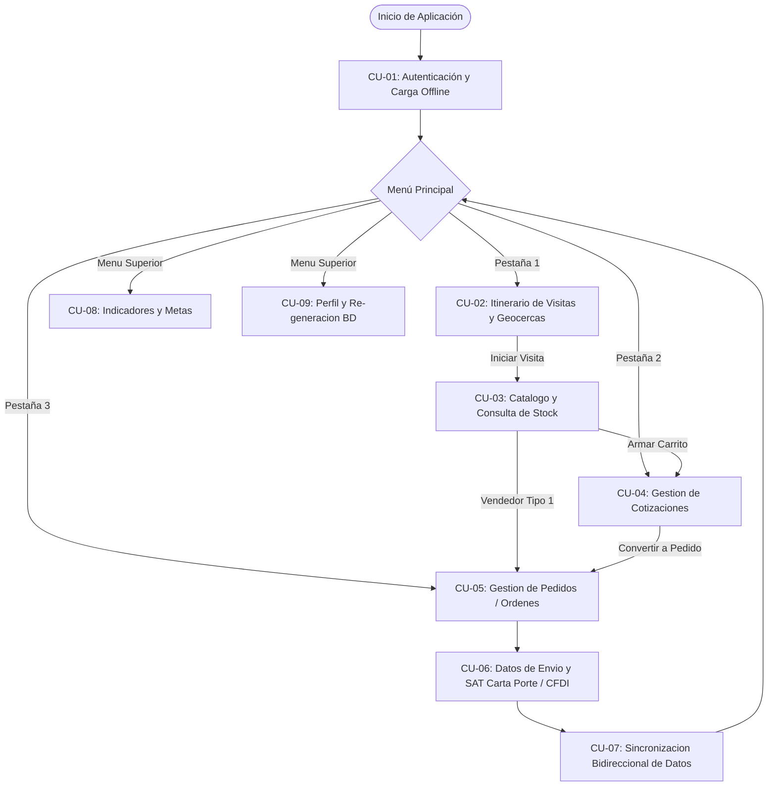
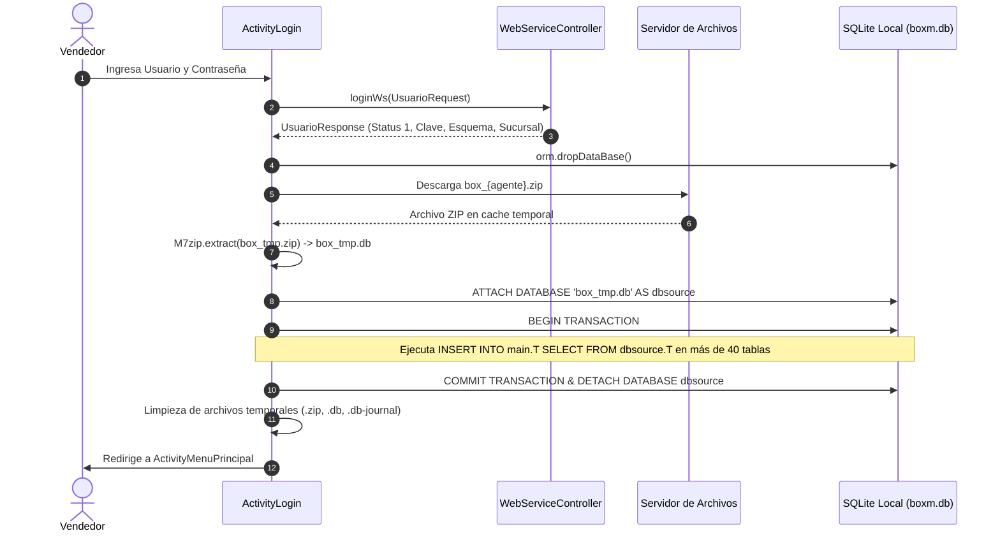
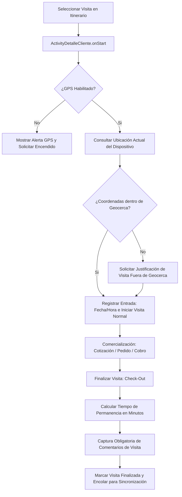
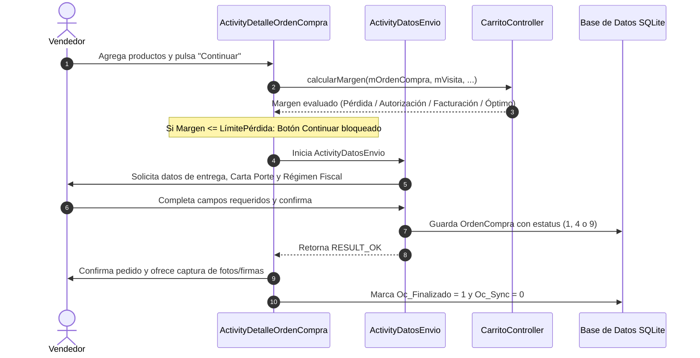
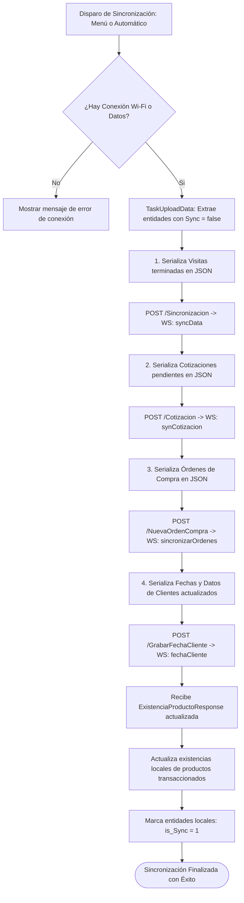
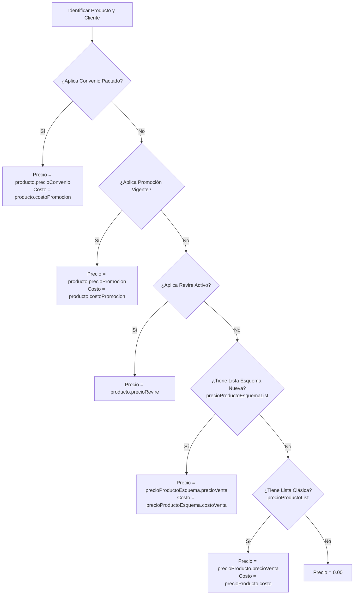

# Casos de Uso, Roles y Reglas de Negocio - Boxito Mayoreo (Tableta)

Este documento detalla la arquitectura funcional, los roles de usuario, las políticas de seguridad en tiempo de ejecución y las reglas de negocio codificadas en el sistema móvil Android legacy **Boxito Mayoreo** (`com.boxito.boxm`).

---

## 1. Roles de Usuario y Esquemas de Operación

El acceso a las funcionalidades comerciales está gobernado por dos niveles de parametrización: el **Tipo de Esquema** del usuario (`Te_IdTipoEsquema`) y los **Flags de Permisos Granulares** asignados a la persona en la base de datos local.

### 1.1 Matriz de Perfiles y Capacidades

| Perfil / Esquema | Identificador | Capacidades Habilitadas | Restricciones Operativas |
|---|---|---|---|
| **Agente de Mayoreo (Vendedor)** | `tipoEsquema = 1` | • Levantamiento de pedidos directos (Órdenes de Compra).<br>• Generación y seguimiento de cotizaciones.<br>• Consulta de cartera de clientes y facturas vencidas.<br>• Inicio y cierre de visitas con geocercas.<br>• Consulta de indicadores comerciales (Tablero de metas).<br>• Conversión de cotizaciones en pedidos. | • Sujeto a umbrales de margen de rentabilidad.<br>• Requiere sincronización previa antes de cerrar sesión. |
| **Promotor / Cotizador / Obra** | `tipoEsquema != 1` | • Levantamiento de cotizaciones para clientes.<br>• Creación de proformas para frentes de obra.<br>• Consulta de catálogos y existencias multi-sucursal.<br>• Consulta de itinerario de visitas. | • **Bloqueo del botón de venta directa (`fab_add_venta` oculto)**.<br>• No puede colocar órdenes de compra finales directamente en el ERP sin pasar por cotización previa. |

### 1.2 Permisos Granulares y Atributos de Sesión

Los permisos se almacenan en la entidad `PersonaSesion` y la tabla `Usuario`:

1. **`modificaPrecio` (Binario: 0 o 1)**:
   - Determina si el agente puede alterar manualmente el precio de venta de un artículo en el carrito.
   - Aunque el usuario tenga `modificaPrecio = 1`, la edición sólo se permite si el producto individual también tiene habilitado el flag `Producto.modificaPrecio == 1` y el valor ingresado se encuentra dentro del rango de `modificaPrecioMin` y `modificaPrecioMax`.
2. **`exportarExcel` (Binario: 0 o 1)**:
   - Faculta al agente a generar archivos de intercambio local en formato de hoja de cálculo.
3. **`Su_IdSucursal` (Numérico)**:
   - Identificador de la sucursal matriz del vendedor. Determina el inventario local prioritario y la tasa de IVA predeterminada (incluyendo estímulo fronterizo si aplica).

### 1.3 Perfiles de Clientes y Condiciones Comerciales

La entidad `Persona` (cliente) define el comportamiento comercial en cada interacción:
- **Tipo de Persona (`Tp_IdTipoPersona`)**:
  - `1`: Persona Física (habilita validación de RFC de 13 caracteres y catálogo de Uso CFDI para personas físicas).
  - `2`: Persona Moral (RFC de 12 caracteres y catálogo de Uso CFDI exclusivo para personas morales).
- **Condición Financiera**:
  - **Cliente de Contado (`isClienteContado()`)**: Los pedidos pasan automáticamente a estatus de facturación (`idEstatus = 9`) sin validar líneas de crédito vencidas.
  - **Cliente de Crédito**: Valida el límite de crédito disponible (`Cp_CreditoDisponible`), saldo vencido (`Cp_SaldoVencido`) y ticket promedio de compra.
- **Nivel de Proveedor (`ClienteNivelProveedor`)**:
  - Clasifica el nivel del cliente (`cp_nivel`) respecto a marcas y fabricantes específicos para aplicar esquemas de precio preferenciales.

---

## 2. Manejo de Permisos del Sistema Operativo (Android OS)

La aplicación implementa validaciones de permisos estáticos en el `AndroidManifest.xml` y dinámicos en tiempo de ejecución (`ActivityLogin.checkPermissions`):

```java
// Matriz de permisos auditados en tiempo de ejecución
public static String[] permissions = new String[]{
    Manifest.permission.INTERNET,
    Manifest.permission.READ_PHONE_STATE,
    Manifest.permission.ACCESS_NETWORK_STATE,
    Manifest.permission.WRITE_EXTERNAL_STORAGE,
    Manifest.permission.READ_EXTERNAL_STORAGE,
    Manifest.permission.ACCESS_FINE_LOCATION,
    Manifest.permission.ACCESS_COARSE_LOCATION
};
```

### Justificación de Permisos

| Permiso de Android | Componente Consumidor | Justificación y Regla Técnica |
|---|---|---|
| `ACCESS_FINE_LOCATION`<br>`ACCESS_COARSE_LOCATION` | `ActivityDetalleCliente`<br>`GeocercaRastreoController`<br>`ConsultarGPS` | Permite verificar si el agente se encuentra físicamente dentro del radio o polígono de la geocerca del cliente para habilitar el Check-In de la visita y calcular el tiempo de permanencia. |
| `WRITE_EXTERNAL_STORAGE`<br>`READ_EXTERNAL_STORAGE`<br>`WRITE_INTERNAL_STORAGE` | `ActivityLogin` (`getFile`)<br>`FileUtils`<br>`OrmLiteDatabaseHelper` | Descarga de la base de datos precompilada del agente (`box_{agente}.zip`), almacenamiento de fotografías de evidencias y exportación de respaldos a la carpeta `Downloads/bd_boxito`. |
| `INTERNET`<br>`ACCESS_NETWORK_STATE` | `RetrofitWebServiceController`<br>`TaskUploadData` | Envío de transacciones comerciales al ERP IIS, descarga de APKs para auto-actualización y consulta de existencias en tiempo real. |
| `READ_PHONE_STATE` | `BaseActivity`<br>`DispositivoGps` | Auditoría de hardware y vinculación del dispositivo físico con el usuario logueado. |
| `REQUEST_INSTALL_PACKAGES` | `Updater` | Permite a la aplicación descargar el nuevo paquete `mayoreo.apk` e iniciar el instalador del sistema operativo de manera desatendida. |
| `android.permission.C2D_MESSAGE` | `MayoreoApplication` | Infraestructura legacy de Google Cloud Messaging (C2DM) para recepción de avisos del servidor. |

---

## 3. Flujos Principales de la Aplicación (Casos de Uso)



---

### CU-01: Autenticación y Reconstrucción de Base de Datos Local

* **Actores**: Agente de Ventas.
* **Componentes**: `ActivityLogin`, `UsuarioSesionController`, `getFile` (AsyncTask), `M7zip`, `OrmLiteDatabaseHelper`.
* **Propósito**: Validar credenciales contra el servicio web central y reconstruir íntegramente el repositorio de datos local del vendedor en una sola transacción SQLite.



* **Criterios de Éxito**:
  1. Si la descarga o extracción falla, la transacción local se revierte (`rollback`), se desvincula la base fuente y se restaura el estado previo sin corromper el esquema local.
  2. Si el usuario no tiene sucursales asignadas (`sucursalPersonas` vacía), se bloquea el acceso con mensaje descriptivo.

---

### CU-02: Gestión del Itinerario y Ejecución de Visitas con Geocercas

* **Actores**: Agente de Ventas.
* **Componentes**: `ActivityMenuPrincipal`, `FragmentVisitas`, `ActivityDetalleCliente`, `VisitaController`, `GeocercaRastreoController`, `GeocercaUtil`, `LocationServices`.
* **Propósito**: Ejecutar la ruta de visitas programadas auditando la presencia física del vendedor en las coordenadas del cliente.



* **Reglas del Flujo**:
  1. **Auditoría de Geocerca**: `GeocercaUtil.isLocationInGeocerca()` evalúa geocercas circulares por radio o polígonos irregulares configurados en la tabla `GeocercaPoligonal`.
  2. **Cálculo de Tiempo**: Registra `fechaHoraEntrada` y `fechaHoraSalida`, calculando la diferencia en minutos (`tiempoGeocerca`) para medir la calidad del contacto comercial.
  3. **Celebración de Cumpleaños**: Al abrir el detalle del cliente, si la fecha actual coincide con el día y mes de `Persona.Cumpleanios`, el sistema activa una animación de confeti en pantalla (`iniciarAnimacionConfetiSimple`). Si no cuenta con fecha registrada, despliega un `DatePickerDialog` para capturarla y sincronizarla.

---

### CU-03: Exploración del Catálogo y Consulta de Existencias Multi-Sucursal

* **Actores**: Agente de Ventas / Cotizador.
* **Componentes**: `ActivityCatalogoCotizacion`, `ActivityCatalogoOrden`, `ProductoController`, `UniversalImageLoader`, `ConsultarExistenciaDialog`, `WebServiceController`.
* **Propósito**: Localizar artículos mediante filtros de categorización y verificar disponibilidad en almacenes propios y foráneos.

* **Pasos Operativos**:
  1. El vendedor selecciona la jerarquía comercial en los spinners superiores: **División** -> **Subdivisión** -> **Grupo**.
  2. El catálogo aplica un `TextWatcher` en el buscador con retardo para consultar localmente la tabla `Producto` en SQLite mediante cláusulas `LIKE` sobre `pr_clave` o `pr_descripcion`.
  3. Las imágenes se descargan y almacenan en memoria y disco mediante `UniversalImageLoader` limitando el consumo de datos celulares.
  4. **Consulta en Tiempo Real de Existencias**: Al realizar pulsación prolongada sobre un artículo, se abre `ConsultarExistenciaDialog`, el cual realiza una petición HTTP en vivo al endpoint `ObtenerExistenciaSucursal` para mostrar el stock detallado de todas las sucursales del grupo empresarial.

---

### CU-04: Elaboración y Gestión de Cotizaciones

* **Actores**: Vendedor / Cotizador.
* **Componentes**: `ActivityCatalogoCotizacion`, `ActivityDetalleCotizacion`, `CarritoController`, `OrdenCompraController`, `WebServiceController`.
* **Propósito**: Generar cotizaciones formales con precios calculados automáticamente, control de márgenes y exportación a PDF.

* **Pasos Operativos**:
  1. Se selecciona la condición de venta inicial: **Crédito** o **Contado**.
  2. Se indica la modalidad de la atención: **Visita Presencial** o **Visita Telefónica**.
  3. El vendedor agrega productos al carrito. En cada adición, `CarritoController.actualizarCarrito()` calcula los impuestos, importes, factores de venta y determina el precio aplicable.
  4. En la pantalla de detalle (`ActivityDetalleCotizacion`), se visualizan las partidas, subtotales, IVA y la máscara de margen.
  5. **Envío y Generación de PDF**:
     - El agente puede presionar "Enviar Correo Cotización", disparando el endpoint `CorreoOrdenCompra`.
     - O puede presionar "Descargar Reporte", que invoca `ReporteCotizacion`, obteniendo un archivo Base64 que se decodifica como PDF en el dispositivo para apertura con visores externos.
  6. **Conversión a Pedido**: Si el cliente acepta la cotización y el usuario tiene rol de vendedor (`tipoEsquema == 1`), se activa la opción para clonar y convertir la cotización en una Orden de Compra formal.

---

### CU-05: Levantamiento y Confirmación de Órdenes de Compra (Pedidos)

* **Actores**: Agente de Mayoreo (`tipoEsquema = 1`).
* **Componentes**: `ActivityCatalogoOrden`, `ActivityDetalleOrdenCompra`, `ActivityDatosEnvio`, `CarritoController`.
* **Propósito**: Registrar una transacción en firme para surtido y facturación en el ERP.



---

### CU-06: Configuración de Datos de Envío y Cumplimiento Fiscal SAT

* **Actores**: Agente de Ventas.
* **Componentes**: `ActivityDatosEnvio`, controladores de catálogo SAT (`Pais`, `Estado`, `Municipio`, `Localidad`, `CodigoPostal`, `Colonia`, `RegimenFiscal`, `UsoCfdi`, `FormaPago`).
* **Propósito**: Garantizar que el pedido cumpla estrictamente con la legislación fiscal mexicana (Carta Porte para transporte de mercancías y Anexo 20 CFDI 4.0).

* **Campos y Validaciones Ejecutadas**:
  1. **Sucursal de Surtido**: Selección del almacén desde donde se despachará el pedido.
  2. **Tipo de Entrega**:
     - *Ocurre / En Tienda*: No exige domicilio de destino externo.
     - *Entrega a Domicilio*: Exige selección de dirección registrada o captura de un nuevo domicilio validado contra el catálogo SAT.
  3. **Carta Porte SAT**:
     - Estado, Municipio y Localidad vinculados al Código Postal seleccionado.
     - Selección de Colonia mediante autocompletado de catálogo oficial SAT.
     - Captura obligatoria de Calle, Número Exterior, Cruzamientos y Referencias físicas.
  4. **CFDI 4.0**:
     - Régimen Fiscal del receptor filtrado según sea Persona Física o Moral.
     - Uso de CFDI validado según el régimen tributario del cliente.
     - Método y Forma de Pago (Efectivo, Transferencia, Cheque, Crédito).
  5. **División de Factura**: Casilla que marca `Oc_DividirFactura = 1` cuando el cliente requiere fragmentar el surtido en múltiples comprobantes fiscales.

---

### CU-07: Sincronización Bidireccional de Datos en Campo

* **Actores**: Sistema / Agente de Ventas.
* **Componentes**: `TaskUploadData` (RoboAsyncTask), `WebServiceController`, `VisitaController`, `OrdenCompraController`.
* **Propósito**: Transmitir al ERP central las transacciones levantadas offline y recibir confirmaciones y actualización de inventarios.



---

### CU-08: Monitoreo de Indicadores y Tablero Mensual

* **Actores**: Agente de Ventas.
* **Componentes**: `ActivityTableroMes`, `IndicadorController`, `SpeedometerGauge`, `WebServiceController.obtenerPresupuesto`.
* **Propósito**: Proveer visibilidad en tiempo real sobre el avance comercial frente a la cuota mensual.

* **Indicadores Visualizados mediante Tacómetros**:
  1. **Meta de Ventas ($)**: Importe facturado acumulado en el mes contra el presupuesto asignado. Rango rojo (0% - 100%), rango verde (> 100%).
  2. **Meta de Pedidos**: Número de órdenes procesadas contra la meta programada.
  3. **Margen de Rentabilidad Promedio (%)**: Porcentaje promedio de utilidad obtenido en las operaciones del mes.
  4. **Recuperación de Cartera / Cobranza ($)**: Montos recaudados por concepto de facturas vencidas y cobranza en ruta.

---

### CU-09: Soporte Operativo y Regeneración Remota de Base de Datos

* **Actores**: Agente de Ventas / Soporte Técnico.
* **Componentes**: `ActivityPerfilUsuario`, `WebServiceController.generarBD`, `Updater`, `UpdateDialog`.
* **Propósito**: Resolver contingencias de catálogos desactualizados, inconsistencias de datos o cambio de entorno de red en campo.

* **Acciones Disponibles**:
  1. **Regeneración Remota de BD (`mButtonGenerarBD`)**: Invoca el endpoint `GerararDBMayoreoAgente`. El servidor central compila una nueva base de datos SQLite con los datos más recientes del agente, la empaqueta en ZIP y el cliente la descarga de inmediato ejecutando la rutina de importación `updateDbFromDB`.
  2. **Actualización de la Aplicación (`mButtonActualizar`)**: Invoca `new Updater().checkUpdate()`, que consulta `ObtenerVersionApp`, compara contra el `versionCode` local y si existe una nueva versión descarga e instala el APK `mayoreo.apk`.
  3. **Configuración de Servidor (`mButtonServidor`)**: Permite cambiar la URL base del servidor WebService y el repositorio de base de datos directamente desde una ventana emergente.

---

## 4. Reglas de Negocio Codificadas

### RN-01: Jerarquía en la Determinación de Precios de Venta

Para cada producto añadido a una cotización u orden, el sistema resuelve el precio unitario neto aplicando estrictamente la siguiente cascada de precedencia descendente (`CarritoController.actualizarCarrito`):



Si el vendedor modificó manualmente el precio (`producto.precioModificado == true`), el valor ingresado sobrescribe el resultado de la jerarquía anterior, siempre que respete los límites mínimos y máximos.

---

### RN-02: Algoritmo de Redondeo Comercial ("Redondeo JC")

Para artículos cuyo precio no fue alterado manualmente, el sistema implementa la función `Utils.NuevoRedondeoJC(precioNeto, cantidad, 0, Constants.IVA)`.

* **Propósito**: Eliminar diferencias de centavos entre el cálculo local y el motor de facturación de Epicor/ERP, forzando a que los totales cuadren en fracciones de `.50` o número entero:
  - Calcula el importe bruto: `Importe = precioNeto * cantidad`.
  - Calcula el IVA: `TotalIVA = Importe * IVA`.
  - Calcula el total acumulado: `Total = Importe + TotalIVA`.
  - Redondea el total final y recalcula en reversa:
    $$\text{PrecioUnitario} = \frac{\text{Total}}{\text{Cantidad}}$$
    $$\text{PrecioSinIVA} = \frac{\text{PrecioUnitario}}{1 + \text{IVA}}$$

---

### RN-03: Matriz de Control de Márgenes y Semáforo de Rentabilidad

Cada orden de compra se somete a una auditoría matemática de margen de ganancia (`CarritoController.calcularMargen`):

#### Fórmulas de Cálculo:
1. Cantidad en unidades de inventario (convierte factor de venta):
   $$\text{CantidadInventario} = \left\lceil \frac{\text{Cantidad}}{\text{FactorVenta}} \right\rceil$$
2. Costo total de la orden:
   $$\text{TotalCosto} = \sum (\text{CostoUnitario} \times \text{CantidadInventario})$$
3. Venta total sin impuestos:
   $$\text{TotalVentaSinIVA} = \sum (\text{PrecioNeto} \times \text{Cantidad})$$
4. Porcentaje de margen comercial:
   $$\text{Margen (\%)} = \left( 1 - \frac{\text{TotalCosto}}{\text{TotalVentaSinIVA}} \right) \times 100$$

#### Umbrales y Comportamiento del Sistema:

| Rango de Margen | Estatus de la Orden | Icono Visual | Comportamiento del Sistema |
|---|---|---|---|
| **$\text{Margen} \le \text{LímitePérdida}$** | No aplicable | `ic_margen_perdida` (Rojo) | **Bloqueo total**: El botón "Enviar Pedido" se oculta. No se permite continuar con la venta bajo ninguna circunstancia. |
| **$\text{LímitePérdida} < \text{Margen} \le \text{LímiteAutorización}$** | `idEstatus = 4` (Por Autorizar) | `ic_margen_autorizacion` (Amarillo) | Se permite enviar el pedido, pero viaja al ERP marcado para **autorización obligatoria por gerencia** antes de surtirse. |
| **$\text{LímiteAutorización} < \text{Margen} \le \text{LímiteFacturación}$** | `idEstatus = 9` (Facturación) | `ic_margen_facturacion` (Verde Claro) | Pedido aprobado comercialmente para facturación directa. |
| **$\text{Margen} > \text{LímiteFacturación}$** | `idEstatus = 1` u `9` | `ic_margen_optimo` (Verde Intenso) | Margen comercial óptimo. Aprobación inmediata. |

*Nota sobre clientes de contado*: Si el cliente es de contado (`isClienteContado() == true`), el estatus se fuerza a `9` (Facturación) siempre que el margen no caiga en zona de pérdida.

---

### RN-04: Enmascaramiento de Margen de Ganancia (MascaraMargen)

Para evitar que los clientes observen el porcentaje de ganancia cuando el vendedor opera la tableta frente a ellos, el texto del margen se codifica mediante la función `mascaraMargen()`:

$$\text{TextoEnPantalla} = \text{ClaveSucursal} + \text{MargenRedondeado} + \text{ClaveAgente}$$

*Ejemplo*: Si la sucursal es "01", el margen calculado es "24.50" y la clave del agente es "AG12", el texto mostrado en pantalla es: **`0124.50AG12`**.

---

### RN-05: Modificación Manual de Precios de Artículos

La edición manual del precio unitario está sujeta a las siguientes validaciones concurrentes:
1. `UsuarioSesion.modificaPrecio == 1` (El agente tiene permiso asignado en ERP).
2. `Producto.modificaPrecio == 1` (El catálogo permite negociar el precio de este artículo).
3. $\text{PrecioIngresado} \ge \text{Producto.modificaPrecioMin}$ (No menor al piso fijado por finanzas).
4. $\text{PrecioIngresado} \le \text{Producto.modificaPrecioMax}$ (No mayor al techo estipulado).
5. Si un artículo ya existe en el carrito con un precio diferente, el sistema lanza una excepción impidiendo mezclar precios distintos para el mismo SKU en el mismo pedido.

---

### RN-06: Descuentos por Volumen

El sistema evalúa promociones por volumen mediante las tablas `DescuentoVolumen` y `DescuentoVolumenArticulo`:
1. El artículo debe estar incluido dentro del folio de descuento por volumen vigente (`fechaInicial` $\le \text{Hoy} \le$ `fechaFinal`).
2. La cantidad añadida al carrito debe situarse entre `rangoInicial` y `rangoFinal`.
3. El descuento se aplica sobre el costo base (`costo`) o sobre el precio de lista según el valor del campo `comoAplica` y `formaAplica`.

---

### RN-07: Vigencia y Vencimiento de Cotizaciones

Las cotizaciones tienen un periodo de vigencia configurable en la tabla `Configuracion`:
- Clave: `TIME_VALID_COTIZACION` (por defecto: **3 días** naturales).
- Durante la carga del RecyclerView en `VisitaController.checkCotizacion()`, toda cotización con antigüedad mayor a 3 días se marca como `vencida`.
- Las cotizaciones vencidas no pueden ser convertidas a orden de compra directamente sin una actualización previa de partidas.

---

### RN-08: Integridad en el Cierre de Sesión (CanExitApp)

Para evitar la pérdida irreversible de información capturada durante la jornada:
- La función `VisitaController.canExitApp()` revisa si existen registros en la tabla `Visita` u `OrdenCompra` que cumplan:
  $$\text{visitaFinalizada} == \text{true} \quad \land \quad \text{is\_Sync} == \text{false} \quad \land \quad \text{margenOptimo} == \text{true}$$
- Si existe al menos una transacción pendiente de transmisión, la aplicación despliega un diálogo de advertencia severo indicando que hay información que no ha llegado al servidor central antes de permitir el retorno al Login.
